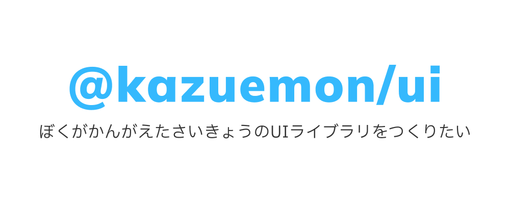
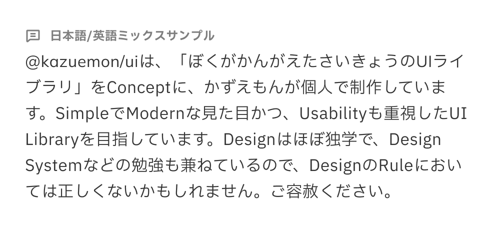

# @kazuemon/ui

## もくひょう

- コンポーネントがいっぱいあるけど、マテリアルデザインほどかたい感じじゃないモダンなUIライブラリがつくりたい。
- とりあえず手を進めていきたいので、アクセシビリティへの対応は後ほど。

## つかうもの

- ベース: Tailwind CSS
- フォント: Mulish + IBM Plex Sans JP
- アイコン: [Phosphor Icons](https://phosphoricons.com/)

以下画像は日本語と英語を混ぜた文章を作るために、色んな単語を無理やり英語に置き換えたサンプルテキストです。

## つくりたいコンポーネント

以下はまず最初に作りたいものです。

- [ ] Button
- [ ] Checkbox
- [ ] TextField
- [ ] Textarea
- [ ] Radio
- [ ] Select
- [ ] Alert
- [ ] Switch
- [ ] Pagination
- [ ] Menu
- [ ] Breadcrumb
- [ ] Tab
- [ ] Navbar
- [ ] Badge
- [ ] Card
- [ ] Chip
- [ ] Divider
- [ ] List

---

以下は優先度は低めですが最終的には作りたいものです。

- [ ] Accordion
- [ ] Dropdown
- [ ] DatePicker
- [ ] Dropzone
- [ ] Calendar
- [ ] Step
- [ ] Dialog
- [ ] Modal
- [ ] Spinner
- [ ] Skeleton
- [ ] Progress
- [ ] Drawer
- [ ] Popover
- [ ] Tooltip
- [ ] Table (with react-table)

## Figma

(準備中)