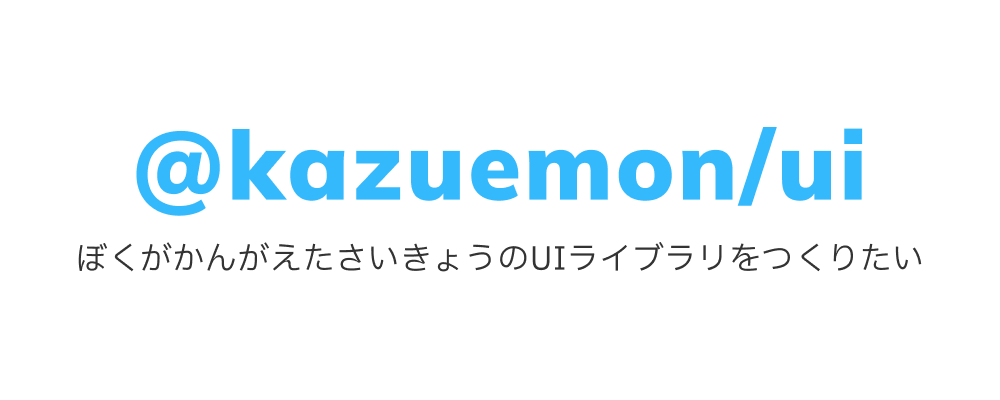
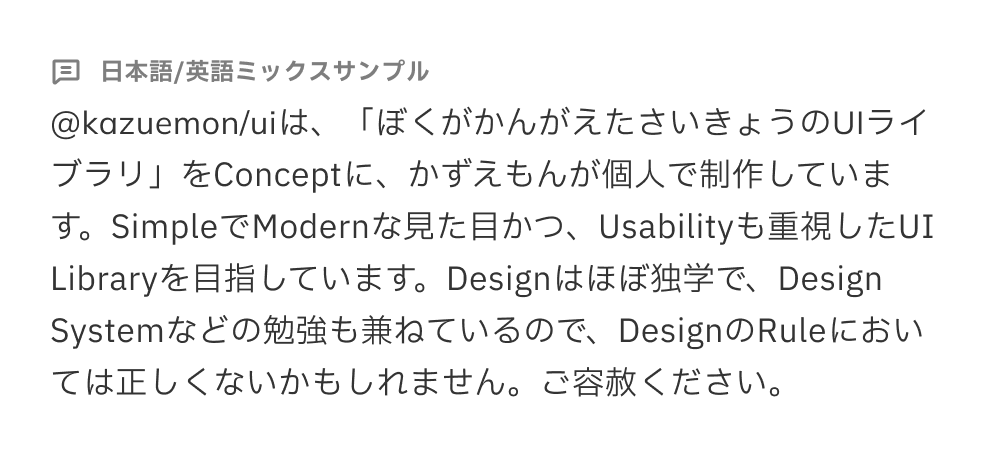

# @kazuemon/ui



## もくひょう

- コンポーネントがいっぱいあるけど、マテリアルデザインほどかたい感じじゃないモダンなUIライブラリがつくりたい。
- とりあえず手を進めていきたいので、アクセシビリティへの対応は後ほど。

## つかうもの

- ベース: Tailwind CSS
- フォント: Mulish + IBM Plex Sans JP（等幅: Geist Mono）
- アイコン: [Phosphor Icons](https://phosphoricons.com/)

以下画像は日本語と英語を混ぜた文章を作るために、色んな単語を無理やり英語に置き換えたサンプルテキストです。



## つかいかた

```sh
pnpm add @kazuemon/ui
pnpm add @fontsource/ibm-plex-sans-jp  # 和文フォントも読むとき
```

React 19 以上が要ります。部品は `@kazuemon/ui` から読みます。部品ごとに `'use client'` を持つので、Server Components のページからそのまま使えます。

### Tailwind CSS（v4）を使うアプリ

アプリの CSS で、`tailwindcss` のあとに読みます。部品のクラスは、アプリの Tailwind がまとめて作ります。

```css
@import 'tailwindcss';
@import '@kazuemon/ui/tailwind.css';
@import '@kazuemon/ui/fonts.css'; /* 欧文と等幅（Mulish・Geist Mono） */
@import '@kazuemon/ui/fonts-ja.css'; /* 和文（IBM Plex Sans JP）。@fontsource/ibm-plex-sans-jp が要る */
```

- トークンは Tailwind のクラスとしても使えます（`bg-primary`・`rounded-control`・`h-control`・`text-caption` など）
- 部品に `className` で渡したクラスは、部品のクラスより優先されます。自分で `cn()` を作るときは、`twMergeConfig` を `extendTailwindMerge(twMergeConfig)` に渡すと、部品と同じまとめ方になります
- 部品は、ページのフォント（`body` などに置いたもの）を受け継ぎます

### Tailwind CSS を使わないアプリ

ビルド済みの CSS を読みます。Tailwind v3 のアプリもこちらです。

```ts
import '@kazuemon/ui/styles.css';
import '@kazuemon/ui/fonts.css';
import '@kazuemon/ui/fonts-ja.css';
```

- ページ全体のリセットは入っていません。部品の要素とその中だけに、Tailwind と同じリセットが効きます（部品の要素には `kz-ui` のクラスが付きます）
- 全体が `@layer kazuemon` の中にあるので、アプリの CSS が必ず勝ちます。部品の見た目を CSS で変えるときに `!important` は要りません。そのかわり、アプリの要素へのスタイル（`button { … }`・`a { … }`）も部品に効きます。そうしたスタイルは、`@layer base { … }` のようにレイヤーに入れてください
- 部品のクラスは Tailwind と同じ名前（`flex`・`p-2`・`rounded-lg` など）です。アプリの CSS に同じ名前のクラスがあると、部品にも効きます

### フォント

フォントを読まないときは、`ui-sans-serif, system-ui, sans-serif` など、端末のフォントで描かれます。

## つくりたい機能

部品ではなく、ライブラリとして使うときに要るものです。

- [ ] ダークモード
- [x] Server Components 対応
- [ ] 多言語
- [x] Tailwind なしでの利用
- [x] スタイルの衝突を避ける（Tailwind あり・なし）
- [x] ツリーシェイク

## つくりたいコンポーネント

### 土台

- [x] Icon
- [x] VisuallyHidden
- [x] ThemeProvider
- [x] Collapsible
- [x] ScrollArea
- [x] AspectRatio
- [x] Portal
- [x] Transition

### 文字

- [x] Heading
- [x] HeadingAnchor
- [x] Text
- [x] Code
- [x] Kbd
- [x] Mark
- [ ] Ruby
- [ ] Highlight
- [x] NumberFormat

### 本文

- [x] Prose
- [x] CodeBlock
- [x] Blockquote
- [x] Figure
- [x] Callout
- [x] LinkCard
- [x] Footnote
- [x] Steps
- [x] FileTree
- [x] CodeGroup
- [x] Embed
- [x] Video
- [x] Gallery
- [x] ImageZoom
- [x] Bleed
- [x] Spoiler
- [ ] TypeTable
- [ ] Mermaid
- [ ] Math

### ページの枠

- [x] Container
- [x] Navbar
- [ ] Sidebar
- [x] Stack
- [x] Grid
- [x] Masonry
- [x] SkipLink
- [x] Affix
- [ ] Splitter

### ナビゲーション

- [x] TableOfContents
- [x] Pager
- [x] Breadcrumb
- [x] Tabs
- [x] Pagination
- [x] Menu
- [ ] Stepper
- [ ] NavigationMenu
- [ ] ContextMenu
- [ ] Toolbar
- [ ] CommandPalette
- [ ] BackToTop
- [ ] Menubar
- [x] Tree
- [ ] Tour

### 表示

- [x] Tag
- [x] Card
- [x] List
- [x] Table
- [x] Divider
- [x] Time
- [x] RelativeTime
- [x] Avatar
- [x] Badge
- [x] Chip
- [x] Timeline
- [x] Accordion
- [x] Image
- [ ] AvatarGroup
- [x] DescriptionList
- [x] Stat
- [x] Meter
- [x] Carousel
- [x] Thumbnails
- [ ] Indicator

### 操作

- [x] Button
- [x] Link
- [x] Toggle
- [x] ToggleGroup
- [ ] ButtonGroup
- [x] CopyButton

### 入力

- [x] TextField
- [x] Select
- [x] Switch
- [x] Form
- [x] Textarea
- [x] Checkbox
- [x] Radio
- [ ] Fieldset
- [x] Combobox
- [ ] Segmented Control
- [ ] Slider
- [x] NumberField
- [x] DateField
- [ ] DatePicker
- [ ] Dropzone
- [x] SearchField
- [x] PasswordField
- [x] Autocomplete
- [x] PinField
- [x] TagsInput
- [x] TimeField
- [ ] TimePicker
- [ ] ColorPicker
- [ ] Rating
- [x] Calendar
- [ ] DateRangePicker
- [x] CheckboxGroup
- [x] MaskField
- [ ] Editable
- [ ] FileInput

### 通知

- [x] Notice
- [x] Loading
- [ ] Spinner
- [x] Toast
- [x] Progress
- [x] Skeleton
- [ ] StatusPanel
- [ ] LoadingOverlay

### 重なるもの

- [x] Dialog
- [x] Drawer
- [x] Popover
- [x] Tooltip
- [x] AlertDialog
- [ ] PreviewCard

### アプリの画面

Web アプリで使うものです。ポートフォリオのあとに作ります。土台は外のヘッドレス（TanStack Table・TanStack Virtual・dnd-kit）に peer dependency で乗り、ここでは見た目とトークンを持ちます。

- [ ] DataTable
- [ ] VirtualList
- [ ] Sortable
- [ ] Kanban
- [ ] Popconfirm
- [ ] ActionBar
- [ ] Mentions
- [ ] Cascader
- [ ] TreeSelect
- [ ] Transfer

### チャット

- [ ] Composer
- [ ] MessageList
- [ ] Bubble
- [ ] TypingIndicator
- [ ] Attachment
- [ ] StreamingText

## Figma

(準備中)
