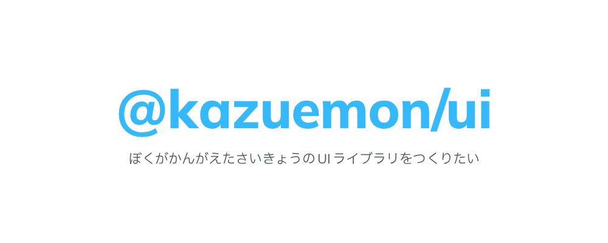
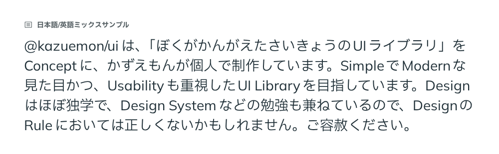

# @kazuemon/ui



[](https://www.npmjs.com/package/@kazuemon/ui) [](./LICENSE)

かずえもんが個人で作っている、React と Tailwind CSS の UI コンポーネントライブラリです。

- ドキュメント: https://ui.k6n.jp
- Storybook: https://story.ui.k6n.jp

## もくひょう

- コンポーネントがいっぱいあるけど、マテリアルデザインほどかたい感じじゃないモダンなUIライブラリがつくりたい。
- とりあえず手を進めていきたいので、アクセシビリティへの対応は後ほど。

## つかうもの

- ベース: Tailwind CSS
- フォント: Mulish + IBM Plex Sans JP（等幅: Geist Mono）
- アイコン: [Phosphor Icons](https://phosphoricons.com/)

以下画像は日本語と英語を混ぜた文章を作るために、色んな単語を無理やり英語に置き換えたサンプルテキストです。



## つかいかた

@kazuemon/ui は、Component と Recipe で構成されています。

- **Component**: `@kazuemon/ui` から読んで使う部品です（Button・TextField・Dialog など）
- **Recipe**: 部品にはせず、コードを写して使う見本です。[Storybook](https://story.ui.k6n.jp) の Recipes に並んでいます
  - コンポーネントを組み合わせて作るもの（Footer など）
  - 外部ライブラリと組み合わせて使うもの（TanStack Table・dnd-kit など）

Tailwind CSS v4 と React 19 以上が必要です。

```sh
pnpm add @kazuemon/ui

# 日本語の推奨フォント（IBM Plex Sans JP）を使うときに必要です
pnpm add @fontsource/ibm-plex-sans-jp

# Icon などに Phosphor のアイコンを渡すときに必要です
pnpm add @phosphor-icons/react

# DataTable の Recipe（TanStack Table でつなぐ）を使うときに必要です
pnpm add @tanstack/react-table

# Sortable の Recipe（dnd-kit でつなぐ）を使うときに必要です
pnpm add @dnd-kit/react @dnd-kit/helpers @dnd-kit/dom
```

アプリの CSS で、`tailwindcss` のあとに読みます。部品のクラスは、アプリの Tailwind がまとめて作ります。

```css
@import 'tailwindcss';
@import '@kazuemon/ui/tailwind.css';
@import '@kazuemon/ui/fonts.css'; /* 欧文と等幅（Mulish・Geist Mono） */
@import '@kazuemon/ui/fonts-ja.css'; /* 和文（IBM Plex Sans JP）。@fontsource/ibm-plex-sans-jp が要る */
```

```tsx
import { Button } from '@kazuemon/ui';

export function SaveButton() {
  return <Button>保存する</Button>;
}
```

- 部品は `@kazuemon/ui` から読みます。部品ごとに `'use client'` を持つので、Server Components のページからそのまま使えます
- トークンは Tailwind のクラスとしても使えます（`bg-primary`・`rounded-control`・`h-control`・`text-caption` など）
- 部品に `className` で渡したクラスは、部品のクラスより優先されます。自分で `cn()` を作るときは、`twMergeConfig` を `extendTailwindMerge(twMergeConfig)` に渡すと、部品と同じまとめ方になります
- 部品は、ページのフォント（`body` などに置いたもの）を受け継ぎます。フォントを読まないときは、`ui-sans-serif, system-ui, sans-serif` など、端末のフォントで描かれます

## つくりたいもの

作りたい部品と機能、その進み具合は [`design/roadmap.md`](./design/roadmap.md) にあります。

## ライセンス

[MIT](./LICENSE)
