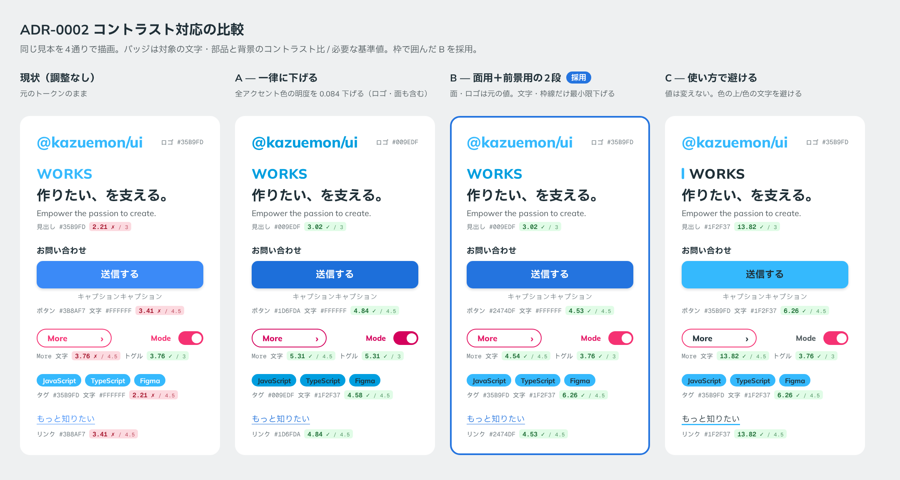

# 0002. コントラスト基準と面用／前景用の2段

- ステータス: Accepted
- 日付: 2026-09-12
- ラウンド: ループ外

## 背景

README ではアクセシビリティ対応を後回しにしています。ただ、色のコントラストは他の対応と違って、トークンの値そのものに焼き込まれます。ムードを決めた後で直すと選んだ色が動き、ADR の連鎖を後から覆すことになります。

既存の色を白地で測ると、多くが基準を満たしていませんでした。

| 組み合わせ                       | 比   | 判定                                |
| -------------------------------- | ---- | ----------------------------------- |
| 白文字 on ブランド水色 `#35B9FD` | 2.21 | 大きい文字の基準（3:1）にも届かない |
| 白文字 on 濃い青 `#3B8AF7`       | 3.41 | 大きい文字のみ可                    |
| 白文字 on ピンク `#F53273`       | 3.76 | 大きい文字のみ可                    |
| 白文字 on Danger `#D4283F`       | 5.03 | 可                                  |
| キャプション `#788287` on 白     | 3.93 | 本文サイズでは不可                  |

ユーザーからは「色のテイスト（他の色とのバランス）は維持したい」という要望がありました。

## 決定 1: コントラストを生成時の制約にする

| 対象                                                 | 必要なコントラスト比 |
| ---------------------------------------------------- | -------------------- |
| 本文、ボタンの文字、キャプション                     | 4.5:1                |
| 大きい文字、アイコン、入力欄の枠線、トグルなどの部品 | 3:1                  |

これを満たさない候補は生成しません。キーボード操作や ARIA などは、README のとおり後回しにします。

### 却下した案

- 制約にしない: 基準未満の色を選んだ場合、後で必ず直すことになる
- 参考情報として表示するだけ: 見た目の好みで基準未満の案を選べてしまい、結局後で直すことになる

## 決定 2: 色を面用と前景用の2段で持つ

### 候補

同じ見本（ロゴ、セクション見出し、ボタン、More、トグル、タグ、リンク）を4通りに描いて比較しました。

| 案   | 内容                                                                 | 見出し                | ボタン               | ピンクの文字              | タグ（面／文字）     |
| ---- | -------------------------------------------------------------------- | --------------------- | -------------------- | ------------------------- | -------------------- |
| 現状 | 調整なし                                                             | `#35B9FD`             | `#3B8AF7`            | `#F53273`                 | `#35B9FD`／白        |
| A    | 全アクセント色の明度（oklch L）を一律 0.084 下げる。ロゴ・面も含む   | `#009EDF`             | `#1D6FDA`            | `#D4015C`                 | `#009EDF`／`#1F2F37` |
| B    | 面・ロゴは元の値。文字・枠線だけ、基準を満たす最小限まで明度を下げる | `#009EDF`             | `#2474DF`            | `#E41966`                 | `#35B9FD`／`#1F2F37` |
| C    | 値は変えない。色の上に白い文字を置かず、色の文字も使わない           | `#1F2F37`＋水色の縦線 | `#35B9FD`／`#1F2F37` | `#1F2F37`（枠だけピンク） | `#35B9FD`／`#1F2F37` |

A の下げ幅 0.084 は、見出しの水色が大きい文字の基準（3:1）に届く量です。

### 採用: B

面・装飾・ロゴには元の値を使い、文字と枠線には前景用の値を使います。前景用の値は、色相と彩度を保ち、明度だけを下げて作ります。

| 色     | 面用      | 前景用                      | 前景用の白地でのコントラスト比 |
| ------ | --------- | --------------------------- | ------------------------------ |
| 水色   | `#35B9FD` | `#009EDF`（大きい文字のみ） | 3.02                           |
| 濃い青 | —         | `#2474DF`                   | 4.53                           |
| ピンク | `#F53273` | `#E41966`                   | 4.54                           |

- 白い文字を載せる面は、前景用の値を使うか、文字を濃紺グレー（`#1F2F37`）にします。水色の面に濃紺グレーの文字を載せた場合は 6.26:1 です
- あわせて、キャプション色を `#788287`（白地 3.93）から `#6E787D`（白地 4.52）に変更しました

### 理由

- ピンクと濃い青は、明度の下げ幅が 0.04〜0.07 程度で、並べて比べないと気づかない差です。2色がほぼ同じ幅で動くので、色どうしのバランスも崩れません
- 水色は下げ幅が大きいですが、見出しは大きい文字の基準（3:1）でよいので `#009EDF` で済みます。ロゴ、背景の大きな装飾文字、面の塗りには、元の `#35B9FD` をそのまま使えます
- 4案の中で、元のバランスに最も近い見た目でした

### 却下した案と理由

- **A**: ロゴとタグまで沈み、ブランドの明るさが消えます。さらに、ピンクが `#D4015C` になり、Danger `#D4283F` とのコントラスト比が 1.05:1 と、ほぼ同じ色になります。旧 Danger を変更したのは、まさにピンクとの衝突を避けるためだったので、その理由と矛盾します
- **C**: 最も明るいまま残りますが、水色の見出しという特徴的なクセを手放すことになります。また、Primary ボタンがブランドの水色になり、原則6の「水色は構造、濃い青はインタラクション」という役割分担が消えます

## 影響

- `tokens.css` に面用（`--color-brand`、`--color-accent`）と前景用（`--color-fg-brand`、`--color-fg-accent`）を分けて定義しました。`accent` は当時の名前で、[ADR-0013](./0013-secondary-color.md) で `--color-secondary`、`--color-fg-secondary` に改名しました
- B の唯一の見た目の変化は、水色の面に載る文字が濃くなることです（タグなど）。「タグの文字を濃くするか、タグの面を前景用の濃い水色にするか」を前半の軸に加えました
- 前景用のピンク `#E41966` と Danger `#D4283F` の比は 1.11:1 で、面用どうし（1.34:1）よりさらに近くなります。Danger とピンクの区別の手段は後半の軸で決めます
- キャプション `#6E787D` は、グレーの入力欄の塗り `#F4F5F5` の上では 4.14:1 で基準を下回ります。キャプションは本体の下の白地に置く前提です
- **追記（principles.md から移した記録）**: 旧トークンの `Dark #1F3737` は誤記とみなし、文字色は `#1F2F37`（濃紺グレー）に統一しました。ユーザーが確認しています。
  > 「Dark はこれで良さそうです。」

## 比較画像

補足: タグの配色は [ADR-0007](./0007-tag-color.md) で変更しました。スイッチ OFF のトラックは、[ADR-0011](./0011-switch-off-track.md) で 3:1 の例外にしました。
