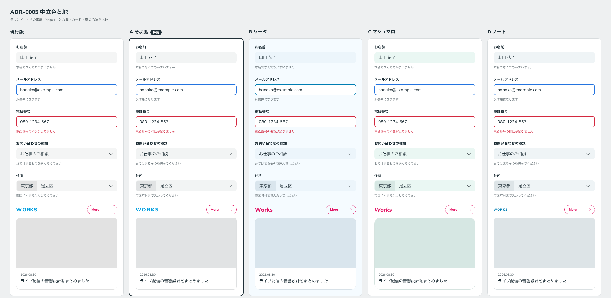

# 0005. 中立色と地

- ステータス: Accepted
- 日付: 2026-09-12
- ラウンド: 前半 r01

## 背景

前半の軸「中立色の色味」と「背景」を決める必要がありました。中立色は、入力欄の塗り、グレーボタン、入力欄の prefix、細い境界線に使う色です。

ラウンド1では、4方向の候補がそれぞれ別の色味を持つように散らしました。各候補の中立色は、1つの色相と彩度から明度だけを変えて作っています。

## 候補

| 案           | 色味                                   | 地 `--color-bg` | 入力欄 `--color-field` | グレーボタン `--color-neutral` | prefix `--color-field-addon` | 線 `--color-line` |
| ------------ | -------------------------------------- | --------------- | ---------------------- | ------------------------------ | ---------------------------- | ----------------- |
| 現行版       | 無彩色（旧パレット）                   | `#FFFFFF`       | `#F4F5F5`              | `#F4F5F5`                      | `#E2E2E2`                    | `#E2E2E2`         |
| A そよ風     | 無彩色寄り（色相 220・彩度 0.002）     | `#FFFFFF`       | `#F2F4F4`              | `#EFF0F1`                      | `#E1E3E4`                    | `#DEE0E1`         |
| B ソーダ     | 水色寄り（色相 237・彩度 0.012）       | `#F5FBFF`       | `#ECF5FB`              | `#E9F2F7`                      | `#D9E5ED`                    | `#D7E1E8`         |
| C マシュマロ | ミント寄り（色相 178・彩度 0.014）     | `#FFFFFF`       | `#EAF7F3`              | `#E7F3F0`                      | `#D6E7E3`                    | `#D5E3DF`         |
| D ノート     | 濃紺グレー寄り（色相 225・彩度 0.006） | `#FFFFFF`       | `#EFF4F6`              | `#ECF1F3`                      | `#DDE4E7`                    | `#DBE1E3`         |

## 決定

A そよ風の中立色と地を採用します。地は白、中立色は色相 220・彩度 0.002 の無彩色寄りです。

| 役割トークン          | 値の層               | 値        |
| --------------------- | -------------------- | --------- |
| `--color-field`       | `--palette-gray-50`  | `#F2F4F4` |
| `--color-neutral`     | `--palette-gray-100` | `#EFF0F1` |
| `--color-field-addon` | `--palette-gray-200` | `#E1E3E4` |
| `--color-line`        | `--palette-gray-300` | `#DEE0E1` |
| `--color-bg`          | `--palette-white`    | `#FFFFFF` |

## 理由

ユーザーのメモ: 「色合いも A 案が好きかも」

A は「軽い」に振り切った案です。中立色がほぼ色味を持たないので、水色とピンクのアクセントを邪魔しません。

現行版とは見た目がほぼ同じです。違いは、A の4色が1つの色相と彩度から作られていて、明度の段階が揃っていることです。A を採用すると、中立色を「色相 220・彩度 0.002 のまま明度だけを変える」という1つの規則で説明できます。

## 却下した案と理由

ユーザーが選んだのは A です。B〜D の色味について、個別の却下理由は聞いていません。

- **現行版**: A とほぼ同じ方向ですが、旧パレットの値が段階として揃っていません
- **B ソーダ**: 薄い水色の地に白いカードが浮く効果はありましたが、選ばれませんでした
- **C マシュマロ**: ミント寄りの色味は選ばれませんでした
- **D ノート**: 濃紺グレー寄りの色味は選ばれませんでした

## 影響

- `tokens.css` の `--palette-gray-*` を A の値に置き換え、役割の対応先を上の表のとおりにしました
- 前半の軸から「中立色の色味」と「背景」を外しました。ラウンド2以降は親から引き継ぎます
- グレーボタンのコントラストは、`--color-neutral` `#EFF0F1` が白地で 1.14:1 です（旧値 `#F4F5F5` は 1.09:1）。後半の軸「グレーボタンのコントラスト」は残ります
- キャプション `#6E787D` は、入力欄の塗り `#F2F4F4` の上では 4.09:1 で基準を下回ります。「キャプションは本体の下の白地に置く」前提（[ADR-0002](./0002-contrast-and-foreground-tokens.md)）は変わりません

## 比較画像

