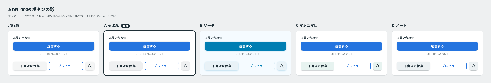

# 0006. ボタンの影

- ステータス: Accepted
- 日付: 2026-09-12
- ラウンド: 前半 r01

## 背景

前半の軸「影の強さと色」を決める必要がありました。影を付けるのは、塗りのあるボタンだけです（[原則1](../principles.md#1-影は押せることの記号)）。影は hover で減り、押下で消えます（[原則3](../principles.md#3-hover-は一段沈む)）。

## 候補

| 案           | 見た目                         | 通常                                                             | hover                             | 押下                         |
| ------------ | ------------------------------ | ---------------------------------------------------------------- | --------------------------------- | ---------------------------- |
| 現行版       | 柔らかい落ち影                 | `0 2px 4px rgb(31 47 55 / 0.18)`                                 | `0 1px 2px rgb(31 47 55 / 0.14)`  | なし                         |
| A そよ風     | 輪郭程度のごく薄い影           | `0 1px 2px rgb(31 47 55 / 0.10), 0 0 0 1px rgb(31 47 55 / 0.05)` | `0 0 0 1px rgb(31 47 55 / 0.06)`  | なし                         |
| B ソーダ     | 水色がかった柔らかい影         | `0 2px 6px rgb(0 126 179 / 0.24)`                                | `0 1px 3px rgb(0 126 179 / 0.20)` | なし                         |
| C マシュマロ | 真下にずれるキーキャップ風の影 | `0 3px 0 rgb(31 47 55 / 0.20)`                                   | `0 2px 0 rgb(31 47 55 / 0.20)`    | `0 0 0 rgb(31 47 55 / 0.20)` |
| D ノート     | 下辺に細い線が出る影           | `0 1px 0 rgb(31 47 55 / 0.22), 0 1px 3px rgb(31 47 55 / 0.10)`   | `0 1px 0 rgb(31 47 55 / 0.16)`    | なし                         |

## 決定

A そよ風の影を採用します。

| トークン                | 値                                                              |
| ----------------------- | --------------------------------------------------------------- |
| `--shadow-raised`       | `0 1px 2px rgb(31 47 55 / 0.1), 0 0 0 1px rgb(31 47 55 / 0.05)` |
| `--shadow-raised-hover` | `0 0 0 1px rgb(31 47 55 / 0.06)`                                |
| 押下                    | 影なし（接地）                                                  |

通常はごく薄い落ち影と輪郭、hover では輪郭だけが残り、押下で消えます。原則3の「hover で影が減り、押下で消える」の順序を保っています。

## 理由

ユーザーのメモ: 「ボタンのシャドウについては A 案が一番気に入ってますね」

基準の言葉の「軽い」（影は弱く、線は細い）に最も近い案です。

## 却下した案と理由

ユーザーが選んだのは A です。他の案について、個別の却下理由は聞いていません。

- **現行版**: 柔らかい落ち影。A より影が濃く、ボタンが浮いて見えます
- **B ソーダ**: 影に水色が混ざります
- **C マシュマロ**: 真下にずれた、輪郭のはっきりした影です。押すと影の厚み（3px）だけ沈む動きと組でした
- **D ノート**: 下辺に細い線が出る影です

## 影響

- `tokens.css` の `--shadow-raised` と `--shadow-raised-hover` を A の値に置き換えました
- **決めたのは影の値だけです。** ラウンド1の候補は、影と一緒に押下時の動きも違っていました（A は 100ms で 1px 沈む）。沈み込みの量（`--press-depth`）、イージング（`--ease-press`）、時間（`--duration-press`）は未決のまま、前半の軸に残ります
- hover で残る 1px の輪郭は、影の一部です。フォーカス枠（青・2px）とは色も太さも違うので、原則3の「hover に枠線を使わない」とは衝突しないと判断しています

## 比較画像

