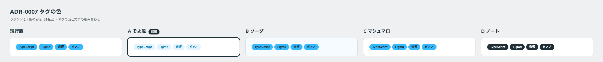

# 0007. タグの色

- ステータス: Accepted
- 日付: 2026-09-12
- ラウンド: 前半 r01

## 背景

[ADR-0002](./0002-contrast-and-foreground-tokens.md) で色を面用と前景用の2段にした結果、水色の面 `#35B9FD` には白い文字を載せられなくなりました（2.21:1）。そのため、タグの配色を前半の軸「タグの文字色」として決める必要がありました。

ユーザーはこの部品を「チップ」と呼んでいます。このドキュメントでは「タグ」と書きます。

## 候補

| 案                             | 面                   | 文字                 | コントラスト比 |
| ------------------------------ | -------------------- | -------------------- | -------------- |
| 現行版・B ソーダ・C マシュマロ | 水色 `#35B9FD`       | 濃紺グレー `#1F2F37` | 6.26:1         |
| A そよ風                       | 淡い水色 `#E3F4FE`   | 濃い水色 `#0075A7`   | 4.54:1         |
| D ノート                       | 濃紺グレー `#1F2F37` | 白 `#FFFFFF`         | 13.82:1        |

## 決定

A そよ風の配色を採用します。淡い水色の面に、同じ色相の濃い水色の文字を載せます。

タグ専用の役割トークンを新設しました。

| 役割トークン     | 値の層              | 値        |
| ---------------- | ------------------- | --------- |
| `--color-tag`    | `--palette-sky-50`  | `#E3F4FE` |
| `--color-on-tag` | `--palette-sky-700` | `#0075A7` |

## 理由

ユーザーのメモ: 「チップの色の合わせ方も好みです（青に黒より良い）」

同じ色相の濃淡でまとめているので、水色の面に濃紺グレーの文字を載せる案より軽く見えます。

## 却下した案と理由

- **水色の面＋濃紺グレーの文字**（現行版・B・C）: ユーザーの言う「青に黒」です。A の組み合わせのほうが好まれました
- **濃紺グレーの面＋白い文字**（D）: 選ばれませんでした。個別の理由は聞いていません

## 影響

- `tokens.css` に `--palette-sky-50`、`--palette-sky-700`、`--color-tag`、`--color-on-tag` を追加しました
- ADR-0002 の「影響」にある「B の唯一の見た目の変化は、水色の面に載る文字が濃くなることです（タグなど）」は、タグについてはこの ADR で置き換わります。水色の面に文字を載せる場合の `--color-on-brand`（濃紺グレー）は、タグ以外の部品のために残します
- 原則6の表で、タグの塗りを `--color-brand` から `--color-tag` に変えました
- 前半の軸から「タグの文字色」を外しました
- `--color-on-tag` の余裕は 4.54:1 で、基準（4.5:1）ぎりぎりです。`--color-tag` を濃くする場合は、文字色も合わせて見直す必要があります

## 比較画像

