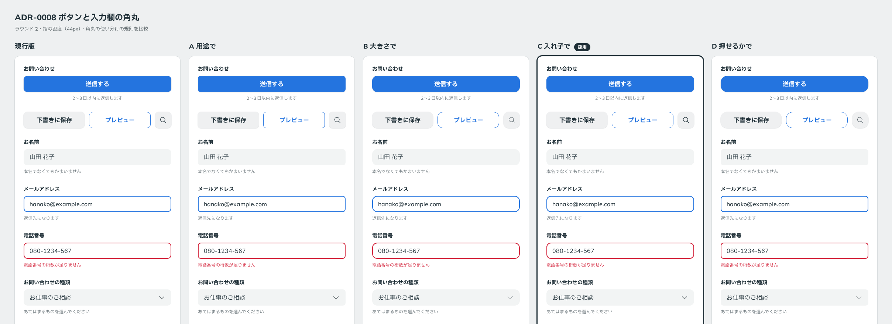

# 0008. ボタンと入力欄の角丸

- ステータス: Accepted
- 日付: 2026-09-12
- ラウンド: 前半 r02

## 背景

ラウンド1でユーザーから「角丸はマシュマロも好きかも。使い分けができるといいですね。」というメモがありました。そこでラウンド2では、角丸の使い分けの規則を4通り用意し、主題として比べました（[原則5](../principles.md#5-角丸は部品と包むもので分ける)）。

## 候補

| 案           | 使い分けの規則                                 | ボタン           | 入力欄           | カード                  |
| ------------ | ---------------------------------------------- | ---------------- | ---------------- | ----------------------- |
| 現行版       | 用途で3段階（原則5）                           | 10               | 10               | 16                      |
| A 用途で     | 操作する部品は締め、包むカードだけ大きく丸める | 8                | 8                | 24                      |
| B 大きさで   | 高さの約 1/3 に比例させる                      | 指 14・マウス 11 | 指 14・マウス 11 | 20                      |
| C 入れ子で   | 内側の角丸＝外側の角丸 − 余白                  | 12               | 12               | 24（画像 16・内側 8px） |
| D 押せるかで | 押せるボタンだけ丸くする                       | 指 18・マウス 14 | 8                | 12                      |

単位は px です。タグ、トグル、リンクなどの小物は、どの案も pill です。

## 決定

ボタンと入力欄の角丸を、C「入れ子で」の部品の値 **12px** で統一します（`--radius-control: 12px`）。密度（指用・マウス用）によって値を変えません。

カードの角丸は、この ADR では決めません。ラウンド3の主題として扱います。

## 理由

ユーザーのメモ: 「ボタンや入力欄の角丸デフォルトはCが好きかも。」

基準の言葉の「やわらかい」（角が丸い）に寄せつつ、ボタンと入力欄を同じ値に揃えることで「整然」も保てます。

## 却下した案と理由

- **現行版（10）**: ユーザーは C の 12 を選びました
- **A 用途で（8）**: 部品の角丸が最も小さい案です。ユーザーは C を選びました
- **B 大きさで（比例）**: ユーザーの理由は「B のように比例する形式だと、ルックが揃えたくても見た目が変わって困ることありそう。」です。密度を切り替えると角丸の値も変わるため、2つの密度で見た目を揃えたいときに困ります
- **D 押せるかで（ボタン 18／14、入力欄 8）**: ユーザーは C を選びました。ボタンと入力欄の角丸が大きく異なる案です

C のうち、カードを入れ子にする規則（画像を内側に角丸で収める）は採用していません。ユーザーのメモ: 「カードについては入れ子のタイプだとちょっと過剰カモ。このタイプも選べるようにするのであれば、下の角丸が丸すぎる気持ち。」

## 影響

- `tokens.css` の `--radius-control` を 10px から 12px に変更しました
- 原則5の「押せる面積が小さいものほど丸くなる」を削除し、「部品は 12 で統一、小物は pill、カードは未決」に書き直しました
- ラウンド3の主題: カードの角丸。標準のカード（画像を端まで）と、選べる型としての入れ子のカード（外側を控えめに）を並べます
- 「大きさに比例する」規則は、2つの密度で見た目を揃えにくいという理由で、角丸以外の値（余白など）を決めるときにも参考になります

## 比較画像

