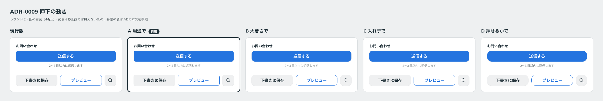

# 0009. 押下の動き

- ステータス: Accepted
- 日付: 2026-09-12
- ラウンド: 前半 r02

## 背景

前半の軸「動き」を決める必要がありました。押下時に要素が沈む深さ、イージング、時間です（[原則3](../principles.md#3-hover-は手応え押すと沈む)）。影の値は [ADR-0006](./0006-button-shadow.md) で決まっていましたが、動きは未決でした。

## 候補

| 案           | 時間  | イージング                          | 沈み込み | 縮み | 印象                           |
| ------------ | ----- | ----------------------------------- | -------- | ---- | ------------------------------ |
| 現行版       | 120ms | `cubic-bezier(0.2, 0, 0, 1)`        | 0px      | なし | 影の変化のみ                   |
| A 用途で     | 100ms | `cubic-bezier(0.2, 0, 0, 1)`        | 1px      | なし | 素早く 1px 沈む                |
| B 大きさで   | 220ms | `cubic-bezier(0.34, 1.56, 0.64, 1)` | 2px      | 0.97 | 縮んで弾む（オーバーシュート） |
| C 入れ子で   | 140ms | `cubic-bezier(0.3, 1.3, 0.6, 1)`    | 2px      | なし | 少し弾んで 2px 沈む            |
| D 押せるかで | 90ms  | `cubic-bezier(0.2, 0, 0, 1)`        | 1px      | なし | 短く 1px 沈む                  |

## 決定

A の動きを採用します。

| トークン           | 値                           |
| ------------------ | ---------------------------- |
| `--duration-press` | `100ms`                      |
| `--ease-press`     | `cubic-bezier(0.2, 0, 0, 1)` |
| `--press-depth`    | `1px`                        |

押下時は縮めません（scale 1）。

## 理由

ユーザーのメモ: 「ボタンの沈み込み具合は A が好きですね。」

[ADR-0001](./0001-judgement-criteria.md) では「ポップさはトークン層＋動きで出す」としていましたが、選ばれた動きは弾まない控えめなものでした。

## 却下した案と理由

ユーザーが選んだのは A です。他の案について、個別の却下理由は聞いていません。

- **現行版**: 沈まず、影の変化だけです
- **B**: 縮んで弾む、最も大きな動きです
- **C**: 少し弾んで 2px 沈みます
- **D**: A より 10ms 短いだけで、ほぼ同じ動きです

## 影響

- `tokens.css` の `--duration-press` を 120ms から 100ms に、`--press-depth` を 0px から 1px に変更しました
- 原則3の押下を【決定】にしました
- 前半の軸から「動き」が外れました

## 比較画像

静止画では動きが見えないため、各案の値は上の表で示しています。画像はボタンの見た目の比較です。

