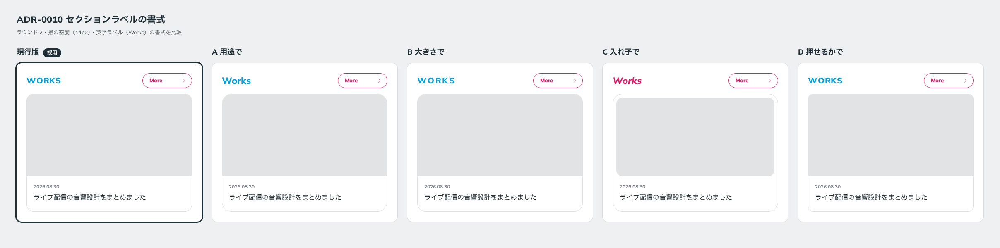

# 0010. セクションラベルの書式

- ステータス: Accepted
- 日付: 2026-09-12
- ラウンド: 前半 r02

## 背景

英語のセクションラベル（WORKS、PROFILE など）の書式は、参照画像の中で揺れていました。大文字（WORKS）、先頭だけ大文字（Biography）、イタリック（_My Value_）です（[原則10](../principles.md#10-和欧併記)）。ラウンド2では、4案それぞれで書式を変えて比べました。

## 候補

| 案           | 大文字         | 字形       | 大きさ | 太さ | 字間   | 色               |
| ------------ | -------------- | ---------- | ------ | ---- | ------ | ---------------- |
| 現行版       | すべて大文字   | 標準       | 20px   | 800  | 0.04em | 水色（前景用）   |
| A 用途で     | 先頭のみ大文字 | 標準       | 22px   | 800  | 0      | 水色（前景用）   |
| B 大きさで   | すべて大文字   | 標準       | 20px   | 800  | 0.12em | 水色（前景用）   |
| C 入れ子で   | 先頭のみ大文字 | イタリック | 22px   | 800  | 0      | ピンク（前景用） |
| D 押せるかで | すべて大文字   | 標準       | 20px   | 800  | 0.04em | 水色（前景用）   |

D は現行版とほぼ同じ書式です。

## 決定

現行版の書式を採用します。

| トークン            | 値                                 |
| ------------------- | ---------------------------------- |
| `--label-transform` | `uppercase`                        |
| `--label-style`     | `normal`                           |
| `--label-size`      | `20px`                             |
| `--label-weight`    | `800`                              |
| `--label-tracking`  | `0.04em`                           |
| 色                  | `--color-fg-brand`（前景用の水色） |

`--label-size`、`--label-weight`、`--label-tracking` は、この決定に合わせて `tokens.css` に追加しました。

## 理由

ユーザーのメモ: 「見出しは現行版が好き。感覚が空きすぎていると、AI っぽくて。」（「感覚」は「間隔」の意味です）

## 却下した案と理由

- **B（字間 0.12em）**: 字間を大きく空けた英字ラベルは、AI が作ったように見えます。ユーザーのメモの「間隔が空きすぎている」はこの案を指しています
- **A（先頭のみ大文字）**: ユーザーは現行版を選びました
- **C（ピンクのイタリック）**: ユーザーは現行版を選びました。ラベルがピンクになる案だったので、ピンクをセクションラベルに使う方向も退きました
- **D**: 現行版とほぼ同じです

## 影響

- `tokens.css` に `--label-size`、`--label-weight`、`--label-tracking` を追加しました
- 原則10のラベルの書式を【決定】にしました
- 反例に「字間を大きく空けた英字ラベル（AI が作ったように見える）」を追加しました
- ピンクの量について: セクションラベルをピンクにしない方向になりました。ピンクは More、トグル、Mode の切り替えだけに使います（ユーザー確認待ち）
  - 追記: この「ピンクは More、トグル、Mode の切り替えだけ」は、[ADR-0013](./0013-secondary-color.md) で置き換えられました。ピンクは用途を限定しない Secondary です。セクションラベルを水色にするというこの ADR の決定は変わりません

## 比較画像

