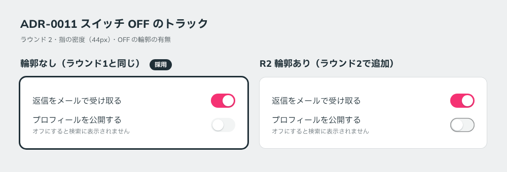

# 0011. スイッチ OFF のトラック

- ステータス: Accepted
- 日付: 2026-09-12
- ラウンド: 前半 r02

## 背景

経緯は次のとおりです。

1. **ラウンド1**: OFF のトラックは薄いグレー（`--color-field`）だけで描いていました。ユーザーから「返信をメールで受け取る は disabled のスイッチですか？」と質問がありました。このスイッチは本来 ON で描いたもので、ON に見えなかったのはキャンバス側の描画の不具合です。ただし、隣の OFF のスイッチも、Disabled に見えやすい見た目でした
2. **ラウンド2**: OFF のトラックに、白地に対して 3:1 の輪郭（1.5px）を足しました。[ADR-0002](./0002-contrast-and-foreground-tokens.md) の「トグルなどの部品は 3:1」に合わせたものです
3. **ラウンド2の後**: ユーザーの判断で、輪郭を撤回しました

## 候補

| 案                          | OFF のトラック                |
| --------------------------- | ----------------------------- |
| 輪郭なし（ラウンド1と同じ） | 薄いグレーの塗りだけ          |
| 輪郭あり（ラウンド2で追加） | 薄いグレーの塗り＋ 3:1 の輪郭 |

## 決定

スイッチ OFF のトラックには輪郭を付けません。ラウンド1の見た目に戻します。

OFF と Disabled の区別は、Disabled の側の見た目を変えることで付けます。

## 理由

ユーザーのメモ: 「スイッチ OFF の輪郭はいらないかも。前と同じでよいです。disabled の時の見た目を変える方がよさそう。」

## 却下した案と理由

- **輪郭あり**: OFF の状態は分かりやすくなりますが、ユーザーは不要と判断しました。区別の責任を、OFF ではなく Disabled の側に持たせる方針です

## 影響

- **ADR-0002 の例外になります。** OFF のトラック（`--color-field`）は白地との比が 1.1:1 程度で、部品の輪郭に求めている 3:1 を満たしません。OFF の状態は、ノブの位置（左）とノブの影で伝えます
- 候補の生成ツールのコントラスト検査から、「トグル OFF の輪郭」を外しました
- 原則12の「スイッチの OFF のトラックも輪郭を 3:1 にする」を撤回し、この ADR を例外として参照しました
- 後半の軸「Disabled の表し方」に、方向性として「Disabled は見た目を変える（スイッチ OFF と区別できるように）」を追記しました。原則1本文の「Disabled は色を薄くする必要がありません」とは逆の方向です

## 比較画像

