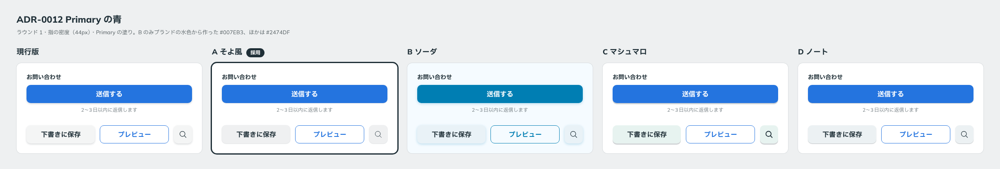

# 0012. Primary の青

- ステータス: Accepted
- 日付: 2026-09-12
- ラウンド: 前半 r01（確定はラウンド3の後）

## 背景

Primary の青（塗りのボタン、フォーカス枠）は前半の軸でした。

旧原則では「濃い青（要確定）」とされ、参照画像からの推定値は `#3B8AF7` 前後でした。`#3B8AF7` は白文字に対して 3.41:1 で、ボタンの文字に必要な 4.5:1 を満たしません。そのため [ADR-0002](./0002-contrast-and-foreground-tokens.md) で、明度だけを下げた `#2474DF`（4.53:1）を現行版の値にしていました。

## 候補

ラウンド1の値です。ラウンド2・3では、全案が `#2474DF` でした。

| 案           | Primary の青                                                   |
| ------------ | -------------------------------------------------------------- |
| 現行版       | `#2474DF`                                                      |
| A そよ風     | `#2474DF`                                                      |
| B ソーダ     | `#007EB3`（ブランドの水色 `#35B9FD` から明度を下げて作った値） |
| C マシュマロ | `#2474DF`                                                      |
| D ノート     | `#2474DF`                                                      |

## 決定

Primary の青は `#2474DF`（`--palette-blue-600` → `--color-primary`）です。

一旦この値で確定します。後で見直してかまいません。

## 理由

ラウンド1で、ユーザーは色について「色合いも A 案が好きかも」と述べました。この「色合い」に Primary の青も含めて確定扱いにし、ユーザーに確認したところ、次の返答でした。

> Primary は一旦これで。

## 却下した案と理由

- **B の `#007EB3`**: ラウンド1で、B の色合い（水色寄りの中立色、ごく薄い水色の地）とまとめて退きました（[ADR-0005](./0005-neutral-and-background.md)）。Primary の青だけを取り出して比べたわけではありません

## 影響

- `tokens.css`: `--color-primary` の値は変わりません。コメントにこの ADR を追記しました
- `principles.md`: 原則6で Primary を【決定】にし、「確定扱い・ユーザー確認待ち」の枠を解消しました
- 「一旦」の決定です。後半で Secondary や Danger と並べたときに違和感があれば、この ADR を Superseded にして見直します

## 比較画像

