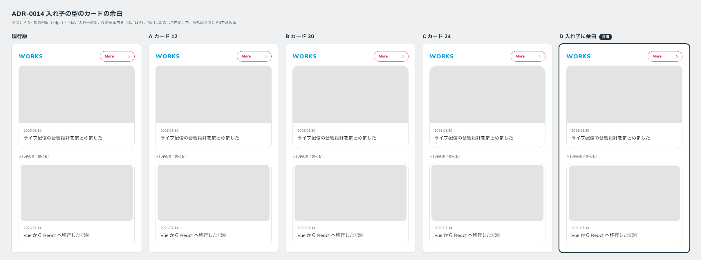

# 0014. 入れ子の型のカードの余白

- ステータス: Accepted
- 日付: 2026-09-12
- ラウンド: 前半 r03

## 背景

ラウンド2の「入れ子で」案では、標準のカード自体を入れ子（画像を内側に角丸で収める型）にしていました。ユーザーの反応は次のとおりです。

> カードについては入れ子のタイプだとちょっと過剰カモ。このタイプも選べるようにするのであれば、下の角丸が丸すぎる気持ち。

これを受けて、カードを次の2つの型に分けました。

- **標準のカード**: 画像を端まで届かせる
- **入れ子の型**: 画像を内側に角丸で収める。利用者が選べる型として用意し、外側の角丸は控えめにする

ラウンド3では、標準のカードの角丸と、入れ子の型の外側の角丸・余白を振りました。

## 候補

入れ子の型の画像の角丸は、外側の角丸 − 余白（同心）です。

| 案             | 標準のカード | 入れ子の型（外側） | 入れ子の型（余白） | 入れ子の型（画像） |
| -------------- | ------------ | ------------------ | ------------------ | ------------------ |
| 現行版         | 16           | 16                 | 6                  | 10                 |
| A カード 12    | 12           | 16                 | 6                  | 10                 |
| B カード 20    | 20           | 16                 | 6                  | 10                 |
| C カード 24    | 24           | 18                 | 6                  | 12                 |
| D 入れ子に余白 | 16           | 20                 | 8                  | 12                 |

## 決定

入れ子の型のカードの余白（画像の周り）は **8px** です（`--card-nested-inset`）。

決めたのは余白だけです。標準のカードと入れ子の型の角丸は、ラウンド4で決めます。

## 理由

ユーザーのメモです。

> 入れ子カードは余白があると良さそう。

余白が 8 だったのは D だけでした。

角丸についてのメモは「角丸度合いは現行 or C かも。」でした。現行版（16）と C（24）のどちらかに絞れなかったので、ラウンド4で比べます。

## 却下した案と理由

- **余白 6（現行版、A、B、C）**: ユーザーは余白の広い D を良いと判断しました

## 影響

- `tokens.css`: `--card-nested-inset: 8px` を追加しました
- `principles.md`: 原則5のカードの行に、入れ子の型の余白を【決定】として追加しました
- ラウンド4: 入れ子の型は余白 8 に固定し、標準のカードの角丸を 16〜24 の範囲で比べます（[`rounds/r04/candidates.mjs`](../rounds/r04/candidates.mjs)）。前半で残る軸はこれだけです

## 比較画像

