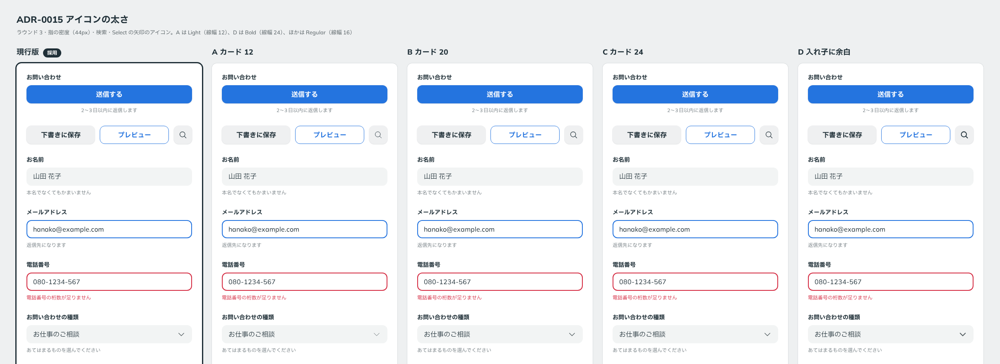

# 0015. アイコンの太さ

- ステータス: Superseded by 0018
- 日付: 2026-09-12
- ラウンド: 前半 r01〜r03

> この ADR は [ADR-0018](./0018-icon-weight-by-context.md) で置き換えられました。ラウンド4でユーザーから「アイコン単体の場合は Bold、テキストと合わせてならば Regular」という意見があり、アイコンの太さを使われ方で分けることになりました。

## 背景

アイコン（Phosphor）の太さは前半の軸の一つでした。ラウンド1〜3で、各案に次の太さを割り当てて振りました。どれも viewBox 256 に対する線幅です。

## 候補

| ラウンド | Light（線幅 12）         | Regular（線幅 16）               | Bold（線幅 24） |
| -------- | ------------------------ | -------------------------------- | --------------- |
| r01      | A そよ風                 | 現行版、B ソーダ、D ノート       | C マシュマロ    |
| r02      | B 大きさで、D 押せるかで | 現行版、A 用途で、C 入れ子で     | —               |
| r03      | A カード 12              | 現行版、B カード 20、C カード 24 | D 入れ子に余白  |

## 決定

アイコンの太さは **Regular（線幅 16）** です（`--icon-stroke: 16`）。

## 理由

3ラウンドを通して、ユーザーはアイコンの太さに一度も言及しませんでした。Light や Bold を割り当てた案が選ばれたラウンドでも、選ばれた理由はアイコン以外（影、色味、角丸など）でした。

design/README.md の終了条件は「現行版が勝ち続けたら終わる」です。これに従い、言及がないことを「どの候補も現行版に勝たなかった」とみなし、現行版の Regular で確定しました。この扱いはユーザーに報告済みです。異論があれば、この ADR を Superseded にして軸に戻します。

## 却下した案と理由

- **Light（線幅 12）**: 現行版に勝ったという判断がありませんでした
- **Bold（線幅 24）**: 同上

## 影響

- `tokens.css`: 値の変更はありません（`--icon-stroke: 16` のまま）
- `principles.md`: アイコンの太さを【決定】にし、この ADR にリンクしました

## 比較画像

