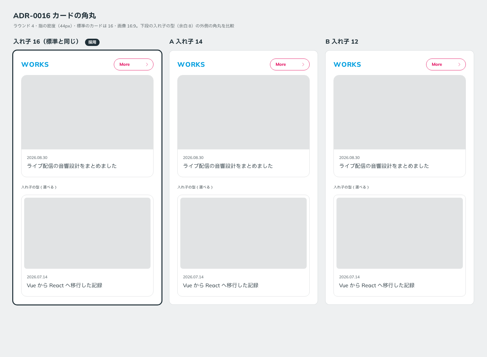

# 0016. カードの角丸

- ステータス: Accepted
- 日付: 2026-09-12
- ラウンド: 前半 r04

## 背景

カードの角丸は、前半で最後に残った軸でした。カードには2つの型があります（[ADR-0014](./0014-nested-card-inset.md)）。

- **標準のカード**: 画像を端まで届かせる
- **入れ子の型**: 画像を内側に角丸で収める。利用者が選べる型。余白は 8

ラウンド3のユーザーのメモ「角丸度合いは現行 or C かも。」を受けて、ラウンド4では標準のカードを 16〜24 の範囲に絞って比べました。入れ子の型の画像の角丸は、外側の角丸 − 余白（同心）です。

## 候補

ラウンド4の候補です（[`rounds/r04/candidates.mjs`](../rounds/r04/candidates.mjs)）。

| 案                     | 標準のカード | 入れ子の型（外側） | 入れ子の型（画像） |
| ---------------------- | ------------ | ------------------ | ------------------ |
| 現行版                 | 16           | 16                 | 8                  |
| A カード 24            | 24           | 18                 | 10                 |
| B カード 20            | 20           | 18                 | 10                 |
| C カード 16・入れ子 20 | 16           | 20                 | 12                 |

ユーザーは標準のカードを 16 に決めたうえで、入れ子の型の外側について迷いを示しました。そこで、標準 16・画像 16:9（[ADR-0017](./0017-card-media-aspect.md)）に固定し、入れ子の型の外側だけを変えた確認用の比較を作りました（[`rounds/r04/adr-0016-card.mjs`](../rounds/r04/adr-0016-card.mjs)）。

| 案                      | 入れ子の型（外側） | 入れ子の型（画像） |
| ----------------------- | ------------------ | ------------------ |
| 入れ子 16（標準と同じ） | 16                 | 8                  |
| A 入れ子 14             | 14                 | 6                  |
| B 入れ子 12             | 12                 | 4                  |

## 決定

カードの角丸は **16px** です（`--radius-card`）。**入れ子の型も同じ 16px** で、余白 8 の内側に収める画像の角丸は、同心で 8px になります。

## 理由

ラウンド4のユーザーのメモです。

> 一番好みは 16 な気がします。

> 角丸を通常版と入れ子版で変えるのはちょっとうーんという感じもしますが、画像の角丸に影響してくるので、入れ子の方が控えめの方がいいかもですね。

> 画像の角丸はほとんど変わって感じないですね。

確認用の比較（入れ子 16／14／12）への回答は「A かなあ」でした。ここでの A は「入れ子も標準と同じ 16」の選択肢です。

- 標準と入れ子の型で角丸を変えることには、ユーザー自身が抵抗を示していました。同じ値にすれば、角丸のトークンも `--radius-card` の1つで済みます
- 入れ子の型を控えめにしたかった理由は、画像の角丸への影響でした。16 でも画像は 8 で、ラウンド4の候補（画像 10〜12）よりすでに控えめです
- 画像の角丸の差は「ほとんど変わって感じない」ので、外側をさらに小さくしても得るものは小さい、と判断しました

基準の言葉では「整然」（角丸の段階を増やさない）に近い決定です。

## 却下した案と理由

- **標準 24（ラウンド4の A）・標準 20（B）**: ユーザーの好みは 16 でした
- **入れ子 20（ラウンド4の C）**: 入れ子の型が標準より丸くなり、「入れ子の方が控えめ」と逆になります
- **入れ子 14・入れ子 12**: カードの角丸が2種類に増えます。画像の角丸の差は感じにくいため、増やす理由が弱いと判断しました

## 影響

- `tokens.css`: `--radius-card: 16px` のまま、標準と入れ子の型の両方に使うことを注記しました。入れ子の型の専用トークンは作りません
- `principles.md`: 原則5のカードの行を【決定】にしました。前半の軸はすべて決まり、前半は終わりました
- 前半の結果は [`rounds/p1-final/`](../rounds/p1-final/) のキャンバスで確認できます

## 比較画像

