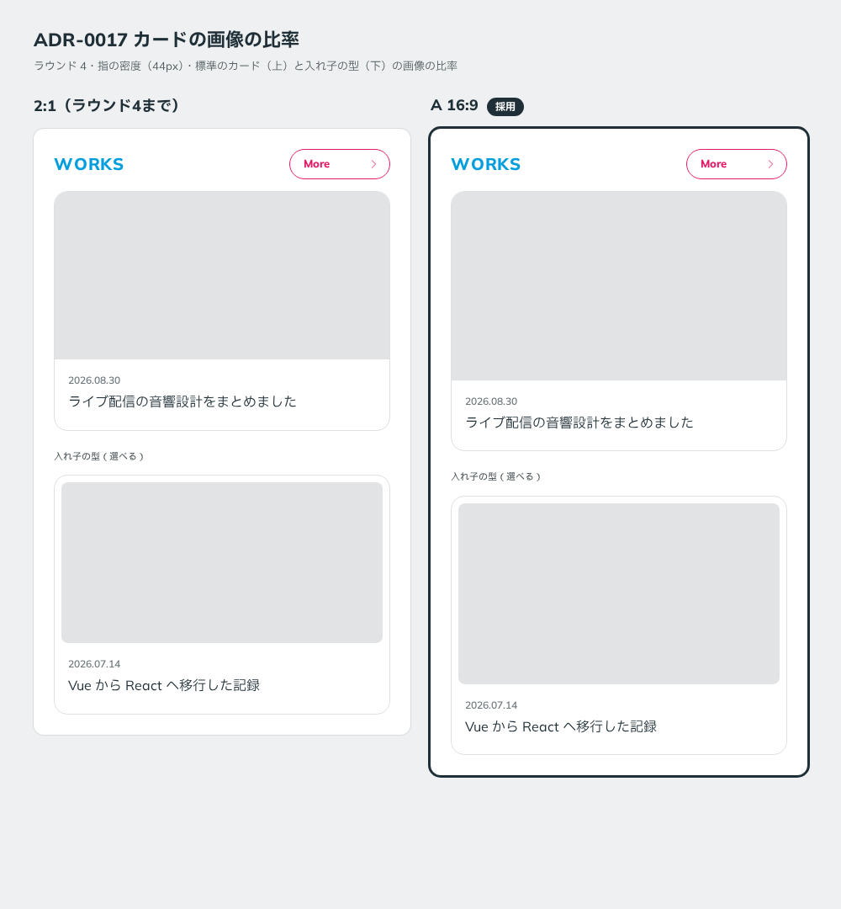

# 0017. カードの画像の比率

- ステータス: Accepted
- 日付: 2026-09-12
- ラウンド: 前半 r04

## 背景

ラウンド4まで、カードの画像は 2:1 で描いていました。これは生成ツールの仮の値で、意図して決めた比率ではありません。ラウンド4で、ユーザーから画像の比率について指摘がありました。

## 候補

| 案                      | 画像の比率 |
| ----------------------- | ---------- |
| 現行版（ラウンド4まで） | 2:1        |
| A                       | 16:9       |

比較は [`rounds/r04/adr-0017-aspect.mjs`](../rounds/r04/adr-0017-aspect.mjs) で作りました。

## 決定

カードの画像の比率は **16:9** です（`--card-media-aspect: 16 / 9`）。標準のカードと入れ子の型の両方に使います。

## 理由

ユーザーのメモです。

> カード内の画像は 16:9 になることがいと思うので、揃えたいです。

（「ことがいと」は「ことが多いと」の意味です。）

カードに載せる画像（動画のサムネイル、スクリーンショットなど）は 16:9 が多いため、比率を揃えれば切り抜きが起きにくくなります。

## 却下した案と理由

- **2:1（ラウンド4まで）**: 実際に載せる画像の多くと比率が合いません

## 影響

- `tokens.css`: `--card-media-aspect: 16 / 9` を追加しました
- `principles.md`: 原則5のカードの行に、画像の比率を【決定】として追加しました
- 生成ツールは、ラウンド4までの `base-tokens.css` を読むときは 2:1 のまま描きます。過去のラウンドの見た目は変わりません

## 比較画像

