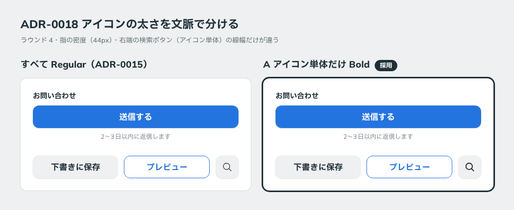

# 0018. アイコンの太さを文脈で分ける

- ステータス: Accepted（[ADR-0015](./0015-icon-weight.md) を置き換える）
- 日付: 2026-09-12
- ラウンド: 前半 r04

## 背景

[ADR-0015](./0015-icon-weight.md) では、アイコン（Phosphor）の太さをすべて Regular（線幅 16）に決めました。3ラウンドを通してユーザーの言及がなく、現行版が勝ったとみなしたためです。

この扱いを報告したところ、ラウンド4でユーザーから、アイコンの使われ方によって太さを分けたいという意見がありました。

## 候補

| 案                 | テキストと並ぶアイコン | アイコン単体       |
| ------------------ | ---------------------- | ------------------ |
| 現行版（ADR-0015） | Regular（線幅 16）     | Regular（線幅 16） |
| A                  | Regular（線幅 16）     | Bold（線幅 24）    |

線幅は viewBox 256 に対する値です。比較は `rounds/r04/adr-0018-icon.mjs`（前半の候補定義。消す前のコミット bcec65c に残っています）で作りました（検索のアイコンボタンだけが変わります）。

## 決定

アイコンの太さを、使われ方で分けます。

| 使われ方                                                                 | 太さ               | トークン                       |
| ------------------------------------------------------------------------ | ------------------ | ------------------------------ |
| テキストと並ぶとき（Select の矢印、More の矢印、ボタン内のアイコンなど） | Regular（線幅 16） | `--icon-stroke: 16`            |
| アイコン単体のとき（アイコンボタン、メニューボタンなど）                 | Bold（線幅 24）    | `--icon-stroke-standalone: 24` |

## 理由

ユーザーのメモです。

> アイコンについてはアイコン単体の場合は Bold でいい気もします。テキストと合わせてならば、Regular が揃ってると思います

テキストと並ぶアイコンは、文字の線の太さと揃っていることが大事です。Regular は本文の文字と太さが揃います。一方、アイコン単体では比べる文字がないため、形がはっきり読み取れる Bold のほうが適しています。

## 却下した案と理由

- **すべて Regular（ADR-0015）**: アイコン単体のときに線が細く、ユーザーは Bold のほうが良いと判断しました

## 影響

- `tokens.css`: `--icon-stroke-standalone: 24` を追加しました。`--icon-stroke: 16` はテキストと並ぶときの値として残します
- ADR-0015 のステータスを「Superseded by 0018」に変えました
- `principles.md`: アイコンの行をこの規則に書き換えました
- 実装では、アイコンを受け取る部品が「テキストと並ぶか、単体か」で線幅を切り替えます

## 比較画像

