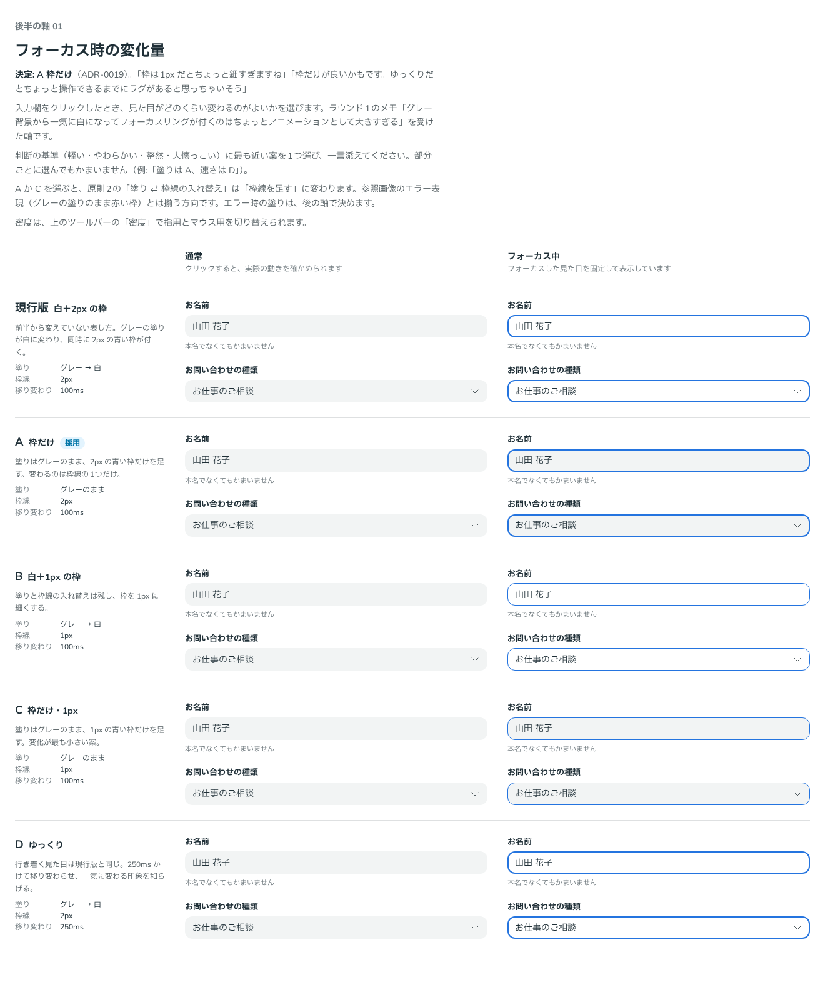

# 0019. 入力欄のフォーカス時の変化量

- ステータス: Accepted
- 日付: 2026-09-12
- ラウンド: 後半 軸01

## 背景

前半のラウンド1で、ユーザーから次の指摘がありました。

> 全体を通して、入力欄をクリックしたときにグレー背景から一気に白になってフォーカスリングが付くのはちょっとアニメーションとして大きすぎる気もします。

それまでの原則2は、フォーカスを「グレーの塗りが白に変わり、同時に青い枠線が付く」（塗り ⇄ 枠線の入れ替え）で表していました。参照画像とも一致していたため【固定】としていましたが、この指摘を受けて後半の軸に戻しました。

後半の最初の軸として、フォーカスで何が変わるか（塗り・枠線の太さ）と、移り変わりの速さを比べました。

## 候補

| 案     | 塗り         | 枠線 | 移り変わり |
| ------ | ------------ | ---- | ---------- |
| 現行版 | グレー → 白  | 2px  | 100ms      |
| A      | グレーのまま | 2px  | 100ms      |
| B      | グレー → 白  | 1px  | 100ms      |
| C      | グレーのまま | 1px  | 100ms      |
| D      | グレー → 白  | 2px  | 250ms      |

比較は Storybook の `Design Review/01 フォーカスの変化量`（決めた時点のコミット `d91655c`。`git checkout d91655c && pnpm storybook` で開けます）です。TextField と Select を並べ、通常の状態と、フォーカスした見た目を固定したものを比べました。通常の列の部品は実際に操作でき、動きも確かめられます。

## 決定

A を採用します。フォーカスでは塗りを変えず、2px の青い枠線（`--color-focus`）だけを足します。移り変わりは 100ms のままです。

- `--color-field-focus: var(--color-field)`
- `--field-border-width: 2px`
- `--duration-field: 100ms`

## 理由

ユーザーのメモです。

> 枠は1px だとちょっと細すぎますね
> 枠だけが良いかもです。ゆっくりだとちょっと操作できるまでにラグがあると思っちゃいそう

変わるものを枠線の1つに絞ると、変化が小さくなり、**軽い**印象になります。一方、枠線を細くすると、フォーカスしていることが読み取りにくくなります。変化を小さくするときは、変わるものの数を減らし、枠線は細くしません。

移り変わりを遅くしても、変化の大きさは和らぎません。操作できるまでのラグに見えるだけです。

## 却下した案と理由

- **現行版（白＋2px）**: 塗りと枠線が同時に変わり、変化が大きすぎる（ラウンド1の指摘）
- **B（白＋1px）・C（枠だけ・1px）**: 枠が細すぎる
- **D（ゆっくり）**: 操作できるまでのラグに見える

## 影響

- `tokens.css`: `--color-field-focus` を `var(--color-surface)` から `var(--color-field)` に変えました
- `principles.md`: 原則2の見出しを「状態は「塗り ⇄ 枠線」の入れ替えで表す」から「状態は枠線で表す」に変え、フォーカスの行を【決定】にしました。「変化を小さくするときは、変わるものの数を減らす」「状態の移り変わりは速くする」を書き足しました
- 残る軸「エラー時の塗り」に影響します。参照画像のエラー表現（グレーの塗りのまま赤い枠）は、この決定と揃う方向です
- 比較のストーリーは、`tokens.css` を更新した後も同じ比較を再現できるよう、全案（現行版を含む）で軸の値を明示する形にしました。後半の比較はすべてこの形にします

- **追記（ADR-0071）**: フォーカスの枠線の色を、部品の色に従わせるように変えました（色なしの入力欄と TextField は濃紺）。青の1色だったフォーカスの枠線は、この決定の対象から外れます

## 比較画像

