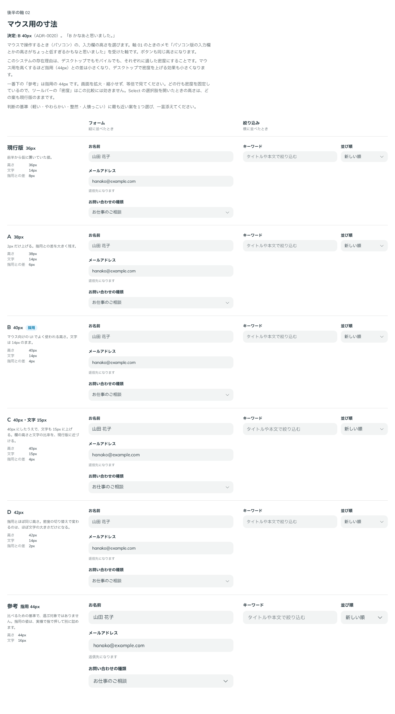

# 0020. マウス用の寸法

- ステータス: Accepted
- 日付: 2026-09-12
- ラウンド: 後半 軸02

## 背景

原則11では、寸法（コントロールの高さ、余白、文字サイズ）を入力方式で切り替えます（[ADR-0004](./0004-density-and-structure-switching.md)）。指用の 44px とマウス用の 36px は、前半では振らずに仮の値として置いていました。

軸 01 の回答のときに、ユーザーから次の指摘がありました。

> そういえばですが、パソコン版の入力欄とかの高さがちょっと低すぎるかもなと思いました。

この先の比較は、すべてマウス用の高さで見ることになります。そのため、エラー時の塗りより先に、マウス用の寸法を比べました。

## 候補

| 案     | 高さ | 文字 | 指用（44px）との差 |
| ------ | ---- | ---- | ------------------ |
| 現行版 | 36px | 14px | 8px                |
| A      | 38px | 14px | 6px                |
| B      | 40px | 14px | 4px                |
| C      | 40px | 15px | 4px                |
| D      | 42px | 14px | 2px                |

比較は Storybook の `Design Review/02 マウス用の寸法`（決めた時点のコミット `d91655c`。`git checkout d91655c && pnpm storybook` で開けます）です。フォーム（縦に並べる）と絞り込み（横に並べる）の2つの場面で、各行の密度をマウス用に固定して比べました。指用の 44px の行を、参考として並べています。

## 決定

B を採用します。マウス用の高さを 36px から 40px に上げ、文字は 14px のままにします。

- `--size-control-fine: 40px`
- `--text-control-fine: 14px`（変更なし）

指用の 44px は変えません。実機で指で押して、別に詰めます。

## 理由

ユーザーのメモです。

> B かなあと思いました。

以下は、比較から読み取れることです。40px にしても、指用との差は高さで 4px、文字で 2px（14px と 16px）残ります。デスクトップでは密度を上げるという存在理由は保てます。

## 却下した案と理由

- **現行版（36px）**: 低すぎる（ユーザーの指摘）
- **A（38px）**: 選ばれませんでした。上げ幅が 2px で、現行版との違いが小さい案です
- **C（40px・文字 15px）**: 選ばれませんでした。高さは B と同じで、文字を大きくするぶん密度が下がります
- **D（42px）**: 選ばれませんでした。指用との差が 2px になり、密度を切り替える意味が薄れます

## 影響

- `tokens.css`: `--size-control-fine` を 36px から 40px に変えました
- `principles.md`: 原則11のマウス用の高さを【決定】にしました。指用の 44px は仮のままです
- 余白（左右 16px／12px）、ラベルとキャプションの文字の大きさの密度差は変えていません
- 角丸は 12px のままです。密度によって変えないことは [ADR-0008](./0008-control-radius.md) で決まっています
- Select の選択肢の高さも `--size-control` を使うため、40px になります

## 比較画像

