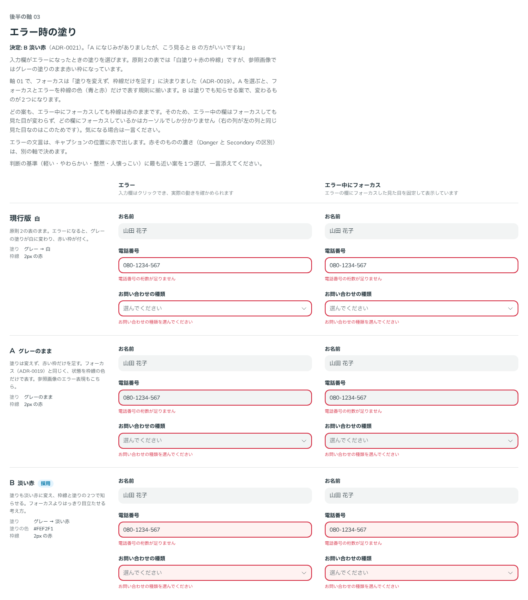

# 0021. エラー時の入力欄の塗り

- ステータス: Accepted
- 日付: 2026-09-12
- ラウンド: 後半 軸03

## 背景

原則2の表では、入力欄のエラーを「白塗り＋赤の枠線」としていました。一方、参照画像（`references/component-text-fields.webp`、`references/component-selects.webp`）のエラーは、グレーの塗りのまま赤い枠になっているように見えます。この食い違いは、前半から後半の軸として残していました。

軸 01 で、フォーカスは「塗りを変えず、枠線だけを足す」に決まりました（[ADR-0019](./0019-field-focus-change.md)）。そのため、エラーの塗りもそれに揃えるかどうかを比べました。

## 候補

| 案     | エラー中の塗り               | 枠線     |
| ------ | ---------------------------- | -------- |
| 現行版 | グレー → 白                  | 2px の赤 |
| A      | グレーのまま                 | 2px の赤 |
| B      | グレー → 淡い赤（`#FEF2F1`） | 2px の赤 |

淡い赤は、Danger（`#D4283F`）と同じ色相（20.6°）で、明度と彩度だけを変えた色です（OKLCH で明度 0.97・彩度 0.015）。

比較は Storybook の `Design Review/03 エラー時の塗り`（決めた時点のコミット `d91655c`。`git checkout d91655c && pnpm storybook` で開けます）です。エラーの TextField と Select を、通常の欄と並べて比べました。

## 決定

B を採用します。エラーの入力欄は、塗りを淡い赤に変え、2px の赤い枠線を付けます。

- `--palette-red-50: #fef2f1`（値の層に追加）
- `--color-field-invalid: var(--palette-red-50)`

淡い赤の上のコントラストは、文字 12.62:1、赤い枠線 4.60:1、Select の矢印（`--color-fg-muted`）6.27:1 で、どれも基準を満たします。

## 理由

ユーザーのメモです。

> A になじみがありましたが、こう見ると B の方がいいですね

A は参照画像と同じ表し方で、なじみがありました。並べて見たうえで、B が選ばれました。

フォーカスとエラーでは、知らせたい強さが違います。フォーカスは操作のたびに起こるので、変化を小さくします（ADR-0019）。エラーは見落とされると困るので、枠線と塗りの2つで知らせます。

淡い赤とグレーの塗り（`--color-field`）は、明度がほぼ同じです（1.01:1）。変わるのは色相だけなので、原則2の「明度で状態を表さない」には反しません。

## 却下した案と理由

- **現行版（白）**: 選ばれませんでした。塗りが白に変わるのは、軸 01 で「変化が大きすぎる」とされたフォーカスの旧表現と同じ変わり方です
- **A（グレーのまま）**: 参照画像と同じでなじみはありますが、並べて見ると B のほうが良い（ユーザー）

## 影響

- `tokens.css`: 値の層に `--palette-red-50` を足し、`--color-field-invalid` を `var(--palette-red-50)` にしました
- `principles.md`: 原則2のエラーの行を【決定】にしました。「変化の大きさは、知らせたい強さに合わせる」を書き足しました
- エラー中にフォーカスしても、見た目は変わりません（枠線は赤、塗りは淡い赤のまま）。比較の説明でこの点を示しましたが指摘はなかったため、このままにします。キーボード操作時のフォーカス（focus-visible）の軸で改めて扱います
- エラーの欄は、hover でも塗りを変えません
- 値が未定だった旧 Danger_Pale には、この淡い赤を当てます。Danger と Secondary の区別の軸で Danger の色を変えた場合は、同じ手順（Danger と同じ色相で明度 0.97・彩度 0.015）で作り直します

## 比較画像

