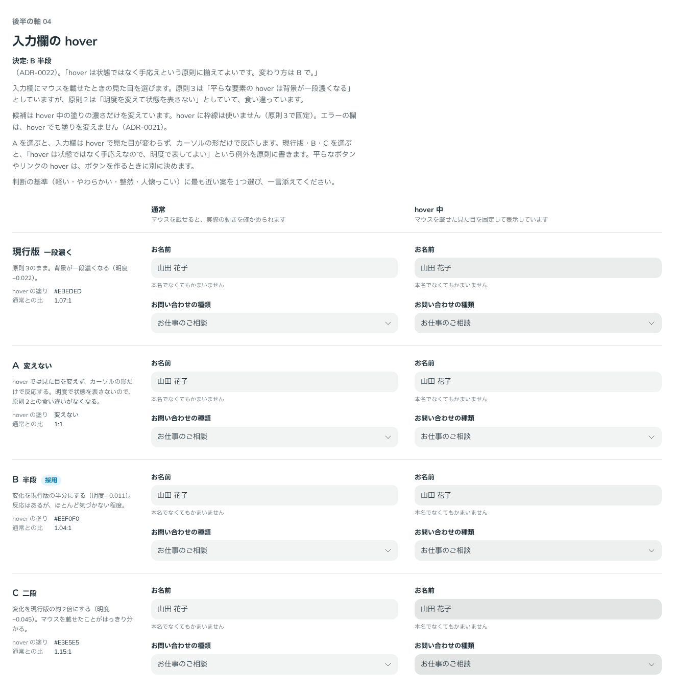

# 0022. 入力欄の hover

- ステータス: Accepted
- 日付: 2026-09-12
- ラウンド: 後半 軸04

## 背景

原則3は「平らな要素の hover は背景が一段濃くなる」としていました。一方、原則2は「明度を変えて状態を表さない」としていて、食い違っていました。前半から後半の軸として残していたものです。

入力欄の hover の見た目を比べ、あわせて食い違いをどちらに寄せるかを決めました。

## 候補

| 案     | hover 中の塗り        | 通常との比 |
| ------ | --------------------- | ---------- |
| 現行版 | 一段濃く（`#EBEDED`） | 1.07:1     |
| A      | 変えない              | 1:1        |
| B      | 半段濃く（`#EEF0F0`） | 1.04:1     |
| C      | 二段濃く（`#E3E5E5`） | 1.15:1     |

どの色も、入力欄の塗り（`--color-field`、`#F2F4F4`）の明度だけを下げたものです。hover に枠線は使いません（原則3で固定）。

比較は Storybook の `Design Review/04 入力欄の hover`（[`stories/axis-04-field-hover.stories.tsx`](../stories/axis-04-field-hover.stories.tsx)）です。TextField と Select を、通常の状態と、マウスを載せた見た目を固定したもので比べました。

## 決定

- **hover は状態ではなく手応えとして扱い、明度で表してかまいません。** 原則2の「明度で状態を表さない」は、フォーカスやエラーなどの状態に限ります
- 入力欄の hover は B（半段濃く）にします
  - `--palette-gray-150: #eef0f0`（旧 `#EBEDED`）
  - `--color-field-hover: var(--palette-gray-150)`

## 理由

ユーザーのメモです。

> hover は状態ではなく手応えという原則に揃えてよいです。変わり方は B で。

以下は、比較と原則から読み取れることです。hover はマウスを載せるたびに起こりますが、欄の状態は何も変わっていません。反応があることが伝われば十分なので、変化は小さくてよいと言えます。

これは、[ADR-0021](./0021-field-error-fill.md) の「変化の大きさは、知らせたい強さに合わせる」とも揃います。入力欄の変化は、弱いほうから次の順になります。

| 何が起きたか       | 変わり方               | ADR  |
| ------------------ | ---------------------- | ---- |
| hover（手応え）    | 塗りが半段濃くなる     | 0022 |
| フォーカス（状態） | 2px の青い枠線を足す   | 0019 |
| エラー（状態）     | 赤い枠線＋淡い赤の塗り | 0021 |

## 却下した案と理由

- **現行版（一段濃く）**: 選ばれませんでした
- **A（変えない）**: 選ばれませんでした。hover を手応えとして扱うことにしたので、反応は残します
- **C（二段濃く）**: 選ばれませんでした。変化が最も大きい案です

## 影響

- `tokens.css`: `--palette-gray-150` を `#EBEDED` から `#EEF0F0` に変えました。この値は `--palette-gray-100`（`#EFF0F1`）とほぼ同じ（1.003:1）ですが、「入力欄の塗りから半段濃く」という作り方を残すため、別の値として持ちます
- `principles.md`: 原則3に「hover は状態ではなく手応え」を書き、平らな要素の hover の行を【決定】にしました。原則2の「原則3との矛盾」の注記を消しました
- 平らなボタン・リンクの hover と押下の変わり方は、ボタンの軸で決めます。hover を明度で表すことは、この ADR で決まっています

## 比較画像

