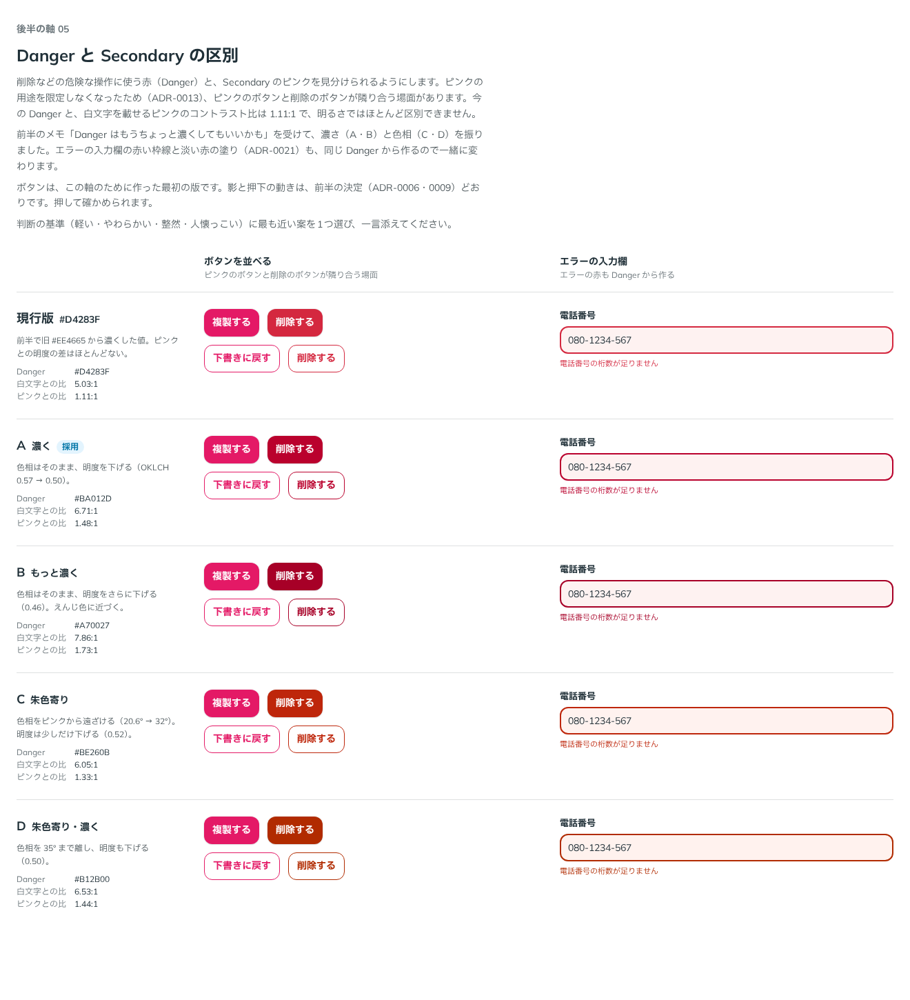

# 0023. Danger と Secondary の区別

- ステータス: Accepted
- 日付: 2026-09-12
- ラウンド: 後半 軸05

## 背景

[ADR-0013](./0013-secondary-color.md) でピンク（Secondary）の用途を限定しなくなったため、ピンクのボタンと削除のボタン（Danger）が隣り合う場面があります。

前半で、Danger を旧 `#EE4665` から `#D4283F` に変えました。それでも、白文字を載せるピンク（`--color-fg-secondary`、`#E41966`）とのコントラスト比は 1.11:1 で、明るさではほとんど区別できませんでした。前半のラウンド1では、ユーザーから次のメモがありました。

> Danger はもうちょっと濃くしてもいいかも。

## 候補

| 案     | Danger    | 色相  | 白文字との比 | 前景用のピンクとの比 |
| ------ | --------- | ----- | ------------ | -------------------- |
| 現行版 | `#D4283F` | 20.6° | 5.03:1       | 1.11:1               |
| A      | `#BA012D` | 20.6° | 6.71:1       | 1.48:1               |
| B      | `#A70027` | 20.6° | 7.86:1       | 1.73:1               |
| C      | `#BE260B` | 32°   | 6.05:1       | 1.33:1               |
| D      | `#B12B00` | 35°   | 6.53:1       | 1.44:1               |

A・B は色相を保ったまま明度を下げる案、C・D は色相をピンクから遠ざける（朱色に寄せる）案です。エラーの入力欄の赤い枠線と淡い赤の塗り（[ADR-0021](./0021-field-error-fill.md)）も Danger から作るので、一緒に変えて比べました。

比較は Storybook の `Design Review/05 Danger と Secondary の区別`（[`stories/axis-05-danger.stories.tsx`](../stories/axis-05-danger.stories.tsx)）です。ピンクと Danger のボタンを塗りと枠線で隣に並べ、エラーの入力欄と一緒に比べました。

## 決定

A を採用します。Danger の色相はそのまま、明度を OKLCH で 0.57 から 0.50 に下げます。

- `--palette-red-700: #ba012d`（値の層に追加。旧 `--palette-red-600: #d4283f` は削除）
- `--color-danger: var(--palette-red-700)`

エラーの淡い赤（`--palette-red-50`、`#FEF2F1`）は色相が同じなので変わりません。淡い赤の上の赤い枠線は 6.13:1、白地の上のエラーの文言は 6.71:1 です。

## 理由

ユーザーは Storybook で A を選び、次のように添えました。

> 選びました！エラーテキストも見やすいかなと思っています。

以下は、比較から読み取れることです。色相を変えずに明度で区別するので、Danger らしい赤のまま、前景用のピンクとの差が 1.11:1 から 1.48:1 に広がります。前半のメモ「Danger はもうちょっと濃くしてもいいかも」の方向どおりです。濃くしたことで、入力欄の下のエラーの文言も読みやすくなりました（5.03:1 → 6.71:1）。

## 却下した案と理由

- **現行版（`#D4283F`）**: ピンクとの差が小さい（1.11:1）
- **B（もっと濃く）**: 選ばれませんでした。最も濃く、えんじ色に近づく案です
- **C・D（朱色寄り）**: 選ばれませんでした。色相をずらして区別する案です

## 影響

- `tokens.css`: 値の層に `--palette-red-700` を足し、`--palette-red-600` を削除しました。`--color-danger` は `var(--palette-red-700)` になりました
- `principles.md`: 原則6の「Danger と Secondary の区別」を【決定】にしました
- 区別は明度だけで行います。形やアイコンでの区別は、今のところ使いません
- Danger を使う部品: 塗りと枠線の Danger ボタン、エラーの入力欄の枠線と文言

## 比較画像

