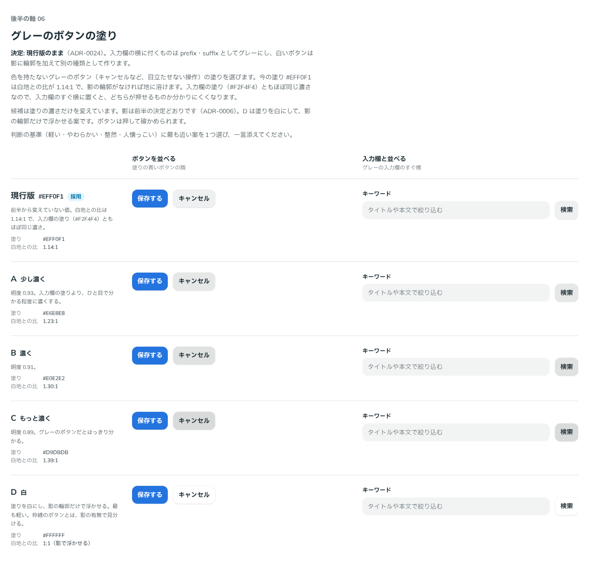

# 0024. グレーのボタンの塗り

- ステータス: Accepted
- 日付: 2026-09-12
- ラウンド: 後半 軸06

## 背景

色を持たないグレーのボタン（`--color-neutral`、`#EFF0F1`）は、白地との比が 1.14:1 です。影の輪郭がなければ地に溶けます。また、入力欄の塗り（`--color-field`、`#F2F4F4`）ともほぼ同じ濃さなので、入力欄のすぐ横に置くと、どちらが押せるものか分かりにくいという問題がありました（前半から残っていた後半の軸「グレーボタンのコントラスト」）。

## 候補

| 案     | 塗り      | 白地との比 |
| ------ | --------- | ---------- |
| 現行版 | `#EFF0F1` | 1.14:1     |
| A      | `#E6E8E8` | 1.23:1     |
| B      | `#E0E2E2` | 1.30:1     |
| C      | `#D9DBDB` | 1.39:1     |
| D      | `#FFFFFF` | 1:1        |

A〜C は中立色の明度だけを下げた案、D は塗りを白にして影の輪郭だけで浮かせる案です。

比較は Storybook の `Design Review/06 グレーのボタンの塗り`（[`stories/axis-06-neutral.stories.tsx`](../stories/axis-06-neutral.stories.tsx)）です。青いボタンの隣と、グレーの入力欄のすぐ横に並べて比べました。

## 決定

1. **グレーのボタンの塗りは、現行版の `#EFF0F1` のままにします**（`--color-neutral` は変更なし）
2. **入力欄のすぐ横に付くもの（検索ボタンなど）は、独立したボタンではなく、入力欄の prefix・suffix として作ります。** 色は、入力欄に付く部分のグレー（`--color-field-addon`、`#E1E3E4`）にします
3. **白いボタン（面の塗り）を、ボタンの種類に加えます。** 影に加えて輪郭を付けます。輪郭の太さと色は、後半の軸 07 で決めます

## 理由

ユーザーのメモです。

> 入力欄の suffix, prefix のような物であればグレーになっている必要があると思います。
> そうでなければ、現行版でいいと思っています。
> 濃くすると Disabled のボタンを作りづらくなる可能性も感じています。
> ボタンのバリエーションとして白ボタンを作るのは賛成ですが、影だけだと区別がつかないので、影に加えてアウトラインが必要だと思います。

以下は、メモから読み取れることです。

- 比較で問題になった「入力欄の横のグレーのボタン」は、入力欄と一体の prefix・suffix として扱えば解けます。独立したグレーのボタンを濃くする必要はありません
- グレーのボタンを濃くすると、Disabled（押せない）の見た目に使える明るさの幅が狭まります。Disabled の軸を残しているため、グレーは明るいままにしておきます
- D の比較で、白い地の上では影だけでは区別がつかないことが分かりました。白いボタンは、輪郭を足して作ります

## 却下した案と理由

- **A〜C（濃くする）**: Disabled のボタンを作りづらくなるおそれがある
- **D（白・影だけ）**: 影だけでは区別がつかない。白いボタン自体は、輪郭を足した別の種類として作ります

## 影響

- `tokens.css`: `--color-neutral` は変更なし。白いボタンの輪郭のために `--color-surface-line`（仮に `--palette-gray-300`）と `--surface-line-width`（仮に 1px）を足しました
- `src/components/Button.tsx`: 白いボタン（`color="surface"`）を足しました。塗りは面（`--color-surface`）で、影と輪郭を付けます
- `principles.md`: 原則1に白いボタンの扱いを、原則8に prefix・suffix の色を書きました
- 後半の軸に「白いボタンの輪郭」（軸 07）と「入力欄の prefix・suffix を部品として作る」を足しました
- Disabled の軸では、グレーのボタンが明るいままであることを前提にします

## 比較画像

