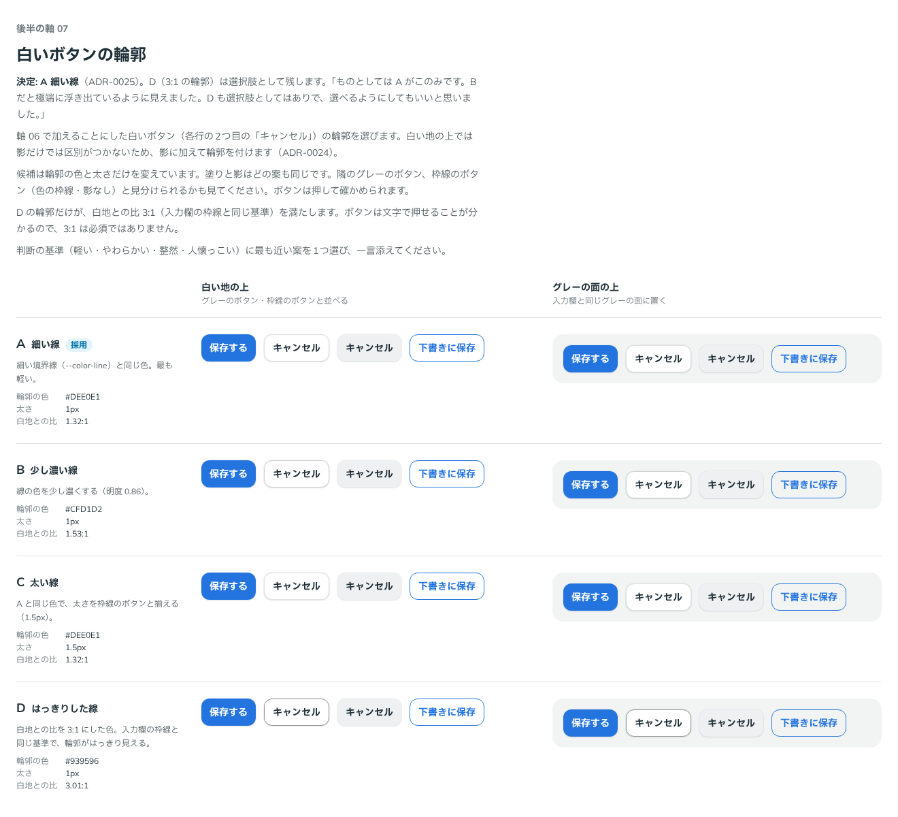

# 0025. 白いボタンの輪郭

- ステータス: Accepted
- 日付: 2026-09-12
- ラウンド: 後半 軸07

## 背景

[ADR-0024](./0024-neutral-button.md) で、白いボタン（面の塗り、`color="surface"`）をボタンの種類に加えました。白い地の上では影だけでは区別がつかないため、影に加えて輪郭を付けます。その輪郭の色と太さを比べました。

## 候補

| 案  | 輪郭の色  | 太さ  | 白地との比 |
| --- | --------- | ----- | ---------- |
| A   | `#DEE0E1` | 1px   | 1.32:1     |
| B   | `#CFD1D2` | 1px   | 1.53:1     |
| C   | `#DEE0E1` | 1.5px | 1.32:1     |
| D   | `#939596` | 1px   | 3.01:1     |

輪郭の色は、どれも中立色の明度だけを下げたものです。A は細い境界線（`--color-line`）と同じ色、C は太さを枠線のボタンと揃えた案、D は入力欄の枠線と同じ 3:1 を満たす案です。新しい種類なので、現行版はありません。

比較は Storybook の `Design Review/07 白いボタンの輪郭`（[`stories/axis-07-surface-button.stories.tsx`](../stories/axis-07-surface-button.stories.tsx)）です。白いボタンを、グレーのボタン・枠線のボタンと並べ、白い地の上とグレーの面の上で比べました。

## 決定

- **白いボタンの輪郭は A（`#DEE0E1`・1px）にします**
  - `--color-surface-line: var(--palette-gray-300)`
  - `--surface-line-width: 1px`
- **D（3:1 の輪郭）は選択肢として残します。** 3:1 の輪郭の色を `--color-line-strong`（`#939596`）として役割の層に足しました。アプリ側で `--color-surface-line` を `var(--color-line-strong)` に差し替えると、その範囲の白いボタンの輪郭が D になります

## 理由

ユーザーのメモです。

> ものとしては A がこのみです。Bだと極端に浮き出ているように見えました。D も選択肢としてはありで、選べるようにしてもいいと思いました。

以下は、メモと比較から読み取れることです。A は細い境界線と同じ色で、候補の中で最も軽く見えます（判断の基準「軽い」）。D は輪郭がはっきりしていて 3:1 を満たすので、コントラストを優先したい画面で選べるようにします。

この軸を比べている途中で、ユーザーから次の指摘がありました（principles.md から移した記録）。

> 何か下の方に行くにつれてボタンの文字が上にずれてます…？

## 却下した案と理由

- **B（少し濃い線）**: 極端に浮き出ているように見える（ユーザー）
- **C（太い線）**: 選ばれませんでした。太さを枠線のボタンと揃える案です

## 影響

- `tokens.css`: 値の層に `--palette-gray-500`（`#939596`）を、役割の層に `--color-line-strong` を足しました。`--color-surface-line` と `--surface-line-width` は、仮の値のまま決定になりました
- `principles.md`: 原則1の白いボタンの輪郭を【決定】にしました
- D の選び方は、画面全体またはその一部で `--color-surface-line` を差し替える形です。ボタン1つずつに選ぶ形にはしていません。この形でよいことはユーザーに確認済みです（「統一でよさそうです。」）
- **追記（README の進捗から移した記録）**: この軸を比べている途中で、行の高さの端数のせいでボタンの文字が1pxずれることが分かり、行の高さを整数pxに直しました。

## 比較画像

