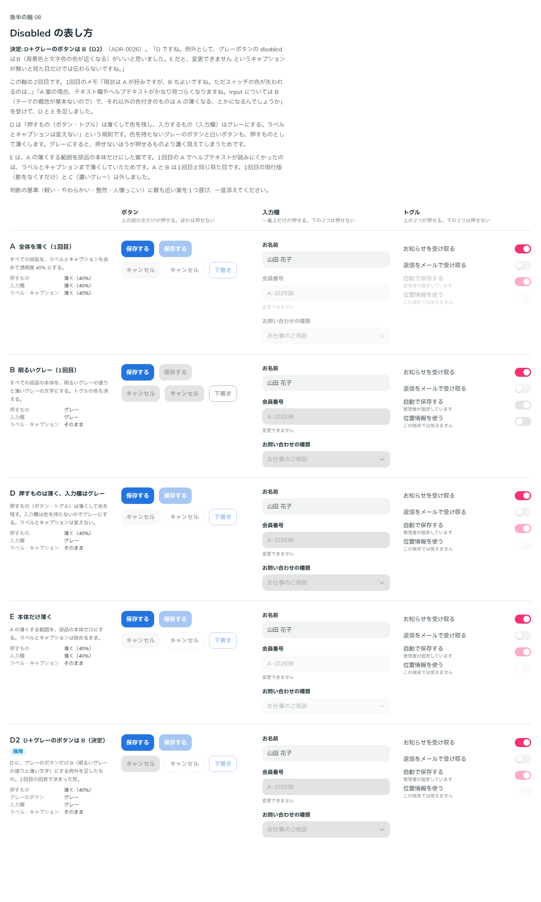

# 0026. Disabled の表し方

- ステータス: Accepted
- 日付: 2026-09-13
- ラウンド: 後半 軸08（2回）

## 背景

原則1では、Disabled を「塗りがある + 影がない」で表し、「Disabled は色を薄くする必要がない」としていました。一方、前半のラウンド2で、ユーザーから次のメモがありました（[ADR-0011](./0011-switch-off-track.md)）。

> スイッチ OFF の輪郭はいらないかも。前と同じでよいです。disabled の時の見た目を変える方がよさそう。

参照画像（`references/component-buttons.webp`）の Disabled も、濃いグレーの塗りに薄い文字で、色を変えています。あわせて、「グレー塗り・影なしの入力欄が、原則1の表では『押せない』と読める」という原則1と原則2の矛盾も残っていました。

## 候補

どの案も影はなくします。ボタン・入力欄・トグルに同じ規則を当てて比べました。

### 1回目

| 案     | 見た目                                                             |
| ------ | ------------------------------------------------------------------ |
| 現行版 | 影をなくすだけ。色は変えない                                       |
| A      | 部品全体（ラベルとキャプションも含む）を透明度 40% にする          |
| B      | 本体を明るいグレーの塗り（`#E1E3E4`）と薄い文字（`#A3A5A6`）にする |
| C      | 本体を濃いグレーの塗り（`#9D9FA0`）と明るい文字（`#F2F4F4`）にする |

ユーザーのメモです。

> 現状は A が好みですが、B もよいですね。ただスイッチの色が失われるのは…という気持ちです。
> A 案の場合、テキスト欄やヘルプテキストがかなり見づらくなりますね。そう思うと Input については B（テーマの概念が基本ないので）で、それ以外の色付きのものは A の薄くなる、とかになるんでしょうか。

### 2回目

1回目のメモを受けて、D と E を足しました。

| 案  | ボタン・トグル | 入力欄 | ラベル・キャプション |
| --- | -------------- | ------ | -------------------- |
| A   | 薄く（40%）    | 薄く   | 薄く                 |
| B   | グレー         | グレー | そのまま             |
| D   | 薄く（40%）    | グレー | そのまま             |
| E   | 薄く（40%）    | 薄く   | そのまま             |

比較は Storybook の `Design Review/08 Disabled の表し方`（[`stories/axis-08-disabled.stories.tsx`](../stories/axis-08-disabled.stories.tsx)）です。押せる部品と押せない部品を、ボタン・入力欄・トグルごとに並べました。

## 決定

D を採用し、グレーのボタンだけは B にします。どの部品も、影はなくします。

| 部品                           | Disabled の見た目                                      | トークン                                                  |
| ------------------------------ | ------------------------------------------------------ | --------------------------------------------------------- |
| 色のボタン・白いボタン・トグル | 本体を透明度 40% にする。色は残す                      | `--disabled-opacity: 0.4`                                 |
| 入力欄（TextField・Select）    | 明るいグレーの塗り（`#E1E3E4`）に薄い文字（`#A3A5A6`） | `--color-field-disabled`、`--color-on-field-disabled`     |
| グレーのボタン                 | 入力欄と同じ                                           | `--color-neutral-disabled`、`--color-on-neutral-disabled` |
| ラベル・キャプション           | 変えない                                               | `--disabled-label-opacity: 1`                             |

値の層に `--palette-gray-400`（`#A3A5A6`）を足しました。

## 理由

2回目のユーザーのメモです。

> D ですね。例外として、グレーボタンの disabled はB（背景色と文字色の色が近くなる）がいいと思いました。
> E だと、変更できません というキャプションが無いと見た目だけでは伝わらないですね。

以下は、メモと比較から読み取れることです。

- 色を持つ部品（色のボタン・トグル）は、薄くしても色が残るので、何の部品か、ON か OFF かが分かります
- 入力欄はテーマの色を持たないので、グレーにしても失うものがありません。入力欄だけを薄くすると、キャプションがなければ押せないことが伝わりません
- グレーのボタンは、薄くするより、塗りと文字の色が近くなるほうが「押せない」と伝わります
- ラベルとキャプションを変えないので、「変更できません」などの説明は読めるままです

## 却下した案と理由

- **1回目の現行版（影をなくすだけ）**: スイッチ OFF と区別しにくい（ADR-0011 の方向性）
- **A（全体を薄く）**: 入力欄とヘルプテキストが見づらくなる
- **B（全部グレー）**: トグルの色が失われる
- **C（濃いグレー）**: 選ばれませんでした
- **E（本体だけ薄く）**: 「変更できません」のようなキャプションがないと、入力欄が押せないことが見た目だけでは伝わらない

## 影響

- `tokens.css`: Disabled のトークンを上の表のとおりに決めました。`--color-disabled`・`--color-on-disabled`・`--color-disabled-fg` は未設定のままで、色を持つ部品はもとの色を保ちます
- `src/components/Button.tsx`: グレーのボタンだけ、Disabled のときに `--color-neutral-disabled` などを使うようにしました
- `principles.md`: 原則1の Disabled の段落と表を書き換え、【決定】にしました。Disabled は「影がないこと」だけで表さなくなったため、原則1と原則2の矛盾（グレー塗り・影なしの入力欄が「押せない」と読める）も解消しました
- 押せない OFF のトグルは、もともと薄いグレーのトラックがさらに薄くなり、見えにくくなります。比較の説明で示しましたが指摘はなかったため、このままにします
- 白いボタンも色を持ちませんが、ユーザーの指定はグレーのボタンだけだったので、薄くするほうにしました
- 比較のストーリーには、2回目の4案に加えて、決定した形（D にグレーのボタンの例外を足したもの）を D2 として並べました
- **追記（[ADR-0029](./0029-disabled-refine.md)）**: 上の「押せない OFF のトグルは……このままにします」は、ADR-0028 の比較でユーザーが後で詰めることにし、ADR-0029 で変わりました。グレーのトグルとグレーの枠線のボタンも、グレーのボタンと同じく薄くせずグレーにします。押せない OFF のトラックは、どの色のトグルも `#E1E3E4` です。色のトグルの ON を 40% に薄くするのは、この ADR のままです

## 比較画像

