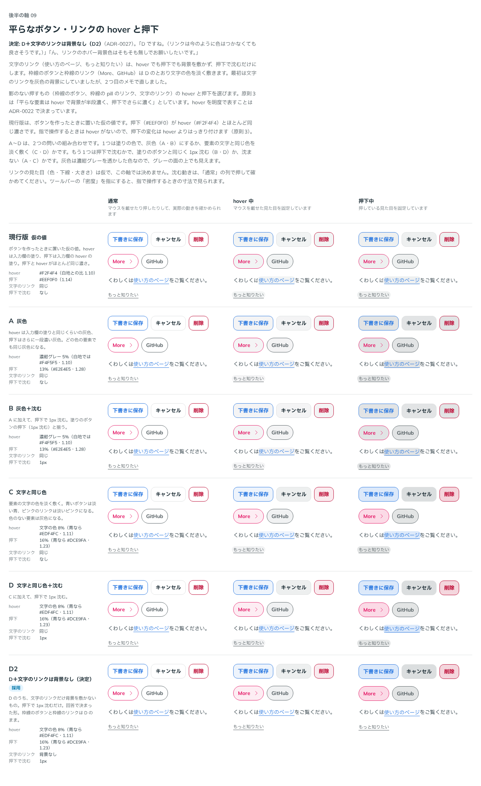

# 0027. 平らなボタン・リンクの hover と押下

- ステータス: Accepted
- 日付: 2026-09-13
- ラウンド: 後半 軸09

## 背景

原則3は、平らな要素（影のない押すもの）について「hover で背景が半段濃く、押下でさらに濃く」としていました。hover を明度で表してよいことは [ADR-0022](./0022-field-hover.md) で決まっていましたが、枠線のボタンとリンクの値は、ボタンを作ったときに置いた仮の値でした。仮の値は hover が `#F2F4F4`、押下が `#EEF0F0` で、押下と hover がほとんど同じ濃さでした。原則3は「指で操作するときは hover がないので、押下の変化は hover よりはっきり付ける」としており、仮の値はこれを満たしていませんでした。

平らな要素として、次の3つを並べて比べました。

- 枠線のボタン（青・グレー・Danger）
- 枠線の pill のリンク（More、GitHub。原則7の例外の、密度の高い並び）
- 文字のリンク（文章中の「使い方のページ」、単独の「もっと知りたい」）

リンクの部品（`src/components/Link.tsx`）は、この比較のために仮で作りました。

## 候補

A〜D は、「塗りの色」と「押下で沈むか」の2つの問いの組み合わせです。

| 案     | hover の塗り                              | 押下の塗り                                 | 押下で沈む |
| ------ | ----------------------------------------- | ------------------------------------------ | ---------- |
| 現行版 | `#F2F4F4`（白地との比 1.10）              | `#EEF0F0`（1.14）                          | なし       |
| A      | 濃紺グレー 5%（白地では `#F4F5F5`・1.10） | 濃紺グレー 13%（白地では `#E2E4E5`・1.28） | なし       |
| B      | A と同じ                                  | A と同じ                                   | 1px        |
| C      | 文字の色 8%（青なら `#EDF4FC`・1.11）     | 文字の色 16%（青なら `#DCE9FA`・1.23）     | なし       |
| D      | C と同じ                                  | C と同じ                                   | 1px        |

- A・B の灰色は、濃紺グレー（`--color-fg`）を透かした色です。グレーの面の上でも見えます
- C・D は、要素の文字の色を淡く敷きます。青いボタンは淡い青、ピンクの More は淡いピンクになります。色のない要素（グレーの枠線のボタン、GitHub）は、文字が濃紺グレーなので灰色になります
- 沈む深さは、塗りのボタンの押下（[ADR-0009](./0009-press-motion.md)）と同じ 1px です

比較は Storybook の `Design Review/09 平らなボタン・リンクの hover と押下`（[`stories/axis-09-flat-press.stories.tsx`](../stories/axis-09-flat-press.stories.tsx)）です。「通常」「hover 中」「押下中」の3列に並べました。

## 決定

**D を採用します。ただし、文字のリンクには背景を敷きません**（ストーリーの D2）。

| 要素                       | hover              | 押下                | 押下で沈む |
| -------------------------- | ------------------ | ------------------- | ---------- |
| 枠線のボタン・枠線のリンク | 文字の色を 8% 敷く | 文字の色を 16% 敷く | 1px        |
| 文字のリンク               | 背景を敷かない     | 背景を敷かない      | 1px        |

トークンは次のとおりです。

- `--color-flat-hover: color-mix(in oklab, currentColor 8%, transparent)`
- `--color-flat-press: color-mix(in oklab, currentColor 16%, transparent)`
- `--color-link-hover: transparent`
- `--color-link-press: transparent`
- `--flat-press-depth: 1px`

## 理由

ユーザーのメモです。

> 個人的には D が好みです。

> D ですね。（リンクは今のように色はつかなくても良さそうです。）

> ん、リンクのホバー背景色はそもそも無しでお願いしたいです。

最初は2つ目のメモを「文字のリンクは色をつけず灰色にする」と受け取り、文字のリンクに灰色の背景を敷いていました。3つ目のメモで、文字のリンクには背景そのものを敷かないことになりました。枠線の pill のリンク（ユーザーは「リンクボタン」と呼んでいました）は、枠線のボタンと同じく色を敷きます。

以下は、メモと比較から読み取れることです。

- **文字の色を淡く敷く**と、押した要素の色がそのまま手応えになります。新しい色相を持ち込まないので、原則2の「状態は枠線と色相で表す」とぶつかりません。hover は状態ではなく手応えです（[ADR-0022](./0022-field-hover.md)）
- **押下で沈む**と、塗りのボタンと平らなボタンが同じ「一段沈む」動きになります（原則3）。押下の塗りは hover の2倍の濃さで、さらに沈むので、hover のない指の操作でも押したことが分かります
- **文字のリンク**は、文章の中にあります。背景が出ると文章の中で目立ちすぎるので、背景は敷かず、押下で沈むだけにします

## 却下した案と理由

- **現行版（仮の値）**: 押下と hover がほとんど同じ濃さで、指で操作するときに押したことが分かりにくい
- **A（灰色）・B（灰色＋沈む）**: 選ばれませんでした。枠線のボタンとリンクは、どの色でも同じ灰色になる案です
- **C（文字と同じ色）**: 選ばれませんでした。D から沈む動きを除いた案です
- **文字のリンクを灰色の背景にする（D2 の最初の形）**: 2つ目のメモの解釈として作りましたが、ユーザーの意図と違いました（「リンクのホバー背景色はそもそも無しでお願いしたいです。」）

## 影響

- `tokens.css`: `--color-flat-hover`・`--color-flat-press`・`--color-link-hover`・`--color-link-press`（役割の層）と `--flat-press-depth` を足しました。塗りは値の層の色ではなく、文字の色や `--color-fg` を透かす式です。どの面の上でも同じだけ濃くなるようにするためです
- `src/components/Button.tsx`: 枠線のボタンの hover と押下を、仮の値からこのトークンに替えました
- `tokens.css` の `--color-link-hover` と `--color-link-press` は `transparent` です。比較のストーリーで A〜D（文字のリンクにも塗りを敷く）を再現できるよう、トークンとしては残しています
- `src/components/Link.tsx`: リンクの部品を足しました。文字のリンクと枠線のリンクの2種類です。色・下線・大きさは仮で、hover と押下だけがこの ADR で決まっています
- 文字のリンクは、hover で見た目が変わらず、カーソルの形だけで反応します。原則3は hover を「すべてのインタラクティブ要素に共通」としていますが、文字のリンクはその例外です。ユーザーのメモは「原則3は限られた素材から作ったので、例外があるかもしれないですね」で、原則3に例外がありうることを書き足しました。文字のリンクの hover（下線の変え方など）は、リンクの見た目の軸で詰めます（「文字リンクは後で詰めましょう。」）
- **追記（[ADR-0030](./0030-text-link.md)）**: 文字のリンクの hover は、下線だけが文字より濃くなる形に決まりました。背景を敷かないことは、この ADR のままです。比較のストーリー（軸 09）は、下線と角丸のトークンを書き足し、比べたときの見た目を再現しています
- `principles.md`: 原則3の平らな要素の行を【決定】にしました
- Danger の枠線のボタンは、hover で淡い赤の塗りになり、エラーの入力欄（赤い枠線＋淡い赤の塗り、[ADR-0021](./0021-field-error-fill.md)）と似た見た目になります。どちらも「注意」の意味なので、いまはこのままにします

## 比較画像

