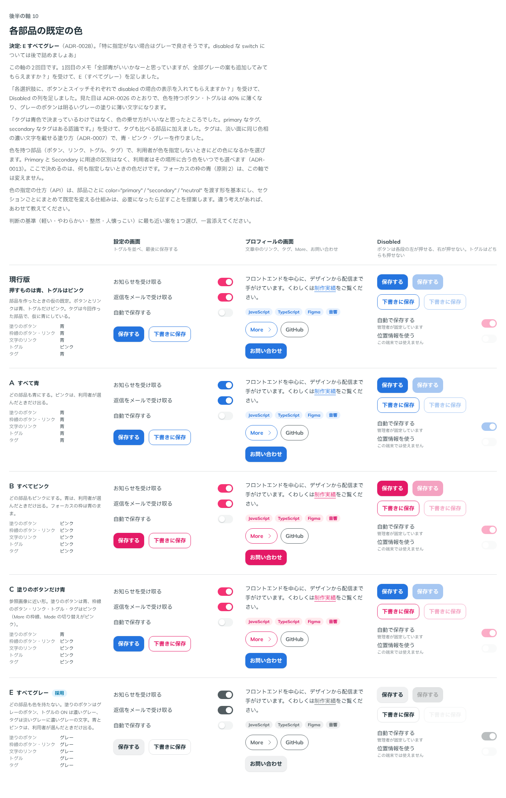

# 0028. 各部品の既定の色

- ステータス: Accepted
- 日付: 2026-09-13
- ラウンド: 後半 軸10

## 背景

[ADR-0013](./0013-secondary-color.md) で、ピンクを用途を限定しない Secondary にしました。色を持つ部品は、利用者が primary / secondary を選べる形にします。そのとき、次の2つは未決にしていました。

- 利用者が色を指定しないときに、どの色になるか（既定の色）
- 色を選ぶ API の形

部品を作ったときの仮の既定は、ボタンとリンクが青、トグルがピンクでした。

タグについては、[ADR-0007](./0007-tag-color.md) が「淡い水色の面に、同じ色相の濃い水色の文字」を決めていました。ユーザーの説明は「タグは青色で決まっているわけではなく、色の乗せ方がいいなと思ったところでした。primary なタグ、secondary なタグはある認識です。」でした。そこで、この軸でタグも色を選べる部品として扱い、タグの部品（`src/components/Tag.tsx`）を作りました。

## 候補

| 案     | 塗りのボタン | 枠線のボタン・リンク | 文字のリンク | トグル | タグ   |
| ------ | ------------ | -------------------- | ------------ | ------ | ------ |
| 現行版 | 青           | 青                   | 青           | ピンク | 青     |
| A      | 青           | 青                   | 青           | 青     | 青     |
| B      | ピンク       | ピンク               | ピンク       | ピンク | ピンク |
| C      | 青           | ピンク               | ピンク       | ピンク | ピンク |
| E      | グレー       | グレー               | グレー       | グレー | グレー |

- 現行版のタグは、この軸で作った部品なので、仮に青にしました
- C は参照画像に近い形です（More の枠線、Mode の切り替えがピンク）
- E は、1回目の回答「全部青がいいかなーと思っていますが、全部グレーの案も追加してみてもらえますか？」を受けて足しました。トグルの ON は濃いグレー（`--color-fg-muted`、`#525C60`）、タグは淡いグレーの面に濃いグレーの文字です
- 2回目では、ユーザーの依頼（「各選択肢に、ボタンとスイッチそれぞれで disabled の場合の表示を入れてもらえますか？」）で、各案に Disabled の見た目も並べました

タグの青とピンクは、水色のタグと同じ作り方で作りました。面は OKLCH の明度 0.96・彩度 0.02 のまま色相だけを変え、文字は同じ色相で、面の上で 4.5:1 を満たすまで明度を下げます。

| タグ   | 面        | 文字      | 面との比 |
| ------ | --------- | --------- | -------- |
| 青     | `#E9F2FE` | `#196BD6` | 4.52:1   |
| ピンク | `#FFEBEE` | `#D7005D` | 4.54:1   |
| グレー | `#EFF0F1` | `#525C60` | 6.02:1   |

Primary の青（`#2474DF`）は、淡い青の面の上では 4.01:1 しかありません。そのため、タグの文字は少し濃い青にしました。

比較は Storybook の `Design Review/10 各部品の既定の色`（決めた時点のコミット `fa9a622`。`git checkout fa9a622 && pnpm storybook` で開けます）です。「設定の画面」「プロフィールの画面」「Disabled」の3列に並べました。この軸は、トークンではなく部品の `color` の指定を行ごとに変えて比べています。

## 決定

**色を指定しないとき、色を持つ部品はすべてグレー（neutral）にします**（E）。

| 部品                       | 指定しないとき                                                                        |
| -------------------------- | ------------------------------------------------------------------------------------- |
| 塗りのボタン               | グレーのボタン（`--color-neutral`）                                                   |
| 枠線のボタン・枠線のリンク | グレーの枠線と文字                                                                    |
| 文字のリンク               | グレーの文字（`--color-fg-muted`）                                                    |
| トグル                     | ON は濃いグレー（`--color-fg-muted`）                                                 |
| タグ                       | 淡いグレーの面（`--color-tag-neutral`）に濃いグレーの文字（`--color-on-tag-neutral`） |

- **色の指定は、部品ごとの `color` です。** 値は `"primary"`（青）、`"secondary"`（ピンク）、`"neutral"`（グレー）です。ボタンは、このほかに `"danger"` と `"surface"`（白いボタン）を持ちます
- セクションごとにまとめて既定の色を変える仕組みは、必要になったら足します
- **タグは、青・ピンク・グレーの3種類です。** 塗り方は ADR-0007 のまま（淡い面に同じ色相の濃い文字）で、色だけを利用者が選びます

## 理由

ユーザーのメモです。

> 全部青がいいかなーと思っていますが、全部グレーの案も追加してみてもらえますか？

> 特に指定がない場合はグレーで良さそうです。disabled な switch については後で詰めましょあ

以下は、メモと比較から読み取れることです。

- 色は、利用者がその場所に合わせて選ぶものです（ADR-0013）。指定しないときに色が付かなければ、画面の中で色が付くのは、利用者が選んだ場所だけになります
- 1回目は A（すべて青）に傾いていましたが、E と並べた結果、グレーになりました
- API の形（部品ごとの `color` を基本にし、まとめて変える仕組みは必要になったら足す）は、ストーリーで提案しました。ユーザーから異論はなかったため、この形で進めます

## 却下した案と理由

- **現行版（押すものは青、トグルはピンク）**: 部品ごとに既定の色がばらばらでした
- **A（すべて青）**: 1回目は好まれましたが、E と並べてグレーになりました
- **B（すべてピンク）・C（塗りのボタンだけ青）**: 選ばれませんでした

## 影響

- `src/components/Button.tsx`・`Link.tsx`・`Switch.tsx`・`Tag.tsx`: 既定の `color` を `"neutral"` にしました。トグルに `color`（primary / secondary / neutral）を足しました
- `src/components/Tag.tsx`: タグの部品を足しました。大きさは仮です
- `tokens.css`: 値の層に `--palette-blue-50`・`--palette-blue-700`・`--palette-pink-50`・`--palette-pink-700` を、役割の層に `--color-tag-primary`・`--color-on-tag-primary`・`--color-tag-secondary`・`--color-on-tag-secondary`・`--color-tag-neutral`・`--color-on-tag-neutral` を足しました
- ADR-0007: 決まったのは塗り方で、水色という色ではないことを追記しました。水色のトークン（`--color-tag`、`--color-on-tag`）は、比較のストーリーの「採用」の印で使っているため残しています
- 軸 01〜09 の比較のストーリー: 既定の色に頼っていた部品に `color` を書き足し、見た目が変わらないようにしました
- `principles.md`: 原則6の「既定の色」を【決定】にしました
- **残った課題**: Disabled の比較で、次の2つが見えにくいことが分かりました。後半の軸に足しました（「disabled な switch については後で詰めましょあ」）
  - 押せないトグル。特に OFF はほとんど見えません
  - 押せないグレーの枠線のボタン。もともと枠線が薄いため、40% に薄くすると枠線も文字も消えかけます

## 比較画像

