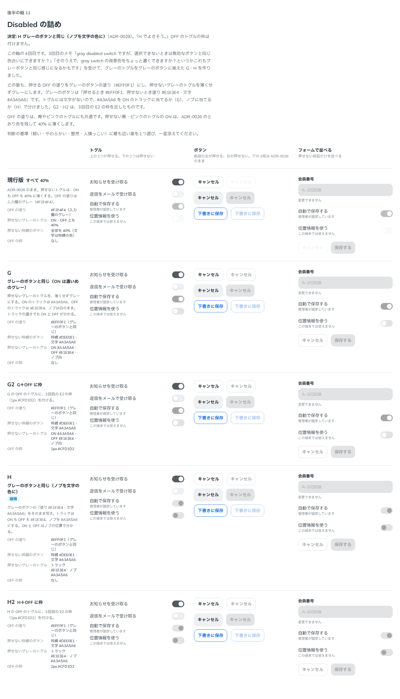

# 0029. Disabled の詰め（トグルとグレーの枠線のボタン）

- ステータス: Accepted
- 日付: 2026-09-13
- ラウンド: 後半 軸11

## 背景

[ADR-0028](./0028-default-color.md) の比較で、[ADR-0026](./0026-disabled.md) の Disabled のうち、次の2つが見えにくいと分かりました。ADR-0028 で、何も指定しないとボタンもトグルもグレーになったため、どちらもよく出てきます。

- **押せない OFF のトグル**: 入力欄のグレーのトラックを 40% に薄くしていたため、ほぼ白でした
- **押せないグレーの枠線のボタン**: もともと枠線が薄いうえに 40% に薄くしていました。さらに、押せないときの文字の色が枠線の色になる、部品の不具合がありました

ユーザーは「disabled な switch については後で詰めましょあ」として、後半の軸に回していました。

## 候補

4回に分けて比べました。比較は Storybook の `Design Review/11 Disabled の詰め`（決めた時点のコミット `fa9a622`。`git checkout fa9a622 && pnpm storybook` で開けます）で、「トグル」「ボタン」「フォームで並べる」の3列に並べました。

| 回  | 案     | 内容                                                                                                                         |
| --- | ------ | ---------------------------------------------------------------------------------------------------------------------------- |
| 1   | 現行版 | すべて 40%                                                                                                                   |
| 1   | A      | 色を持たない部分をグレーにする。押せない OFF は `#E1E3E4`、押せない枠線のボタンは枠線を残して文字を `#A3A5A6`                |
| 1   | B      | A と同じ。ただし押せない枠線のボタンを、押せないグレーのボタンと同じ見た目（塗り `#E1E3E4`・文字 `#A3A5A6`）にする           |
| 1   | C      | 40% のまま、薄くする前の色を濃くする（`#939596` と本文の色）                                                                 |
| 2   | D      | A ＋ 押せない枠線のボタンの枠線を 3px に太くする                                                                             |
| 2   | E      | A ＋ OFF のトグルに 1px の薄い枠（`#DEE0E1`）                                                                                |
| 2   | F      | D ＋ E                                                                                                                       |
| 3   | E2・E3 | E の枠を濃くする（`#CFD1D2`、`#C2C4C5`）                                                                                     |
| 4   | G      | 押せる OFF の塗りをグレーのボタンの塗り（`#EFF0F1`）にし、押せないグレーのトグルを ON `#A3A5A6`・OFF `#E1E3E4`・ノブ白にする |
| 4   | H      | G と同じく OFF の塗りを `#EFF0F1` にし、押せないグレーのトグルをトラック `#E1E3E4`・ノブ `#A3A5A6` にする                    |
| 4   | G2・H2 | G・H ＋ OFF のトグルに E2 の枠                                                                                               |

## 決定

**H を採用します。** グレーの部品は、押せるときも押せないときも、グレーのボタンと同じ組み合わせにします。

| 部品                       | 押せるとき                        | 押せないとき                                             |
| -------------------------- | --------------------------------- | -------------------------------------------------------- |
| グレーのボタン（ADR-0026） | 塗り `#EFF0F1`                    | 塗り `#E1E3E4`・文字 `#A3A5A6`                           |
| グレーのトグル             | ON は濃いグレー、OFF は `#EFF0F1` | トラック `#E1E3E4`・ノブ `#A3A5A6`（ON も OFF も）       |
| 青・ピンクのトグル         | ON は色、OFF は `#EFF0F1`         | ON は色を残して 40%（ADR-0026 のまま）、OFF は `#E1E3E4` |
| グレーの枠線のボタン       | 枠線 `#DEE0E1`・文字は本文の色    | 枠線 `#DEE0E1`・文字 `#A3A5A6`（薄くしない）             |

- OFF のトグルに枠は付けません
- 押せない枠線のボタンの枠線は太くしません
- 白の枠線のボタン（`color="surface"` の枠線）は、グレーの枠線のボタンと同じ見た目なので、Disabled も同じにします

トークンは次のとおりです。

- `--color-switch-off: var(--color-neutral)`（押せる OFF のトラック）
- `--switch-off-disabled-opacity: 1`、`--color-switch-off-disabled: var(--color-neutral-disabled)`
- `--switch-neutral-disabled-opacity: 1`、`--color-switch-neutral-on-disabled: var(--color-neutral-disabled)`、`--color-switch-neutral-disabled-knob: var(--color-on-neutral-disabled)`
- `--outline-neutral-disabled-opacity: 1`、`--color-outline-neutral-disabled-line: var(--color-line)`、`--color-outline-neutral-disabled-text: var(--color-on-neutral-disabled)`、`--color-outline-neutral-disabled-fill: transparent`

## 理由

ユーザーのメモです。

1回目:

> 現行版より A の方が圧倒的に良いですね。C はそこまで差を感じませんね。

> 無効の場合に枠線が太くなる、というのはどうでしょうか？案に足してみてほしいです。

> オフになっているグレーのトグルは確かに薄いですね。ほんのり枠線を足してもいいのかもと思ったりしました。

2回目:

> 枠線を太くするのはちょっと微妙でした…

> E で行きましょう。E の枠ですが、ちょっと濃くできますか？

3回目:

> gray disabled switch ですが、選択できないときは無効なボタンと同じ色合いにできますか？

> そのうえで、gray switch の背景色をちょっと濃くできますか？というかこれもグレーボタンと同じ感じになるかもです

4回目:

> H でよさそう。

以下は、メモと比較から読み取れることです。

- ADR-0026 の「色を持たないものは、押せないときグレーにする」を、トグルと枠線のボタンにも広げました。グレーの部品は、どれも「押せるとき `#EFF0F1`、押せないとき `#E1E3E4` と `#A3A5A6`」の組み合わせに揃います（判断の基準「整然」）
- H は、グレーのボタンの「塗りと文字」を、トグルの「トラックとノブ」にそのまま写した形です
- OFF の枠は、2回目では E が選ばれましたが、3回目で OFF の塗りをグレーのボタンに揃える方向に変わり、4回目で枠のない H が選ばれました。枠を付けない理由は聞いていません

## 却下した案と理由

- **現行版（すべて 40%）**: A のほうが圧倒的に良い（ユーザー）
- **C（40% のまま、元を濃く）**: 現行版との差を感じない（ユーザー）
- **D・F（押せないと枠線が太い）**: 微妙だった（ユーザー）
- **B（枠線のボタンをグレーのボタンと同じにする）**: 選ばれませんでした
- **E〜E3（OFF にほんのり枠）、G2・H2**: 4回目で枠のない H が選ばれました
- **G（押せない ON を濃いめのグレー、ノブは白）**: 選ばれませんでした

## 影響

- `tokens.css`: 上のトークンを足しました。押せない枠線のボタンの枠線の太さ（`--outline-neutral-disabled-line-width`）は、通常と同じ 1.5px です。採らなかった OFF の枠のトークン（`--switch-off-line-width: 0px`、`--color-switch-off-line`）は、比較のストーリーで再現するために残しています
- `src/components/Switch.tsx`: 押せる OFF のトラックを `--color-switch-off` から読むようにしました。押せない OFF と、押せないグレーのトグル（ON のトラックとノブ）を、ほかの色のトグルと別に指定できるようにしました
- `src/components/Button.tsx`: 色を持たない枠線のボタン（グレー・白）の Disabled を、色の枠線のボタンと別に指定できるようにしました。押せないときの文字が枠線の色になる不具合も、これで直りました
- ADR-0011: OFF のトラックの塗りが `#F2F4F4` から `#EFF0F1` に変わったことを追記しました。白地との比は 1.14:1 で、3:1 の例外のままです
- ADR-0026: グレーのトグルとグレーの枠線のボタンの Disabled が、この ADR で変わったことを追記しました
- 軸 08 の比較のストーリー（`axis-08-disabled.stories.tsx`）: ADR-0026 のときの見た目を再現するよう、この軸のトークンを書き足しました
- **分かっていること**: 押せない OFF のトラック（`#E1E3E4`）は、押せる OFF（`#EFF0F1`）より少し濃く見えます。グレーのボタンと同じ関係です。押せるかどうかは、ノブの影と色（グレーのトグルはノブがグレーになる）で見分けます
- `principles.md`: 原則1の Disabled の表と、原則12のスイッチ OFF の例外を書き直しました

## 比較画像

