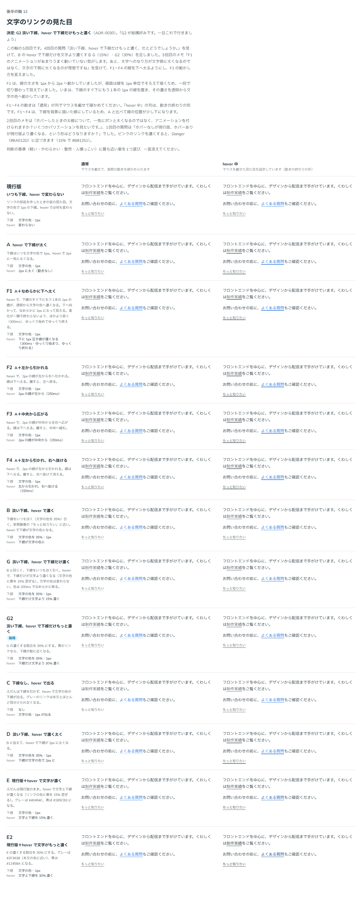

# 0030. 文字のリンクの下線と hover

- ステータス: Accepted（「一旦これで」）
- 日付: 2026-09-13
- ラウンド: 後半 軸12

## 背景

[ADR-0027](./0027-flat-press.md) で、文字のリンクは hover でも押下でも背景を敷かないことに決まりました。そのため、文字のリンクは hover で見た目が変わらず、カーソルの形だけで反応していました。ユーザーは「文字リンクは後で詰めましょう。」として、後半の軸に回していました。原則3には、この件を「例外」として書き足していました。

リンクの色は、指定しないときはグレーです（[ADR-0028](./0028-default-color.md)）。この軸では、下線の出し方と hover での反応を比べました。

## 候補

5回に分けて比べました。比較は Storybook の `Design Review/12 文字のリンクの見た目`（[`stories/axis-12-text-link.stories.tsx`](../stories/axis-12-text-link.stories.tsx)）で、グレーのリンクを含む文章、青のリンクを含む文章、単独の小さいリンクを、「通常」と「hover 中」の2列に並べました。

| 回   | 案     | ふだんの下線                | hover                                                                                    |
| ---- | ------ | --------------------------- | ---------------------------------------------------------------------------------------- |
| 1    | 現行版 | 文字の色・1px               | 変わらない                                                                               |
| 1    | A      | 文字の色・1px               | 2px に太くなる                                                                           |
| 1    | B      | 淡い（文字の色を 35%）      | 下線が文字の色になる                                                                     |
| 1    | C      | なし                        | 下線が出る                                                                               |
| 1    | D      | 淡い                        | 下線が文字の色で 2px になる                                                              |
| 2    | E・E2  | 文字の色・1px               | 文字と下線が 15%・30% 濃くなる（黒を混ぜる）                                             |
| 3〜4 | F1〜F4 | 文字の色・1px（背景に描く） | A に動きを付けたもの。下へなめらかに太る、左から・中央から伸びる、左から伸びて右へ抜ける |
| 5    | G・G2  | 淡い                        | 下線だけが文字より 15%・30% 濃くなる。文字の色は変えない                                 |

- E・E2 は、1回目の質問「ホバーなしが現行版、ホバーありが現行版より濃くなる、という形はどうなりますか？」を受けて足しました
- F1〜F4 は、2回目の依頼を受けて足しました。文字の下線（`text-decoration`）の太さは、1 倍の画面では 1px から 2px へ一段で切り替わり、なめらかに動かせません。そのため、下線を背景に描いた線にして動かしています
- 4回目では、3回目のメモを受けて、F1〜F4 の線を文字と反対の側（下）へ太るようにしました。F1 は、太さを動かすのをやめ、下線のすぐ下に足した 1px の線の濃さを動かす形にしました
- G・G2 は、4回目の質問「淡い下線、hover で下線だけもっと濃く、だとどうでしょうか。」を受けて足しました

## 決定

**G2 を採用します。**

| 状態   | 下線                                                             | 文字の色   |
| ------ | ---------------------------------------------------------------- | ---------- |
| ふだん | 文字の色を 35% に透かした淡い下線（1px）                         | リンクの色 |
| hover  | 文字の色に黒を 30% 混ぜた、文字より濃い下線（1px）。200ms で移る | 変えない   |

トークンは次のとおりです。

- `--color-link-underline: color-mix(in oklab, currentColor 35%, transparent)`
- `--color-link-underline-hover: color-mix(in oklab, currentColor, black 30%)`
- `--link-grow-duration: 200ms`、`--link-grow-ease: cubic-bezier(0.4, 0, 0.2, 1)`（下線の色の移り変わり）
- `--link-hover-darken: 0%`（文字は濃くしない）

## 理由

ユーザーのメモです。

> ホバーなしが現行版、ホバーありが現行版より濃くなる、という形はどうなりますか？

> ホバーしたときの太線について、一気にボンと太くなるのではなく、アニメーションを付けられますか？いくつかバリエーションを見たいです。

> F1 のアニメーションがあまりうまく動いていない気がします。あと、太字へのなり方が文字側に太くなるのではなく、文字の下側に太くなるのが理想ですね

> 淡い下線、hover で下線だけもっと濃く、だとどうでしょうか。

> G2 が結構好みです。一旦これで行きましょう

以下は、メモと比較から読み取れることです。

- ふだんの下線が淡いので、文章の中でリンクが目立ちすぎません（判断の基準「軽い」）。参照画像の「もっと知りたい」の淡い下線にも近い形です
- hover では下線だけが変わり、文字は読みやすいまま、反応ははっきり分かります。淡い下線から文字より濃い下線へ変わるので、変化の幅が大きくなります
- 「一旦これで」とのことなので、使ってみて違和感があれば見直します

## 却下した案と理由

- **現行版**: hover で見た目が変わりません
- **A・F1〜F4（hover で太くなる）**: 動きを付けて比べましたが、選ばれませんでした
- **C（下線なし）**: グレーのリンクが本文とほとんど見分けられません
- **B・D（hover で下線が文字の色になる）**: G2 のほうが好まれました
- **E・E2（hover で文字も濃くなる）**: 選ばれませんでした。ピンクのリンクを濃くすると Danger（`#BA012D`）に近づくことも分かりました
- **G（15%）**: G2（30%）のほうが好まれました

## 影響

- `tokens.css`: 文字のリンクの下線のトークンを、上の値にしました。背景に描く下線のトークン（`--link-base-line-size`、`--link-grow-*`、`--link-grow-alpha-*`、`@property --link-grow-alpha`）は、F1〜F4 を比較のストーリーで再現するために残しています。値は「描かない」です
- `src/components/Link.tsx`: 文字のリンクの下線を、通常と hover でトークンから読むようにしました。背景に下線を描く仕組み、下線の色の移り変わり、文字の色を `--link-color` に入れる形を足しました。文字のリンクの角丸は `--link-text-radius`（`0px`）にしました。背景を敷かないので角丸は要らず、付けると背景に描く下線の端が丸く欠けるためです
- ADR-0027: 文字のリンクの hover が、この ADR で決まったことを追記しました
- 軸 09 の比較のストーリー（`axis-09-flat-press.stories.tsx`）: 比べたときの見た目（pill の塗り、文字の色の下線）を再現するよう、トークンを書き足しました
- `principles.md`: 原則3の例外（文字のリンクは hover で見た目を変えない）を書き直しました。文字のリンクは、背景は敷きませんが、hover で下線が変わります
- **分かっていること**:
  - ふだんの淡い下線は、グレーのリンクで白地との比がおよそ 1.6:1 です。下線は文字ではないので 3:1 の基準は当てはめていませんが、リンクであることは下線の有無で分かります
  - ピンクのリンクの hover の下線は、黒を 30% 混ぜると濃い赤紫になり、Danger の赤に近づきます。下線だけなので、いまはこのままにします
  - リンクの大きさは、まだ仮です

## 比較画像

