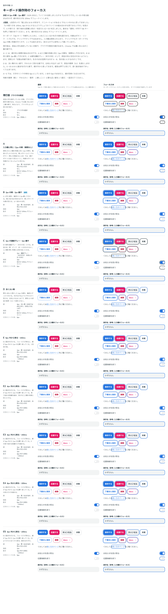

# 0031. キーボード操作時のフォーカス

- ステータス: Accepted
- 日付: 2026-09-13
- ラウンド: 後半 軸13

## 背景

ボタン・リンク・トグルは、hover・押下・Disabled の見た目まで決まりましたが（[ADR-0027](./0027-flat-press.md)・[ADR-0029](./0029-disabled-refine.md)・[ADR-0030](./0030-text-link.md)）、キーボード（Tab キー）で操作したときのフォーカスの見た目がありませんでした。部品には何も指定しておらず、ブラウザの既定の線が出ていました。見た目はブラウザによって違います。

入力欄のフォーカスは、原則2のとおり、クリックでもキーボードでも 2px の青い枠線を足します（[ADR-0019](./0019-field-focus-change.md)）。この軸では、ボタン・リンク・トグルのフォーカスに、原則2の表現を流用するか、別の扱いにするかを比べました。クリックやタップでは出ない、キーボードで操作したときだけのフォーカス（`:focus-visible`）です。

## 候補

2回に分けて比べました。比較は Storybook の `Design Review/13 キーボード操作時のフォーカス`（決めた時点のコミット `016d041`。`git checkout 016d041 && pnpm storybook` で開けます）です。「通常」（Tab キーで動かして確かめる）と「フォーカス中」（全部品のフォーカスを固定）の2列に並べました。

| 回  | 案     | 線                                       | 隙間 | 動き                                    |
| --- | ------ | ---------------------------------------- | ---- | --------------------------------------- |
| 1   | 現行版 | ブラウザの既定                           | なし | なし                                    |
| 1   | A      | 2px・青（入力欄の枠線と同じ）            | なし | 色だけ 100ms でフェードイン             |
| 1   | B      | 2px・青                                  | 2px  | 色だけ 100ms でフェードイン             |
| 1   | C      | 2px・濃紺グレー（本文の色）              | 2px  | 色だけ 100ms でフェードイン             |
| 1   | D      | 4px・淡い青（青を 45%。白地との比 1.87） | なし | 色だけ 100ms でフェードイン             |
| 1   | E      | B と同じ                                 | 2px  | 6px 外から寄る（150ms）                 |
| 2   | E2〜E5 | B と同じ                                 | 2px  | 寄り始める距離 3〜6px × 長さ 100・150ms |

- 2回目の E2〜E5 は、1回目のメモ「E の寄り方を 100ms, 4px からにするとどうでしょうか？いくつか組み合わせも見てみたいです」を受けて足しました。E2 は 4px・100ms、E3 は 4px・150ms、E4 は 6px・100ms、E5 は 3px・100ms です
- A〜E では、文字のリンクの角を 6px にしました。線は角丸に沿うので、それまでの 0px のままだと線が四角くなるためです

## 決定

**B を採用します。**

| 項目             | 値                                                               |
| ---------------- | ---------------------------------------------------------------- |
| 線               | 2px・青（`--color-focus`、`#2474DF`、白地との比 4.53）           |
| 隙間             | 輪郭から 2px 離す                                                |
| 動き             | 線の色だけを 100ms でフェードインする。位置は動かさない          |
| 対象             | ボタン・リンク（文字・枠線）・トグル。クリックやタップでは出ない |
| 文字のリンクの角 | 6px（線が沿う）                                                  |
| 入力欄           | 原則2の枠線のまま（クリックでもキーボードでも出る）              |

トークンは次のとおりです。

- `--focus-ring-style: solid`、`--focus-ring-width: 2px`、`--color-focus-ring: var(--color-focus)`
- `--focus-ring-offset: 2px`、`--focus-ring-offset-rest: 2px`（出る前の隙間。同じ値なので位置は動かない）
- `--focus-ring-duration: var(--duration-field)`（100ms）
- `--link-text-radius: 6px`

## 理由

ユーザーのメモです。

> フォーカスリングは、アクセシビリティなどの考え方を踏まえるとどういうのが正しいんでしょうか？ボタンであればボタンの色に合わせる？、リンクにおける一般的なフォーカスリングは？アニメーションが合っていいの？というところは気になります。
> 個人的には B が好きで、アニメーションがある E でもいいのかなと思ってきました

> 今の B にも若干アニメーションが付いてますか？

> E の寄り方を 100ms, 4px からにするとどうでしょうか？いくつか組み合わせも見てみたいです

> いくつか比較しましたが B でよさそうです。

1つ目の質問への回答（アクセシビリティの考え方）の要点です。

- WCAG 2.4.7（AA）は、キーボードで操作できるものにフォーカスが見えることを求めます。2.4.13（AAA）は、線の太さが 2px 以上で、フォーカスの前後の色の差が 3:1 以上あることを推奨します。原則12 の「部品は 3:1」と同じ考え方です。B は白地に 2px の青（4.53:1）なので、どちらも満たします
- 多くのデザインシステムは、部品の色によらず、フォーカスの線を1色で揃えます。「この線がいまいる場所」と一目で分かるようにするためです。部品の色に合わせると、赤いボタンで線が赤くなり、Danger の意味と混ざります
- リンクも、ボタンと同じ線で文字を囲むのが一般的です
- 動きは禁じられていません。すぐ見えること、「動きを減らす」設定で止めること、Tab キーを速く押しても遅れないことに気を付けます

以下は、メモと比較から読み取れることです。

- **原則2の流用**: 入力欄は 2px の青い枠線、ボタン・リンク・トグルは 2px の青い線を外に離して付けます。「フォーカスは 2px の青い線」で揃い、原則2の「状態は枠線で表す」がそのまま部品全体に広がります（判断の基準「整然」）
- **2px 離す**: 線は部品ではなく地の色と比べることになるので、青いボタンやピンクのボタンでも線が溶けません
- **動き**: 寄る動き（E〜E5）も比べましたが、線の色が 100ms でフェードインするだけの B が選ばれました。長さは入力欄の枠線と同じです

## 却下した案と理由

- **現行版（ブラウザの既定）**: ブラウザによって見た目が違い、このシステムの見た目として決まっていません
- **A（隙間なし）**: 青いボタンとピンクのボタン（青との明度の比 1.00）では、線がボタンに溶けて見えにくくなります。枠線のボタンは、枠線が太くなったように見えます
- **C（濃紺グレー）**: 部品の色に左右されませんが、入力欄の青い枠線と別の扱いになります。選ばれませんでした
- **D（淡く太い青）**: 白地との比が 1.87:1 で、部品の基準（3:1）を満たしません
- **E〜E5（外から寄る）**: 寄り始める距離と長さの組み合わせを比べましたが、B のほうが好まれました

## 影響

- `tokens.css`: フォーカスの線のトークン（`--focus-ring-*`、`--color-focus-ring`）を足しました。`--link-text-radius` を 0px から 6px に変えました
- `src/components/focus-styles.ts`: フォーカスの線のクラスを足し、ボタン・リンク・トグルで共有します。影（box-shadow）ではなく outline で描きます。ハイコントラストモード（forced-colors）でも線が残るようにするためです。ふだんは線の色を透明にしておき、フォーカスで色と隙間を動かします
- `src/components/Button.tsx`・`Link.tsx`・`Switch.tsx`: フォーカスの線を足し、移り変わりに線の色と隙間を含めました。OS で「動きを減らす」を選んでいるときは、これまでどおり動かしません
- `src/components/field-styles.ts`: 入力欄の本体に `outline-none` を足しました。Select のボタンは、キーボードでフォーカスすると、青い枠線にブラウザの既定の線が重なって出ていました
- [ADR-0030](./0030-text-link.md): 文字のリンクの角丸を変えたことを追記しました。軸 12 の比較のストーリーでは、背景に描く下線の案の端が欠けないよう、角丸を 0px に固定しています
- `principles.md`: 原則2に、キーボードで操作したときのフォーカスを足しました
- **分かっていること**:
  - 文字のリンクでは、線が前後の文字に少しかかります。文字のリンクは左右に 4px はみ出して置いているので（`-mx-1 px-1`）、2px 離した 2px の線が隣の文字に重なります。文字のリンクだけ隙間を詰めることは、あとで詰められます
  - 線の青は、白地や明るいグレーの地を前提にしています。色の付いた地（青い帯など）の上に部品を置くときは、線の色を見直す必要があります
- **追記（[ADR-0043](./0043-notice.md)）**: 塗りのお知らせ（`<Notice appearance="filled">`）の中では、リンク・ボタン・× の線を、お知らせの文字の色（白か濃紺）にします。「線は部品の色によらず青の1色」の例外です。青い線は、情報・成功・危険の塗りの上で 1.00〜1.48:1 しかなく、見えないためです。警告の黄色の上は青でも 3.76:1 ありますが、ほかの塗りとそろえて濃紺にします。淡い面（既定）と枠線のお知らせの中は、青のままです（淡い面の上で 4.00〜4.08:1）。線の太さ・隙間・動きは変えません
- **追記（ADR-0071）**: 「線の色は部品によらず1色で、既定は青です」という決まりを変えました。フォーカスの線は部品の色に従い、色を指定していない部品と色を持たない欄は濃紺になります。青の1色のままなのはフォーカスの線だけ、という原則6の例外はなくなります。線の太さ・隙間・動きは変えません

## 比較画像

