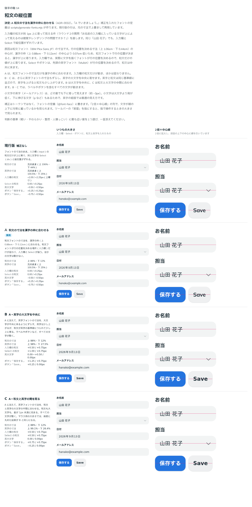

# 0032. 和文の縦位置の補正

- ステータス: Accepted
- 日付: 2026-09-13
- ラウンド: 後半 軸14

## 背景

ラウンド2で、ユーザーから質問がありました。

> お名前の入力欄に入っている文字が上によって見えるのは錯覚やレンダリングの問題ですか？

錯覚ではなく、実際に上に寄っていました（[`principles.md` の「和文の縦位置」](../principles.md#和文の縦位置)）。入力欄の和文は、上の余白より下の余白が約 2px 大きく、同じ「山田 花子」を入れた Select の値とは縦位置がずれていました。対応は後半に回していました。

この軸で、原因を調べました。

- 和文フォント（IBM Plex Sans JP）の、行の位置を決める寸法（hhea）は、上 1.06em・下 0.44em です。この中心は、漢字の枠（上 0.88em・下 0.12em。フォントの typo の寸法）の中心より 0.07em 低くなっています。16px では約 1.1px です
- そのため、和文フォントで行の位置が決まると、漢字が上に寄ります
- 入力欄（input）では、実際に文字を描くフォントが行の位置を決めます。値が和文だけのときは和文フォントで決まるので、上に寄ります
- Select の値やボタンは、先頭の英字フォント（Mulish）が行の位置を決めます。Mulish の行の中心（0.3775em）は漢字の枠の中心（0.38em）とほぼ同じなので、和文は中央に来ます

## 候補

比較は Storybook の `Design Review/14 和文の縦位置`（[`stories/axis-14-text-offset.stories.tsx`](../stories/axis-14-text-offset.stories.tsx)）です。「いつもの大きさ」と「2倍＋中心線」（2倍に拡大し、部品の上下の中心に線を引いたもの）の2列に並べました。

変えるのは、フォントの縦の寸法（`@font-face` の `ascent-override`・`descent-override`）だけです。差は「下の余白 − 上の余白」（正 = 上寄り）で、文字のインクを画素で測りました。値は「指用（16px）／マウス用（14px）」です。

| 案     | 和文の寸法     | 英字の寸法                               | 入力欄の和文    | Select の和文   | 英大文字      |
| ------ | -------------- | ---------------------------------------- | --------------- | --------------- | ------------- |
| 現行版 | 元のまま       | 元のまま                                 | +2.00 / +2.25px | 0.00 / +0.25px  | −0.50px       |
| A      | 上 88%・下 12% | 元のまま                                 | 0.00 / +0.25px  | 0.00 / +0.25px  | −0.50px       |
| B      | A と同じ       | 上 98%・下 27.5%（大文字を中央に）       | +0.50 / +0.75px | +1.00 / +0.75px | 0.00〜+0.50px |
| C      | A と同じ       | 上 99.1%・下 26.4%（和文と大文字の中間） | +0.50 / +0.75px | +0.50 / +0.75px | 0.00px        |

- B・C では、英字と和文が同じ基準線に並ぶため、英字を上げると和文も少し上に寄ります。ラベルやボタンを含むすべての文字が動きます
- 小文字の英字（メールアドレス）は、どの案でも下に寄って見えます（A では指用 −3.75px・マウス用 −3.25px）。小文字は大文字より背が低く、下に伸びる文字もあるためで、英字の組版では普通の見え方です

## 決定

**A を採用します。** 和文フォント（IBM Plex Sans JP）の縦の寸法を、漢字の枠に合わせます。

- `ascent-override: 88%`、`descent-override: 12%`、`line-gap-override: 0%`
- 英字フォント（Mulish）は元のまま

この補正は `@font-face` の記述子なので、トークン（CSS 変数）ではなく、フォントの定義に書きます。`@fontsource/ibm-plex-sans-jp` の CSS は書き換えられないため、同じ `@font-face` に補正を足した CSS を `scripts/generate-fonts.mjs` で作り（`pnpm run fonts`）、`src/styles/globals.css` から読みます。

## 理由

ユーザーのメモです。

> opus 的にはどれがいいと思いますか？個人的には C なのかな…？と思いましたが…

> A でいきましょう。

1つ目の質問に対して、A をすすめました。その理由です。

- 困っていたのは「入力欄の和文が上に寄る」「入力欄と Select で縦位置がずれる」の2つで、A はそれだけを直します。ほかの文字は1画素も動きません
- このシステムの文字の中心は和文です。A では、和文がどこでも中央に来ます
- C は、英字の大文字を中央に寄せる代わりに、すべての和文をわずかに上に寄せます。直したかった「和文が上に寄る」を、小さくして全体に戻すことになります
- A の値は、フォントに入っている漢字の枠の寸法そのものです。C の値は計算で決めた中間の値で、フォントを変えたときに計算し直しになります
- A でも英字の大文字は少し下に寄りますが、差は −0.5px（実際には約 0.25px）で、見分けにくい大きさです

## 却下した案と理由

- **現行版**: 入力欄の和文が上に寄り、Select とずれます
- **B（英字の大文字を中央に）**: 和文が上に寄り、入力欄と Select の和文もずれます（指用で +0.50 と +1.00px）
- **C（和文と大文字の中間）**: 和文がわずかに上に寄ります。英字だけの部品が多い画面では C のほうが整って見える可能性があるので、使っていて英字が低く見えたら見直します

## 影響

- `scripts/generate-fonts.mjs`: 補正を足した和文フォントの CSS を作るスクリプトを足しました。`package.json` に `pnpm run fonts` を足しました。`@fontsource/ibm-plex-sans-jp` を更新したら、流し直します
- `src/styles/ibm-plex-sans-jp.css`: 生成した CSS です（400・500・600・700 の4つの太さ、492 個の `@font-face`）。手で書き換えないため、フォーマッタ（`.oxfmtrc.json`）の対象から外しました
- `src/styles/globals.css`: 和文フォントを、`@fontsource/ibm-plex-sans-jp` の CSS ではなく、生成した CSS から読むようにしました
- `design/tools/measure-text-offset.mjs`: 和文フォントを、生成した CSS から読むようにしました。補正後の値を測れます
- 軸 14 の比較のストーリー: 現行版の行は、元の寸法（上 106%・下 44%）で上書きして再現しています
- 入力欄に和文の値を入れているほかの比較のストーリーでも、値の縦位置が約 1px 下がります。これまでの ADR の比較画像は、撮った時点の見た目のままです
- 前半の design キャンバスを描く道具（`design/tools/render.mjs`。`compare.mjs`・`generate-round.mjs` が使う）は、補正前の `@fontsource/ibm-plex-sans-jp` の CSS を読んだままです。前半は終わっており、過去のラウンドの見え方を変えないため、変えていません
- **分かっていること**:
  - 生成した CSS の中のフォントのファイルへのパスは、`node_modules` を指す相対パスです。ライブラリとして配布する形を決めるときに、見直します
  - 小文字の英字は下に寄って見えます。英字の組版として普通の見え方なので、補正しません

## 比較画像

