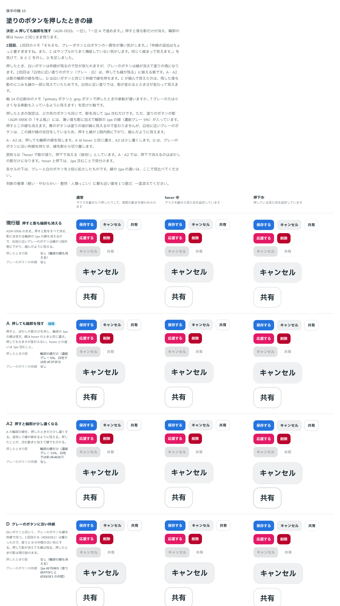

# 0033. 塗りのボタンを押したときの縁

- ステータス: Accepted（「一旦 A で進めます。」）
- 日付: 2026-09-13
- ラウンド: 後半 軸15

## 背景

軸 14 を比べている途中で、ユーザーから質問がありました。

> primary ボタンと gray ボタンで押したときの挙動が違いますか…？グレーの方は小さくなる挙動も入っているように見えます

押したときの指定は、どの色の塗りのボタンも同じで、影を消して 1px 沈むだけです（[ADR-0006](./0006-button-shadow.md)・[ADR-0009](./0009-press-motion.md)）。縮める指定（scale）はありません。

原因は影の中身でした。塗りのボタンの影（ADR-0006 の「そよ風」）は、薄い落ち影（`0 1px 2px` の 10%）と、輪郭の 1px の線（`0 0 0 1px` の 5%）を重ねたものです。押すと影をすべて消すので、この線も消えます。

- 青のボタンは塗りが濃く、塗りの端がそのまま縁に見えるので、線が消えても変わりません
- グレーのボタン（`#EFF0F1`、白地との比 1.14）は、この線が縁の役目もしています。押すと縁が1周内側に下がり、縮んだように見えます

ユーザーの質問「なんで輪郭があるんでしたっけ」への回答として、この線はもともと影の一部として入ったもので、縁として狙って足したものではないことを確かめました。

## 候補

2回に分けて比べました。比較は Storybook の `Design Review/15 塗りのボタンを押したときの縁`（決めた時点のコミット `016d041`。`git checkout 016d041 && pnpm storybook` で開けます）です。「通常」「hover 中」「押下中」の3列に並べ、各セルの下にグレーと白のボタンを2倍にしたものを置きました。

| 回  | 案     | 押したときの影                               | グレーのボタン                             |
| --- | ------ | -------------------------------------------- | ------------------------------------------ |
| 1   | 現行版 | なし（輪郭の線も消える）                     | 影の中の線で縁を持つ                       |
| 1   | A      | 輪郭の線だけ（濃紺グレー 6%。hover と同じ）  | 同じ                                       |
| 1   | A2     | 輪郭の線だけ（濃紺グレー 12%。少し濃くする） | 同じ                                       |
| 1   | B      | なし                                         | 1px の枠線（`#DEE0E1`、白いボタンと同じ）  |
| 1   | C      | なし                                         | 輪郭の線を持たない（ふだんは落ち影だけ）   |
| 2   | D      | なし                                         | 淡い枠線（1px `#E7E8E9`、塗りと B の中間） |

- C は、1回目の途中のメモ「そもそもでグレーボタンに輪郭なし も足せます？」を受けて足しました
- D は、1回目のメモを受けて、2回目に足しました

## 決定

**A を採用します。** 押すと落ち影だけを消し、輪郭の 1px の線は hover と同じまま残します。

| 状態  | 塗りのボタンの影              |
| ----- | ----------------------------- |
| 通常  | 落ち影＋輪郭の線（5%）        |
| hover | 輪郭の線だけ（6%）            |
| 押下  | 輪郭の線だけ（6%）＋ 1px 沈む |

- `--shadow-raised-press: var(--shadow-raised-hover)`
- グレーのボタンにも、ほかの塗りのボタンと同じ影を当てます（`--shadow-neutral`・`--shadow-neutral-hover`・`--shadow-neutral-press`）。枠線は付けません（`--neutral-line-width: 0px`）

## 理由

ユーザーのメモです。

> そもそも、グレーボタンと白ボタンの一貫性が薄い気がします。
> グレーボタンはフォーカスしたとき、完全に同じ色の塊に見えます。
> 一方で白ボタンはまだ影があり、同じ色の塊には見えません。
>
> 枠線の追加はちょっと重すぎますね。また、C はサンプルがうまく機能していない気がします。同じく縮まって見えます。

> 一旦 A で進めます。

1つ目のメモの「フォーカスしたとき」は、押下中の見た目のことだと受け取って2回目を作りました。以下は、メモと比較から読み取れることです。

- **押しても縁が残る**: 白いボタンは縁を枠線で持っているので、押しても形が保たれます。A では、グレーのボタンも押したときに輪郭の線が残り、塗りの塊になりません。「白地に近い塗りのボタンは、押しても縁が残る」が揃います
- **大きさが変わらない**: 線が残るので、押しても縮んで見えません
- **軽い**: 線を足すのではなく、もともとある線を消さないだけです。枠線を足す B・D より軽く済みます

## 却下した案と理由

- **現行版**: グレーのボタンが押すと縮んで見え、塗りの塊になります
- **A2（押すと輪郭が少し濃くなる）**: 選ばれませんでした
- **B（グレーのボタンに `#DEE0E1` の枠線）**: 「枠線の追加はちょっと重すぎますね」
- **C（グレーのボタンは輪郭の線なし）**: 「同じく縮まって見えます」。輪郭の線を外しても、落ち影のにじみが縁の一部に見えるためです。白地に近い塗りでは、影が変わると大きさが変わって見えます
- **D（淡い枠線）**: 選ばれませんでした

## 影響

- `tokens.css`: 押したときの影（`--shadow-raised-press`）を足し、hover と同じ輪郭の線にしました。グレーのボタンの影（`--shadow-neutral-*`）と枠線（`--neutral-line-width`・`--color-neutral-line`）のトークンも足しました。どちらも、比べた案を比較のストーリーで再現するためのもので、値はほかの塗りのボタンと同じ影、枠線なしです
- `src/components/Button.tsx`: 塗りのボタンの押下の影を `--shadow-raised-press` から読むようにしました。グレーのボタンは、影と枠線をトークンから読みます
- [ADR-0006](./0006-button-shadow.md): 押下の影を変えたことを追記しました
- `principles.md`: 原則1の影の値と、原則3の押下の表し方を書き直しました。原則3の「影を完全に消すのは押下に取っておく」（【固定】）は、ユーザーが違和感を示したので軸に戻し、この ADR で決め直しました
- **分かっていること**:
  - 原則3は「影を完全に消すのは押下に取っておいてください。hover で消してしまうと、押下との区別がつきません」（【固定】）としていました。A では押しても輪郭の線が残り、hover と押下の影は同じ見た目になります。違いは 1px 沈むことだけです。落ち影は hover の時点で消えているので、押下で消える影はもともと輪郭の線だけでした
  - 押したとき、白いボタンは枠線と輪郭の線、グレーのボタンは輪郭の線だけが残ります。縁の持ち方は同じではありませんが、どちらも押して縁が消えることはなくなりました
  - 「一旦」とのことなので、使ってみて違和感があれば見直します

## 比較画像

