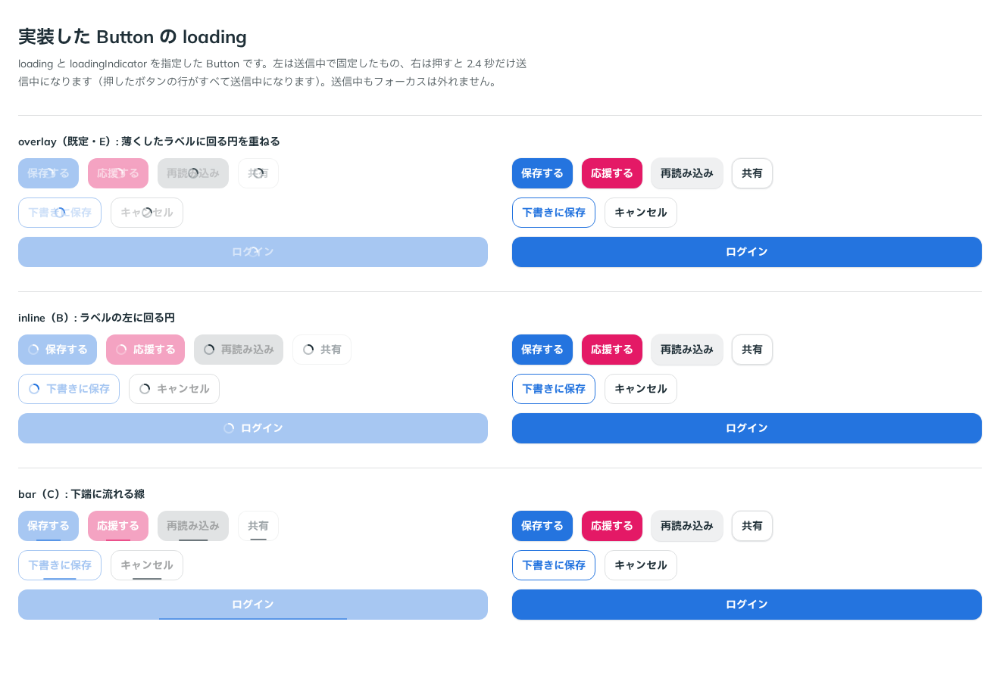

# 0034. ボタンの送信中（loading）

- ステータス: Accepted
- 日付: 2026-09-13
- ラウンド: 後半 軸16

## 背景

ボタンには送信中の状態がありませんでした。押しても見た目が変わらないので、処理が進んでいるか分からず、二度押しできてしまいます。hover・押下・Disabled・フォーカスはすでに決まっており（[ADR-0026](./0026-disabled.md)・[ADR-0027](./0027-flat-press.md)・[ADR-0031](./0031-focus-visible.md)・[ADR-0033](./0033-press-edge.md)）、残っている状態は送信中でした。

## 候補

5回に分けて比べました。比較は Storybook の `Design Review/16 loading 状態`（決めた時点のコミット `016d041`。`git checkout 016d041 && pnpm storybook` で開けます）です。部品にはまだ送信中の状態がなかったので、比べるための仕組みをストーリーの中で組み立てました。

| 回  | 比べたもの                      | 案                                                                                                                                            |
| --- | ------------------------------- | --------------------------------------------------------------------------------------------------------------------------------------------- |
| 1   | 送信中の印                      | A 回る円だけ（ラベルを隠す）、B 回る円＋ラベル、C 下端に流れる線、D 弾む3つの点。送信中は色を保ち、落ち影を消して輪郭の線を残す               |
| 2   | 印の追加と、送信中の見た目      | E 薄くしたラベルに回る円を重ねる（E ふわっと、E2 下から、E3 ふくらむ）。各案に「Disabled と同じ見た目」の列を足した。色の変化にも動きを付けた |
| 3   | 印に Disabled を当てるか        | E・B・C について、印も薄くなる／印は元の色のまま／印はボタンの濃い色                                                                          |
| 4   | E のラベルの薄さ                | 25%・40%・55%・70%・薄くしない                                                                                                                |
| 5   | Disabled の見た目への切り替わり | 0.3 秒・ease-out（4回目まで）、F1 0.2 秒、F2 0.15 秒、F3 0.1 秒（F1〜F3 は押下と同じ緩急）                                                    |

- 2回目では、E2・E3 の動きが最初の 60ms でほぼ終わり、E と見分けがつきませんでした（「E2, E3 ってちゃんと動いてますかね…？」）。長さを 0.4・0.36 秒に延ばし、ふつうの減速の曲線にして比べ直しました
- 3回目では、印を元の色（色のボタンでは白）のまま出すと、薄くなった色のボタンの上で見えにくいこと（白との比は約 1.7）が分かっていたので、ボタンの濃い色にする列も並べました

## 決定

**送信中の印は E を既定にし、B と C も選べるようにします。送信中は、押せないボタンと同じ見た目にします。**

| 項目                     | 決定                                                                                                                                                               |
| ------------------------ | ------------------------------------------------------------------------------------------------------------------------------------------------------------------ |
| 印（`loadingIndicator`） | `overlay`（既定・E）: ラベルを薄くして、上の中央に回る円を重ねる。`inline`（B）: ラベルの左に回る円。`bar`（C）: 下端に流れる線                                    |
| 送信中の見た目           | 押せないボタンと同じ（色のボタンは 40% に薄く、グレーのボタンは明るいグレー — ADR-0026・0029）                                                                     |
| 印の見た目               | 薄くしない。回る円は元の文字の色、流れる線はボタンの濃い色（色のボタンでは塗りの色）。線はその色の 60% の濃さで描く（線そのものの見た目で、Disabled の薄さとは別） |
| E のラベル               | 55% に薄くする（色のボタンでは Disabled の 40% と重なり、実際には約 22%）                                                                                          |
| 切り替わりの動き         | 0.2 秒・押下と同じ緩急（出るときも戻るときも）。回る円も 0.2 秒でふわっと出る                                                                                      |
| 回る円・線の動き         | 回る円は1秒で1周、線は 1.2 秒で左から右へ流れる                                                                                                                    |
| 操作                     | 押しても何もしない（フォームも送信しない）。hover と押下の反応はない。フォーカスは外さない                                                                         |

使い方は `<Button loading>` と `<Button loading loadingIndicator="bar">` です。

## 理由

ユーザーのメモです。

> 元のテキストが薄くなって、上にかぶさる形でスピナーが出てくる（下からふわっとなど、バリエーションもいくつか）案を見てみたいです
> 各選択肢において、loading 中は disabled なボタンと同等になるパターンを追加して欲しいです

> disabled になるパターンで、色などの変化も同様にアニメーションを付けられますか？

> loading の variant として、default は E 案、選択肢として B 案と C 案を設定できるようにする で行きたいです！また、loading 中は一律で disabled と同じ見た目にする、でお願いします。ただし、今に追加で、スピナーやバーには disabled の見た目を適用しない、というのはできるでしょうか。見てから確定させたいです。

> 流れる線の場合はボタンの濃い色、スピナーの場合は元の色のままでお願いします！ちなみにラベルの薄さを調整した場合はどうですか？

> 55 かなあ。あと、アニメーションも調整したいです。もうちょっと disabled な見た目にシュっと変わる感じにするとどうでしょうか？

> 0.2 の F1 かなと思いました！

以下は、メモと比較から読み取れることです。

- **押せないことが一目で分かる**: 送信中を押せないボタンと同じ見た目にしたので、「いまは押せない」が既存の Disabled の規則（原則1）で伝わります
- **動いている印は薄くしない**: 印まで薄くすると、止まっているのか進んでいるのかが分かりにくくなります。印だけは元の強さで出します
- **E（既定）**: ラベルを残すので、何のボタンが送信中か読めます。幅も変わりません。55% は、ラベルが読めて、回る円とラベルが同じくらいの強さで重なる濃さでした
- **B・C は選べる**: 何を待っているかをはっきり読ませたいとき（B）や、変化を最も小さくしたいとき（C）に使います
- **シュっと切り替わる**: 0.2 秒で出だしが速い動きは、押下（0.1 秒）の直後に続く変化として、もたつかずに見えます

## 却下した案と理由

- **現行版（送信中の見た目なし）**: 二度押しできてしまいます
- **A（回る円だけ）・D（弾む3つの点）**: ラベルを隠すので、何のボタンか読めません。選ばれませんでした
- **E2（下から）・E3（ふくらむ）**: E（その場でふわっと）が選ばれました
- **送信中も色を保つ（1回目の形）**: 「loading 中は一律で disabled と同じ見た目にする」
- **印も薄くなる**: 「スピナーやバーには disabled の見た目を適用しない」
- **線を元の色のまま・回る円をボタンの濃い色**: 「流れる線の場合はボタンの濃い色、スピナーの場合は元の色のまま」
- **ラベル 25%・40%・70%・薄くしない**: 55% が選ばれました
- **0.3 秒・ease-out（4回目まで）・F2（0.15 秒）・F3（0.1 秒）**: F1（0.2 秒）が選ばれました

## 影響

- `tokens.css`: `--duration-loading: 200ms`・`--loading-label-opacity: 0.55` と、回る円が出る動き（`--animate-loading-in`）、線が流れる動き（`--animate-loading-bar`）を足しました
- `src/components/Button.tsx`: `loading`・`loadingIndicator` を足しました
  - 送信中は `data-loading`・`aria-busy`・`aria-disabled` を付けます。`disabled` 属性は付けないので、フォーカスは外れません。押したときは `onClick` を呼ばず、フォームの送信も止めます
  - 印を薄くしないため、ボタン全体を薄くする `opacity` は使いません。塗り・文字・枠線の色を、Disabled の薄さ（`--disabled-opacity`）で混ぜた色にします。塗りのボタンの文字は塗りの上に載るので、地の色（`--color-bg`）と混ぜます。枠線のボタンの文字と枠線は、下に塗りがないので透明と混ぜます。どちらも、白地の上では Disabled と同じ色になります。グレーのボタンとグレーの枠線のボタンは、Disabled の色のトークンをそのまま使います
  - hover と押下は、送信中でないときだけにしました（`enabled:not-data-loading:`）
  - 印の色は、回る円が `--button-ink`（元の文字の色）、線が `--button-accent`（ボタンの濃い色）です
  - 文字・枠線の色と薄さの移り変わりを `--duration-loading` にしました。そのため、`disabled` を切り替えたときの色の変化も 0.2 秒で動きます
  - `loading` を指定したボタンは、ラベルを `` で包みます（送信中でないときも包みは変えません）
- 比較のストーリーに、実装した Button を確かめる「実装した Button」を足しました
- **分かっていること**:
  - 回る円を元の色（白）のまま出すので、薄くなった色のボタンの上では回る円が弱く見えます（白との比は約 1.7）
  - 送信中の文字の色は、ボタンが地の色（白）の上にあるときに Disabled と同じになります。色の付いた面の上では、少し違って見えます
  - 動きを減らす設定のとき、色の移り変わりは止まりますが、回る円と線は動いたままです。どうするかは決めていません
  - 入力欄や Select の送信中は、まだ決めていません

## 比較画像

5回目の比較は動きを見るもので、静止画では違いが写らないため、決まった形を実装した Button（ストーリーの「実装した Button」）を載せます。左が送信中で固定したもの、右が押す前のものです。

