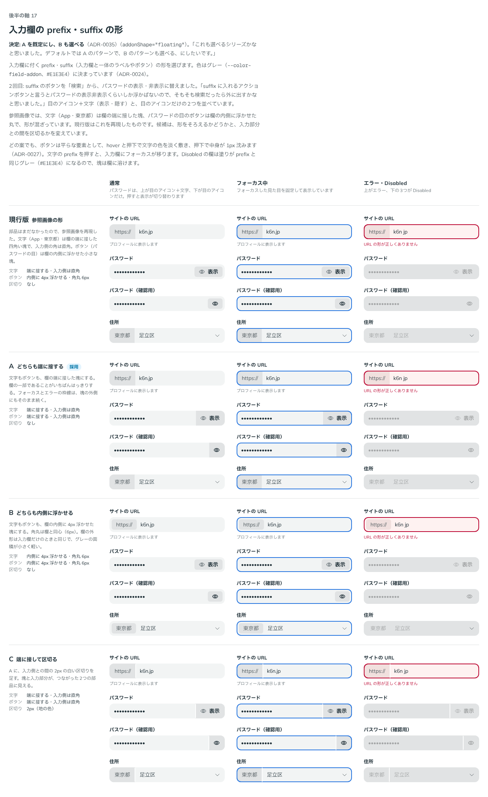
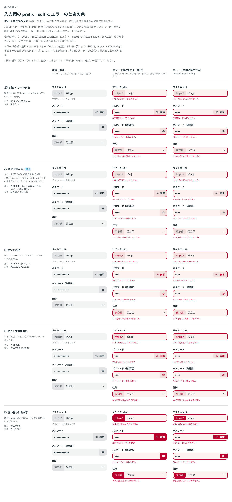

# 0035. 入力欄の prefix・suffix

- ステータス: Accepted
- 日付: 2026-09-13
- ラウンド: 後半 軸17

## 背景

[ADR-0024](./0024-neutral-button.md) で、入力欄に付く prefix・suffix（入力欄と一体のラベルやボタン）の色はグレー（`--color-field-addon`、`#E1E3E4`）と決まりました。部品はまだなかったので、形と作り方を決める必要がありました。

参照画像（`component-text-fields.webp`・`component-selects.webp`）では、文字（App・東京都）は欄の端に接した四角い塊、パスワードの目のボタンは欄の内側に浮かせた丸で、形が混ざっています。

## 候補

3回に分けて比べました。比較は Storybook の `Design Review/17 入力欄の prefix・suffix`（[`stories/axis-17-field-addon.stories.tsx`](../stories/axis-17-field-addon.stories.tsx)）です。部品（`FieldAddon`）を先に作り、形と色をトークンで切り替えて比べました。

| 回  | 比べたもの                                         | 案                                                                                                                                                 |
| --- | -------------------------------------------------- | -------------------------------------------------------------------------------------------------------------------------------------------------- |
| 1   | 形                                                 | 現行版（参照画像の形: 文字は端に接し、ボタンは内側に浮かせる）、A どちらも端に接する、B どちらも内側に 4px 浮かせる、C A に 2px の白い区切りを足す |
| 2   | 形（suffix のボタンを替えた）                      | 1回目と同じ4案。suffix のボタンを「検索」から、パスワードの表示・非表示（目のアイコン＋文字、目のアイコンだけ）に替えた                            |
| 3   | エラーのときの色（ストーリー「エラーのときの色」） | 現行版 グレーのまま、A 塗りを赤みに、B 文字を赤に、C 塗りと文字を赤に、D 赤い塗りに白文字                                                          |

- どの案でも、状態は通常・フォーカス中・エラー・Disabled を並べました。3回目は、端に接する形と内側に浮かせる形の両方でエラーを並べました
- 3回目の A の塗り（`#F1E0DE`）は、ふだんの「グレーの塊と欄」の関係（明度の差 0.05、比 1.17）を、エラーの塗り（`#FEF2F1` — [ADR-0021](./0021-field-error-fill.md)）にそのまま写した色です。どの案も、文字は本文の基準 4.5:1 を満たします

## 決定

**prefix・suffix は、文字もボタンも入力欄の端に接した塊を既定にし、内側に浮かせる形も選べるようにします。エラーのときは、塊の塗りを赤みにします。**

| 項目                  | 決定                                                                                                                                                                                      |
| --------------------- | ----------------------------------------------------------------------------------------------------------------------------------------------------------------------------------------- |
| 形（既定・A）         | 本体の端に接した塊。外側の角は本体と同じ 12px、入力側の角は直角。本体の枠線（フォーカス・エラー）の色は、塊の外側にも同じ場所に描く                                                       |
| 形（選べる・B）       | `addonShape="floating"`: 本体の内側に 4px 浮かせた塊。角丸は本体と同心の 6px                                                                                                              |
| 区切り                | 入れない                                                                                                                                                                                  |
| 塗り                  | グレー `#E1E3E4`（ADR-0024）。エラーのときは赤み `#F1E0DE`（`--color-field-addon-invalid`）                                                                                               |
| 文字                  | 文字の prefix は本文より一段淡い色（`--color-fg-muted`）、ボタンは本文の色の太字。エラーのときも変えない                                                                                  |
| ボタン                | 平らな要素（原則3）。hover で文字の色を 8%、押下で 16% 重ね、押下で中身が 1px 沈む（[ADR-0027](./0027-flat-press.md)）。キーボードのフォーカスは [ADR-0031](./0031-focus-visible.md) の線 |
| suffix に入れるボタン | 入力欄そのものを操作するもの（パスワードの表示・非表示など）に限る。検索のように入力した内容を送るボタンは、入力欄の外に置く（ADR-0024 を見直し）                                         |
| Disabled              | 塊の塗りは変えない。文字は Disabled の文字の色になり、ボタンも押せなくなる                                                                                                                |
| 文字の prefix を押す  | 入力欄にフォーカスが移る                                                                                                                                                                  |

使い方は次のとおりです。

```tsx
<TextField label="サイトの URL" prefix="https://" />
<TextField label="パスワード" type="password" suffix={<FieldAddonButton>…</FieldAddonButton>} />
<Select label="住所" prefix="東京都" items={wards} />
<TextField label="サイトの URL" prefix="https://" addonShape="floating" />
```

## 理由

ユーザーのメモです。

> タグインプットと混在されそう、というのは結構分かります。suffix に入れるアクションボタンと言うとパスワードの表示非表示くらいしか浮かばないので、そもそも検索だったら外に出すかなと思いました。それを踏まえると、A 案が良いかなという気がしています。検索 ではなくてパスワードの表示非表示ボタンだとどうでしょうか？（目のアイコン＋表示） など

> うーむ、これも選べるシリーズかなと思いました。デフォルトでは A のパターンで、B のパターンも選べる、にしたいです。
> ちなみに、エラーになっている時に色を変えるとしたら、どういうパターンがあると思いますか？

> A かなと思います。現行版よりは違和感が改善されました。

以下は、メモと比較から読み取れることです。

- **端に接する（既定）**: 塊が欄の一部であることがはっきりします。1回目の説明で、B の「https://」はタグ入力の一つ一つの塊にも見えると書いたところ、「結構分かります」とのことでした。端に接していれば、その心配はありません
- **内側に浮かせる形も選べる**: 「これも選べるシリーズ」。欄の外形を入力欄だけのときと同じにしたいときや、グレーの面積を小さく、軽く見せたいときに使います
- **suffix のボタンは入力欄を操作するものだけ**: suffix に入るボタンはパスワードの表示・非表示くらいで、検索は外に出す、という見立てです。ボタンが目のボタンのように小さく限られるので、端に接する形でも重くなりません
- **エラーの塗りを赤みに**: グレーのままだと、赤くなった欄の中で塊だけがエラーから浮いて見えました（「現行版よりは違和感が改善されました」）。塊が欄と一緒にエラーの色に入り、赤い文字は増えないので、軽さも保てます

## 却下した案と理由

- **現行版（参照画像の形）**: 文字とボタンで形が混ざります。A が選ばれました
- **C（区切りを入れる）**: A が選ばれました
- **suffix に検索ボタンを入れる**: 「そもそも検索だったら外に出すかなと思いました」
- **エラーでもグレーのまま（3回目の現行版）**: 塊だけがエラーから浮いて見えます。「現行版よりは違和感が改善されました」
- **B（文字を赤に）・C（塗りと文字を赤に）**: A が選ばれました。比較のときの説明では、「https://」や「東京都」が赤くなると、prefix の文字そのものが間違っているようにも読める、としていました
- **D（赤い塗りに白文字）**: A が選ばれました。比較のときの説明では、「表示」が赤地に白文字になり、危険な操作の赤いボタン（Danger）と同じ見た目になる、としていました

## 影響

- `tokens.css`:
  - 形のトークン `--field-addon-inset`・`--field-addon-round-inner`（文字）、`--field-addon-button-inset`・`--field-addon-button-round-inner`（ボタン）、`--field-addon-floating-inset`（内側に浮かせる形の距離）、`--field-addon-divider`（区切り。0px）を足しました。文字とボタンを別に指定できるのは、比べた案（参照画像の形）を比較のストーリーで再現するためです
  - `--palette-red-100`（`#F1E0DE`）と `--color-field-addon-invalid` を足しました。文字の色を差し替える `--color-on-field-addon-invalid` は未設定です（比較のストーリーで赤い文字の案を再現するときに使います）
- `src/components/FieldAddon.tsx`（新規）: 文字の `FieldAddon` と、ボタンの `FieldAddonButton` です。本体の最初の子を prefix、最後の子を suffix として、角と余白を決めます
  - 端に接する形では、塊が本体の枠線の場所に同じ太さの枠線を持ち、本体の枠線の色を受け継ぎます（`border-color: inherit`）。そのため、フォーカスとエラーの枠線が塊の外側にも途切れずに続きます
  - 押せない欄の中の `FieldAddonButton` も押せなくなります（`src/components/field-addon-context.ts` の `FieldAddonDisabled`）
- `src/components/TextField.tsx`: `prefix`・`suffix`・`addonShape` を足しました。文字を渡すと `FieldAddon` で包みます。本体の子の間隔を 0 にしました（入力欄だけのときの見た目は変わりません）
- `src/components/Select.tsx`: `prefix`・`addonShape` を足しました。本体がボタンなので、中にボタンを置く suffix はありません
- `src/components/field-styles.ts`: `addonShape="floating"` のとき、形のトークンを内側に浮かせる値に差し替えます
- `src/components/icons.tsx`: 目のアイコン（`EyeIcon`・`EyeSlashIcon`）と、アイコン単体で置くときに線を太くする `standalone` を足しました（[ADR-0018](./0018-icon-weight-by-context.md)）
- ADR-0024: 決定2の「検索ボタンなど」を見直したことを追記しました
- 入力欄が出てくる ADR の比較画像（0019〜0024・0026・0029・0032）を撮り直し、見た目が変わっていないことを確かめました
- **分かっていること**:
  - suffix のボタンにキーボードでフォーカスすると、欄の青い枠線とボタンのフォーカスの線が両方出ます。どう見せるかは決めていません
  - Disabled の欄は塗りが prefix と同じグレー（`#E1E3E4`）になるので、塊は欄に溶けます
  - 文字の prefix（「https://」など）は、読み上げでは入力欄の名前に含まれません。入力欄とつなぐかは決めていません
  - 指用の密度では、アイコンだけのボタンは 52×44px の横長になります（左右の余白 16px ＋アイコン 20px）

## 比較画像

形（1〜2回目）です。A に採用の印を付けています。



エラーのときの色（3回目）です。A に採用の印を付けています。


