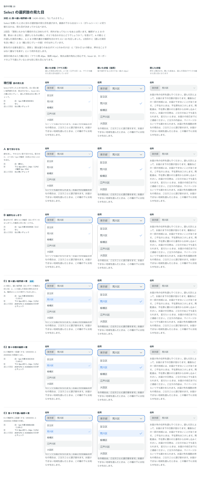

# 0036. Select の浮かぶ選択肢の見た目

- ステータス: Accepted
- 日付: 2026-09-13
- ラウンド: 後半 軸18

## 背景

Select を開いたときに浮かぶ選択肢は、部品を作ったときの仮の見た目（白い面に 1px の細い境界線、影なし）のままでした。浮かぶ面はページの内容の上に重なるので、下の内容との境目をどう見せるかと、いま選んでいる項目をどう見せるかを決める必要がありました。

原則1は「影は塗りのあるボタンにのみ付ける」【固定】としており、浮かぶ面に影を付けることはこれとぶつかります。

## 候補

2回に分けて比べました。比較は Storybook の `Design Review/18 Select の選択肢`（[`stories/axis-18-select-popup.stories.tsx`](../stories/axis-18-select-popup.stories.tsx)）です。部品の浮かぶ部分の見た目をトークン（`--select-popup-*`・`--color-select-*`）にして、行ごとに切り替えて比べました。

| 回  | 案                                                                                                                                                                                                        |
| --- | --------------------------------------------------------------------------------------------------------------------------------------------------------------------------------------------------------- |
| 1   | 現行版（白・1px の線 #DEE0E1・影なし）、A 影で浮かせる（線なし・やわらかい影）、B 輪郭をはっきり（1px の線 #939596・影なし）、C 選んだ項目を淡い青に、D 欄と同じグレーの面（#F2F4F4・線なし、hover は白） |
| 2   | 現行版・A・B に加えて、A の影と C の青に、A と B の間の濃さの輪郭を合わせた E1（#DEE0E1、白地との比 1.32）・E2（#CBCDCE、1.60）・E3（#B8BABB、1.95）。1回目の C・D の行は外した                           |

- 列は、開いた状態（マウス用・指用）と閉じた状態です。開いた状態は、選択肢が下の文章に重なるように並べ、4つ目の項目にマウスを載せた見た目を固定しました
- A の影は「下に 8px・ぼかし 24px・濃さ 12%」で、影の中にごく淡い 1px の輪郭（白地との比 1.11）を含みます。B の線は、白いボタンのはっきりした輪郭と同じ 3:1 の色です

## 決定

**浮かぶ選択肢は、白い面に 1px の細い境界線とやわらかい影を付けます（E1）。選んだ項目は淡い青に塗ります。**

| 項目          | 決定                                                                                                                                                                  |
| ------------- | --------------------------------------------------------------------------------------------------------------------------------------------------------------------- |
| 面            | 白（`--color-select-popup`）                                                                                                                                          |
| 輪郭          | 1px の `#DEE0E1`（`--color-select-popup-line`。白いボタンの輪郭 `--color-surface-line` と同じ）                                                                       |
| 影            | 下に 8px・ぼかし 24px・濃さ 12%（`--shadow-select-popup`）                                                                                                            |
| 内側の余白    | 4px。面の角丸は 12px、項目の角丸は同心の 8px                                                                                                                          |
| 項目          | 高さは入力欄と同じ（マウス用 40px、指用 44px）。hover（キーボードで選んでいるときも同じ）は入力欄の塗り `#F2F4F4`                                                     |
| 選んだ項目    | 青のタグと同じ組み合わせ。`#E9F2FE` の塗りに `#196BD6` の文字とチェック（4.52:1）。hover では、塗りに文字の青を 8% 混ぜて一段濃くする                                 |
| 原則1との関係 | 浮かぶ UI の影は、押せることではなく重なりを表す。原則1の「影は塗りのあるボタンにのみ」と「階層や奥行きは、影ではなく面の明度差と余白で作る」の両方に、例外として足す |

## 理由

ユーザーのメモです。

> 原則1もかなり最初の方に決めたので、例外があってもいいなあとは思います。
> 輪郭が A と B の間、影はいまと同じ、選択したものは青に、の3つを合わせるとどうでしょうか？

> E1 でよさそう。このまま次もお願いします。

以下は、メモと比較から読み取れることです。

- **影で重なりを表す**: 影があると、選択肢がページの上に重なっていることがいちばん分かります。原則1は前半のはじめに決めたもので、浮かぶ UI まで考えて決めたものではありませんでした。影の意味を「押せる」と「重なっている」に分け、浮かぶ UI の影を例外として認めます
- **輪郭は白いボタンと同じ**: E1 の輪郭は、白いボタンの輪郭（[ADR-0025](./0025-surface-button-line.md)）と同じ色です。白いボタンも「影＋#DEE0E1 の 1px の輪郭」で作っているので、白い面を浮かせるときの作りがそろいます。影があるので、淡い輪郭でも下の文章との境目は分かります
- **選んだ項目は青**: 右のチェックだけより、いま何を選んでいるかが一目で分かります。色は青のタグと同じ組み合わせで、新しい色を持ち込みません

## 却下した案と理由

- **現行版（仮の見た目）**: 選ばれませんでした。比較のときの説明では、下の文章と重なると境目が弱く、文章が選択肢の下にそのまま続いて見える、としていました
- **A（影だけ）・B（濃い輪郭だけ）**: 「輪郭が A と B の間」
- **C（選んだ項目の青だけ）**: E1 に取り込みました
- **D（欄と同じグレーの面）**: 選ばれませんでした
- **E2・E3（輪郭をもう一段・二段濃く）**: E1 が選ばれました

## 影響

- `tokens.css`: `--select-popup-padding`・`--select-popup-line-width`・`--color-select-popup`・`--color-select-popup-line`・`--shadow-select-popup`・`--color-select-item-highlight`・`--color-select-item-selected`・`--color-select-item-selected-highlight`・`--color-on-select-item-selected`・`--color-select-check` を足しました。値は E1 です
- `src/components/Select.tsx`:
  - 浮かぶ部分の見た目を、上のトークンで描くようにしました
  - `open`・`defaultOpen`・`onOpenChange`・`modal`・`container`（浮かぶ部分を描く場所）・`collisionAvoidance`（画面の端に当たったときの逃がし方）を渡せるようにしました。比較のストーリーで、開いたままの選択肢を行ごとに並べるために使っています
- `principles.md`: 原則1に、浮かぶ UI の影を例外として足します
- 閉じた Select の見た目は変わっていません。Select が出てくる ADR の比較画像を撮り直して確かめました
- **追記（[ADR-0037](./0037-select-sheet.md)）**: 浮かぶ選択肢の高さの上限（画面の高さの半分。ただし 10.5 項目まで）と、上下の端の続きの影は、ADR-0037 で決まりました。あわせて、面の上下の余白を選択肢の内側に移し、面を角丸で切り抜くようにしました（続きの影が面の端に接するように）。そのため、この ADR の比較画像を撮り直すと、面の角の 18 ピクセルだけが最大 5/255 違います。見ても分からない差なので、画像はそのままにしています。比較のストーリー（軸 18）の開いたままの列は、比べたときの見た目（上限と影なし）で固定しています
- **分かっていること**:
  - 開いた直後は、選んだ項目がキーボードで選んでいるのと同じ状態になり、一段濃い青で表示されます
  - 開くときと閉じるときの動き（98% から 0.1 秒で広がりながら現れる）は仮のままで、比べていません
  - 影のトークンは Select の選択肢だけのものです。Menu・Popover など、ほかの浮かぶ UI でも同じ影を使うかは、それぞれを作るときに決めます
  - 画面が狭いときにボトムシートに切り替えるか（原則11）は、次の軸で比べます → [ADR-0037](./0037-select-sheet.md) で、指で操作していて画面が狭いときにシートにすることに決まりました

## 比較画像

2回目の比較です。E1 に採用の印を付けています。

