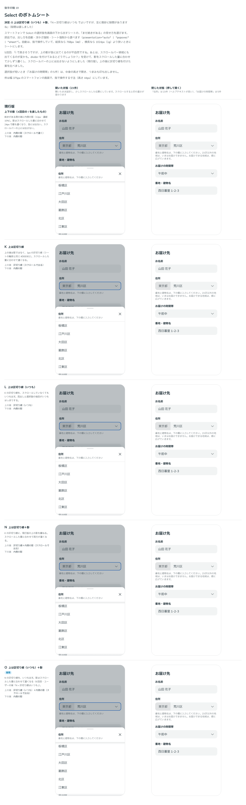
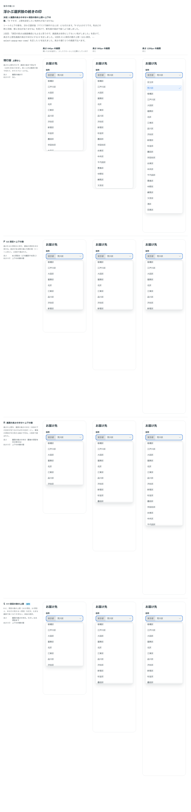

# 0037. Select のボトムシートと、長い選択肢の見せ方

- ステータス: Accepted（浮かぶ選択肢の項目の数の上限は「一旦」）
- 日付: 2026-09-13
- ラウンド: 後半 軸19

## 背景

原則11は「構造（ポップオーバーかボトムシートか）は画面幅で切り替える」【固定】としていましたが、Select には浮かぶ選択肢（[ADR-0036](./0036-select-popup.md)）しかありませんでした。スマートフォンでは、指で押す項目が画面の途中に小さく出ます。

また、選択肢が長いとき（東京都の23区など）の見せ方も決まっていませんでした。浮かぶ選択肢は高さの上限がなく、画面の端まで伸びていました。

## 候補

比較は Storybook の `Design Review/19 Select のボトムシート`（[`stories/axis-19-select-sheet.stories.tsx`](../stories/axis-19-select-sheet.stories.tsx)）です。ストーリーは3つあります。

- **候補**: シートの比較。各セルは幅 375px のスマートフォンの枠で、指で操作する寸法です
- **浮かぶ選択肢の続きの印**: 浮かぶ選択肢の比較。高さの違う画面（640px・900px・1200px）の枠に入れています
- **実機で確かめる**: 枠を使わず、部品の既定の動きで開きます。指の操作・マウスの操作と画面の幅で、出し方が切り替わるのを確かめられます

### シート（6回）

| 回  | 比べたもの         | 案                                                                                                                                                |
| --- | ------------------ | ------------------------------------------------------------------------------------------------------------------------------------------------- |
| 1   | 出し方             | 現行版（浮かぶまま）、A シート（後ろを 30% 暗く）、B A＋つまみ、C シート（暗くしない）                                                            |
| 2   | 長い選択肢の見せ方 | 全案に ×・後ろを暗くする背景・見出しの下のヘルプテキストを付けた。D 半分の高さで開く＋つまみ、E D＋下端を薄く、F 高さいっぱいで開く               |
| 3   | 続きの印           | 見出しを「ラベル＋ヘルプテキスト」のまとまりと、右上に固定した × に分けた。現行版（E）、G ＋下向きの山形、H ＋「ほか N 件」の札、I 下端に内側の影 |
| 4   | 続きの印（上下）   | I の下端の余白を直し、影を上下に付けた。J 上下の影＋上下の山形（押すとスクロール）                                                                |
| 5   | 上の端             | 影をスクロールした量に合わせて濃くし、スクロールバーの手前で止めた（現行版）。K 上は区切り線、L 上は区切り線（いつも）、N 上は区切り線＋影        |
| 6   | 決定               | O（N の区切り線をいつも出す）に決まった。影をシートの端から描くよう直した                                                                         |

- 1回目で「開くと後ろの画面が上にずれる」ことが分かりました。比較用の枠が、スクロールできる箱（`overflow: hidden`）になっていたためでした。開いた直後に、フォーカスが枠の外にある選択肢へ移り、枠の中身がずれていました。枠を `overflow: clip` に直し、実際の画面の幅（375px）でもずれないことを確かめました
- 3回目では、G の山形（本体の山形と同じ形）は「開く」印と取り違えるおそれがある、と説明していました

### 浮かぶ選択肢（3回）

| 回  | 案                                                                                   |
| --- | ------------------------------------------------------------------------------------ |
| 1   | 現行版（上限なし）、P 8.5 項目＋上下の影、Q 8.5 項目だけ                             |
| 2   | 影を面の端まで描くよう直した（左と上下に余白があった）。R 画面の高さの半分＋上下の影 |
| 3   | S R＋項目の数の上限（10.5 項目）                                                     |

### 自動で切り替える基準（ストーリーではなく、やり取りで決めた）

最初は、原則11のとおり「画面の幅が 640px（Tailwind の `sm`）より狭いとき」としていました。ユーザーのメモ「シートを使う利点は、ユーザーの指の動きを緩和するためだと思っています。そうなると、幅が基準にはならないかもしれません。」を受けて、次の3つを示しました。

1. 指で操作するときだけシート（幅は見ない）
2. 指で操作していて、かつ画面が狭いときだけシート
3. 指で操作しているか、画面が狭いときにシート

「1と2のセット」で、幅は Tailwind のブレイクポイントにそろえることになりました。境目の候補（`sm` 640px・`md` 768px・`lg` 1024px）で、それぞれどの端末がシートになるかを示し、「幅は横長なら lg にしたいですが、縦長 なら md ですかね」で決まりました。

## 決定

**Select は、指で操作していて画面が狭いとき、選択肢を画面の下から出すシートにします。長い選択肢は、シートでも浮かぶ選択肢でも途中で切り、上下の端の印で続きを見せます。**

| 項目                     | 決定                                                                                                                                                                                                                            |
| ------------------------ | ------------------------------------------------------------------------------------------------------------------------------------------------------------------------------------------------------------------------------- |
| 出し方（`presentation`） | `auto`（既定）・`popover`（浮かぶ強制）・`sheet`（シート強制）                                                                                                                                                                  |
| 自動の基準               | 指で操作していて（`pointer: coarse`）、縦長なら 768px（`md`）未満、横長なら 1024px（`lg`）未満のときはシート。それ以外（タブレット・マウス）は浮かぶ選択肢                                                                      |
| シートの形               | 画面の下から幅いっぱいに、0.25 秒で滑り出る（出だしが速く、ゆっくり止まる）。上の角は 16px（カードと同じ）。面・輪郭・選んだ項目の見た目は浮かぶ選択肢（ADR-0036）と同じ。上向きの影（上に 8px・ぼかし 24px・濃さ 12%）         |
| 後ろの画面               | 濃紺を 30% 重ねて暗くする。押すと閉じる                                                                                                                                                                                         |
| 見出し                   | ラベルとヘルプテキストを左の1つのまとまりにする（ヘルプテキストはラベルのすぐ下）。閉じる × は右上に固定し、ヘルプテキストが長くても動かない。ラベルの行は × と中央をそろえる                                                   |
| ×                        | 選ばずに閉じる。Tab では止まらない（開いた直後のフォーカスを選んだ項目に置くため）。キーボードでは Esc で閉じる                                                                                                                 |
| 長い選択肢（シート）     | 画面の高さの約半分で開き、最後の項目を半分だけ見せる。上端につまみを出す。つまみを上に引くと高さいっぱい（85%）まで広がり、下まで引くと閉じる。押すと、半分と高さいっぱいを切り替える。短いときは中身の高さで、つまみは出さない |
| 続きの印（シート）       | 上の端: 1px の区切り線（`#DEE0E1`、いつも）と内側の影（スクロールすると出る）。下の端: 内側の影。影は 12px・濃紺 10%（`--color-select-sheet-edge-shadow`）で、スクロールした量に合わせて 24px で最も濃くなる                    |
| 浮かぶ選択肢の高さ       | 画面の高さの半分。ただし 10.5 項目（`--select-popup-max-rows`、10 項目と半分だけ見える 1 項目）まで。最後の項目を半分見せる高さで切る。本体の下の空きが足りなければ、その空きまで                                               |
| 続きの印（浮かぶ選択肢） | 上下の端に内側の影（シートと同じ）                                                                                                                                                                                              |
| 印の置き方               | 影は面の端から描き、スクロールバーがあるときはその手前で止める。区切り線はシートの幅いっぱいに引く                                                                                                                              |
| 閉じたあとの本体         | 選んだ・Esc・×・つまみで閉じたときは、フォーカスが本体に戻るまで、開いているときと同じ青い枠線を保つ。外を押して閉じたときは保たない                                                                                            |

使い方は `<Select label="住所" items={wards} />` です（既定の `auto`）。常にシートにしたいときは `presentation="sheet"`、常に浮かべたいときは `presentation="popover"` を渡します。

## 理由

ユーザーのメモです（比べた順）。

> ボトムシートが出てくるときにレイアウトシフトが起きて、フォーカスが解除されたり後ろのコンテンツが上にずれたりしますね。
> つまみは内容が長い時に「選択肢がまだあるよ！」という見せ方と一緒に使いたい気持ちがあります。
> あと、ボトムシートは選択しなくても閉じられるように、×ボタンがシート右上に欲しいですね。バックドロップはある方が嬉しいです、

> また、ヘルプテキストが設定されている場合はシートの見出しの下に表示したいですね。

> ヘルプテキストと見出しの間隔が少し遠いので、住所とヘルプテキストを1ブロックにして、×ボタンと関係なくすると良さそうです。×ボタンの位置は常に右上固定で。ヘルプテキストの長さが長くなっても位置が変わらないようにするためです。
> シートを使う利点は、ユーザーの指の動きを緩和するためだと思っています。そうなると、幅が基準にはならないかもしれません。
> E が一番好みですが、下端が薄いだけだとちょっと伝わりづらい気もします。Select の仕様として自動・浮かぶ強制・シート強制を選べるようにしたいですね。

> G で下にアイコンを付けるなら、上にある場合も欲しくなりますね。
> G上下+ I 上下 ってどうですか？
> ちなみに I については、下に余白がありますね
> 切替基準は1と2のセットで良さそう。幅は tailwind のブレイクポイントに揃えたい気持ちがあるんですが、選択肢としては何がありそうですかね？

> I で良さそうですが、上の影が急に出てくるのが不自然ですね。あとは、スクロールバー領域にも出てくるのが変かも。
> divider を付けてみるとどうでしょうか？

> N + 区切り線はいつも でよいですが、左に微妙に隙間がありますね
> あとは、この上下影をポップアップタイプにも反映させるか迷います
> 幅は横長なら lg にしたいですが、縦長 なら md ですかね

> P がよさそうです。先ほどの時と同様、影に余白がありますね。
> 項目の長さは画面構成にもよると思うので、画面高さ依存にしてもいい気がしました。

> R ですが、上限を設定したい気持ちがありますね

> あと、選択肢を選んだ後に一瞬青の枠線が消えるのが気になっています。

> 項目数上限は後から変える可能性がありますが、一旦これで行きましょう。

以下は、メモと比較から読み取れることです。

- **指で操作するときだけシート**: シートにする理由は、画面の狭さではなく指の動きを減らすことです。そのため入力方式で判定し、そのうえで広い画面（タブレット）は浮かべたままにします。原則11の「構造は画面幅で切り替える」を、Select では「入力方式と画面の幅の両方で切り替える」に改めます
- **× と後ろの画面**: 選ばずに閉じる手段を、目に見える形で置きます。× は見出しの長さに左右されない場所（右上）に固定します
- **続きがあることを見せる**: つまみは、選択肢が長いときに「まだある」ことと一緒に出します。印は、下端を薄くするだけでは弱かったので、影と区切り線に替えました。影は急に出ると不自然なので、スクロールした量に合わせて濃くします
- **浮かぶ選択肢にも同じ決まり**: 長い選択肢は途中で切り、上下の影で続きを見せる、という決まりを、シートと浮かぶ選択肢で共通にします。高さは画面の構成に合わせて画面の高さの半分にし、大きな画面で長くなりすぎないよう項目の数でも上限をかけます
- **閉じたあとの青い枠線**: Base UI は、閉じる動きが終わってからフォーカスを本体に戻します。そのあいだ本体が「開いている」でも「フォーカス中」でもなくなり、枠線が一瞬消えていました。フォーカスが戻るまで、開いているときの見た目を保ちます

## 却下した案と理由

- **浮かぶ選択肢のまま（1回目の現行版）**: 指で押す項目が画面の途中に小さく出ます。シートにしました
- **C（後ろを暗くしない）**: 「バックドロップはある方が嬉しいです」
- **F（高さいっぱいで開く）**: 「つまみは内容が長い時に「選択肢がまだあるよ！」という見せ方と一緒に使いたい」ので、半分で開く形にしました
- **E（下端を薄く）**: 「下端が薄いだけだとちょっと伝わりづらい」
- **G（下向きの山形）・J（上下の影＋上下の山形）・H（「ほか N 件」）**: 選ばれませんでした。G は、本体の山形と取り違えるおそれがある、と比較のときに説明していました
- **I（上下の影）・K・L・N**: O（N の区切り線をいつも出す）が選ばれました
- **画面の幅だけで切り替える（640px 未満）**: 「幅が基準にはならないかもしれません」
- **浮かぶ選択肢の高さの上限なし（現行版）・8.5 項目で固定（P・Q）・画面の高さの半分だけ（R）**: 「画面高さ依存にしてもいい」「上限を設定したい」

## 影響

- `tokens.css`:
  - シート: `--select-sheet-radius`（16px）・`--color-select-sheet-backdrop`（濃紺 30%）・`--color-select-sheet-edge-shadow`（続きの影、濃紺 10%）・`--shadow-select-sheet`・`--duration-sheet`（250ms）・`--ease-sheet`
  - 浮かぶ選択肢: `--select-popup-max-rows`（10.5）。`--select-popup-max-height` は部品が計算して書く（未設定なら画面の端まで）
- `src/components/Select.tsx`:
  - `presentation`・`sheetDetent`・`sheetMoreCue`・`popoverMoreCue`・`popoverMaxHeight` を足しました。既定は、決まった形（`auto`・`half`・`divider-always-shadow`・`shadow`・`screen`）です。ほかの値は、比べた案を比較のストーリーで再現するために残しています
  - シートは、Base UI の Select の浮かぶ部分を、画面の下に固定して作っています（位置のインラインの style を上書きする）。つまみを引く操作は自前です
  - 開閉を部品の中でも持つようにしました（× とつまみで閉じるため）
  - 浮かぶ選択肢の上下の余白を、選択肢の内側に移し、面を角丸で切り抜くようにしました（続きの影が面の端に接するように）
- `src/components/icons.tsx`: 閉じる × のアイコン（`XIcon`）を足しました
- `principles.md`: 原則11の「構造は画面幅で切り替える」を、Select について改めます。ADR-0004 に追記します
- ADR-0036: 浮かぶ選択肢の高さの上限と続きの影は、この ADR で決まったことを追記します。比較のストーリー（軸 18）の開いたままの列は、比べたときの見た目（上限と影なし）で固定しています
- 軸 18 の比較画像を撮り直すと、面の角の 18 ピクセルだけがわずかに違います（最大 5/255）。面を角丸で切り抜くようにしたためで、見ても分からない差なので、画像はそのままにしています
- 入力欄と Select が出てくるほかの ADR の比較画像は、撮り直しても変わっていません
- **分かっていること**:
  - つまみを引く操作は自前で、引く速さ（勢い）では判定しません。Base UI の Drawer にある、はじいて閉じる動きはありません
  - シートの半分の高さと浮かぶ選択肢の上限は、開いたときと選択肢の大きさが変わったときに計算します。開いたまま画面の大きさを変えても、計算し直しません
  - 原則11の「どちらの判定も、アプリ側から Provider で固定できるようにする」は、まだ作っていません。いまは部品ごとに `presentation` で固定します
  - 動きを減らす設定のときは、シートの滑り出る動きと高さの変化を止めます
  - 項目の数の上限（10.5）は「一旦」です。使ってみて見直すかもしれません

## 比較画像

シートの比較（6回目）です。O に採用の印を付けています。

浮かぶ選択肢の比較（3回目）です。S に採用の印を付けています。

