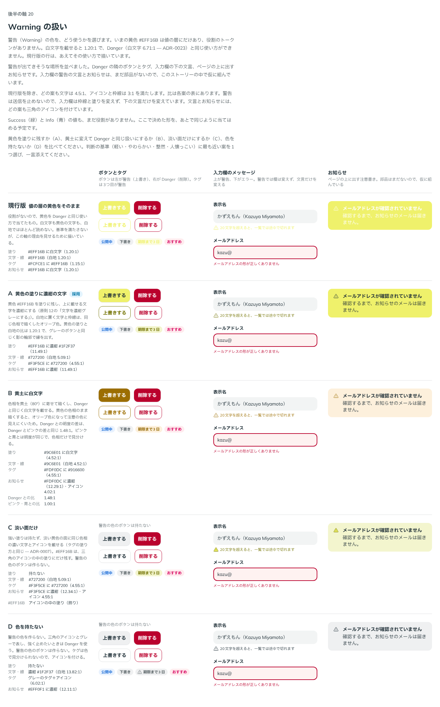

# 0038. Warning の扱い

- ステータス: Accepted
- 日付: 2026-09-13
- ラウンド: 後半 軸20

## 背景

警告（Warning）の黄色 `#EFF16B` は値の層（`--palette-warning-500`）にだけあり、役割のトークンがありませんでした。白文字を載せると 1.20:1 しかなく、Danger（白文字 6.71:1 — [ADR-0023](./0023-danger-color.md)）と同じ使い方ができません。

原則6（色の使い方）と原則12（面用と前景用の2段）に関わります。原則12には「白い文字を載せる面は、前景用の値を使うか、文字を濃紺グレーにします」とあります。

## 候補

1回で比べました。比較は Storybook の `Design Review/20 Warning の扱い`（[`stories/axis-20-warning.stories.tsx`](../stories/axis-20-warning.stories.tsx)）です。

警告が出てきそうな場所を並べました。Danger の隣のボタンとタグ、入力欄の下の文言、ページの上に出すお知らせです。入力欄の文言とお知らせは部品がないので、ストーリーの中で仮に組みました。現行版を除き、どの案も文字は 4.5:1、アイコンと枠線は 3:1 を満たします。

| 案     | 内容                   | 塗り                                  | 白地の文字・線      | タグ                                   | お知らせ                     |
| ------ | ---------------------- | ------------------------------------- | ------------------- | -------------------------------------- | ---------------------------- |
| 現行版 | 値の層の黄色そのまま   | `#EFF16B` に白文字（1.20:1）          | `#EFF16B`（1.20:1） | `#FCFCE1` に `#EFF16B`（1.15:1）       | `#EFF16B` に白文字（1.20:1） |
| A      | 黄色の塗りに濃紺の文字 | `#EFF16B` に濃紺 `#1F2F37`（11.49:1） | `#727200`（5.09:1） | `#F3F5CE` に `#727200`（4.55:1）       | `#EFF16B` に濃紺（11.49:1）  |
| B      | 黄土に白文字           | `#9C6E01` に白文字（4.52:1）          | `#9C6E01`（4.52:1） | `#FDF0DC` に `#916600`（4.55:1）       | `#FDF0DC` に濃紺（12.29:1）  |
| C      | 淡い面だけ             | 持たない                              | `#727200`（5.09:1） | `#F3F5CE` に `#727200`（4.55:1）       | `#F3F5CE` に濃紺（12.34:1）  |
| D      | 色を持たない           | 持たない                              | 濃紺（13.82:1）     | グレーのタグ＋三角のアイコン（6.02:1） | `#EFF0F1` に濃紺（12.11:1）  |

- 現行版は基準を満たしません。黄色を Danger と同じ使い方で当てると読めない、というこの軸の理由を見せるために描きました
- B は色相を黄土（80°）に寄せて暗くし、Danger と同じく白文字を載せる案です。Danger との明度の差は 1.48:1 です
- C は `#EFF16B` を三角のアイコンの中の塗りにだけ残す案です。C と D は警告の色のボタンを持ちません

## 決定

**A を採用します。黄色 `#EFF16B` は塗りに残し、上に載せる文字とアイコンは濃紺にします。白地に置く文字・枠線・アイコンには、同じ色相で暗くしたオリーブ色 `#727200` を使います。**

| 項目                       | 決定                                                                                     |
| -------------------------- | ---------------------------------------------------------------------------------------- |
| 塗り                       | `--color-warning`（`#EFF16B`）                                                           |
| 塗りの上の文字・アイコン   | `--color-on-warning`（濃紺 `--color-fg`、11.49:1）                                       |
| 白地の文字・枠線・アイコン | `--color-fg-warning`（`#727200`、白地 5.09:1）                                           |
| タグ                       | `--color-tag-warning`（`#F3F5CE`）に `--color-on-tag-warning`（`#727200`、4.55:1）       |
| お知らせ                   | 黄色の塗りに濃紺の文字とアイコン（`--color-warning`・`--color-on-warning`）              |
| 塗りの縁                   | 塗りと白地の比は 1.20:1。グレーのボタンと同じく、影の輪郭（`--shadow-raised`）で縁を出す |

- タグは `<Tag color="warning">` で使えます
- **ボタンの警告の色は、いまは作りません。** 塗りのトークン（`--color-warning`・`--color-on-warning`・`--color-fg-warning`）はあるので、必要になったら Button の `color` に足せます
- Success（緑）と Info（青）も比較のときに尋ねましたが、答えはありませんでした。役割はまだ当てません

## 理由

ユーザーのメモです。

> warning については A でよさそうです。warning のボタンというのがそもそもあまり使うことは無いですが。

以下は、メモと比較から読み取れることです。

- **黄色を残す**: 前半から持っている黄色を、そのまま警告の色として使えます。B のように色相を変えないので、警告らしい明るい黄色のままです
- **原則12のとおり**: 白文字が載らない面は、文字を濃紺にします。白地に置く文字は、色相を保って明度だけを下げた前景用の値（オリーブ色）にします。どちらも、既存の規則をそのまま当てはめた形です
- **ボタンは作らない**: 「warning のボタンというのがそもそもあまり使うことは無い」ので、部品には足しません。トークンだけ用意しておきます

## 却下した案と理由

- **現行版（黄色に白文字）**: 1.20:1 で読めません
- **B（黄土に白文字）**: 選ばれませんでした。Danger と同じ使い方ができますが、黄色から離れます
- **C（淡い面だけ）**: 選ばれませんでした。強い塗りを持たず、黄色はアイコンの中にだけ残る案です
- **D（色を持たない）**: 選ばれませんでした。警告をグレーと三角のアイコンで表す案です

## 影響

- `tokens.css`:
  - 値の層に `--palette-warning-700`（`#727200`）を足しました
  - `--palette-warning-50` を `#FCFCE1` から `#F3F5CE` に変えました。旧値は白地 1.04:1 で面が見えず、役割もありませんでした。新しい値は、ほかのタグの面（`--palette-sky-50`・`--palette-blue-50` など）と同じ明度（OKLCH 0.96）です
  - 役割の層に `--color-warning`・`--color-on-warning`・`--color-fg-warning`・`--color-tag-warning`・`--color-on-tag-warning` を足しました
- `src/components/Tag.tsx`: `color` に `warning` を足しました
- `src/components/Button.tsx`: 変えていません。警告の色のボタンは、必要になったときに足します。そのときは塗りを `--color-warning`、文字を `--color-on-warning`、枠線のボタンの線と文字を `--color-fg-warning` にし、影はグレーのボタンと同じにします
- 入力欄の下の警告の文言とお知らせは、部品がまだありません。トークンは用意できたので、部品は後で作ります。比較では次の形で組みました
  - 入力欄の文言: 三角のアイコンと文言を `--color-fg-warning` にし、欄の枠線と塗りは変えない（警告は送信を止めないため）
  - お知らせ: 黄色の塗りに、濃紺の太字の見出しと本文、濃紺の三角のアイコン
- 比較のストーリーは、既定で A に採用の印を付けます。タグは `<Tag color="warning">` にしました。行ごとにトークンを上書きしているので、現行版の行はいまも比べたときの見た目です
- `principles.md`: カラートークンの表に警告を足し、後半の軸から「Warning の扱い」を外します
- **分かっていること**:
  - オリーブ色の文字は、黄色の塗りの上では 4.24:1 で基準に届きません。黄色の塗りの上は、いつも濃紺にします
  - お知らせ用の面・文字・アイコンの役割（ストーリーの `--color-warning-surface` など）は足していません。いまは塗りのトークンで足ります。部品を作るときに、分けるかを決めます
  - Success と Info は、値の層（`--palette-success-*`・`--palette-info-*`）にだけあるままです
- **追記（[ADR-0043](./0043-notice.md)）**: お知らせの部品（`src/components/Notice.tsx`）を作り、決定の表の「お知らせ」を変えました。お知らせの既定の見た目は、ほかの状態の色とそろえて、淡い黄色の面 `#F3F5CE`（タグの面と同じ）に、オリーブ色 `#727200` の題とアイコン（4.55:1）、濃紺の本文（12.34:1）です。黄色の塗りに濃紺の文字（この ADR の形）は、塗りの見た目（`appearance="filled"`）として残ります。ユーザーのメモは「warning の原則については、こちらに変更で良さそう。」でした。お知らせ用の面・文字・アイコンの役割は、塗りのトークンと分けました（`--color-notice-warning`・`--color-notice-warning-title` など。塗りの見た目は `--color-notice-warning-filled` が `--color-warning` を指す）。塗り・白地の文字・タグ・入力欄の下の警告の文の値は、この ADR のままです。比較画像は比べたときの記録なので、そのままにしています

## 比較画像

