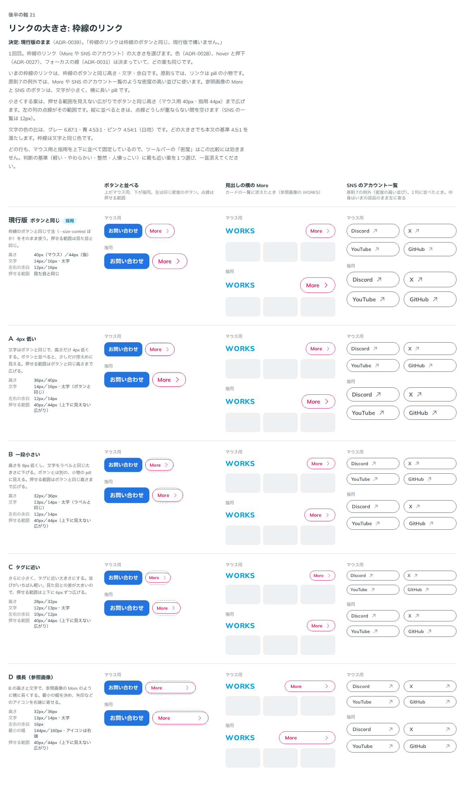
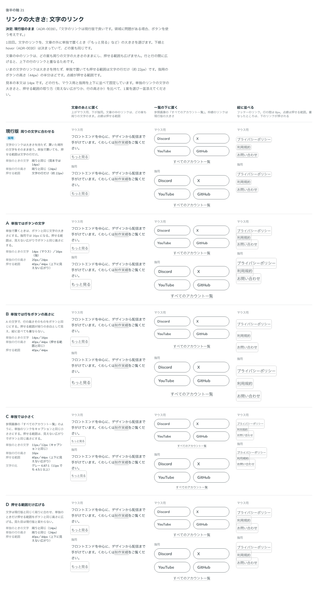

# 0039. リンクの大きさ

- ステータス: Accepted
- 日付: 2026-09-13
- ラウンド: 後半 軸21

## 背景

リンク（`src/components/Link.tsx`）の大きさは、仮のままでした。色は [ADR-0028](./0028-default-color.md)、hover と押下は [ADR-0027](./0027-flat-press.md)・[ADR-0030](./0030-text-link.md)、フォーカスは [ADR-0031](./0031-focus-visible.md) で決まっていて、残っていたのが大きさでした。

枠線のリンクは、枠線のボタンと同じ高さ・文字・余白（`--size-control`・`--text-control`・`--space-control-x`）を使っていました。原則5では、リンクは pill の小物です。原則7の例外では、More や SNS のアカウント一覧のような密度の高い並びに使います。参照画像の More と SNS のボタンは、文字が小さく、横に長い pill です。ボタンと同じ大きさのままでよいかを確かめる必要がありました。

文字のリンクは大きさを持たず、置いた場所の文字をそのまま使います。文章の外に単独で置いても（「もっと見る」など）、押せる範囲は文字の行だけ（約 22px）です。指用のボタンの高さ（44px）の半分ほどです。

## 候補

比較は Storybook の `Design Review/21 リンクの大きさ`（[`stories/axis-21-link-size.stories.tsx`](../stories/axis-21-link-size.stories.tsx)）です。枠線のリンクと文字のリンクでは「大きさ」の意味が違うので、ストーリーを2つに分けました。1回で決まりました。

どの行も、マウス用と指用を上下に並べて固定しています。部品はまだリンク用の寸法を持たないので、比べるための値はストーリーの中で差し替えました。

### 枠線のリンク

ボタンと並べる、見出しの横の More、SNS のアカウント一覧（2列）の3つの場面で比べました。小さくする案は、押せる範囲を見えない広がりで、ボタンと同じ高さまで広げています。

| 案                  | 高さ（マウス／指）     | 文字                             | 左右の余白 | 押せる範囲                                        |
| ------------------- | ---------------------- | -------------------------------- | ---------- | ------------------------------------------------- |
| 現行版 ボタンと同じ | 40px／44px             | 14px／16px・太字                 | 12px／16px | 見た目と同じ                                      |
| A 4px 低い          | 36px／40px             | 14px／16px・太字（ボタンと同じ） | 12px／14px | 40px／44px                                        |
| B 一段小さい        | 32px／36px             | 13px／14px・太字（ラベルと同じ） | 12px／14px | 40px／44px                                        |
| C タグに近い        | 28px／32px             | 12px／13px・太字                 | 10px／12px | 40px／44px                                        |
| D 横長（参照画像）  | 32px／36px（B と同じ） | 13px／14px・太字                 | 16px       | 40px／44px。最小の幅 144px／160px、アイコンは右端 |

### 文字のリンク

文章の中のリンクは、どの案も周りの文字のままで、押せる範囲も広げません。行と行の間に広げると、上下の行のリンクと重なるためです。

比べたのは、文章の外に単独で置くときです。文章のあとに置く、一覧の下に置く（参照画像の「すべてのアカウント一覧」）、縦に並べる（フッター）の3つの場面で比べました。見本の本文は 14px・行の高さ 24px です。

| 案                           | 単独のときの文字                 | 単独の行の高さ     | 押せる範囲                     |
| ---------------------------- | -------------------------------- | ------------------ | ------------------------------ |
| 現行版 周りの文字に合わせる  | 周りと同じ（14px）               | 周りと同じ（24px） | 文字の行だけ（約 22px）        |
| A 単独ではボタンの文字       | 14px／16px                       | 20px／24px         | 40px／44px（見えない広がり）   |
| B 単独では行をボタンの高さに | 14px／16px                       | 40px／44px         | 40px／44px（行の高さそのもの） |
| C 単独では小さく             | 11px／12px（キャプションと同じ） | 16px               | 40px／44px（見えない広がり）   |
| D 押せる範囲だけ広げる       | 周りと同じ（14px）               | 周りと同じ（24px） | 40px／44px（見えない広がり）   |

## 決定

**枠線のリンクも文字のリンクも、現行版のままにします。**

| 項目                     | 決定                                                                                                                                                                              |
| ------------------------ | --------------------------------------------------------------------------------------------------------------------------------------------------------------------------------- |
| 枠線のリンク             | 枠線のボタンと同じ寸法。高さ `--size-control`、文字 `--text-control`・`--leading-control`（太字）、左右の余白 `--space-control-x`、アイコン `--size-icon`。どれも密度で切り替わる |
| 枠線のリンクの押せる範囲 | 見た目と同じ                                                                                                                                                                      |
| 文字のリンク             | 大きさを持たない。置いた場所の文字の大きさと行の高さをそのまま使う。単独で置いても同じ                                                                                            |
| 文字のリンクの押せる範囲 | 文字の行だけ。見えない広がりで広げない                                                                                                                                            |
| 広い範囲が要るとき       | 文字のリンクを広げず、ボタンを使う                                                                                                                                                |

## 理由

ユーザーのメモです。

> 枠線のリンクは枠線のボタンと同じ、現行版で構いません。

> 文字のリンクは現行版で良いです。領域に問題がある場合、ボタンを使う考えです。

以下は、メモと比較から読み取れることです。

- **枠線のリンクは、枠線のボタンとそろえる**: ボタンの隣に並べても、高さと文字がそろいます（整然）。リンク用の寸法を別に持たずに済みます。指用の高さ（44px、仮）を詰めるときも、ボタンと一緒に変わります
- **押せる範囲は見た目と同じ**: 小さくする案は、見えない広がりで押せる範囲を補う必要がありました。縦に並べるときも、広がりどうしが重ならない間を空ける必要がありました。現行版は、見た目の大きさがそのまま押せる範囲です
- **文字のリンクは文章の一部**: 見た目も押せる範囲も、周りの文字の行のままにします。押しやすさが要る場所では、文字のリンクを広げず、はじめからボタンを選びます。部品ごとの役割が分かれ、見えない広がりが上下のリンクと重なることもありません

## 却下した案と理由

枠線のリンク:

- **A（4px 低い）・B（一段小さい）・C（タグに近い）**: 「枠線のボタンと同じ、現行版で構いません」
- **D（横長、参照画像）**: 同じ理由です。最小の幅を決めてアイコンを右端に寄せる並べ方も、採りませんでした

文字のリンク:

- **A（単独ではボタンの文字）・B（単独では行をボタンの高さに）・D（押せる範囲だけ広げる）**: 「領域に問題がある場合、ボタンを使う考えです」。文字のリンクの文字も押せる範囲も広げず、広い範囲が要るときはボタンにします
- **C（単独では小さく）**: 選ばれませんでした。単独のリンクも周りの文字に合わせます。押せる範囲を広げる点は、A・B・D と同じ理由で採りません

## 影響

- `tokens.css`: 変更なし。リンク用の寸法（`--size-link` など）は足しません。比較のストーリーの中だけで使った値です
- `src/components/Link.tsx`: 動きは変えていません。「大きさは仮」のコメントを、この決定に書き換えました
- 比較のストーリーは、2つとも現行版に採用の印を付けました
- `principles.md`: 後半の軸の「リンクの大きさ」は、この ADR で決まったことにします
- **分かっていること**:
  - 指用の高さ 44px は仮の値です（原則11）。詰めるときは、枠線のリンクもボタンと一緒に変わります
  - 幅いっぱいに広げた枠線のリンク（SNS のアカウント一覧の2列）は、中身が左に寄ります。中央に寄せるか、アイコンを右端に寄せるかは、決めていません
  - 単独の文字のリンクの押せる範囲は、指用のボタンの約半分（約 22px）です。フッターのように縦に並べて押しにくいときは、ボタンに替えます
  - いまの Button は `<button>` だけで、`href` を持てません。ページを移るリンクをボタンの形にする方法は、まだ作っていません

## 比較画像

枠線のリンクの比較です。現行版に採用の印を付けています。

文字のリンクの比較です。現行版に採用の印を付けています。

