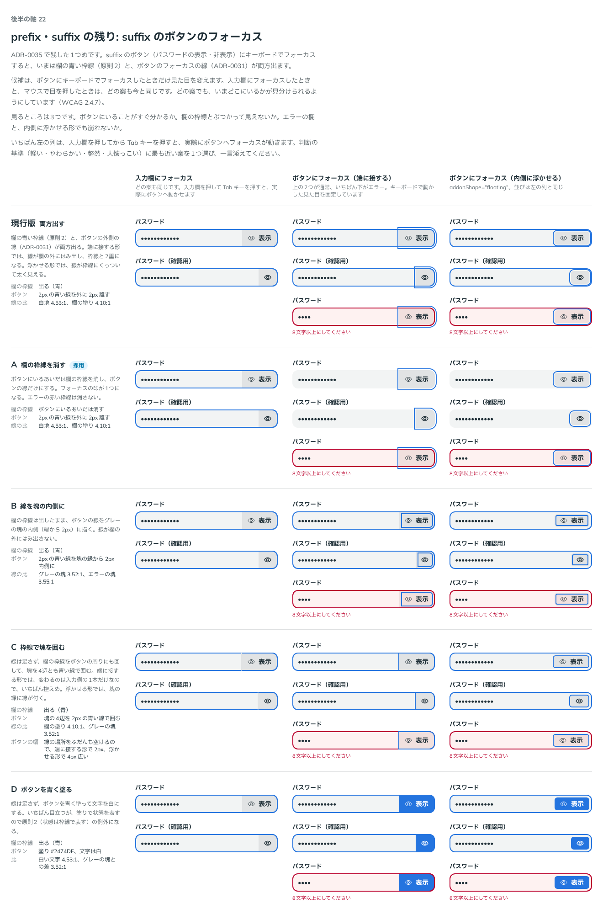
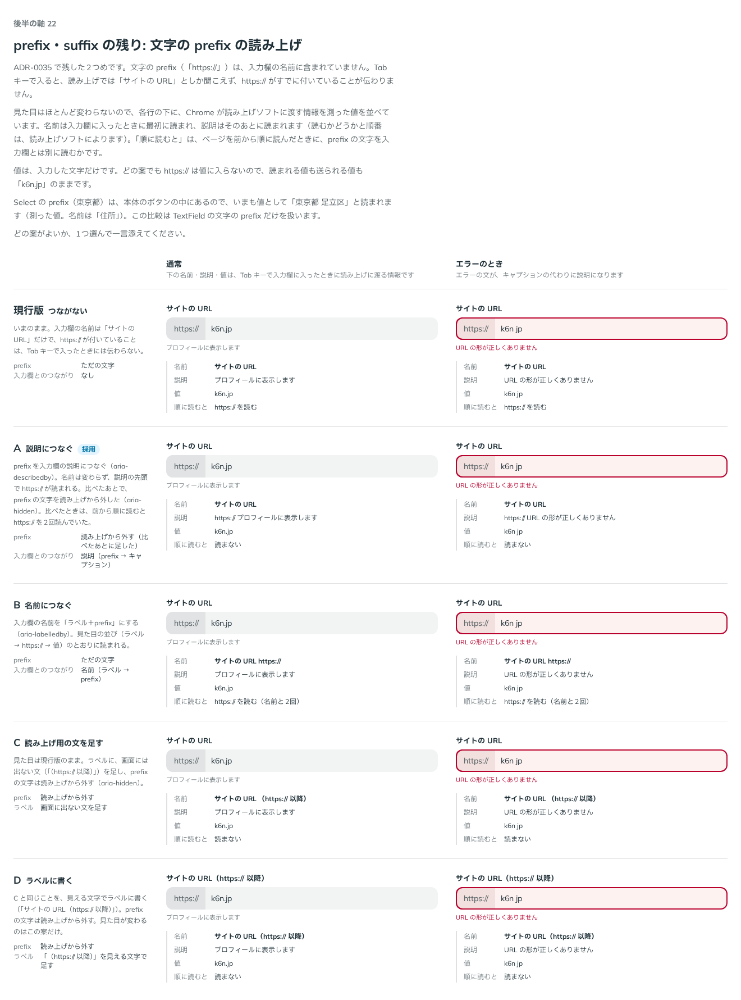

# 0040. prefix・suffix の残り（ボタンのフォーカスと、文字の読み上げ）

- ステータス: Accepted（文字の prefix・suffix の読み上げは「一旦」）
- 日付: 2026-09-13
- ラウンド: 後半 軸22

## 背景

[ADR-0035](./0035-field-addon.md) で prefix・suffix の形と色が決まり、「分かっていること」に2つが残っていました。

- suffix のボタンにキーボードでフォーカスすると、欄の青い枠線（原則2）と、ボタンのフォーカスの線（[ADR-0031](./0031-focus-visible.md)）が両方出ます。端に接する形では、線が欄の外にはみ出し、枠線と2重になります。内側に浮かせる形では、線が枠線にくっついて太く見えます
- 文字の prefix（「https://」など）は、読み上げでは入力欄の名前に含まれません。Tab キーで入ると「サイトの URL」としか聞こえず、https:// がすでに付いていることが伝わりません

この軸では、2つを別々に比べました（原則8）。

## 候補

比較は Storybook の `Design Review/22 prefix・suffix の残り`（[`stories/axis-22-field-addon-rest.stories.tsx`](../stories/axis-22-field-addon-rest.stories.tsx)）です。ストーリーは2つあります。部品にはまだ切り替えの仕組みがなかったので、案はストーリーの中の CSS と props で作りました。

### suffix のボタンのフォーカス（ストーリー「suffix のボタンのフォーカス」）

どの案も、ボタンにキーボードでフォーカスしている（`:focus-visible`）ときだけ見た目を変えます。入力欄にフォーカスしたときと、マウスで押したときは今と同じです。パスワードの表示・非表示のボタン（目のアイコン＋文字、目のアイコンだけ）を、端に接する形と内側に浮かせる形で、エラーの欄も含めて並べました。

| 案     | 内容                                                                                                                                      |
| ------ | ----------------------------------------------------------------------------------------------------------------------------------------- |
| 現行版 | 欄の青い枠線と、ボタンの外側の線（2px の青い線を外に 2px 離す）が両方出る                                                                 |
| A      | ボタンにいるあいだは欄の枠線を消し、ボタンの線だけにする。エラーの赤い枠線は消さない                                                      |
| B      | 欄の枠線は出したまま、ボタンの線をグレーの塊の内側（縁から 2px）に描く。線の比はグレーの塊に対して 3.52:1                                 |
| C      | 線は足さず、欄の枠線をボタンの周りにも回して、塊を4辺とも青い線で囲む。線の場所をふだんも空けるので、ボタンが 2px（浮かせる形は 4px）広い |
| D      | 線は足さず、ボタンを青く塗って文字を白にする。塗りで状態を表すので、原則2（状態は枠線で表す）の例外になる                                 |

### 文字の prefix の読み上げ（ストーリー「文字の prefix の読み上げ」）

見た目の差はほとんどないので、各行の下に、Chrome が読み上げソフトに渡す情報（名前・説明・値）を測った値を並べました。通常とエラーのときの2列です。

| 案     | 内容                                                                                                    | 名前（測った値）               | 説明（通常のとき）                |
| ------ | ------------------------------------------------------------------------------------------------------- | ------------------------------ | --------------------------------- |
| 現行版 | つながない                                                                                              | サイトの URL                   | プロフィールに表示します          |
| A      | prefix を入力欄の説明につなぐ（`aria-describedby`）                                                     | サイトの URL                   | https:// プロフィールに表示します |
| B      | 入力欄の名前を「ラベル＋prefix」にする（`aria-labelledby`）                                             | サイトの URL https://          | プロフィールに表示します          |
| C      | ラベルに画面に出ない文（「（https:// 以降）」）を足し、prefix の文字は読み上げから外す（`aria-hidden`） | サイトの URL （https:// 以降） | プロフィールに表示します          |
| D      | C と同じことを、見える文字でラベルに書く。prefix の文字は読み上げから外す。見た目が変わるのはこの案だけ | サイトの URL（https:// 以降）  | プロフィールに表示します          |

- 値は、どの案でも入力した文字（「k6n.jp」）だけです。https:// は値に入りません
- 比べたときの A と B は、prefix の文字を読み上げに残していました。そのため、ページを前から順に読むと https:// を2回読みます
- Select の prefix（東京都）は、本体のボタンの中にあるので、いまも値として「東京都 足立区」と読まれます（名前は「住所」）。この比較は TextField の文字の prefix だけを扱いました

## 決定

**suffix のボタンにキーボードでフォーカスしているあいだは、欄の枠線を消してボタンの線だけにします（A）。文字の prefix・suffix は入力欄の説明につなぎ、見えている文字は読み上げから外します（A に `aria-hidden` を足した形）。**

| 項目                                 | 決定                                                                                                                                                               |
| ------------------------------------ | ------------------------------------------------------------------------------------------------------------------------------------------------------------------ |
| ボタンのフォーカス                   | ボタンにキーボードでフォーカスしている（`:focus-visible`）あいだは、欄の青い枠線を消し、ボタンの線（ADR-0031）だけにする。端に接する形・内側に浮かせる形のどちらも |
| エラーの欄                           | 赤い枠線は消さない。赤い枠線とボタンの青い線が両方出る                                                                                                             |
| 入力欄にいるとき・マウスで押したとき | 今と同じ（欄の青い枠線だけ）                                                                                                                                       |
| 文字の prefix                        | 入力欄の説明につなぐ。説明は prefix の文字が先で、キャプション（エラーのときはエラーの文）が後ろ                                                                   |
| 見えている prefix の文字             | 読み上げから外す（`aria-hidden`）。前から順に読んでも、https:// は説明で1回だけ読まれる                                                                            |
| 文字の suffix（「円」など）          | prefix と同じ。説明は prefix → suffix → キャプション → エラーの文の順（測った値は「影響」）                                                                        |
| ボタン（`FieldAddonButton`）         | つながない。ボタンはそれ自体にフォーカスが止まり、自分の名前で読まれるため                                                                                         |
| Select                               | 変えない。prefix（東京都）は、いまも値の一部として「東京都 足立区」と読まれる                                                                                      |

使い方は変わりません。`<TextField label="サイトの URL" prefix="https://" caption="プロフィールに表示します" />` と書くと、入力欄の名前は「サイトの URL」、説明は「https:// プロフィールに表示します」になります。

## 理由

ユーザーのメモです（比べた順）。

> suffix のボタンのフォーカスは、A でよさそうです。

> 読み上げは、どれが一般的ですか？

> B は 2 回読まれるんですか？

> 一旦 A で行きましょう。

決めたあとのメモです（2026-09-13）。「分かっていること」に、suffix の文字の読み上げを測っていないと残していました。メモの「prefix」は、prefix と同じ仕組みでつないだ suffix の文字のことです。

> prefix は測ってください。

2つ目の質問への回答の要点です。

- 決まったやり方はありません。Bootstrap の入力欄のグループは説明につなぎます（A）。Shopify Polaris の TextField は、名前を「ラベル＋prefix」にします（B）。GOV.UK は prefix を読み上げから外し、同じことをラベルに書きます（C・D）。MUI など、何もしないライブラリも多くあります
- 名前を変えずに済む A を勧めました

3つ目の質問への回答の要点です。

- ページを前から順に読むと、A も B も https:// を2回読みます。見えている prefix の文字と、B では名前、A では説明です。Tab キーで入ったときは1回です
- Chrome で測ると、見えている prefix の文字に `aria-hidden` を付けても、A の説明と B の名前には https:// が残り、単独の文字だけが消えました。そのため、どちらを選んでも prefix の文字には `aria-hidden` を付けることにしました

以下は、メモと比較から読み取れることです。

- **フォーカスの印は1つ**: いまいる場所を示す線が1本になり、欄の枠線と重なって太く見えることもありません（判断の基準「整然」）。ボタンの線は ADR-0031 のままなので、ほかのボタンと同じ見え方です
- **エラーの赤は残す**: 赤い枠線はフォーカスではなく、欄の状態です。ボタンにいるあいだも消しません
- **名前は変えない**: 名前はラベルのままで、https:// は説明として後ろに読まれます。ラベルの文言も見た目も変えずに済みます
- **1回だけ読む**: 見えている文字を読み上げから外し、説明の中で1回だけ読ませます
- **「一旦」**: 読み上げのやり方は、使ってみて見直すかもしれません
- **suffix の文字も測る**: 仕組みが同じでも、読まれ方は測って確かめます。測ると、suffix も prefix と同じく、名前は変わらず、説明の中で1回だけ読まれました

## 却下した案と理由

suffix のボタンのフォーカスです。

- **現行版（両方出す）**: 線が2重になり、太く見えます。A が選ばれました
- **B（線を塊の内側に）・C（枠線で塊を囲む）**: A が選ばれました。比較のときの説明では、B は線の比がグレーの塊に対して 3.52:1 になり、C は線の場所をふだんも空けるのでボタンが広くなる、としていました
- **D（ボタンを青く塗る）**: A が選ばれました。比較のときの説明では、塗りで状態を表すので原則2の例外になる、としていました

文字の prefix の読み上げです。

- **現行版（つながない）**: Tab キーで入ったときに、https:// が付いていることが伝わりません
- **B（名前につなぐ）**: A が選ばれました。名前が「サイトの URL https://」になります
- **C（読み上げ用の文を足す）・D（ラベルに書く）**: A が選ばれました。どちらも、prefix と同じことをラベルにもう一度書く必要があります。D は見た目も変わります
- **A のまま、prefix の文字を読み上げに残す（比べたときの形）**: 前から順に読むと、https:// を2回読みます。`aria-hidden` を足しました

## 影響

- `src/components/field-styles.ts`: 本体（`controlBox`）に、中の `FieldAddonButton` が `:focus-visible` のあいだ枠線を透明にする指定を足しました
  - 端に接する塊の枠線は本体の色を受け継ぐので、一緒に消えます
  - エラーの欄（`[data-invalid]` の中）には効きません
  - 枠線の移り変わりは、これまでどおり `--duration-field`（100ms）です。ボタンの線が出る長さ（`--focus-ring-duration`）と同じです
- `src/components/TextField.tsx`: 文字の prefix・suffix に id を付けて、入力欄の `aria-describedby` の先頭につなぎ、文字には `aria-hidden` を付けます
  - 対象は、文字を渡したときと、`FieldAddon` を渡したときです。`FieldAddon` に `id` があれば、それを使います
  - 渡された `aria-describedby` は、prefix・suffix の後ろに続けます。キャプションとエラーの文の id は、Base UI がさらに後ろに足します
  - `FieldAddon` に `aria-hidden` を渡したときは、つなぎません。C・D の形のように、読み上げを呼び出し側で決めるときのためです
  - `FieldAddonButton` と、それ以外の要素はつなぎません
- `src/components/FieldAddon.tsx`: コメントだけです
- 比較のストーリー:
  - 2つとも、既定で A に採用の印を付けます
  - A の行は部品のまま描きます。ほかの案は、比べたときの形に戻しています。フォーカスは欄の枠線を CSS で出し直し、読み上げは `FieldAddon` に `aria-hidden` を渡します（現行版・B は `false`、C・D は `true`）
  - 「文字の prefix の読み上げ」の A の行は、決まった形（`aria-hidden` を足した形）にしました。「順に読むと」は「読まない」になります
  - 後から来たメモのあと、「文字の prefix の読み上げ」の下に、文字の suffix の例を足しました。「月の予算」（suffix「円」とキャプション）と、「サブドメイン」（prefix「https://」、suffix「.k6n.jp」、キャプション、エラー）です。どちらにも、測った名前・説明・値を添えています。比べた行は変えていません
- 測った値（Chrome の CDP、2026-09-13）:
  - `prefix="https://"` の TextField: 名前「サイトの URL」、説明「https:// プロフィールに表示します」（エラーのとき「https:// URL の形が正しくありません」）、値「k6n.jp」。単独の https:// の文字は、読み上げに残りません
  - Tab キーで入力欄から suffix のボタンへ動かすと、端に接する形・内側に浮かせる形のどちらも、欄の枠線が透明になり、ボタンの青い線だけが出ます。エラーの欄では、赤い枠線が残ります
  - マウスでボタンを押したときは、今までどおり欄の青い枠線だけが出ます
- 文字の suffix を測った値（後から来たメモのあと。Chrome の CDP の `Accessibility.getPartialAXTree`、2026-09-13）:
  - `suffix="円"` とキャプションの TextField: 名前「月の予算」、説明「円 税込みで入れてください」、値「30000」。見えている「円」には `aria-hidden="true"` が付き、読み上げのツリーでは無視されます。単独の「円」は、ツリーのどこにも残りません
  - prefix・suffix・キャプション・エラーのある TextField: 名前「サブドメイン」、説明「https:// .k6n.jp あとから変えられません 使えない文字が入っています」、値「my site」。`aria-describedby` の順は、prefix → suffix → キャプション → エラーの文です。見た目の順（キャプション → prefix → 値 → suffix → エラーの文）とは、キャプションの場所だけが違います。エラーのあいだもキャプションは消えません（[ADR-0041](./0041-caption-and-message.md)）。単独の https:// と .k6n.jp も、ツリーに残りません
  - 比べた A の行（`prefix="https://"`）は、これまでと同じ値でした
  - 比較画像（`0040-field-addon-name.png`）は、suffix の例を足す前に撮ったものです。撮り直していません。撮り直すと、下に suffix の例が写ります
- ADR-0035 の「分かっていること」のうち、ボタンのフォーカスと文字の prefix の読み上げは、この ADR で決めました
- **分かっていること**:
  - エラーの欄では、赤い枠線とボタンの青い線が両方出ます
  - 部品が見分けるのは、`prefix`・`suffix` に直接渡した文字と `FieldAddon` だけです。`FieldAddon` を別の部品で包んで渡すと、つながりません
  - 説明を読むかどうかと、名前との順番は、読み上げソフトによります
  - 読み上げのやり方は「一旦」です。使ってみて見直すかもしれません

## 比較画像

suffix のボタンのフォーカスです。A に採用の印を付けています。

文字の prefix の読み上げです。A に採用の印を付けています。A の行は、決まった形（prefix の文字を読み上げから外した形）で撮っています。

