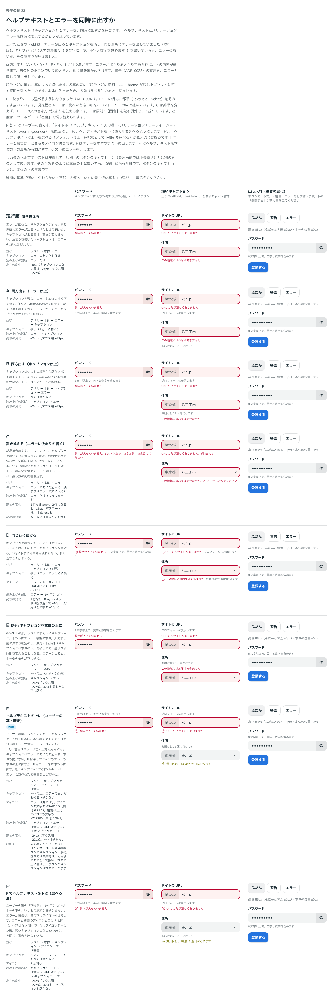

# 0041. ヘルプテキストとエラー・警告を同時に出す

- ステータス: Accepted
- 日付: 2026-09-13
- ラウンド: 後半 軸23

## 背景

これまでの Field は、エラーを渡すとキャプション（ヘルプテキスト）を消し、同じ場所にエラーを出していました。キャプションに入力の決まり（「8文字以上で、英字と数字を含めます」）を書いていると、エラーのあいだ、その決まりが見えません。

また、[ADR-0038](./0038-warning.md) で警告の色の役割は決まりましたが、入力欄の下の警告の文言は、部品がまだありませんでした。比較では、キャプションの場所に仮に組んでいました。

原則4（ラベル / 本体 / キャプションの3層）に関わります。原則4は、キャプションを「本体の下」としています【固定】。

## 候補

比較は Storybook の `Design Review/23 ヘルプテキストとエラー`（[`stories/axis-23-caption-error.stories.tsx`](../stories/axis-23-caption-error.stories.tsx)）です。列は3つです。

- **パスワード**: キャプションに入力の決まりがある欄。suffix にボタン
- **短いキャプション**: prefix 付きの TextField と Select
- **出し入れ（高さの変化）**: ふだん・警告・エラーを切り替えて、下の内容が動く量を測る

部品にない形は、ストーリーの中で組みました。各案の「読み上げの説明」は、Chrome が読み上げソフトに渡す説明を測ったものです。

| 案     | 内容                                                                                         | 並び                                            |
| ------ | -------------------------------------------------------------------------------------------- | ----------------------------------------------- |
| 現行版 | エラーが出ると、キャプションが消え、同じ場所にエラーが出る                                   | ラベル → 本体 → エラー                          |
| A      | 両方出す。エラーを本体のすぐ下に足し、キャプションはその下に動く                             | ラベル → 本体 → エラー → キャプション           |
| B      | 両方出す。キャプションは動かさず、その下にエラーを足す                                       | ラベル → 本体 → キャプション → エラー           |
| C      | 部品は今のまま。エラーの文に、キャプションの決まりを書き足す                                 | ラベル → 本体 → エラー（決まりを含む）          |
| D      | キャプションの行の頭に、アイコン付きのエラーを入れる。1行に収まれば高さは変わらない          | ラベル → 本体 → エラー＋キャプション（1行）     |
| E      | GOV.UK の形。キャプションとエラーを本体の上に置く。原則4【固定】を破る例外として並べた       | ラベル → キャプション → エラー → 本体           |
| F      | ユーザーの案（既定）。キャプションを本体の上に、アイコン付きのエラーか警告を本体のすぐ下に   | ラベル → キャプション → 本体 → アイコン＋エラー |
| F′     | F でキャプションを本体の下に置く形（選べる形）。キャプションは動かさず、その下にエラーを足す | ラベル → 本体 → キャプション → アイコン＋エラー |

- 1回目は、現行版と A〜E を並べました。警告の文言も、エラーと同じ場所に出しました
- 2回目に、ユーザーの案として F と F′ を足しました。エラーは丸の「!」、警告は三角のアイコンで見分けます
- F′ は、メモ「ヘルプテキストの位置はそのままで、ヘルプテキストの下にバリデーションエラーが増える」のとおり、B の並びにアイコンを足した形です

## 決定

**F を既定にし、F′ も選べるようにします。キャプションはエラー・警告のあいだも消さず、エラーと警告は本体の下の行に、アイコン付きで出します。**

| 項目                         | 決定                                                                                                                             |
| ---------------------------- | -------------------------------------------------------------------------------------------------------------------------------- |
| 並び（`captionPlacement`）   | `top`（既定・F）: ラベル → キャプション → 本体 → エラー・警告。`bottom`（F′）: ラベル → 本体 → キャプション → エラー・警告       |
| キャプション                 | エラー・警告のあいだも消さない。どちらの並びでも、位置は動かない                                                                 |
| 本体                         | エラー・警告が出ても動かない（F・F′ とも）                                                                                       |
| エラーの行                   | 丸の「!」（Phosphor の WarningCircle）＋文。アイコンも文字も `--color-danger`（`#BA012D`、白地 6.71:1）                          |
| 警告の行                     | 三角（Phosphor の Warning）＋文。アイコンも文字も `--color-fg-warning`（`#727200`、白地 5.09:1）                                 |
| アイコン                     | キャプションの行の高さと同じ 16px。文との間は 4px。線は Regular（文と並ぶため — [ADR-0018](./0018-icon-weight-by-context.md)）   |
| 欄の見た目                   | エラーは赤い枠線と淡い赤の塗りのまま（[ADR-0021](./0021-field-error-fill.md)）。警告は欄の見た目を変えない（送信を止めないため） |
| エラーと警告を両方渡したとき | 両方出す。エラーの行、その下に警告の行（下の追記。比べたときはエラーだけを出していた）                                           |
| 読み上げの説明               | 見た目の順。キャプション → エラー・警告。文字の prefix・suffix があるときは、その前（[ADR-0040](./0040-field-addon-rest.md)）    |
| Select のボトムシート        | 見出しには、これまでどおりラベルとキャプションだけを出す。エラー・警告はシートには出さない                                       |
| 原則4                        | 入力欄のヘルプテキスト（左寄せ）は、原則4のボタンのキャプション（参照画像では中央寄せ）とは別のものとして扱い、本体の上に置ける  |

使い方は次のとおりです。

- `<TextField label="パスワード" caption="8文字以上で、英字と数字を含めます" error="数字が入っていません" />`（F）
- `<TextField … captionPlacement="bottom" />`（F′）
- `<Select label="住所" caption="お届けは23区内だけです" warning="荒川区は、お届けが翌日になります" … />`（警告）

## 理由

ユーザーのメモです（比べた順）。

> ところで、ヘルプテキストとバリデーションエラーを同時に表示するかどうか迷っています。

> 23 についてはデフォルトを以下にすると良さそう？案に足してみてもらえますか？
>
> - タイトル
> - ヘルプテキスト
> - 入力欄
> - バリデーションエラーアイコン + バリデーションエラーテキスト（warning/danger）
>
> ヘルプテキストは上下を選べる（デフォルトは上、選択肢として下強制も選べる）が個人的には好みです。

> 原則4ですが、元イメージのボタンキャプションはセンタリングされており、今回のキャプションは左寄せになっているという違いがあります。なので、許容する認識です。ヘルプテキストが下の場合ですが、ヘルプテキストの位置はそのままで、ヘルプテキストの下にバリデーションエラーが増える、としたいです。

> F または F' を選べる形にしましょう！デフォルトは F とします。

以下は、メモと比較から読み取れることです。

- **決まりが見えたまま直せる**: キャプションはエラーのあいだも消えないので、「8文字以上で…」を読みながら直せます
- **入力する前に読める（F）**: キャプションがラベルのすぐ下にあるので、本体に入る前に読めます
- **本体が動かない**: F はエラーを本体の下に足すので、エラーが出ても本体の位置は変わりません。E はエラーを本体の上に出すので、本体が下に動きました
- **形でも見分ける**: エラーは丸の「!」、警告は三角です。赤とオリーブ色の違いだけに頼りません
- **下にも置ける（F′）**: キャプションを本体の下に置きたいときは、キャプションの位置はそのままで、エラー・警告がその下に増えます
- **原則4に沿う**: 原則4のキャプションは、参照画像ではボタンの下に中央寄せで置かれたものです。入力欄のヘルプテキストは左寄せで、別のものとして扱います。そのため、本体の上に置いても原則4の例外ではありません。ボタンのキャプションは、本体の下のままです

## 却下した案と理由

- **現行版（置き換える）**: エラーのあいだ、キャプションに書いた決まりが見えません
- **A（エラーが上）**: 選ばれませんでした。比較のときの説明では、エラーが出るとキャプションが1行分下に動く、としていました
- **B（キャプションが上）**: 並びは F′ に取り込みました。F′ は B にアイコンを足した形です
- **C（エラーに決まりを書く）**: 選ばれませんでした。比較のときの説明では、文が長くなって2行になることがあり、決まりのないキャプションはエラーのあいだ消える、としていました
- **D（同じ行に続ける）**: 選ばれませんでした。比較のときの説明では、折り返すと1行増える、としていました
- **E（キャプションとエラーを本体の上に）**: 選ばれませんでした。エラーが出ると、本体そのものが下に動きます

## 影響

- `tokens.css`: エラー・警告の行の `--field-message-icon-size`（`--leading-caption` と同じ 16px）と `--field-message-gap`（4px）を足しました。警告の役割のコメントを、入力欄の警告の文が使う形に直しました
- `src/components/Field.tsx`:
  - `captionPlacement`（`'top' | 'bottom'`、既定は `'top'`）と `warning` を足しました
  - DOM の順を見た目の順にしました（F ではキャプションが本体の前）
  - エラーは Base UI の `Field.Error`、警告は `Field.Description` で描きます。警告は説明につなぎますが、欄をエラーの状態にしません
  - エラー・警告の行には `data-slot="field-message"` と `data-kind`（`error`・`warning`）を付けます
  - キャプションとエラー・警告の id を、見た目の順で本体に渡します（`children` に関数を渡したとき）。表示や消える順によらず、説明の順が見た目の順になります
- `src/components/TextField.tsx`・`src/components/Select.tsx`: `captionPlacement` と `warning` を渡します。説明の順は、prefix・suffix → 渡された説明 → キャプション → エラー・警告です。Select は本体のボタンに `aria-describedby` を渡すようにしました
- `src/components/icons.tsx`: 丸の「!」（`WarningCircleIcon`）と三角（`WarningIcon`）を足しました。アイコンに `className` を渡せるようにしました（既定は `--size-icon`）
- `src/components/field-styles.ts`: エラー・警告の行（`message`）とアイコン（`messageIcon`）を足しました
- 比較のストーリー:
  - 既定で F に採用の印を付けます
  - F・F′ の行は、部品のまま描きます。現行版と A〜E は、比べたときの形をストーリーの中で組んでいます（現行版と C の「置き換える」形も、いまの Field にはないので、ストーリーの中で再現しています）
  - F・F′ の行を部品に替えても、見た目は比べたときと同じです。画素で比べると、差は細い帯の数十画素だけでした。同じページを 24px 下にずらしただけでも、同じ大きさの差が出ます（描く位置による差）
  - 現行版の行（ストーリーの中で再現した形）も、画素で比べて同じでした
- 軸 20 の比較のストーリー（[ADR-0038](./0038-warning.md)）: 警告の文言をキャプションの場所に仮に組んでいたので、その欄は `captionPlacement="bottom"` にして、比べたときの見た目（本体の下）のままにしました
- ほかの比較のストーリーでは、キャプションが本体の上に、エラーがアイコン付きになります。ADR の比較画像は比べたときの記録なので、撮り直していません
- ADR-0038 の「入力欄の下の警告の文言は、部品がまだない」は、この ADR で作りました。形は、比較で組んだもの（三角のアイコンと文をオリーブ色にし、欄の枠線と塗りは変えない）と同じです
- 測った値（Chrome の CDP、2026-09-13）:
  - `<TextField label="サイトの URL" prefix="https://" caption="プロフィールに表示します" error="URL の形が正しくありません" />`: 名前「サイトの URL」、説明「https:// プロフィールに表示します URL の形が正しくありません」。`captionPlacement="bottom"` でも同じ
  - 同じ欄で `warning="http:// のサイトかもしれません"`: 説明「https:// プロフィールに表示します http:// のサイトかもしれません」。エラーの状態にはならない（`invalid` は false）
  - `error` と `warning` を両方渡すと、エラーだけが出て、説明もエラーだけになる（下の追記で、両方出すように変えた）
  - Select（`prefix="東京都"`）: 説明「お届けは23区内だけです 荒川区は、お届けが翌日になります」（警告）・「お届けは23区内だけです この地域にはお届けできません」（エラー）。値は「東京都 荒川区」
  - エラー・警告が出たときの高さの変化: 指用 +24px、マウス用 +22px（行 16px ＋ 間 8px・6px）。本体の位置は F・F′ とも ±0px
  - エラー・警告の行: 高さ 16px、アイコン 16px、アイコンと文の間 4px。文字の色はエラー `rgb(186, 1, 45)`、警告 `rgb(114, 114, 0)`
  - Select のシートの見出しは、ラベルとキャプション（「お届けは23区内だけです」）だけを出す
- **分かっていること**:
  - エラー・警告が出ると、下の内容は1行分（指用 24px・マウス用 22px）動きます。本体は動きません（[ADR-0044](./0044-message-announce.md) で、行の高さを 0.2 秒で開き、閉じることにしました）
  - エラー・警告の行は、出たときに読み上げで知らせません（`aria-live` はない）。本体に入ったときに説明として読まれます（[ADR-0044](./0044-message-announce.md) で、欄を離れたときなどは polite で知らせ、送信したときはフォーカスを移すことにしました）
  - Select のシートには、エラー・警告を出しません。本体の下にあり、シートを閉じると見えます（[ADR-0044](./0044-message-announce.md) で、シートの見出しのヘルプテキストの下にも出すことにしました）
  - 原則4の書き方（入力欄のヘルプテキストとボタンのキャプションを分けること）は、`principles.md` で直します
- **追記（2026-09-13。ユーザーの返事）**: エラーと警告を両方渡したときは、両方出すことにしました。ユーザーのメモは「エラーと警告が両方あるなら、両方出したいですね」でした。
  - 並び: 本体の下に、エラーの行、その下に警告の行。`captionPlacement="bottom"` でも同じです（キャプションの下にエラー、その下に警告）
  - 行の間: `--space-field-gap`（指用 8px・マウス用 6px）。キャプションと本体の間、本体と行の間と同じ値です。アイコンと色は、1行のときと同じです
  - 読み上げの説明: キャプション → エラー → 警告。文字の prefix・suffix があるときは、その前です
  - 読み上げと動き（[ADR-0044](./0044-message-announce.md)）: 行ごとに箱（`aria-live="polite"`）を持ちます。知らせるのも、0.2 秒で開き閉じるのも、送信で出た行を知らせないのも、行ごとです
  - Select のシートの見出し（ADR-0044）: ヘルプテキストの下に、エラー → 警告の順で出します。行の間は、ヘルプテキストとの間と同じ 4px です。一覧（listbox）の説明も、ヘルプテキスト → エラー → 警告です
  - Form のエラーの一覧（ADR-0044）には、これまでどおりエラーだけを入れます
  - `src/components/Field.tsx`: エラーの箱と警告の箱を、1つずつ続けて置くようにしました。どちらも `data-slot="field-message"` で、`data-kind` は `error`・`warning` です（閉じても変わらない）。行の id は `…error`・`…warning` です
  - `src/components/Select.tsx`: シートの見出しの行を、エラーと警告の2つにしました（どちらも `data-slot="select-sheet-message"`）
  - 比較のストーリー: 「エラーと警告の両方」を足しました（F・F′ のパスワードと住所の Select、出し入れ）。候補のストーリーは変えていません
  - 測った値（Chrome の CDP、2026-09-13。「エラーと警告の両方」）:
    - パスワード（F）: 説明「8文字以上で、英字と数字を含めます 数字が入っていません よく使われるパスワードに似ています」、invalid true。F′ も同じ
    - 住所の Select（荒川区。error「郵便番号と合いません」）: 説明「お届けは23区内だけです 郵便番号と合いません 荒川区は、お届けが翌日になります」
    - 行の間（エラーのアイコンの下端から警告のアイコンの上端）: 指用 8px・マウス用 6px。文字の色は エラー `rgb(186, 1, 45)`、警告 `rgb(114, 114, 0)`
    - 高さの変化（ふだんから）: 両方で 指用 +48px・マウス用 +44px。1つなら +24px・+22px（これまでどおり）
    - 行ごとの動き（指用）: 両方を出して 60ms で、2つの箱はどちらも 17.6px。両方から警告だけにすると、エラーの箱だけが閉じる（60ms で 6.4px）
    - シート（390 × 844・指の操作）: 見出し 118px（1行のときは 98px）。エラーはヘルプテキストの 4px 下、警告はエラーの 4px 下
  - **分かっていること**: エラーから警告に替わるときは、エラーの箱が閉じ、警告の箱が開きます。警告の行が1行分上に滑り、下の内容は動きません（60ms で 14.6px と 9.4px、和は 24px のまま）。これまでは1つの箱で文を入れ替えていたので、その場で替わっていました

## 比較画像

F に採用の印を付けています。F・F′ の行は、部品（TextField・Select）で描いています。

