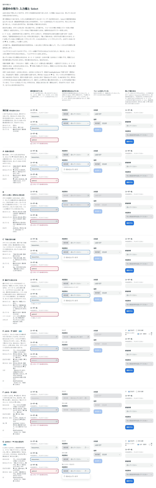
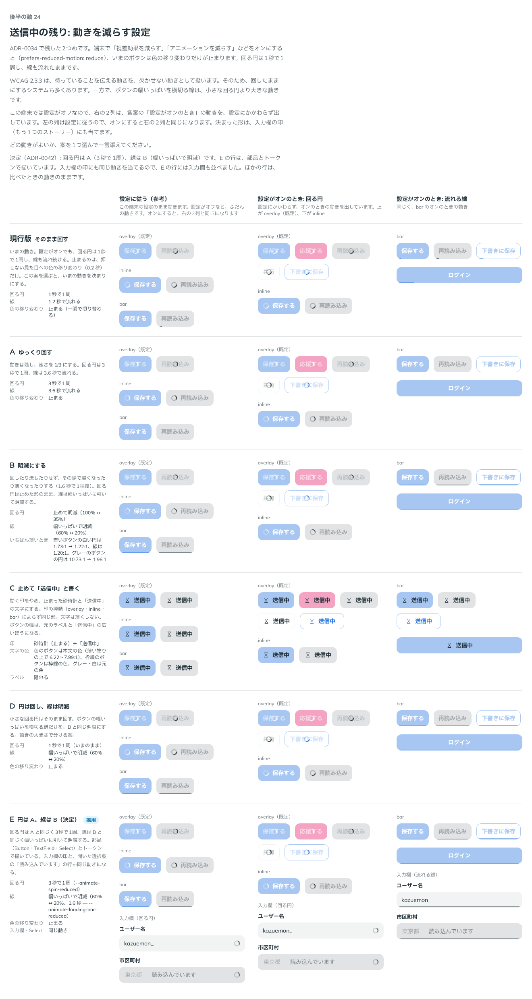

# 0042. 入力欄と Select の待っているあいだ（loading）と、動きを減らす設定

- ステータス: Accepted
- 日付: 2026-09-13
- ラウンド: 後半 軸24

## 背景

[ADR-0034](./0034-loading.md) でボタンの送信中が決まり、2つが残っていました。

- 入力欄と Select には、待っているあいだの見た目がありませんでした。待つ場面は3つあります。入力した値を確かめているとき（ユーザー名が使えるか）、選択肢を読み込んでいるとき（都道府県を選んだあとの市区町村）、フォーム全体を送っているときです
- 動きを減らす設定（`prefers-reduced-motion: reduce`）のとき、止まるのは色の移り変わりだけでした。回る円は1秒で1周し、線も流れたままでした

原則1（Disabled の表し方）と原則2（フォーカスとエラーの枠線）に関わります。

## 候補

比較は Storybook の `Design Review/24 入力欄と Select の送信中`（決めた時点のコミット `c206648`。`git checkout c206648 && pnpm storybook` で開けます）です。ストーリーは2つあります。比べたときは部品に入力欄の待っているあいだがなかったので、印と押せない見た目はストーリーの中で組み立てました。

### 入力欄と Select の送信中

列は4つです。値を確かめている（通常・フォーカス中・エラーのあとで確かめ直し）、選択肢を読み込んでいる（閉じたものと開いたもの）、フォームを送っている、触って確かめる（流れを実際に動かす）です。

| 案     | 内容                                                                                                                                    | 止めるか |
| ------ | --------------------------------------------------------------------------------------------------------------------------------------- | -------- |
| 現行版 | 何も変わらない。Select は、開くと空の選択肢が出る                                                                                       | 止めない |
| A      | 欄の右端に、ボタンと同じ回る円。Select では ▼ が回る円に替わる。開くと「読み込んでいます」の行                                          | 止めない |
| B      | ボタンの送信中と同じく、押せない欄の見た目にする。回る円は薄くしない。Select では ▼ が回る円に替わり、開けない                          | 止める   |
| C      | ボタンの C と同じ線を、欄の下端（枠線の内側）に流す                                                                                     | 止めない |
| D      | 欄の下の行（エラーの文が出る行）に、回る円と「確認しています」を出す                                                                    | 止めない |
| E      | B と同じく止める。Select は、プレースホルダの場所に「読み込んでいます」を出し、▼ を隠して、回る円を ▼ のあった場所に置く。開けない      | 止める   |
| F      | E で、▼ を隠さずに押せない文字の色に薄くする。回る円は薄い ▼ の左                                                                       | 止める   |
| G      | 止めない。都道府県を選ぶと、すぐに「選んでください」が出て開ける。開くと「読み込んでいます」の行。回る円は ▼ と置き換えず、▼ の左に置く | 止めない |

- 1回目は、現行版と A〜D を並べました
- メモ（印は回る円と線から選びたい、止めるか止めないかも選びたい、止めるときは ▼ を隠すか薄くしたい）を受けて、E・F・G を足しました。E・F・G は、回る円と流れる線の両方を並べ、触って確かめる列で切り替えられるようにしました
- どの案でも、都道府県を選ぶ前の市区町村は、いまと同じく押せない欄にし、プレースホルダの場所に理由（「先に都道府県を選んでください」）を出しました

### 動きを減らす設定

列は3つです。設定に従う（参考）と、設定がオンのときの動きを設定にかかわらず出した列（回る円・流れる線）です。

| 案     | 回る円                   | 流れる線                            |
| ------ | ------------------------ | ----------------------------------- |
| 現行版 | 1秒で1周（いまのまま）   | 1.2 秒で流れる（いまのまま）        |
| A      | 3秒で1周（ゆっくり）     | 3.6 秒で流れる（ゆっくり）          |
| B      | 止めて明滅（100% ↔ 35%） | 幅いっぱいに引いて明滅（60% ↔ 20%） |
| C      | 止めた砂時計と「送信中」 | 止めた砂時計と「送信中」            |
| D      | 1秒で1周（いまのまま）   | 幅いっぱいに引いて明滅（B と同じ）  |

## 決定

**入力欄と Select の待っているあいだは、止める（E）か止めない（G）かを選べるようにします。印は回る円を既定にし、流れる線も選べます。動きを減らす設定では、回る円はゆっくり回し（A）、線は明滅にします（B）。**

| 項目                            | 決定                                                                                                                                                                                                                                                                                                                                                          |
| ------------------------------- | ------------------------------------------------------------------------------------------------------------------------------------------------------------------------------------------------------------------------------------------------------------------------------------------------------------------------------------------------------------- |
| 止め方（`loadingBehavior`）     | `non-blocking`（既定・G）: 止めない。`blocking`（E）: 止める                                                                                                                                                                                                                                                                                                  |
| 止めないとき（G）               | 書き換えられる。TextField は右端（suffix の前）に回る円。Select はプレースホルダをそのまま出し、開ける。開くと、選択肢の最後に「読み込んでいます」の行（回る円＋文。選べない）を出す。回る円は ▼ の左に置き、▼ は替えない。間は 8px（ボタンの回る円とラベルの間と同じ）                                                                                       |
| 止めるとき（E）                 | 押せない欄と同じ見た目（塗り `#E1E3E4`・値の文字 `#A3A5A6` — [ADR-0026](./0026-disabled.md)）。書き換えられない・開けない。フォーカスは外さない。フォーカスの青とエラーの赤の枠線は残す                                                                                                                                                                       |
| 止めるときの Select             | プレースホルダの場所に「読み込んでいます」を、押せない欄の理由の文と同じ `--color-fg-subtle`（`#6E787D`）で出す。▼ を隠し、回る円を ▼ のあった場所に置く。読み込むと、ふだんのプレースホルダ（「選んでください」）と ▼ に戻る                                                                                                                                 |
| 印（`loadingIndicator`）        | `spinner`（既定）: 回る円。`bar`: 下端（枠線の内側）に流れる線。E・G のどちらでも選べる                                                                                                                                                                                                                                                                       |
| 印の見た目                      | 薄くしない（ボタンと同じ — ADR-0034）。回る円は ▼ と同じ `--color-fg-muted`（`#525C60`）。線は本文の色の 60%。速さはボタンと同じ（回る円は1秒で1周、線は 1.2 秒で流れる）                                                                                                                                                                                     |
| 読み込む前の Select             | Disabled にして、プレースホルダの場所に理由を出す（いまと同じ）                                                                                                                                                                                                                                                                                               |
| Disabled の ▼（`disabledIcon`） | `show`（既定）: プレースホルダの場所の文と同じ `#6E787D`（`--color-select-icon-disabled`。押せない塗りの上で 3.51:1）で出す。`hide`: 隠す。E・G のどちらでも使える                                                                                                                                                                                            |
| 押せない欄の文字の色            | プレースホルダの場所に出す文（ふだんのプレースホルダ・押せないときの理由・止めるときの「読み込んでいます」）と ▼ は `#6E787D`（`--color-fg-subtle`）。押せない文字の色 `#A3A5A6`（`--color-on-field-disabled`）は、選んだ値・入力した値だけに使う。値が入った押せない欄と、文を出している押せない欄を見分けるため。印（回る円・線）は薄くしない（上のとおり） |
| 読み上げ                        | 待っているあいだ、本体に `aria-busy`。止めるときは `aria-disabled` も付ける（TextField は `readOnly`、Select は `aria-readonly`）。読み込み中の行は `role="status"`                                                                                                                                                                                           |
| 止めるときの suffix のボタン    | 押せる（`FieldAddonButton`）。見た目もふだんのまま。値は書き換えられないが、パスワードの表示・非表示のように欄を操作するボタンは使える                                                                                                                                                                                                                        |
| 動きを減らす設定                | 回る円は3秒で1周（A）。線は流さず、幅いっぱいに引いて明滅する（濃さ 60% ↔ 20%、1.6 秒で1往復 — B）。ボタン・入力欄・Select の読み込み中の行の、すべての印に当てる。回る円がふわっと出る動き（`--animate-loading-in`、0.2 秒）はなくし、すぐに出す。色の移り変わりは、これまでどおり止める                                                                     |

使い方は次のとおりです。

- `<TextField label="ユーザー名" loading />`（G・回る円）
- `<Select label="市区町村" loading loadingBehavior="blocking" … />`（E）
- `<Select … loading loadingIndicator="bar" />`（流れる線）
- `<Select … disabled disabledIcon="hide" />`（押せないときの ▼ を隠す）

## 理由

ユーザーのメモです（比べた順）。

> 24 については、
>
> - ローディングは前の意思決定と同じく、スピナーとバーを選べるようにしたいです
> - disabled について、B のブロッキングか、A のノンブロッキングかを選択できるようにしたいです。ブロッキング（B）の場合、プレースホルダの位置にブロック理由を表示（A・Bと同じ）し、読み込み条件を満たした場合、プレースホルダの位置に「読み込んでいます」を表示、読み込みが完了したらプレースホルダテキスト（今は「選んでください」）となる。ノンブロッキングの場合、ブロック理由は同様、読み込み条件を満たした場合、プレースホルダテキストは既に表示され、開いた選択肢の位置に読み込み中表示を行います。また、アイコンが置換されるのではなく、スピナーはアイコンの左側に表示されます。

> ブロッキングの場合は、下向き矢印を非表示 or 薄くしたいです。案を足してもらえますか？

> E の円の回る位置はいまのでOKです。
> 読み込んでいます は、disabled なときと同じ見た目がいいので、今で OK です。
> ブロッキングの場合はEで、ノンブロッキングの場合はGで。
> どちらも共通で、ローディング前の disabled の時に下向き三角を非表示にできる（デフォルトはdisabledテキストカラーで表示）ようにしたいです。
> loading は、スピナーがデフォルトで行きます。（スピナー全体こちらで）
> 動きを減らす設定は、円はAのゆっくり案、バーは明暗かなと思いました。

> 既定はGでおっけーです。

> なるほど、disabled な選択肢と、選択済み選択肢が disabled な場合で区別がつかなくなる可能性があるのですね。すべて 6E787D に揃えたいです。

決めたあとに、「分かっていること」に残した2つへのメモです（2026-09-13）。

> 待っている間も suffix は押せていいと思います

> 動きを減らす設定ではふわっとでる動きはなしでよいです

以下は、メモと比較から読み取れることです。

- **止めるか止めないかを選べる**: 待っているあいだに触ってよいかは、場面によって違います。値を確かめる・選択肢を読み込むあいだは、打つ手を止めずに続けられるほうが軽く感じます。送っているあいだなど、書き換えられると困るときは止めます
- **止めるときは Disabled と同じ見た目（原則1）**: 「いまは触れない」を、すでにある Disabled の規則で伝えます。印だけは薄くせず、進んでいることを見せます（ボタンと同じ）
- **止めるときは ▼ を隠す（E）**: 開けないことを、▼ がないことで伝えます。回る円は ▼ のあった場所に置きます
- **止めないときは ▼ を替えない（G）**: 開けることを ▼ で伝えたまま、回る円を左に足します
- **印は回る円を既定に**: 回る円は場所を取らず、どの欄にも同じ形で置けます。線は、変化を最も小さくしたいときに選びます（ボタンの `bar` と同じ）
- **既定は止めない（G）**: 「既定はGでおっけーです。」打っている途中で入力を止めないことを優先します。止めるのは、使う側が場面に合わせて選びます
- **押せない欄のプレースホルダの場所の文と ▼ は `#6E787D` にそろえる**: 比べたときの E は、「読み込んでいます」を押せない文字の色 `#A3A5A6`（押せない塗りの上で 1.92:1）で組んでいました。3つめのメモの「今で OK」は、これを見てのものです。一方で、押せない Select の理由の文（「先に都道府県を選んでください」）は、ふだんのプレースホルダと同じ `#6E787D`（3.51:1）で、決めたあとに ▼ も `#A3A5A6` にしていました。このままだと、プレースホルダの場所に文を出している押せない欄と、値を選んである押せない欄が、同じ色になって見分けにくくなります。これを示したところ、「すべて 6E787D に揃えたいです。」となりました。プレースホルダの場所に出す文と ▼ は `#6E787D` にし、`#A3A5A6` は選んだ値・入力した値だけに使います。▼ は 3.51:1 で、アイコンの基準（3:1）も満たします
- **動きを減らす設定**: 回る円は小さな動きなので、ゆっくりにして残し、待っていることを伝え続けます（WCAG 2.3.3 は、待っていることを伝える動きを欠かせない動きとして扱います）。線は幅いっぱいを横切る大きな動きなので、流さずに、その場の明滅にします
- **ふわっと出る動きもなくす**: 濃さだけの小さな動きですが、設定がオンなら要りません。「動きを減らす設定ではふわっとでる動きはなしでよいです」。回る円はすぐに出て、そのあとはゆっくり回ります
- **止めているあいだも suffix のボタンは押せる**: 止めるのは値の書き換えです。suffix に置くボタンは、パスワードの表示・非表示のように欄そのものを操作するものに限っています（[ADR-0024](./0024-neutral-button.md) の追記）。値を変えないので、待っているあいだも使えます。「待っている間も suffix は押せていいと思います」

## 却下した案と理由

入力欄と Select の送信中:

- **現行版（何も変わらない）**: 待っていることが見えず、Select は開くと空の選択肢が出ます。E・G が選ばれました
- **A（▼ を回る円に替える）**: 止めない形は G になりました。「アイコンが置換されるのではなく、スピナーはアイコンの左側に表示されます」
- **B（止める・▼ を回る円に替える）**: 止める形のもとにしました。E は、B に ▼ の扱いとプレースホルダの文を足した形です
- **C（下端に流れる線）**: 線は、印の選択肢（`bar`）として取り込みました。「スピナーとバーを選べるようにしたいです」
- **D（欄の下に知らせる）**: 選ばれませんでした。メモでは、読み込み中の表示は「プレースホルダの位置」と「開いた選択肢の位置」に出します
- **F（▼ を薄くする）**: 「ブロッキングの場合はEで」

動きを減らす設定:

- **現行版（そのまま回す）**: 「円はAのゆっくり案、バーは明暗」
- **A の線（3.6 秒で流す）・B の回る円（止めて明滅）**: 回る円は A、線は B を組み合わせました
- **C（砂時計と「送信中」）・D（円は1秒のまま回し、線は明滅）**: 「円はAのゆっくり案、バーは明暗」

## 影響

- `tokens.css`: 動きを減らす設定の動きとして、`--animate-spin-reduced`（3秒で1周）・`--animate-loading-bar-reduced`（1.6 秒で1往復）と `@keyframes loading-bar-pulse`（濃さ 60% ↔ 20%）を足しました。押せない Select の ▼ の色として `--color-select-icon-disabled`（`--color-fg-subtle`、`#6E787D`）を足しました
- **後から来たメモのあと（動きを減らす設定の、ふわっと出る動き）**:
  - `tokens.css`: 動きを減らす設定では、`--animate-loading-in` を `none` に上書きします（`@media (prefers-reduced-motion: reduce)` の中の `:root`。`@theme` の中には `@media` を書けないため）。これを使う印は、どれもすぐに出ます
  - `src/components/Loading.tsx`: コメントだけです。`src/components/Button.tsx` は変えていません（overlay は `animate-loading-in` のまま、トークンの上書きで動きがなくなります）
  - いま、この動きを使うのはボタンの overlay だけです。入力欄の回る円と Select の読み込み中の行には、もともとふわっと出る動きはありません
  - 比較画像は、動きが終わってから撮るので変わりません
- `src/components/Loading.tsx`（新規）: 回る円（`Spinner`）と流れる線（`LoadingBar`）を、Button から移して共有にしました。動きを減らす設定では、回る円は `--animate-spin-reduced`、線は幅いっぱいで `--animate-loading-bar-reduced` にします。比較のストーリーが印を探すクラス名（`animate-spin`・`animate-loading-bar`）は変えていません
- `src/components/Button.tsx`: 印を `Loading.tsx` から使うようにしました。ふだんの見た目は変わりません。変わるのは、動きを減らす設定のときの動きだけです
- `src/components/Field.tsx`:
  - 型 `FieldLoadingBehavior`（`'blocking' | 'non-blocking'`）と `FieldLoadingIndicator`（`'spinner' | 'bar'`）を足しました
  - 欄の右端の回る円（`FieldSpinner`）と、下端の線（`FieldLoadingBar`、本体の角丸で切り抜く）を足しました
  - `Field` に `loading`・`loadingBehavior` を足しました。待っているあいだ、外枠に `data-loading`（`blocking` か `non-blocking`）を付けます
- `src/components/field-styles.ts`: 止めているあいだの本体の見た目を足しました。塗りのトークン（`--color-field`・`--color-field-hover`・`--color-field-focus`・`--color-field-invalid`）を本体の中で押せない塗りに差し替えるので、hover・フォーカス・開いている・エラーのときも押せない塗りになります。枠線の色は変えません。文字は `--color-on-field-disabled`、カーソルは待っている形（`progress`）です
- `src/components/FieldAddon.tsx`: 止めているあいだは、文字の prefix・suffix も押せない文字の色にします（エラーの色より優先）
- `src/components/TextField.tsx`: `loading`・`loadingBehavior`（既定 `non-blocking`）・`loadingIndicator`（既定 `spinner`）を足しました。印は input と suffix のあいだに置きます（prefix・suffix が最初と最後の子のまま）。止めているあいだは `readOnly` と `aria-disabled` を付け、`disabled` 属性は付けません（フォーカスが外れない）
- `src/components/Select.tsx`:
  - `loading`・`loadingBehavior`（既定 `non-blocking`）・`loadingIndicator`（既定 `spinner`）・`loadingText`（既定「読み込んでいます」）・`disabledIcon`（既定 `show`）を足しました
  - 止めるときは、Base UI の `readOnly`（値を変えられない）に加えて、開閉を閉じたままに固定します。Base UI の `readOnly` だけでは開けてしまうためです
  - 読み込み中の行は、選択肢の一覧（`role="listbox"`）の中ではなく、そのすぐ下に置きます。一覧の中には選択肢しか置けないためです。見た目（高さ・左の余白・上下の余白）は、比べたときの行と同じです
  - プレースホルダの場所の文は、止めるとき（`loadingText`）も `--color-fg-subtle` にしました。押せないときの ▼ は `--color-select-icon-disabled` です（どちらも `#6E787D`）。選んだ値は、これまでどおり押せない文字の色です
- **Disabled の ▼ の色**: これまで、押せない Select の ▼ は `--color-fg-muted`（`#525C60`）のままでした（押せない文字の色になっていたのは本体の文字だけでした）。メモの「デフォルトはdisabledテキストカラーで表示」に合わせて、いったん `--color-on-field-disabled`（`#A3A5A6`）にしました。そのあとのメモ「すべて 6E787D に揃えたいです。」を受けて、プレースホルダの場所の文と同じ `--color-select-icon-disabled`（`#6E787D`）にしました。軸 08・17 の比較のストーリーでは、押せない Select の ▼ だけが `#525C60` から `#6E787D` に変わります。ADR-0026・ADR-0035 の比較画像は比べたときの記録なので、撮り直していません（▼ は `#525C60` のまま）
- **止めるときの「読み込んでいます」の色**: 比べたときも、決めた直後の部品も、押せない文字の色（`#A3A5A6`）でした。いまは、押せない欄の理由の文と同じ `--color-fg-subtle`（`#6E787D`）です。Select のプレースホルダの場所の文は、ふだんも押せないときも止めるときも、すべてこの色になりました。押せない文字の色は、選んだ値だけに残ります。止めるときの TextField に入力した値も値なので、`#A3A5A6` のままです
- `design/stories/Comparison.tsx`: 採用の印（`pick`）を、カンマで区切って2つ以上付けられるようにしました（例: `E,G`）。1つのときの動きは変わりません
- 比較のストーリー:
  - 入力欄と Select の送信中: 既定で E と G に採用の印を付けます。E・G の行は、部品の `loading` で描きます。「フォームを送っている」の列だけは、部品にまだない形（欄を止めて、印はボタンだけ）なので、比べたときの組み立てのままです。ほかの行も、比べたときの形をストーリーの中で再現しています。E の「読み込んでいます」と、どの行でも都道府県を選ぶ前の市区町村（押せない欄）の ▼ は、部品の色（`#6E787D`）になります。F の「読み込んでいます」と薄い ▼ は、比べたときの `#A3A5A6` のままです。E の仕様の文とストーリーの説明の色も `#6E787D` に直しました
  - 触って確かめる列の E・G に、押せないときの ▼（出す・隠す）の切り替えを足しました
  - 動きを減らす設定: 決まった形を E（「円は A、線は B（決定）」）として足し、既定で採用の印を付けます。E の行は、部品とトークンで描き、入力欄も並べました。ほかの行は、設定がオンでも比べたときの動きになるよう、ストーリーの中で部品の動きを戻しています
- `design/tools/capture-story.mjs`: 比較画像は動きを減らす設定をオンにして撮るので、この ADR のあとは送信中の印の形も変わります（線は幅いっぱいの明滅）。ふだんの動きの印を撮れるよう、`--motion normal` を足しました（既定は `reduce` のまま）。ADR-0034 の比較画像は撮り直していません
- ADR-0034 の「分かっていること」に残した2つ（動きを減らす設定と、入力欄や Select の送信中）は、この ADR で決めました
- 測った値（Chrome の CDP、2026-09-13。マウス用の寸法）:
  - E の TextField（止める）: 塗り `rgb(225, 227, 228)`、文字 `rgb(163, 165, 166)`、カーソル `progress`、`readOnly`・`aria-disabled="true"`・`aria-busy="true"`。枠線はフォーカス中 `rgb(36, 116, 223)`、エラー `rgb(186, 1, 45)` のまま。回る円 `rgb(82, 92, 96)`・濃さ 1。確かめているあいだもフォーカスは外れない
  - E の Select（止める）: 「読み込んでいます」`rgb(110, 120, 125)`（塗り `rgb(225, 227, 228)` の上。決めた直後は `rgb(163, 165, 166)`）、▼ は隠れ、回る円は ▼ のあった場所。`aria-busy="true"`・`aria-disabled="true"`・`aria-readonly="true"`。押しても開かない（`aria-expanded="false"`）。読み込むと「選んでください」（`rgb(110, 120, 125)`）と ▼（`rgb(82, 92, 96)`）に戻る
  - G の TextField（止めない）: 塗りはふだん `rgb(242, 244, 244)`、エラー `rgb(254, 242, 241)` のまま。書き換えられ、`aria-busy="true"`
  - G の Select（止めない）: 「選んでください」がすぐ出る。回る円と ▼ の間 8px。開くと、一覧の下に `role="status"` の「読み込んでいます」の行（高さ 40px、左の余白 12px、文字 `rgb(82, 92, 96)`。一覧の中の選択肢は 0 個）。浮かぶ部分の高さ 50px
  - 線: 高さ 2px、本体の下端から 2px（枠線の内側）、本文の色 `rgb(31, 47, 55)` の 60%
  - 押せない Select の ▼: 既定 `rgb(110, 120, 125)`（決めた直後は `rgb(163, 165, 166)`）。`disabledIcon="hide"` で隠れる
  - 押せない欄の文字（後から来たメモのあと）: 押せない Select のプレースホルダの場所の理由の文 `rgb(110, 120, 125)`、選んだ値（軸 08 の「お仕事のご相談」）`rgb(163, 165, 166)`、▼ `rgb(110, 120, 125)`。止めるときの TextField に入力した値 `rgb(163, 165, 166)`。F の行の「読み込んでいます」と薄い ▼ は `rgb(163, 165, 166)`（比べたときのまま）
  - 動きを減らす設定（200ms ごとに測った）: ボタンと入力欄の回る円は 1周 2.97〜2.98 秒（ふだんは 0.99 秒）。線は幅いっぱい（ボタン 80px のうち 80px、入力欄 303px のうち 303px）で、濃さが 0.20 → 0.60 → 0.20 と 1.6 秒で1往復。ふだんは幅 40% で流れる
  - 画素で比べた差（動きを止めて撮った）: 軸 16（ボタンの送信中）・19・23 の比較のストーリーは差なし。軸 08・17 は、押せない Select の ▼ の色だけ
  - E・G の行を部品に替えても、見た目は比べたときと同じです。行ごとに画素で比べると、部品の列の差は数十〜百数十画素（最大 51/255）で、文字の縁だけでした。列の見出しの注記が1行増えて、行が 32px 下にずれたための差です（描く位置による差 — ADR-0041 と同じ）。名前の列は「採用」の印の分だけ変わります。この比較は後から来たメモの前に取ったもので、いまは E の「読み込んでいます」と押せない ▼ が `#6E787D` になっています
  - 動きを減らす設定のストーリーの、比べた行（現行版〜D）も、画素で比べて同じでした（差は文字の縁だけ）
  - ふわっと出る動き（後から来たメモのあと）: 軸 16 の実装した Button の overlay を、出た瞬間から測りました。設定がオンでは `--animate-loading-in` が `none` で、最初のコマから濃さ 1 です。オフでは濃さが 0 → 0.61（50ms）→ 0.88（100ms）→ 0.98（150ms）→ 1（200ms）で、これまでどおりです。軸 24 のストーリーで `loading-in` の動きは、ボタンの印の 8 個だけでした（設定がオンで 0 個）
  - 止めているあいだの suffix のボタン: 押せない状態を受け取るのは欄の `disabled` からだけで、止めているあいだは受け取りません（`FieldAddonDisabled`）。そのため押せて、見た目もふだんのままです
- **分かっていること**:
  - フォーム全体を送っているあいだの形（欄を止めて、印はボタンだけ）は、部品にまだありません。`loading` を渡すと、欄にも必ず印が出ます。フォーム全体の「待っている」を欄に配る仕組み（Provider など）もまだなく、欄ごとに `loading` を渡します
  - 読み込み中の行は、浮かぶ選択肢の高さの上限（[ADR-0037](./0037-select-sheet.md)）の計算に入りません。選択肢が多いまま読み込むと、行の分だけ高くなります
  - シートで読み込み中の行を出すときは、浮かぶ選択肢と同じ行を一覧の下に置き、下端の安全領域の分をこの行の下に空けます。シートでの見た目は比べていません
  - 読み込み中の行は、開いたときに一緒に出るので、読み上げソフトによってはすぐには知らせません。本体の `aria-busy` と合わせて伝えます

## 比較画像

入力欄と Select の送信中です。E と G に採用の印を付けています。E・G の行は、部品（TextField・Select）で描いています。

動きを減らす設定です。E に採用の印を付けています。E の行は、部品とトークンで描いています。動きの比較なので、静止画には回る円の角度と線の濃さの1コマだけが写ります。

