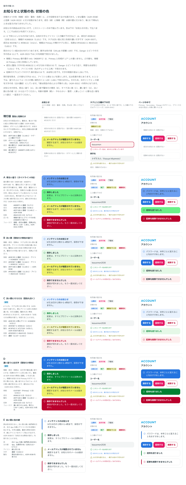
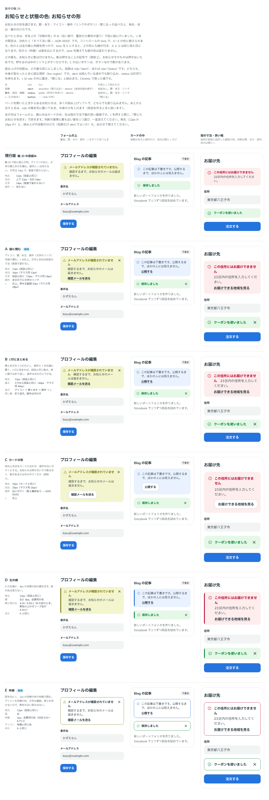

# 0043. お知らせと状態の色

- ステータス: Accepted
- 日付: 2026-09-13
- ラウンド: 後半 軸25

## 背景

状態の色（情報・成功・警告・危険）のうち、役割があったのは警告（[ADR-0038](./0038-warning.md)）と危険（[ADR-0023](./0023-danger-color.md)）だけでした。成功（緑）と情報（青）は値の層（`--palette-success-*`・`--palette-info-*`）にだけあり、軸 20 で尋ねたときは答えがありませんでした。

お知らせの部品もありませんでした。ADR-0038 では、お知らせを黄色の塗りに濃紺の文字で仮に組みました。お知らせ用の面・文字・アイコンの役割を塗りのトークンと分けるかは、部品を作るときに決めることにしていました。

原則1（影）、原則5（角丸）、原則6（色の使い方）、原則12（面用と前景用の2段）に関わります。

## 候補

比較は Storybook の `Design Review/25 お知らせと状態の色`（[`stories/axis-25-notice.stories.tsx`](../stories/axis-25-notice.stories.tsx)）です。ストーリーは2つあります。比べたときはお知らせの部品がなかったので、ストーリーの中で組みました。色は、役割のトークンを行ごとに上書きして作りました。

### 状態の色

列は3つです。お知らせ（上から情報・成功・警告・危険）、タグと入力欄の下の行、ページの中（ボタンやブランドの水色の見出しの隣）です。

| 案     | 内容                             | 情報                                        | 成功                               | 警告                                 | 危険                               |
| ------ | -------------------------------- | ------------------------------------------- | ---------------------------------- | ------------------------------------ | ---------------------------------- |
| 現行版 | 警告と危険だけ                   | 役割なし                                    | 役割なし                           | `#EFF16B` に濃紺（11.49:1）          | ボタンと入力欄の赤だけ             |
| A      | 明るい塗り（値の層の 500）       | `#6B9FF1` に濃紺（5.17:1）                  | `#6BF188` に濃紺（9.58:1）         | `#EFF16B` に濃紺                     | `#BA012D` に白（6.71:1）           |
| B      | 淡い面。警告だけ黄色の塗り       | `#E9F2FE` に濃紺。アイコンだけ青            | `#E5F8E7` に濃紺。アイコンだけ緑   | `#EFF16B` に濃紺                     | `#FEEDED` に濃紺。アイコンだけ赤   |
| C      | 淡い面にそろえる（警告も淡く）   | `#E9F2FE` に題とアイコン `#196BD6`          | `#E5F8E7` に題とアイコン `#008132` | `#F3F5CE` に題とアイコン `#727200`   | `#FEEDED` に題とアイコン `#BA012D` |
| D      | 濃い塗りに白文字。警告だけ黄色   | `#2474DF`（Primary）に白（4.53:1）          | `#008132` に白（5.02:1）           | `#EFF16B` に濃紺                     | `#BA012D` に白（6.71:1）           |
| E      | 白い面に色の線（警告も黄色なし） | 白い面に、左の 4px の線とアイコン `#196BD6` | 同じ形で `#008132`                 | 同じ形で `#727200`（黄色を使わない） | 同じ形で `#BA012D`                 |

- E の面は白に細い境界線 `#DEE0E1`、文字は濃紺（13.82:1）です。線とアイコンは白地で 5.02〜6.71:1 です
- C の本文は濃紺で、淡い面の上で 12.20〜12.44:1 です。題とアイコンの色は、淡い面の上で 4.52〜5.93:1 です
- A〜E で同じにしたものがあります。白地の文字とアイコンは、成功が `#008132`（白地 5.02:1）、情報が `#196BD6`（5.10:1）です。タグは淡い面に同じ色相の濃い文字です（[ADR-0007](./0007-tag-color.md)）
- 見分けにくい組み合わせが3つあります。値の層の Info（`#6B9FF1`）は Primary と色相が 1.7° しか違わないので、どの案も情報は Primary と同じ色相にしました。成功と警告の文字の色（`#008132` と `#727200`）は、色の差が 9.5（OKLab の距離 ×100）、明度の比が 1.02:1 で、アイコンの形で見分けます。危険のタグとピンクのタグは、面の差が 0.6 です
- A と D では、塗りの上にフォーカスの青い線を引くと見えません。そのため、中のリンクと × の線を文字の色にして組みました

### お知らせの形

列は3つです。フォームの上（警告。題・本文・操作・× をすべて持つ）、カードの中（情報は本文と操作、成功は題と ×）、指の寸法で幅の狭い画面です。色は状態の色の B で仮に組み、コントロールの tone で A〜E に替えられるようにしました。

| 案     | 内容                                                          | 角丸 | 余白                  | 操作                   |
| ------ | ------------------------------------------------------------- | ---- | --------------------- | ---------------------- |
| 現行版 | 軸 20 の仮組み。アイコンの右に題と本文。文字は 14px のまま    | 12px | 上下 12px・左右 16px  | 持たない（× も）       |
| A      | 縦に積む。× は右上。文字と余白は部品の寸法（密度で変わる）    | 12px | 16px（マウス用 12px） | 本文の下に文字のリンク |
| B      | 1行にまとめる。1行なら部品と同じ高さ                          | 12px | 部品と同じ            | 右端に文字のリンクと × |
| C      | カードの形                                                    | 16px | 20px（マウス用 16px） | 白いボタン             |
| D      | A の左端に、4px の状態の色の線                                | 12px | A と同じ              | A と同じ               |
| E      | 枠線。白い面を 1px の状態の色の枠線で囲む。アイコンも枠線の色 | 12px | A と同じ              | A と同じ               |

- どの案も、お知らせに影を付けませんでした（原則1）。C の白いボタンだけ、ボタンなので影があります
- 読み上げの役割は、どの案も同じにしました。危険は `role="alert"`、ほかは `role="status"` です。× は role の外に置き、「閉じる」と読みます

## 決定

**状態の色は C（淡い面）を既定にします。D（濃い塗り）と、形の E（枠線）も選べます。形は A（縦に積む）です。操作には、C のように白いボタンも置けます。余白は A のままです。**

| 項目                   | 決定                                                                                                                                                     |
| ---------------------- | -------------------------------------------------------------------------------------------------------------------------------------------------------- |
| 見た目（`appearance`） | `soft`（既定・色の C）、`filled`（色の D）、`outline`（形の E）                                                                                          |
| `soft`                 | タグと同じ淡い面（ADR-0007 の塗り方）。題とアイコンは同じ色相の濃い色、本文は濃紺                                                                        |
| `filled`               | 白文字が載る濃い塗り。警告だけは黄色の塗りに濃紺（ADR-0038）。題・本文・アイコンは同じ色                                                                 |
| `outline`              | 白い面に 1px の状態の色の枠線。アイコンも枠線の色、題と本文は濃紺                                                                                        |
| 形                     | アイコンの右に、太字の題・本文・操作を縦に積む。× は右上                                                                                                 |
| 角丸                   | 12px（部品と同じ。`--notice-radius`）                                                                                                                    |
| 余白                   | 部品の左右の余白（`--space-control-x`。指用 16px・マウス用 12px）。アイコンと文の間は、そこから 4px 引いた値（12px・8px）                                |
| 文字                   | 部品と同じ（指用 16px・行 24px、マウス用 14px・行 20px）                                                                                                 |
| アイコン               | 情報は丸の「i」、成功は丸のチェック、警告は三角、危険は丸の「!」。文と並ぶので Regular（[ADR-0018](./0018-icon-weight-by-context.md)）                   |
| 操作（`actions`）      | 本文の下に 6px 空けて置く。白いボタン（`<Button color="surface">`）か文字のリンク。並べるときの間は 8px。リンクは、お知らせの文字の色の太字              |
| ×（`onClose`）         | 右上。押せる範囲は行の高さ＋8px（指用 32px・マウス用 28px）。アイコン単体なので Bold。hover と押下は平らな要素と同じ（[ADR-0027](./0027-flat-press.md)） |
| 影                     | 付けない（原則1）。影があるのは、中の白いボタンだけ                                                                                                      |
| フォーカスの線         | `soft` と `outline` の中は青のまま（[ADR-0031](./0031-focus-visible.md)）。`filled` の中は、お知らせの文字の色（白か濃紺）                               |
| 読み上げ               | 題・本文・操作を role の箱に入れる。危険は `alert`、ほかは `status`。× は箱の外に置き、「閉じる」と読む                                                  |

色は次のとおりです。

| 色   | `soft` の面                         | 題・アイコン（`soft`） | 本文（`soft`）  | `filled`                           | 枠線・アイコン（`outline`） |
| ---- | ----------------------------------- | ---------------------- | --------------- | ---------------------------------- | --------------------------- |
| 情報 | `#E9F2FE`（`--palette-blue-50`）    | `#196BD6`（4.52:1）    | 濃紺（12.23:1） | `#2474DF`（Primary）に白（4.53:1） | `#196BD6`（白地 5.10:1）    |
| 成功 | `#E5F8E7`（`--palette-success-50`） | `#008132`（4.52:1）    | 濃紺（12.44:1） | `#008132` に白（5.02:1）           | `#008132`（白地 5.02:1）    |
| 警告 | `#F3F5CE`（`--palette-warning-50`） | `#727200`（4.55:1）    | 濃紺（12.34:1） | `#EFF16B` に濃紺（11.49:1）        | `#727200`（白地 5.09:1）    |
| 危険 | `#FEEDED`（`--palette-red-75`）     | `#BA012D`（5.93:1）    | 濃紺（12.20:1） | `#BA012D` に白（6.71:1）           | `#BA012D`（白地 6.71:1）    |

- **情報は Primary と同じ色相（青）です。** 値の層の Info（`#6B9FF1`・`#E1ECFC`）には役割を当てません。情報の淡い面と文字は、青のタグと同じ値です
- **警告のお知らせの既定は、淡い黄色になります。** ADR-0038 の「お知らせは黄色の塗りに濃紺」を変えました。黄色の塗りは `filled` の見た目として残ります。塗り・白地の文字・タグ・入力欄の下の警告の文の値は、ADR-0038 のままです
- **フォーカスの線は、`filled` の中だけ文字の色にします。** 「線は部品の色によらず青の1色」（ADR-0031）の例外です。青い線は、情報・成功・危険の塗りの上で 1.00〜1.48:1 しかなく、見えません。警告の黄色の上は青でも 3.76:1 ありますが、ほかの塗りとそろえて濃紺にします。淡い面の上の青は 4.00〜4.08:1 なので、`soft` の中は青のままです
- お知らせの中のリンクは、`color` の指定によらず、お知らせの文字の色になります。濃い塗りの上でも読めるようにするためです

使い方は次のとおりです。

- `<Notice tone="success" title="保存しました" onClose={…} />`
- `<Notice tone="warning" title="メールアドレスが確認されていません" actions={<Button color="surface">確認メールを送る</Button>}>確認するまで、お知らせのメールは届きません。</Notice>`
- `<Notice tone="danger" appearance="filled" … />`（濃い塗り）
- `<Notice tone="info" appearance="outline" actions={<Link href="…">詳しく見る</Link>}>…</Notice>`（枠線）

## 理由

ユーザーのメモです。

> 25 については C がデフォルト、D も選べるようにしたいです。あと、お知らせの形で言及されていた、アウトラインタイプも選べたら嬉しですね。warning の原則については、こちらに変更で良さそう。
> お知らせの形は、めっちゃ A が好みです。C のようにボタンも置けるようにはしたいですが、余白類は A に揃える形で。

以下は、メモと比較から読み取れることです。

- **淡い面を既定に（C）**: 4つの色が、タグと同じ淡い面という1つの作りにそろいます（判断の基準「整然」）。B のように警告だけが強い塗りになり、危険より目立つことがありません
- **濃い塗り（D）と枠線（E）も選べる**: 「D も選べるようにしたい」「アウトラインタイプも選べたら嬉しい」。どの場面でどれを使うかは、使う側が選びます。ボタンの `appearance`（`filled`・`outline`）と同じ名前にしました
- **警告は ADR-0038 から変える**: 「warning の原則については、こちらに変更で良さそう。」C の警告は、警告のタグと同じ淡い黄色の面にオリーブ色の題とアイコンです。すでにある警告の値の組み合わせで作れます
- **形は A**: 「めっちゃ A が好み」。文字と余白が部品の寸法なので、密度に合わせて変わります
- **ボタンも置けるが、余白は A**: 「C のようにボタンも置けるようにはしたいですが、余白類は A に揃える形で。」角丸 12px と余白は A の値で、操作の場所に白いボタンも置けるようにしました。ボタンは本文の下 6px（A の文字のリンクと同じ間）に置きます

## 却下した案と理由

状態の色:

- **現行版（警告と危険だけ）**: 成功と情報のお知らせを作れません
- **A（明るい塗り）**: 選ばれませんでした。情報の塗り `#6B9FF1` はブランドの水色 `#35B9FD` に近い（色の差 7.2）案でした
- **B（淡い面。警告だけ黄色の塗り）**: 選ばれませんでした。警告だけが強い塗りになり、危険より目立ちます
- **E（白い面に色の線）**: 色としては選ばれませんでした。塗りを持たない形は、形の E（枠線）として選べます

お知らせの形:

- **現行版（軸 20 の仮組み）**: 操作と × を持たず、文字が密度で変わりません
- **B（1行）・D（左の線）**: 選ばれませんでした
- **C（カードの形）**: 白いボタンを置けることは取り込みました。角丸 16px と余白 20px は採らず、A の値にそろえました
- **E（枠線）**: 見た目の選択肢（`outline`）として取り込みました

## 影響

- `tokens.css`:
  - 値の層: `--palette-success-50` を `#E1FCE7` から `#E5F8E7` に置き換えました（ほかの淡い面と同じ明度 0.96・彩度 0.03。旧値は明度 0.97・彩度 0.04 で、役割もありませんでした）。`--palette-success-700`（`#008132`）と `--palette-red-75`（`#FEEDED`）を足しました。`--palette-info-*` には、役割を当てないことを書き添えました
  - 役割の層: 白地の文字・枠線・アイコンとして `--color-fg-info`（`#196BD6`）・`--color-fg-success`（`#008132`）を足しました
  - 役割の層: お知らせの役割を足しました。`soft` は色ごとに `--color-notice-{tone}`（面）・`--color-on-notice-{tone}`（本文）・`--color-notice-{tone}-title`・`-icon`・`-ring`、`filled` は `--color-notice-{tone}-filled`・`--color-on-notice-{tone}-filled`・`--color-notice-{tone}-filled-ring`、`outline` は `--color-notice-outline`・`--color-on-notice-outline` と色ごとの `--color-notice-{tone}-line` です
  - 形のトークン `--notice-radius`（`--radius-control`）を足しました。余白とアイコンの間は密度で変わる値（`--space-control-x`）から部品の中で計算するので、トークンにしていません
  - これで ADR-0038 の「お知らせ用の役割を塗りのトークンと分けるか」に答えました。分けます。警告の `filled` は `--color-notice-warning-filled` が `--color-warning` を指します
- `src/components/Notice.tsx`（新規）: `tone`（`info`・`success`・`warning`・`danger`）、`appearance`（`soft`・`filled`・`outline`。既定は `soft`）、`title`、`children`（本文）、`actions`、`onClose` を持ちます。型 `NoticeTone`・`NoticeAppearance` も出します
- `src/components/icons.tsx`: `InfoIcon`（丸の「i」）と `CheckCircleIcon`（丸のチェック）を足しました。比較のストーリーで組んだ形と同じです
- [ADR-0038](./0038-warning.md): お知らせの既定を変えたことを追記しました
- [ADR-0031](./0031-focus-visible.md): 塗りのお知らせの中の線を文字の色にする例外を追記しました
- `principles.md`: 原則6の「Warning」と色の役割、原則1（お知らせに影を付けない）、原則5の角丸の表、決まった軸の表、後半の軸を改めます
- 比較のストーリー:
  - 状態の色は既定で C と D に、お知らせの形は既定で A と E に採用の印を付けます
  - 採用した行は部品で描きます。状態の色の C・D の行（お知らせの列とページの中の列）と、形の A・E の行です。部品の役割トークンは、ストーリーの中で上書きしていたトークンと同じ名前です。そのため、形の tone を切り替えると、部品の行も同じ色に変わります。tone を E（左の線と枠線）にしたときだけ、部品にない線を描くため、ストーリーの中の Notice に戻ります
  - 形の色の既定は、決めた C（淡い面）です。はじめは比べたときの既定（B。警告だけ黄色の塗り）のままにしていたので、形の比較画像の A の警告が黄色の塗りになっていました。既定を C に直し、形の比較画像を撮り直しました
  - ほかの行は、比べたときのストーリーの中の Notice のままです
  - 実装した Notice のストーリー（`実装した Notice`）を足しました。4色 × 3つの見た目を、題・本文・操作・× 付きで、マウス用と指用の寸法に並べます
- 測った値（Chrome の CDP、2026-09-13）:
  - `soft` の面: 情報 `rgb(233, 242, 254)`・成功 `rgb(229, 248, 231)`・警告 `rgb(243, 245, 206)`・危険 `rgb(254, 237, 237)`。題とアイコン: `rgb(25, 107, 214)`・`rgb(0, 129, 50)`・`rgb(114, 114, 0)`・`rgb(186, 1, 45)`。本文と × は `rgb(31, 47, 55)`
  - `filled` の面: `rgb(36, 116, 223)`・`rgb(0, 129, 50)`・`rgb(239, 241, 107)`・`rgb(186, 1, 45)`。文字・題・アイコン・リンク・× は白 `rgb(255, 255, 255)`、警告だけ `rgb(31, 47, 55)`
  - `outline`: 面は白、枠線は 1px で `outline` の表の色、アイコンも同じ色。題・本文・リンク・× は `rgb(31, 47, 55)`
  - 形: 角丸 12px。余白はマウス用 12px・指用 16px、アイコンと文の間は 8px・12px。文字は 14px/20px・16px/24px。アイコンは 16px・20px で、上から 14px・18px（1行目の中央）。× は 28px・32px で、上と右から 8px・12px（`outline` は枠線の分 1px 内側）。アイコンの線は Regular（16）、× は Bold（24）
  - 高さ（題・本文・リンクのとき）: マウス用 92px、指用 136px。白いボタンがあるとき 112px・156px。`outline` は枠線の分 2px 高い。ボタンの上端は本文の下端から 6px
  - 影: どの見た目も、お知らせの `box-shadow` は `none`。中で影があるのは白いボタン（`--shadow-raised`）だけ
  - フォーカスの線（本物の Tab キーで、24 のお知らせの中の 60 か所を順に測った）: `soft` と `outline` は 2px の `rgb(36, 116, 223)` を 2px 離して描く。`filled` は情報・成功・危険で `rgb(255, 255, 255)`、警告で `rgb(31, 47, 55)`。どれも `:focus-visible`
  - 読み上げ（`Accessibility.getFullAXTree`）: 24 のお知らせのうち、情報・成功・警告の 18 は `status`（live `polite`・atomic）、危険の 6 は `alert`（live `assertive`・atomic）。箱の名前は空で、題・本文・操作を中身として読む。24 の「閉じる」のボタンは、どれも live region の外
  - 390px の幅: 横にスクロールしない。お知らせは 342px の幅で1列に並ぶ
  - 採用した行を部品に替えても、見た目は比べたときと同じです。ストーリーの中の Notice で描いた画面と画素で比べると、状態の色の C・D の行は 595 画素・最大 2/255、形の A・E の行は 305 画素・最大 11/255 の差で、どちらも文字の縁だけでした。差はほかの行にはありません。はじめは部品の操作の行が 4px 高くなっていました。行を flex にしたため、文字のリンクの上下の余白（フォーカスの線のための 2px）が行の高さに入ったためです。文の中のリンクと同じく行の高さに数えないようにして、そろえました
- **分かっていること**:
  - タグの成功・情報・危険の色は、比べたときは決めていませんでした。あとで部品に足しました（下の追記）。情報のタグは Primary の青のタグと同じ値です。危険のタグの面は、ピンクのタグの面とほぼ同じです（色の差 0.6）
  - 入力欄の下の成功・情報の行（ADR-0041 の形）は作っていません。白地の文字の役割（`--color-fg-success`・`--color-fg-info`）はあります
  - 警告も `alert` にするかは、後から決めました。危険だけが `alert` です（下の追記の「危険だけ割り込む」）
  - 部品は、role の箱と中身を一緒に出します。あとから出すお知らせを多くの読み上げソフトで知らせるには、箱を先に置いておき中身だけを入れる必要があります。その仕組み（空の箱を置いておく部品など）はまだありません
  - `live={false}` で、role の箱を使わずに出せます。出したお知らせにフォーカスを移して読ませるとき（Form のエラーの一覧 — [ADR-0044](./0044-message-announce.md)）に使います
  - 黄色の塗り（`filled` の警告）と白地の比は 1.20:1 です。お知らせには影を付けないので、縁は付けていません。淡い面（白地 1.11〜1.13:1）と同じく、面の色だけで置きます
  - 操作の場所には、白いボタンと文字のリンクを置く前提です。枠線のリンクなど、ほかの部品は確かめていません
  - × の読み上げの名前は「閉じる」で固定です
- **追記（2026-09-13。後から尋ねたことへの返事）**: タグに状態の色を足しました。ほかは、決めたとおりで受け入れられました。ユーザーの返事です。

  > 状態のタグは欲しいです！
  > 情報は前の色合いでよいです
  > 成功と警告のいろ、そこまでちかいですか？これでいいかなと
  > filled でいいですね
  > お知らせの色合わせもよし
  > 警告の色は外れてなければおまかせします。
  - **状態のタグ**: 「状態のタグは欲しいです！」。`<Tag color>` に `info`・`success`・`danger` を足しました（`warning` は [ADR-0038](./0038-warning.md)）。面と文字は、`soft` のお知らせの面と題と同じ値です。比べたときに、ストーリーの中で上書きしていた値とも同じです
    - 情報: 面 `#E9F2FE`、文字 `#196BD6`（4.52:1）。Primary のタグと同じ値です
    - 成功: 面 `#E5F8E7`、文字 `#008132`（4.52:1）
    - 警告: 面 `#F3F5CE`、文字 `#727200`（4.55:1）。ADR-0038 のままです
    - 危険: 面 `#FEEDED`、文字 `#BA012D`（5.93:1）
    - 面と白地の比は、どれも 1.11〜1.13:1 です。ほかのタグ（1.13〜1.14:1）と同じです
  - **近い組み合わせは、そのまま受け入れました**:
    - 情報のタグは、Primary のタグと同じ値です。「情報は前の色合いでよいです」。見分けるのは文言だけです
    - 危険のタグの面は、ピンクのタグの面と色の差 0.6（比 1.01:1）です。文字どうしは色の差 8.4、明度の比 1.29:1 で、危険の赤のほうが暗く見えます
    - 成功と警告（「そこまでちかいですか？」）: 文字の `#008132` と `#727200` は、色相が 148° と 110° で違います。近いのは明度で、比は 1.02:1 です（色の差 9.5）。面どうしの色の差は 3.3 です。1型・2型の2色覚を真似て計算すると、文字の色の差は 2.9〜3.7 に縮みます。お知らせではアイコンの形（丸のチェックと三角）で、タグでは文言で見分けます。「これでいいかなと」なので、値は変えません
  - **`filled` の名前**: 「filled でいいですね」。濃い塗りの見た目の名前は、ボタンの `appearance` にそろえた `filled` のままです
  - **お知らせの中のリンクの色**: 「お知らせの色合わせもよし」。お知らせの中のリンクは、`color` の指定によらず、お知らせの文字の色の太字のままです（`soft` と `outline` は濃紺、`filled` は白か濃紺）
  - **塗りの警告のフォーカスの線**: 「警告の色は外れてなければおまかせします。」黄色の塗り（`filled` の警告）の中の線は、濃紺のまま（11.49:1）にします。青でも 3.76:1 で基準の 3:1 に届きますが、ほかの塗りと同じく文字の色にそろえます
  - **危険だけ割り込む（`alert`）**: 「危険だけ割り込み、というのは一般的ですか？」と尋ねられました。一般的な決まりではなく、部品集によって違うと答えました（MUI はどのお知らせも `alert`、Carbon は既定で `status`、GOV.UK は成功の知らせも `alert`）。そのうえで、いまの形を勧めました。W3C（ARIA の Alert のパターン）と MDN は、割り込む `alert` を、すぐに気づいてもらう必要がある急ぎの知らせだけに使うよう勧めているためです。ユーザーの返事は「危険だけ割り込みの件は、今おっしゃっていただいた形で良いです。」でした。危険は `role="alert"`、ほかの3つは `role="status"` のままで、部品は変えません
  - `tokens.css`: 役割の層に `--color-tag-info`・`--color-on-tag-info`（`--color-tag-primary`・`--color-on-tag-primary` を指す）、`--color-tag-success`・`--color-on-tag-success`（`--palette-success-50`・`--color-fg-success`）、`--color-tag-danger`・`--color-on-tag-danger`（`--palette-red-75`・`--color-danger`）を足しました。値の層は足していません
  - `src/components/Tag.tsx`: `color` に `info`・`success`・`danger` を足しました
  - 比較のストーリー:
    - 状態の色の「タグと入力欄の下の行」の列のタグを、部品（`<Tag color={tone}>`）で描くようにしました。ストーリーの中のタグの上書き（`--color-tag-{tone}`）は外しました。値は同じなので、見た目は変わりません。比較画像は撮り直していません
    - 実装したタグのストーリー（`実装した状態のタグ`）を足しました。利用者が選ぶ色（primary・secondary・neutral）・状態の色（info・success・warning・danger）・近い組み合わせの3行を、マウス用と指用の寸法に並べます
  - 測った値（Chrome の CDP、2026-09-13）:
    - 面と文字: 情報 `rgb(233, 242, 254)` に `rgb(25, 107, 214)`、成功 `rgb(229, 248, 231)` に `rgb(0, 129, 50)`、警告 `rgb(243, 245, 206)` に `rgb(114, 114, 0)`、危険 `rgb(254, 237, 237)` に `rgb(186, 1, 45)`。比較のストーリーの列でも同じ値です
    - 寸法: 文字はマウス用 11px・指用 12px、行 16px、太字。高さはどちらも 20px、左右の余白 8px、角丸は pill。ほかのタグと同じです
    - 390px の幅: 横にスクロールしない

## 比較画像

状態の色です。C と D に採用の印を付けています。C・D の行のお知らせの列とページの中の列は、部品（Notice）で描いています。

お知らせの形です。A と E に採用の印を付けています。A・E の行は、部品（Notice）で描いています。色は、決めた既定の C（淡い面）です。比べたときは B（警告だけ黄色の塗り）で組んでいました。

