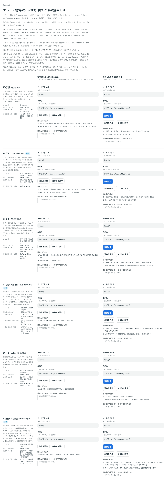
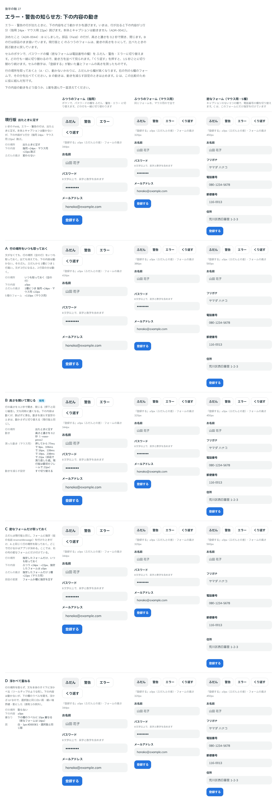
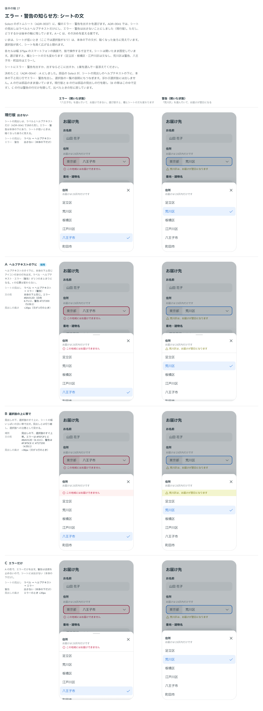
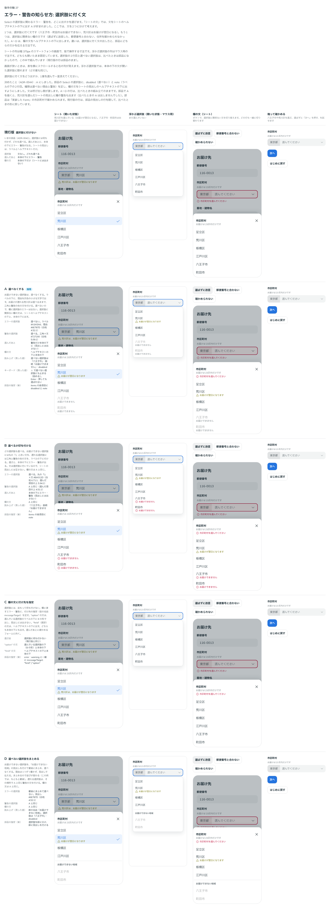

# 0044. エラー・警告の知らせ方（読み上げ、下の内容の動き、シートと選択肢の文）

- ステータス: Accepted
- 日付: 2026-09-13
- ラウンド: 後半 軸27（2回。シートの文と選択肢に付く文は2回目）

## 背景

[ADR-0041](./0041-caption-and-message.md) で、エラー・警告の行の並びと見た目が決まりました。そのとき、次の3つが残りました（ADR-0041 の「分かっていること」）。

- 行が出ても、読み上げで知らせない（`aria-live` がない）。本体に入ったときに、説明として読まれるだけ
- 行が出ると、下の内容が1行分（指用 24px・マウス用 22px）跳ぶ
- Select のボトムシートには、エラー・警告を出さない

この ADR で3つとも決めます。はじめの2つは1回目で決まりました。3つめは、2回目に「シートの文」と「選択肢に付く文」に分けて比べました。選択肢に関わる文（この地域にはお届けできない、など）と、選択肢に関係ない欄の文（市区町村を選んでください、など）では、出し方が違ってよいためです。

原則4（ラベル / 本体 / キャプションの3層）に関わります。読み上げは、原則12の終わりに書いた「見た目の比較と一緒に決めたもの」に加わります。

## 候補

比較は Storybook の `Design Review/27 エラー・警告の知らせ方`（[`stories/axis-27-message-announce.stories.tsx`](../stories/axis-27-message-announce.stories.tsx)）です。部品にない形は、ストーリーの中で組みました。

### 出たときの知らせ方

列は2つです。欄を離れたときに確かめる、送信したときに確かめる、です。各セルで「流れを再生」を押すと、ページの中で真似た読み上げを記録します。各案の「測った値」は、Chrome の CDP で測った値です。

| 案     | 内容                                               | 欄を離れたとき                         | 送信したとき                                     |
| ------ | -------------------------------------------------- | -------------------------------------- | ------------------------------------------------ |
| 現行版 | 知らせない                                         | 読まない                               | 読まない。フォーカスは「登録する」のまま         |
| A      | 行を、いつも置いた `aria-live="polite"` の箱に出す | いまの読み上げが終わってから読む       | 出た行を順に読む。フォーカスは動かない           |
| B      | エラーだけ `role="alert"` で割り込む               | エラーを割り込んで読む。警告は読まない | エラーを割り込んで読む                           |
| C      | 送信したときにエラーの一覧（GOV.UK の形）          | 確かめない                             | 一覧へフォーカスを移して読む。リンクで各欄へ移る |
| D      | A と C の組み合わせ                                | A と同じ                               | C と同じ。欄の行は知らせない                     |
| E      | 送信したら最初のエラーの欄へ（Base UI の Form）    | 読まない                               | 最初のエラーの欄へ移り、その欄の名前と説明を読む |

- C・D の一覧は、比較のために仮に組んだ見た目です（淡い赤の面に 2px の赤い枠）
- E は、Base UI の Form がもともと持つ動き（最初の欄へ移って、入力した文字を選ぶ）です

### 下の内容の動き

列は3つです。ふつうのフォーム（指用・マウス用）と、密なフォーム（マウス用・5欄）です。ボタンで、欄をふだん・警告・エラーに切り替えます。

| 案     | 内容                                                  | 下の内容                                          | ふだんの高さ             |
| ------ | ----------------------------------------------------- | ------------------------------------------------- | ------------------------ |
| 現行版 | 出たときに足す                                        | 指用 +24px・マウス用 +22px 跳ぶ                   | 変わらない               |
| A      | 行の場所をいつも取っておく                            | ±0px                                              | 1欄につき +24px・+22px   |
| B      | 行の高さと濃さを 0.2 秒で開き、閉じる                 | 跳ばずに滑る                                      | 変わらない               |
| C      | 密なフォームだけ取っておく（仮の名前 reserveMessage） | ふつうは跳ぶ。指定したフォームは ±0px             | 指定したフォームだけ高い |
| D      | 浮かべて重ねる                                        | ±0px。下の欄のラベルに 10px 重なる（密なら 14px） | 変わらない               |

### シートの文

列は2つです。八王子市を選んでいてエラーのとき、荒川区を選んでいて警告のときです。各セルは幅 375px のスマートフォンの画面（指で操作する寸法）で、シートを開いたまま固定しています。

| 案     | 内容                                     | シートの見出し                                               |
| ------ | ---------------------------------------- | ------------------------------------------------------------ |
| 現行版 | 出さない（ADR-0041 のまま）              | ラベル → ヘルプテキスト。エラー・警告は本体の下だけ          |
| A      | ヘルプテキストの下に、本体の下と同じ行   | ラベル → ヘルプテキスト → エラー（警告）。見出しが 20px 高い |
| B      | 選択肢のすぐ上に、シートの幅いっぱいの帯 | ラベル → ヘルプテキスト。帯の分 36px 高い                    |
| C      | A の形で、エラーだけ                     | ラベル → ヘルプテキスト → エラー。警告は本体の下だけ         |

- B の帯は、エラーが `#FEF2F1` に `#BA012D`（6.13:1）、警告が `#F3F5CE` に `#727200`（4.55:1）です

### 選択肢に付く文

シートの文で A が好まれたあと、文を2つに分けて比べました。選択肢に付く文（八王子市・町田市はお届けできない、荒川区はお届けが翌日になる）と、選択肢に関係ない欄の文（選ばずに送信した、郵便番号と合わない、住所を確かめられなかった）です。A〜D は、欄の文をシートの見出しのヘルプテキストの下に出します（シートの文の A）。

列は4つです。シート（荒川区を選んでいる）、浮かぶ選択肢（マウス用・まだ選んでいない）、欄の文（ボタンで切り替える）、触って確かめる、です。

| 案     | 内容                                           | お届けできない選択肢                                   | お届けが遅れる選択肢            |
| ------ | ---------------------------------------------- | ------------------------------------------------------ | ------------------------------- |
| 現行版 | 選択肢に付けない                               | 選べる。選ぶと本体の下にエラー                         | 選べる。選ぶと本体の下に警告    |
| A      | 選べなくする                                   | 選べない。ラベルの下に灰色の理由                       | 選べる。三角と警告の色の2行目   |
| B      | 選べるが印を付ける                             | 選べる。丸の「!」と赤い2行目                           | A と同じ                        |
| C      | 欄の文に付け先を指定（仮の名前 messageTarget） | 選ぶ前は何も付かない。選ぶと、その選択肢の下に B の形  | 選ぶと、その選択肢の下に B の形 |
| D      | 選べない選択肢をまとめる                       | 「お届けできない地域」の見出しで最後にまとめ、選べない | A と同じ                        |

- A〜D の2行目と選べない選択肢は、比べたときに部品になかったので、ストーリーの中で組みました

## 決定

**送信したときは、エラーのある最初の欄へフォーカスを移します（E。既定）。長いフォームでは、エラーの一覧を出して一覧へフォーカスを移す形（C）も選べます。欄を離れたときや、あとから確かめたときは、行を polite で知らせます（A）。行は、高さと濃さを 0.2 秒で開き、閉じます（B）。**

**Select では、選べない選択肢を選べなくし、理由をラベルの下に出します（選択肢に付く文の A）。選べるが知っておくことがある選択肢には、警告の2行目を付けます。欄のエラー・警告は、シートの見出しのヘルプテキストの下にも出します（シートの文の A）。文は呼び出し側が渡し、部品は組み立てません。**

| 項目                                  | 決定                                                                                                                                                                    |
| ------------------------------------- | ----------------------------------------------------------------------------------------------------------------------------------------------------------------------- |
| 送信したとき（`<Form>`）              | エラーのある最初の欄（見た目の順）へフォーカスを移し、入力した文字を選ぶ。欄の名前・無効・説明（キャプション → エラー）が読まれる                                       |
| 送信したとき（`<Form errorSummary>`） | フォームの上にエラーの一覧を出し、一覧へフォーカスを移す。長いフォーム向け                                                                                              |
| 一覧の見た目                          | 危険のお知らせ（[ADR-0043](./0043-notice.md) の `soft`）。題は「入力を確かめてください（N件）」、本文は各欄へのリンク。リンクの文は「欄の名前: エラーの文」（下の追記） |
| 一覧の読み上げ                        | `role="group"`・名前は題・`tabindex="-1"`。お知らせの role の箱（alert）は使わない。フォーカスが移ったときに1回だけ読む                                                 |
| 一覧のリンク                          | 押すと、その欄へフォーカスを移す（文字は選ばない）。欄全体（ラベルからエラーの行まで）が見えるようにスクロールする                                                      |
| 一覧の中身                            | 欄のエラーに合わせて直す。直した欄は消え、件数も変わる。すべて直すと一覧を閉じる。警告は入れない（送信を止めないため）                                                  |
| 欄を離れたとき・あとから確かめたとき  | 行を、いつも置いた箱（`aria-live="polite"`）の中に出す。いまの読み上げが終わってから読む。エラーも警告も                                                                |
| 送信で出た行                          | 知らせない（箱を `aria-live="off"` にする）。フォーカスの移る先で読むので、二重に読まない。その行の文が変わるまで off のまま                                            |
| 行の動き                              | 高さと濃さを 0.2 秒（`--duration-field-message`）で開き、閉じる。緩急は押下と同じ（`--ease-press`）。閉じるあいだは最後の文を残す（説明から外し、読み上げでも隠す）     |
| 動かないもの                          | ラベル・キャプション・本体（ADR-0041 の F・F′）。下の内容が滑る                                                                                                         |
| 動きを減らす設定                      | 動かさずに、すぐ切り替える                                                                                                                                              |
| 確かめること                          | アプリが決める。Form は、送信で出たエラーが描かれたあとで、フォーカスを移すだけ                                                                                         |
| 選べない選択肢（`items[].disabled`）  | ラベルを押せない文字の色 `#A3A5A6` にする。押しても選ばれない。マウスの hover では塗らない。矢印キーでは止まる（Base UI のまま）。文字を打って探すときは飛ばす          |
| キーボードで止まったとき              | 選べない選択肢にも、ほかの選択肢と同じ hover の塗り（`#F2F4F4`）を付けて、いまの場所を見せる（focus-visible のときだけ）                                                |
| 選択肢に付く文（`items[].note`）      | ラベルの下の2行目。`kind` は `reason`（選べない理由。`#6E787D`・アイコンなし）と `warning`（選べる。三角＋ `#727200`）。文の大きさと行の高さはキャプションと同じ        |
| 2行目のある選択肢の高さ               | 上下 6px を足し、指用 52px・マウス用 48px。1行の選択肢は 44px・40px のまま                                                                                              |
| 選択肢の読み上げ                      | 名前はラベルだけ（`aria-labelledby`）、2行目は説明（`aria-describedby`）。選べない選択肢は「使用不可」も読まれる                                                        |
| 警告の選択肢を選んだとき              | 2行目は、選んだ項目の淡い青の上でも警告の色のまま                                                                                                                       |
| シートの見出し                        | ラベル → ヘルプテキスト → 欄のエラー・警告。行は本体の下と同じ（アイコン＋文）。ヘルプテキストとの間は 4px。見出しは、これまでどおり読み上げでは隠す                    |
| 選択肢の一覧（listbox）の説明         | ヘルプテキスト → 欄のエラー・警告。シートは見出しの文を、浮かぶ選択肢は本体の上下の文を指す。選択肢の2行目は入れない                                                    |
| 浮かぶ選択肢                          | 欄の文は出さない。本体の下の文が選択肢に隠れても、そのまま                                                                                                              |
| 長い選択肢                            | 2行目の分だけ選択肢が高くなり、シートが半分の高さで開くことがある（そのまま）。半分の高さと浮かぶ選択肢の上限は、項目ごとの高さで数える                                 |
| 文の組み立て                          | 部品は渡された文をそのまま出す。どの選択肢を選べなくするか、理由と警告をどう書くかは、実装ガイドラインで決める                                                          |

使い方は次のとおりです。

- `<Form onSubmit={…}>…</Form>`（E）
- `<Form errorSummary onSubmit={…}>…</Form>`（C）
- 送信のときは、`onSubmit` の中で各欄の `error`・`warning` を決めます。同じ描画のあとで、Form がフォーカスを移します
- 欄を離れたときに確かめるときは、`onBlur` で `error`・`warning` を渡します。行は polite で知らせます
- Select の選択肢: `items={[{ value: 'hachioji', label: '八王子市', disabled: true, note: { kind: 'reason', text: 'お届けできません' } }, { value: 'arakawa', label: '荒川区', note: { kind: 'warning', text: 'お届けが翌日になります' } }, …]}`
- Select の欄の文（`error="市区町村を選んでください"` など）は、本体の下と、シートの見出しに出ます

## 理由

ユーザーのメモです（比べた順）。

> 27の知らせ方は、どういう風に読むのが一般的か教えてください。
> 内容の動きは B が好みです。

一般的な読み方として、次のように答えました。

- 送信したとき: 多くの React のフォーム（react-hook-form の既定、React Aria、Base UI の Form）は、最初のエラーの欄へフォーカスを移します（E）。移った欄の名前・無効・エラーの文が説明として読まれるので、ほかに何もいりません
- 長いフォームでは、上にエラーの一覧を出し、各欄へのリンクを置いて、一覧へフォーカスを移す形も多いです（C。GOV.UK と W3C の手引き）
- 欄を離れたとき: 何もしない（現行版）か、いまの読み上げのあとで知らせます（A）。次の欄に移った直後に割り込む（B）のは、避けることが多いです
- 勧め: 送信は E、離れたときは A、長いフォームでは C も選べる

> 27 については、お勧めいただいたものを実装してみてもらってもいいですか？ C のケースも選べるようにはしたいかもですね。

以下は、メモと比較から読み取れることです。

- **送信したら最初の欄へ（E）**: 直す場所へそのまま移れます。移った欄の説明にエラーが入っているので、読み上げでも1回で伝わります。ページの形も変わりません
- **長いフォームは一覧も選べる（C）**: エラーのある欄が画面の外にあっても、件数とどの欄かが一度に分かります。リンクで各欄へ移れます
- **離れたときは読み終えてから（A）**: 次の欄の読み上げを遮らずに、出たエラーを伝えます。B のように割り込むと、移った先の欄の名前が聞こえなくなります
- **送信で出た行は知らせない**: E と C は、フォーカスの移る先で読みます。行も知らせると、同じ文を2回聞くことになります（比較の D の考え方）
- **動きは B**: 行が跳ばずに滑るので、どこに文が増えたかを目で追えます。A・C のように場所を取らないので、ふだんの高さは変わりません

シートの文と選択肢に付く文（2回目）のメモです。

シートの文では A が好まれました（メモ「シートの文は A が良いなと思いましたが、選択肢依存であるかどうかによるフラグがあると良さそうかなと思いました。例えば、選択肢の八王子のような場合、そもそも選択できない or 八王子という選択肢に対してエラーがつく というのが直感的です。一方で選択肢に関係ないケース（あるかな？）では、ヘルプテキストの下に出るのが正しいなと思いました。案を作ってみてもらえますか？」）。そこで、選択肢に付く文を別のストーリーで比べました。そのあと、次の3つを尋ねました。

1. 選べない選択肢に、矢印キーで止まって「使用不可」と読むか、飛ばすか
2. 浮かぶ選択肢は、本体の下の文を隠す。欄の文を浮かぶ選択肢にも出すか
3. 2行目の分だけシートが高くなり、半分の高さで開くことがある

> 27 は A が良さそうです。選択肢が選べない理由は複数あり、グルーピングは難しいと思いました。ただし、テキストの生成ロジックは、実装ガイドラインベースとし、コンポーネントレイヤーでは持たなくてよさそうです。
> 選べない選択肢は止まって読み上げて良さそうです。2と3は許容します。

以下は、メモと比較から読み取れることです。

- **選べなくする（A）**: お届けできない選択肢は、選ぶ前に分かります。選んでからエラーが出る形（現行版・B・C）より、手戻りがありません。理由を2行目に書くので、なぜ選べないかも分かります
- **理由は選択肢ごとに書く（D を採らない）**: 選べない理由は選択肢ごとに違うことがあり、1つの見出しでまとめられません
- **文は呼び出し側が書く**: 部品は、渡された理由と警告をそのまま出します。どの選択肢を選べなくするか、文をどう書くかは、実装ガイドラインで決めます
- **止まって読む**: 矢印キーで選べない選択肢にも止まり、名前・使用不可・理由が読まれます。飛ばすと、なぜその選択肢がないのか分かりません。Base UI のもともとの動きです
- **欄の文はシートの見出しに（シートの文の A）**: シートは、本体の下の文を隠すことがあります。ヘルプテキストのすぐ下なら、ラベル・ヘルプテキスト・エラー（警告）が1つのまとまりとして読めます
- **浮かぶ選択肢には出さない・シートが半分で開いてもよい**: 「2と3は許容します。」

## 却下した案と理由

出たときの知らせ方:

- **現行版（知らせない）**: 送信しても何も読まれません。どこが悪いかは、欄を順に回って知るしかありません
- **B（エラーだけ割り込む）**: 次の欄に移った直後の読み上げを遮ります。一度に2つ以上出ると、後のほうが前のほうを遮ります
- **D（A と C の組み合わせ）**: 別の形としては持ちません。`<Form errorSummary>` を使い、欄を離れたときに確かめると、D と同じ動きになります
- **送信のときの A**: 出た行を順に読むだけで、フォーカスは動きません。送信は E か C にしました

下の内容の動き:

- **現行版（跳ぶ）**: 「内容の動きは B が好みです。」下の内容が一度に 22px・24px 跳びます
- **A（いつも取っておく）**: ふだんから1欄につき 22px・24px 高くなります（5欄のマウス用で 110px）
- **C（密なフォームだけ取っておく）**: 指定を足す必要があり、ふつうのフォームは跳んだままです
- **D（浮かべて重ねる）**: 下の欄のラベルを隠します

シートの文:

- **現行版（出さない）**: シートを高く広げると、本体の下の文が隠れます
- **B（選択肢の上の帯）**: 選ばれませんでした。比較のときの説明では、見出しから切り離して、選択肢への注意として見せる形でした。見出しが 36px 高くなります
- **C（エラーだけ）**: 選ばれませんでした。警告はシートに出ず、本体の下だけになります

選択肢に付く文:

- **現行版（付けない）**: 選んでから、お届けできないことが分かります
- **B（選べるが印を付ける）**: お届けできない選択肢も選べてしまい、選ぶとエラーになります
- **C（付け先の指定 messageTarget）**: 部品に付け先の指定を足す必要があります。選ぶ前は、選択肢に何も付きません
- **D（まとめる）**: 「選択肢が選べない理由は複数あり、グルーピングは難しいと思いました。」

## 影響

- `tokens.css`: 行の動きの長さ `--duration-field-message`（200ms）を足しました。緩急は押下と同じ `--ease-press` です
- `src/components/Form.tsx`（新規）: `Form` は `<form>` を描きます
  - `errorSummary`（既定 false）と `errorSummaryTitle`（既定「入力を確かめてください（N件）」）を持ちます。ほかの props は `<form>` にそのまま渡します。`noValidate` は既定で true です（ブラウザの吹き出しを出さず、欄の下の行で知らせる）
  - 送信すると、アプリの `onSubmit` のあとで送信の回数を増やします。その描画のあとで、開いているエラーの行を DOM の順に集めます。欄の本体は、その行を説明（`aria-describedby`）に持つ要素です（TextField の入力欄、Select のボタン）
  - Base UI の Form は包んでいません。Base UI の Form は、送信のときに Base UI の確かめ方（`validate`・`invalid`）で先に確かめます。エラーがあると `onSubmit` を呼ばずに、前の描画のエラーの欄へフォーカスを移します。いまの部品は、エラーをアプリから受け取ります（`error`・`warning`）。そのため、アプリが確かめる前に動いてしまい、C の一覧へのフォーカスともぶつかります。E の動き（最初の欄へ移し、入力した文字を選ぶ）は、Base UI と同じにしました
- `src/components/form-context.ts`（新規）: Form が、中の欄に送信の回数を配ります
- `src/components/Field.tsx`:
  - エラー・警告の行を、いつも置く箱（`data-slot="field-message"`）に入れました。箱は `aria-live="polite"` です。文があるときは `data-open` を持ち、`data-kind`（`error`・`warning`）は閉じるあいだも最後の文の種類のままです
  - 行は、Base UI の `Field.Error`・`Field.Description` ではなく、ふつうの要素で描きます。閉じる動きのあいだ、最後の文を残すためです。説明のつなぎは、これまでどおり id を見た目の順で渡します。欄のエラーの状態（`data-invalid`・`aria-invalid`）は、これまでどおり Base UI の `Field.Root` が付けます
  - Form の送信の回数が増えた描画で出た（変わった）行は、箱を `aria-live="off"` にします。その行の文が変わるまで off のままです
  - 文が出る・変わるたびに、行を描き直します（読み上げに「足された」と伝えるため）。閉じた行は `aria-hidden` にし、説明から外します
- `src/components/field-styles.ts`: 行の箱（`messageRegion`）・中身（`messageClip`）・行の上の間（`messageLine`）を足しました。箱そのものは隠しません（隠した live region に文を入れると、読み上げソフトによっては知らせないため）。濃さと visibility は中身で動かします。箱の上の間を打ち消すので、閉じているときの高さは変わりません
- `src/components/Notice.tsx`: `live`（既定 true）を足しました。false にすると、題・本文・操作を role の箱に入れません。Form のエラーの一覧で使います。フォーカスを移して読ませるので、alert のままだと出たときとフォーカスが移ったときの2回読まれるためです
- [ADR-0041](./0041-caption-and-message.md)・[ADR-0043](./0043-notice.md): 「分かっていること」に、この ADR へのつなぎを書き足しました
- 比較のストーリー:
  - 出たときの知らせ方: 既定で A・C・E に採用の印を付けます。A の行は部品の TextField、E の送信の列は部品の Form で描きます。現行版・C・E（欄を離れたとき）の行は、比べたときの形（`aria-live` なし）に戻しています（部品の行の箱を off にする）。C の一覧は、比べたときの仮の見た目のままです。B・D の行も、比べたときの組み立てのままです
  - 下の内容の動き: 既定で B に採用の印を付けます。B の行は部品のまま描きます。現行版と C のふつうのフォームは、`--duration-field-message` を 0s にして、比べたときの跳ぶ動きに戻しています。比べたときの B の組み立て（ストーリーの中で開閉を動かす箱）は消しました。B の「測った動き」は部品で測り直した値にしました
  - 「実装した Form」を足しました。既定（左）と `errorSummary`（右）を並べ、欄を離れたとき・あとから確かめたとき（ユーザー名。回る円のあとで文を出す）・送信を試せます。読み上げの記録（ページの中で真似たもの）も付けました
  - シートの文: 既定で A に採用の印を付けます。A の行は、部品の見出しの行で描きます（1回目は、ストーリーの中で行を部品の見出しに差し込んでいました）。現行版と B の行は部品の見出しの行を隠し（B の帯はストーリーの中で足す）、C の行は警告の行だけを隠して、比べたときの形に戻しています
  - 選択肢に付く文: 既定で A に採用の印を付けます。A〜D の行は、比べたときの組み立て（ストーリーの中の NoteSelect）のままです。部品で A を描くと、荒川区を選んでいるシートの列で、見出しに欄の警告も出るためです（下の「分かっていること」）。現行版の行は、部品の見出しの行を隠しています
  - 現行版・B・C の行の一覧（listbox）の説明には、隠した見出しの行もつながります。見た目は比べたときと同じで、読み上げの説明だけが違います
  - 実装した Form: 市区町村の選択肢を、選択肢に付く文の A にしました（八王子市・町田市は選べない、荒川区は警告の2行目）。選べなくしたので、お届けできない地域のエラーは消しました
- `tokens.css`（2回目）: 選べない理由の色 `--color-select-item-reason`（`--color-fg-subtle`）と、選べない選択肢のラベルの色 `--color-on-select-item-disabled`（`--color-on-field-disabled`）を足しました
- `src/components/Select.tsx`（2回目）:
  - `SelectItem` に `disabled` と `note` を足しました。`note` は `SelectItemNote`（`kind`: `SelectItemNoteKind` = `'reason' | 'warning'`、`text`）です
  - 選択肢の項目を `SelectOption` に分けました。高さは `min-h-(--size-control)` にし、2行目のある項目だけ上下 6px を足します。1行の項目の見た目は変わりません
  - 選べない項目は、Base UI の `Select.Item` の `disabled` です。hover の塗りを消し、キーボードで止まったとき（`focus-visible`）だけ付け直します。`:not(:focus-visible)` の形は使っていません。Storybook の pseudo-states アドオンがこの形を書き換え、キーボードでも塗りが消えていたためです
  - シートの見出しのヘルプテキストの下に、欄のエラー・警告の行（`data-slot="select-sheet-message"`・`data-kind`）を足しました。ヘルプテキストの行に id を付け、一覧（`role="listbox"`）の `aria-describedby` にしました。浮かぶ選択肢の一覧の `aria-describedby` は、本体と同じ（キャプション → エラー・警告）です
  - シートの半分の高さと、浮かぶ選択肢の高さの上限を、項目ごとの高さで数えるようにしました。これまでは最初の項目の高さで数えていました。項目の高さがそろっているときは、これまでと同じ値です
  - `items` と `error`・`warning` の説明に、文は呼び出し側が書くこと（実装ガイドライン）を書きました
- [ADR-0041](./0041-caption-and-message.md): 「分かっていること」の、シートにエラー・警告を出さないことに、この ADR へのつなぎを書き足しました
- ほかの比較のストーリー: 部品の行は、どこでも polite の箱に入り、0.2 秒で開閉します。止まった画面の見た目は変わりません。ADR の比較画像は動きを減らす設定で撮るので、撮り直していません
- ADR-0041 の「分かっていること」のうち、読み上げ・下の内容の動き・シートの文は、この ADR で決めました
- 測った値（Chrome の CDP、2026-09-13。マウス用の寸法。「実装した Form」で測った）:
  - E（送信）: フォーカスはメールアドレスの欄で、入力した文字（5文字）を選んだ状態。AX は名前「メールアドレス」、説明「ログインに使います メールアドレスの形が正しくありません」、invalid true。送信で出た4つの行（エラー3・警告1）の箱は、足された時点でも2フレーム後でも `aria-live="off"`。真似た記録は、「登録する」とメールアドレスのフォーカスの2つだけ
  - 送信のあとでメールアドレスを空にして離れる（文が変わる）: その欄の箱だけ polite に戻り、「メールアドレスを入力してください」を読み終えてから読む。ほかの行の箱は off のまま
  - C（送信）: フォーカスは一覧（`role="group"`・`tabindex="-1"`）。AX は名前「入力を確かめてください（3件）」。一覧の中に live region はない。リンクは3つで、先はメールアドレスの欄・ユーザー名の欄・市区町村の Select のボタン（`href` は各本体の id）。2つ目を押すと、ユーザー名の欄にフォーカスが移る（文字は選ばない）。URL のハッシュは変わらない。送信で出た行の箱は、E と同じく off
  - C の一覧の中身: メールアドレスを直して離れると 3件 → 2件、ユーザー名を直すと 1件（市区町村だけ）
  - C の一覧: 620 × 106px。面 `rgb(254, 237, 237)`、題 `rgb(186, 1, 45)`、リンク `rgb(31, 47, 55)`
  - 欄を離れる: 箱の AX は generic・live polite・relevant「additions text」。空のときも無視されない。メールアドレスを離れると行が箱に足され、真似た記録は「読み終えてから メールアドレスの形が正しくありません」
  - あとから確かめる: ユーザー名を離れると、`aria-busy="true"` と回る円。0.8 秒後に「このユーザー名はすでに使われています」が polite の箱に足される
  - 開く動き（離れてから）: 28ms で 2.2px、45ms で 8.9px、62ms で 13.3px、95ms で 18px、145ms で 21px、212ms で 22px。濃さは 0.10 → 0.41 → 0.61 → 0.82 → 1.00（195ms）。キャプションと本体は ±0px。次の欄のラベルは、箱と同じだけ下がる
  - 閉じる動き: 27ms で 19.8px、43ms で 13px、60ms で 8.6px、93ms で 4px、143ms で 1px、193ms で 0px。見えなくなる（visibility: hidden）のは 226ms。閉じた行は `aria-hidden`。説明はキャプションだけに戻る。閉じるときに箱に足されるものはない
  - 動きを減らす設定: 開くのも閉じるのも、最初のフレームで 22px・0px
  - 箱: 上の余白 −6px、行の上の間 6px。開いたときの高さ 22px（行 16px ＋ 間 6px）。ADR-0041 の +22px（指用 +24px）と同じ
  - 下の内容の動きのストーリー（マウス用の列）: 現行版と C は、最初のフレームで「登録する」が 22px 跳ぶ（0s）。B は滑り、押してから 77ms で 9px、106ms で 16px、139ms で 19px、238ms で 22px
  - 出たときの知らせ方のストーリー: 現行版・E（欄を離れたとき）と C（送信）の箱は off で、真似た記録に polite はない。A は、離れたときも送信のときも polite で読む。E（送信）は部品の Form で、メールアドレスへ移って文字を選ぶ
  - A の行を部品に替えても、見た目は比べたときと同じです。欄を離れたあとの行（476 × 22px）を、ストーリーの中の組み立て（D の行）と画素で比べると、差は 0 画素でした。フォーム全体（476 × 240px）では 21 画素・最大 50/255 の差がありました（場所は確かめていません）
- 測った値（2回目。Chrome の CDP、2026-09-13。「実装した Form」の市区町村と、比較のストーリーで測った）:
  - 選択肢の高さ: 2行目のある選択肢は 指用 52px・マウス用 48px、1行の選択肢は 44px・40px。ラベルは上から 6px、2行目は上から 30px・26px（1行の選択肢のラベルは 10px）。比べたときの A（ストーリーの中の組み立て）と同じ値
  - 選べない選択肢（八王子市・町田市）: ラベル `rgb(163, 165, 166)`、理由 `rgb(110, 120, 125)`（アイコンなし）、カーソル `not-allowed`。AX は option・名前「八王子市」・説明「お届けできません」・disabled
  - 警告の選択肢（荒川区）: 2行目 `rgb(114, 114, 0)` と三角。AX は名前「荒川区」・説明「お届けが翌日になります」。選んで開き直しても2行目は残る。選んだ項目の hover の塗り（`#D9E7FC`）の上で 4.07:1、選んだ項目の青い文字は 4.08:1。比較のストーリーでは、塗りを近似の `#D9E8FC` として 4.10:1・4.11:1 と書いていた（同じ程度）
  - キーボード（浮かぶ選択肢、本物のキー）: 開いて ↓ を5回押すと八王子市に止まり、フォーカスが移る。Enter を押しても選ばれず、開いたまま。もう1回 ↓ で町田市に止まる。止まった選べない選択肢の塗りは `rgb(242, 244, 244)`
  - マウス（本物のマウスで開き、八王子市に重ねる）: 八王子市は highlighted だが focus-visible ではなく、塗りは透明。押しても選ばれず、開いたまま
  - シート（390 × 844・指の操作）: 選ばずに送信してから開くと、見出しが 78px から 98px（+20px）になり、「市区町村を選んでください」が `rgb(186, 1, 45)` で、ヘルプテキストの 4px 下に出る。一覧の AX の説明は「お届けは23区内だけです 市区町村を選んでください」。荒川区を選んで開き直すと、見出しに「荒川区は、お届けが翌日になります」（`rgb(114, 114, 0)`）が出て、荒川区の2行目も残る
  - シートの高さ（390 × 844）: 見出し 98px ＋ 選択肢 292px ＋ 境界 1px ＝ 391px。画面の半分より低いので中身の高さで開き、つまみは出ない
  - 浮かぶ選択肢（1320px）: 一覧の説明は「お届けは23区内だけです」、荒川区を選んだあとは「お届けは23区内だけです 荒川区は、お届けが翌日になります」（本体と同じ）。欄の文は選択肢の中に出ない
  - シートの文のストーリー: 見出しの高さは 現行版 78px、A 98px（両方の列）、B 114px（帯）、C はエラーの列 98px・警告の列 78px。比べたときの差（+20px・+36px）と同じ
  - 選択肢に付く文のストーリー: 現行版の「欄の文」の列の見出しは 78px（部品の見出しの行を隠している）
  - 高さの数え方: 項目の高さがそろっているとき、新しい計算が前の計算と同じ値になることを、画面の高さ・項目の数・項目の高さ・余白を変えた 50,400 通りで確かめた（差 0）
- **分かっていること**:
  - 選んだ選択肢の警告を欄の `warning` にも渡すと、シートでは、その選択肢の2行目と見出しの両方に出ます。比べたときの A は、見出しに出していませんでした。部品は、欄の文が選択肢についての文かどうかを知りません（付け先の指定 C を採らなかったため）。ユーザーは、これを自然なこととして受け入れました（下の追記）。部品はこのままです。欄に渡すかどうかは、実装ガイドラインで決めます
  - キーボードで選べない選択肢に止まったときの塗りは、比べたときの A にはありませんでした（比べたときは hover でも塗らない）。塗らないと、キーボードでいまどこにいるか見えないので足しました。キーボードで動かしたあとにマウスを重ねたときも、focus-visible が続くので塗りが付きます。塗りはユーザーが確かめました（下の追記）
  - 選べない理由（`#6E787D`）は、キーボードで止まったときの塗りの上で 4.09:1 です。押せない部品の中の文です（WCAG の文字のコントラストの対象外）
  - 浮かぶ選択肢は、本体の下の文を隠します（「2と3は許容します。」）
  - 2行目のある選択肢が多いと、シートが半分の高さで開き、つまみが出ます（同じく許容）。半分の高さは、項目ごとの高さで、最後の項目を半分見せるところで切ります
  - 選択肢の群（Base UI の `Select.Group`）は、部品にありません
  - いつ何を確かめるかは、アプリが決めます。部品に確かめる仕組み（Base UI の `validate`・`validationMode` など）は、つないでいません
  - 送信のあとで、あとから（非同期で）出たエラー（サーバーの答えなど）には、フォーカスを移しません。polite で知らせます。送信で出た行を off にするのも、アプリが `onSubmit` の中でエラーを渡したとき（同じ描画）だけです
  - Select を選んだときに確かめると、選択肢を閉じてフォーカスが本体に戻るときに、説明としても読まれることがあります（polite と重なる）
  - 一覧のリンクの文に、欄の名前（ラベル）を足しました（下の追記）。欄の名前は、ラベルの文字そのものです。ラベルに文字の印（「必須」など）を入れると、その文字も一覧に入ります
  - 一覧のフォーカスの線は、キーボードで送信したときだけ出ます（マウスで押したときは出ない — ADR-0031 の focus-visible）
  - 読み上げは、Chrome の AX（CDP）とページの中で真似た記録で確かめました。本物の読み上げソフト（VoiceOver・NVDA）では試していません。選択肢の2行目と選べない選択肢の読み上げも同じです
  - 閉じた行は、次に文が出るまで DOM に残ります（見えず、読み上げでも隠す）
- **追記（2026-09-13。ユーザーの返事）**:
  - エラーの一覧のリンクに、欄の名前を足し、項目の間を広げました。ユーザーのメモは「errorSummary にエラーの項目名は欲しいかも。あと、エラー間の間隔がかなり狭いので、ちょっと広げたいですね」でした。
    - リンクの文は「欄の名前: エラーの文」です（例「パスワード: 数字が入っていません」）。区切りは半角のコロンと空白です
    - 名前もエラーの文も同じ太さ（400）です。題が太字の赤なので、その下に太字を重ねません。1つのリンクの中で太さを分けると、2つのものに見えるためです
    - 欄の名前は、その欄のラベルの文字です（Field のラベルに `data-slot="field-label"` を付けて読む）。ラベルのない欄は、エラーの文だけです
    - 項目の間: これまでは 0px でした（行の高さ 指用 24px・マウス用 20px がそのまま並ぶ）。`--space-field-gap`（指用 8px・マウス用 6px）にしました。欄の中の行の間と同じ値です
    - 題と最初の項目の間も、同じ 8px・6px にしました（お知らせの題と本文の間 2px に、差の分を足す）。項目の間だけ広げると、題が最初の項目にだけ寄って見えるためです
  - ユーザーが確かめたこと（部品は変えない）:
    - 一覧の見た目と、直すたびに減ること: 「errorSummary の見た目は危険のお知らせでOKです。また直すたびに減って OK です。」
    - 一覧の題「入力を確かめてください（N件）」: 「errorSummary のテキストは問題なさそう。」
    - 送信したときに、フォーカスを最初のエラーの欄の1件だけに移すこと: 「フォーカスは最初の1件でいいと思います」
    - 行の動きの長さ 0.2 秒: 「0.2 秒で良さそう」
    - キーボードで選べない選択肢に止まったときの塗り（hover と同じ薄い灰色 `#F2F4F4`）: 「薄い灰色の面で良さそう」
    - Base UI の Form を包まない、自前の Form: 「自前の form についてはあとからブラッシュアップをするので、一旦おｋです」。一旦の決定で、あとで見直します
    - 選んだ選択肢の警告が、シートの見出しにも出ること: 「選んだ選択肢の警告がシートの警告に移るのは自然なことかなと思いました。」上の「分かっていること」を直しました
  - エラーと警告が両方ある欄（[ADR-0041](./0041-caption-and-message.md) の追記）: 行ごとに箱を持つので、polite・送信で出た行の off・0.2 秒の開閉は、行ごとに働きます。一覧には、エラーの行だけが入ります
  - `src/components/Form.tsx`: 一覧の各行に欄の名前を持たせ、リンクの文を「欄の名前: エラーの文」にしました。一覧を直すときの比べ方にも、名前を足しました
  - 「実装した Form」: ユーザー名に、大文字の警告（「大文字は小文字にそろえて登録します」。離れたときにすぐ確かめる）を足しました。使われている名前は、大文字と小文字を区別しないようにしました。はじめの値を「Kazuemon」にしたので、エラーと警告が両方出ます
  - 測った値（Chrome の CDP、2026-09-13。「実装した Form」）:
    - C（送信）: リンクは「メールアドレス: メールアドレスの形が正しくありません」「ユーザー名: このユーザー名はすでに使われています」「市区町村: 市区町村を選んでください」。リンクの AX の名前も同じ。題（グループの名前）は「入力を確かめてください（3件）」
    - 項目の間: マウス用 6px・指用 8px。題と一覧の間も 6px・8px。一覧は マウス用 620 × 122px（これまで 106px）、指用 620 × 152px
    - C の一覧の中身: ユーザー名を「kazu2」に直して離れると 3件 → 2件。ユーザー名のエラーと警告の行は両方閉じ、箱に足されるものはない
    - 送信で出た行: C では5行（エラー3・警告2）の箱が、どれも `aria-live="off"`。一覧の中に live region はない。E（送信）では、フォーカスはメールアドレス（5文字を選んだ状態）で、説明は「ログインに使います メールアドレスの形が正しくありません」
    - 欄を離れる（送信の前、ユーザー名「Kazuemon」）: 警告の行がすぐ polite の箱に足され、0.8 秒後にエラーの行が別の polite の箱に足される（記録では 10ms と 808ms）。説明は「プロフィールの URL に使います このユーザー名はすでに使われています 大文字は小文字にそろえて登録します」
    - E で送信する前に出ていたユーザー名の2行は、文が変わらないので polite のまま（送信で足されるものはない）

## 比較画像

出たときの知らせ方です。A・C・E に採用の印を付けています。A の行と E の送信の列は、部品（TextField・Form）で描いています。C の一覧は、比べたときの仮の見た目です。

下の内容の動きです。B に採用の印を付けています。B の行は、部品（Field）で描いています。止まった画像なので、動きは写りません。

シートの文です。A に採用の印を付けています。A の行は、部品（Select）の見出しの行で描いています。現行版・B・C の行は、比べたときの形に戻しています。

選択肢に付く文です。A に採用の印を付けています。A〜D の行は、比べたときの組み立てです。部品の A は、「実装した Form」の市区町村で確かめられます。

