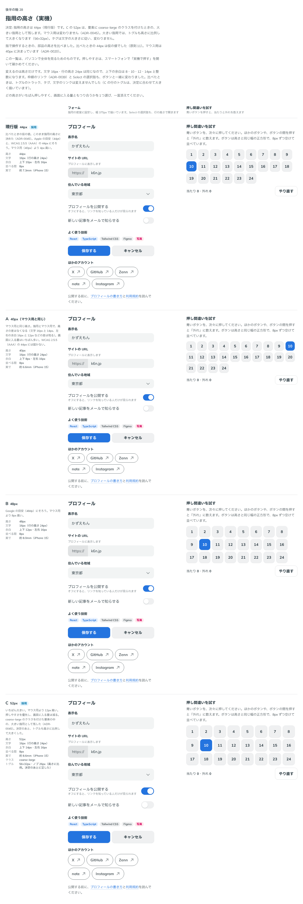

# 0045. 指用の高さ

- ステータス: Accepted
- 日付: 2026-09-13
- ラウンド: 後半 軸28

## 背景

原則11では、寸法を入力方式で切り替えます（[ADR-0004](./0004-density-and-structure-switching.md)）。マウス用の高さは [ADR-0020](./0020-control-size-fine.md) で 40px に決まりました。指用の 44px は、前半から仮の値のままでした。

指で押しやすいかは、画面で見ても分かりません。そのため、指用の高さは実機で押して比べることにしていました（ADR-0004 の決定3）。

## 候補

比較は Storybook の `Design Review/28 指用の高さ（実機）`（[`stories/axis-28-coarse-size.stories.tsx`](../stories/axis-28-coarse-size.stories.tsx)）です。ストーリーは2つあります。

- **実機で押す**: スマートフォンで開くためのストーリーです。プロフィールのフォームと、押し間違いを試すボタンの並びを描きます。ボタンは高さと同じ幅の正方形で、8px ずつ空けて 24 個並べます。案は上の切り替えで1つずつ入れ替えるか、縦に並べます。入れ替えても、親指のあたりにある部品が同じ位置に来ます
- **一覧（パソコン）**: 同じ画面を横に並べたものです（比較画像用）

変えたのは高さだけです。文字 16px・行の高さ 24px・左右の余白 16px・並べる間 8px は、どの案も同じです。高さを読むもの（ボタン・入力欄・Select の本体と選択肢・トグルの行・枠線のリンク）は一緒に変わります。比べたときは、トグルのトラック・タグ・文字のリンクは変えませんでした（トグルは、決めたあとで高さに比例して大きくすることにしました。決定を参照）。

| 案     | 高さ | 上下の余白 | マウス用（40px）との差 | 実寸（iPhone 15） | 内容                                                    |
| ------ | ---- | ---------- | ---------------------- | ----------------- | ------------------------------------------------------- |
| 現行版 | 44px | 10px       | 4px                    | 約 7.3mm          | 仮の値。Apple の目安（44pt）と WCAG 2.5.5（AAA）の 44px |
| A      | 40px | 8px        | 0px                    | 約 6.6mm          | マウス用と同じ高さ。画面に入る量がいちばん多い          |
| B      | 48px | 12px       | 8px                    | 約 8.0mm          | Google の目安（48dp）                                   |
| C      | 52px | 14px       | 12px                   | 約 8.6mm          | いちばん大きい。押しやすさを優先し、画面に入る量は減る  |

## 決定

**指用の高さは 44px（現行版）に決めます。C の 52px は「大きい指用」として残し、要素に `coarse-large` のクラスを付けたときに使います。大きい指用では、トグルも高さに比例して大きくします。マウス用は 40px のままです。**

| 項目               | 決定                                                                                                                                                                                        |
| ------------------ | ------------------------------------------------------------------------------------------------------------------------------------------------------------------------------------------- |
| 指用の高さ         | 44px（`--size-control-coarse`）。値は変えず、仮の値でなくなった                                                                                                                             |
| 大きい指用         | 52px（`--size-control-coarse-large`）。`coarse-large` のクラスを付けた要素の中で使う                                                                                                        |
| 変わるもの         | `--size-control` を読むものの高さ。ボタン・入力欄・Select の本体・Select の選択肢の行（浮かぶ選択肢とシート）・シートの見出しと ×・枠線のリンク・トグルの行の最小の高さ                     |
| 大きい指用のトグル | トラック 56×32px・ノブ 26px・隙間 3px（`--switch-w-coarse-large`・`--switch-h-coarse-large`・`--switch-knob-coarse-large`）。指用の 48×28px・ノブ 22px を高さと同じ比で大きくした（下の表） |
| 変わらないもの     | 文字（16px）・行の高さ（24px。52px で上下 14px）・左右の余白（16px）・並べる間（8px）・タグ・文字のリンク                                                                                   |
| タグ               | 変えない。押すものではないので、文字の大きさ（`--text-caption`）に従う                                                                                                                      |
| マウス用           | 40px のまま（ADR-0020）。`coarse-large` を付けても変わらない。トグルも 40×22px のまま                                                                                                       |
| 付ける場所         | `html` でも、途中の要素でもよい。Select の選択肢は `body` の直下に出るので、アプリ全体では `html` に付ける                                                                                  |
| 密度の固定と一緒   | 中の `data-density="coarse"` の要素も 52px になる。`data-density="fine"` の要素の中は 40px のまま                                                                                           |
| クラスの名前       | いまは `coarse-large` のまま。必要になったら変える                                                                                                                                          |
| ツールバー         | Storybook の「指用の高さ」はそのまま残す。ほかのストーリーでも 52px を見るための道具                                                                                                        |

使い方は次のとおりです。

- `<html class="coarse-large">`（アプリ全体）
- `<section class="coarse-large">…</section>`（その中だけ。Select の選択肢も効かせるときは、`container` をその中にする）

行の高さの規則（整数 px で、部品の高さとの差が偶数 — [ADR-0032](./0032-text-offset.md)）は、52px でも満たします（52 − 24 = 28。上下 14px）。

トグルの値は、指用の値に 52/44（約 1.18）を掛け、次のように整数にしました。

| 寸法           | 指用 | ×52/44 | 大きい指用 |
| -------------- | ---- | ------ | ---------- |
| トラックの幅   | 48px | 56.7px | 56px       |
| トラックの高さ | 28px | 33.1px | 32px       |
| ノブ           | 22px | 26.0px | 26px       |
| 隙間           | 3px  | 3.5px  | 3px        |
| ノブの動く距離 | 20px | 23.6px | 24px       |

- ノブは、比例した値（26.0px）がそのまま整数です
- 隙間は 3px のままです。マウス用（40×22px）と指用でも同じ値で、密度で変えていません。トラックの高さは「ノブ ＋ 隙間 × 2」で 32px です。上下左右の隙間がそろい、ノブが真ん中に来ます
- 高さ 32px なら、52px の行でトラックの上下が 10px ずつ空きます。33px では 9.5px になり、端数が出ます（ADR-0032 と同じ考え）
- 幅は 56px です。ノブの動く距離は 24px で、比例した値（23.6px）に近くなります
- ほかの丸め方も考えました。57×33px・ノブ 27px は、トラックは近くなりますが、ノブが 1px 大きく、行の中で 0.5px ずれます。58×34px・ノブ 28px は、ノブが 2px 大きくなります

## 理由

ユーザーのメモです。

> 28 について、指用は 44px だなあと思いました。と思いつつ、ユースケースによっては 52px を使いたい場合もあるかなと思いました。全体テーマ設定のような形で、class を付けることで変化する、とかだとありがたいなと思います。PC についてはいまのままで行きましょう。

決めたあと、残っていた問い（トグルとタグ、クラスの名前、ツールバー）へのメモです。

> クラス名は必要になったら変えましょう。
>
> 52px のときは、トグルは比例して大きくなるようにしたいですね。タグはインタラクティブな要素ではないので、あくまでも文字サイズ依存になりそうです。
>
> ツールバーの切り替えはほかの画面でも見たいので、ナイス気づきです。このままで。

以下は、メモと比較から読み取れることです。

- **既定は 44px**: 「指用は 44px だなあと思いました。」Apple の目安（44pt）と WCAG 2.5.5（AAA）の 44px にそろいます。マウス用との高さの差は 4px のままで、文字（16px と 14px）と余白（16px と 12px）の差と合わせて、指用の大きさを出します
- **52px はクラスで選ぶ**: 場面によっては、画面に入る量より押しやすさを優先したいことがあります（「ユースケースによっては 52px を使いたい場合もある」）。部品ごとに指定するのではなく、テーマのように外側から一度に変えます（「class を付けることで変化する」）
- **トグルは比例して大きくする**: 「52px のときは、トグルは比例して大きくなるようにしたいですね。」トグルは押すものなので、ほかの部品と一緒に大きくします。トラックとノブを高さと同じ比で大きくし、形（縦横の比とノブの大きさの比）はほぼ変えません
- **タグは文字の大きさに従う**: 「タグはインタラクティブな要素ではないので、あくまでも文字サイズ依存になりそうです。」押すものではないので、指の大きさに合わせる理由がありません。大きい指用では文字が変わらないので、タグも変わりません
- **クラスの名前は、いまは `coarse-large`**: 指用とマウス用は、トークンと密度の固定で coarse・fine と呼んでいます（`--size-control-coarse`、`data-density="coarse"`）。これに合わせて、「指用を大きく」と読める名前にしました。「クラス名は必要になったら変えましょう。」なので、使う場面が見えてきたら見直します
- **ツールバーは残す**: 「ツールバーの切り替えはほかの画面でも見たいので、ナイス気づきです。このままで。」ほかのストーリーでも 52px を確かめられるよう、Storybook の道具として残します
- **マウス用は変えない**: 「PC についてはいまのままで行きましょう。」大きい指用は、指用の密度だけを変えます

## 却下した案と理由

- **A（40px）**: 選ばれませんでした。マウス用と同じ高さになり、WCAG 2.5.5（AAA）の 44px に届きません
- **B（48px）**: 選ばれませんでした。既定は 44px、大きくしたいときは C の 52px になりました
- **C（52px）**: 既定にはしませんでした。クラスで選ぶ大きい指用として残しました

## 影響

- `tokens.css`: `--size-control-coarse`（44px）の「実機で詰める」を外し、この ADR を参照するようにしました。大きい指用の高さ `--size-control-coarse-large`（52px）を足しました。`--leading-control-coarse` の注記に、52px で上下 14px を足しました。大きい指用のトグル `--switch-w-coarse-large`（56px）・`--switch-h-coarse-large`（32px）・`--switch-knob-coarse-large`（26px）を足しました
- `src/styles/globals.css`:
  - `.coarse-large` を足しました。`--size-control-coarse` を `--size-control-coarse-large` に差し替え、`--size-control` をその要素で計算し直します。トグルの寸法（`--switch-w`・`--switch-h`・`--switch-knob`）も、同じように差し替えて計算し直します
  - 密度の規則に `--density-coarse`（指用 1・マウス用 0）を足しました。`--size-control` は `:root` や `data-density` の要素で値が決まり、子には値だけが引き継がれます。途中の要素に付けたクラスで高さを変えるには、その要素で計算し直す必要があります。そのとき、いまの密度を `--density-coarse` で知ります。式は「マウス用 ＋ `--density-coarse` ×（指用 − マウス用）」です
  - `.coarse-large` は `@layer` の外に置きました。`tokens.css` の `:root` も `@layer` の外にあるので、`html` に付けたときに `--size-control-coarse` を上書きするためです
- `src/components/Switch.tsx`: 変えていません。トラック・ノブ・ON のときのノブの位置（`--switch-w − --switch-knob − --switch-inset × 2`）は、もともとトークンを読んでいます。押したときにノブが縮む動き（[ADR-0009](./0009-press-motion.md)）と OFF のトラック（[ADR-0011](./0011-switch-off-track.md)、[ADR-0029](./0029-disabled-refine.md)）もそのままです
- `.storybook/preview.tsx`: ツールバーに「指用の高さ」（44px（既定）・52px（coarse-large））を足しました。`html` に `coarse-large` を付けます。「密度」と組み合わせて使います。メモを受けて、そのまま残します
- 比較のストーリー:
  - 既定で現行版と C に採用の印を付けます（`current,C`）。「実機で押す」の印も、カンマで区切って2つ付けられるようにしました
  - C の行は `coarse-large` で描きます。「一覧」は行の中の要素に、「実機で押す」は案の section に付けます。高さは比べたときと同じ 52px です。C の仕様に「クラス」の行を足し、説明の文に決定を足しました
  - C の行はクラスで描くので、トグルも 56×32px になります。C の仕様に「トグル」の行を足し、説明の文を直しました。現行版・A・B の行は比べたときのままです（トグルは 48×28px）
- 測った値（Chrome の CDP、2026-09-13。指の操作（`pointer: coarse`）、390×844）:
  - 既定: ボタン・入力欄・Select の本体・枠線のリンクは 44px。シートの選択肢の行と × も 44px
  - `html` に `coarse-large`: 同じものが 52px。シートの選択肢の行と × も 52px。軸 19 のシートの見出し（ヘルプテキストのある Select）は 62px から 70px
  - 途中の要素（`#storybook-root`）に付けても 52px。中の `data-density="coarse"` の要素（軸 28 の案の section から固定の値を外したもの）も 52px
  - `html` に `data-density="fine"` を付けると、クラスがあっても 40px（`html` に付けたときも、途中の要素に付けたときも）
  - マウスで操作している環境（1320×1000）では、クラスを付けても 40px。浮かぶ選択肢の行も 40px
  - 変わらないもの: 文字のリンク 22px
  - 軸 19 の「実機で確かめる」と軸 24 の2つのストーリーに `html` から付けても、ページは画面の幅からはみ出しません（ページの幅 375px、画面 390px）。高くなった分だけ縦に伸びます（軸 19 は 1316px から 1356px、軸 24 の送信中は 5479px から 5551px、動きを減らす設定は 3319px から 3551px）
  - 比較の行: 現行版 44px、A 40px、B 48px、C 52px（C は `coarse-large` で描いた値）
- トグルを測った値（同じ条件。軸 28 の案の section から固定の値を外し、`:root` の密度で描いたもの）:
  - 既定: トラック 48×28px・ノブ 22px。ノブの位置は OFF で左 3px、ON で左 23px（動く距離 20px）
  - `html` に `coarse-large`: トラック 56×32px・ノブ 26px。隙間は上下左右 3px。ノブの位置は OFF で左 3px、ON で左 27px（動く距離 24px）。途中の要素（`#storybook-root`）に付けても同じ
  - `html` に `data-density="fine"`: クラスを `html` に付けても、途中の要素に付けても、付けなくても 40×22px・ノブ 16px（ON で左 21px）。`html` が fine でも、クラスの中の `data-density="coarse"` の要素は 56×32px
  - 押している間（`:active`）: ノブは 92% に縮みます（大きい指用で 26px から 23.92px、既定で 22px から 20.24px）
  - 比較の行: C の行のトグルは 56×32px・ノブ 26px、ほかの行は 48×28px・ノブ 22px
- **分かっていること**:
  - 大きい指用で、文字・左右の余白・並べる間を変えるかは比べていません。いまは高さとトグルだけが変わります
  - どんな場面で大きい指用を使うかは、決めていません
  - Select の選択肢は `body` の直下に出ます。途中の要素に付けたときは、`container` をその中にしないと、選択肢の行は 44px のままです
  - 寸法を Provider で固定する仕組み（原則11）はまだありません。クラスは `html` か要素に直接付けます

## 比較画像

一覧（パソコン）です。現行版と C に採用の印を付けています。C の行は `coarse-large` で描いていて、トグルも大きくなっています（56×32px・ノブ 26px）。

