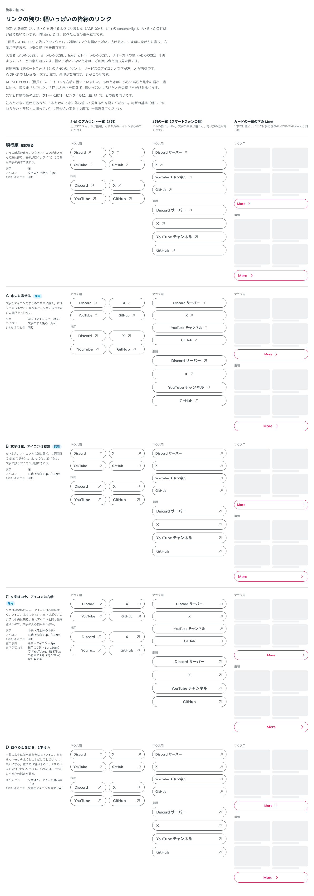
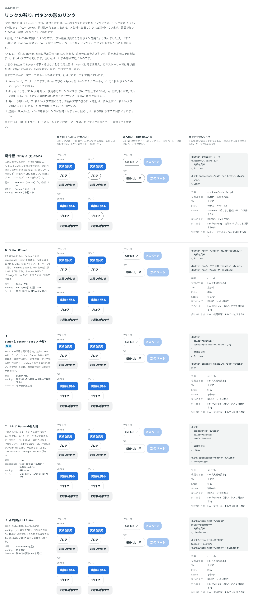

# 0046. リンクの残り（幅いっぱいの枠線のリンクと、ボタンの見た目のリンク）

- ステータス: Accepted
- 日付: 2026-09-13
- ラウンド: 後半 軸26

## 背景

[ADR-0039](./0039-link-size.md) でリンクの大きさが決まり、2つが残っていました。

- 枠線のリンクを幅いっぱいに広げると（SNS のアカウント一覧の2列など）、中身が左に寄り、右側が空いていました
- Button は `<button>` だけで、`href` を持てませんでした。ADR-0039 で「広い範囲が要るときはボタンを使う」と決めましたが、ページを移るリンクをボタンの形で描く方法がありませんでした

原則5（リンクは pill）と原則7（塗りか枠線か。密度の高い並びは枠線）に関わります。色は [ADR-0028](./0028-default-color.md)、hover と押下は [ADR-0027](./0027-flat-press.md)、フォーカスは [ADR-0031](./0031-focus-visible.md) で決まっています。

## 候補

比較は Storybook の `Design Review/26 リンクの残り`（決めた時点のコミット `c206648`。`git checkout c206648 && pnpm storybook` で開けます）です。ストーリーは2つあります。比べたときは部品がどちらも持たなかったので、ストーリーの中で組み立てました。比較は1回です。そのあとのメモで、塗りのボタンのリンク、↗ の扱い、キーボード、押せないリンク、新しいタブで開くときの読み上げと ↗、文字のリンクの ↗ の大きさと下線が決まりました。

### 幅いっぱいの枠線のリンク

SNS のアカウント一覧（2列）、1列の一覧（スマートフォンの幅）、カードの一覧の下の More の3つの場面で比べました。どの行も、マウス用と指用を上下に並べています。大きさ・色・hover と押下・フォーカスは、どの案も同じです。

| 案                           | 文字                      | アイコン                | 1本だけのとき |
| ---------------------------- | ------------------------- | ----------------------- | ------------- |
| 現行版 左に寄る              | 左                        | 文字のすぐ後ろ（8px）   | 同じ          |
| A 中央に寄せる               | 中央（アイコンと一緒に）  | 文字のすぐ後ろ（8px）   | 同じ          |
| B 文字は左、アイコンは右端   | 左                        | 右端（余白 12px／16px） | 同じ          |
| C 文字は中央、アイコンは右端 | 箱全体の中央              | 右端（余白 12px／16px） | 同じ          |
| D 並べるときは B、1本は A    | 並べるときは左、1本は中央 | 並べるときは右端        | A と同じ      |

C は、左の余白に「アイコン＋8px」を足して、文字を箱全体の中央に置きます。指用の2列（1つ 150px）では「YouTube」が「…」で切れます。

### ボタンの形のリンク

どの案も、行き着く要素は Button と同じ見た目の `<a>` です。違うのは書き方と型です。

| 案                        | 書き方                                     | loading                          | ルーターのリンク              |
| ------------------------- | ------------------------------------------ | -------------------------------- | ----------------------------- |
| 現行版 作れない           | Button に onClick で移る／枠線のリンク     | Button なら持てる                | —                             |
| A Button に href          | `<Button href="/works">`                   | href と一緒には型エラー          | 別の口が要る（Provider など） |
| B Button に render        | `<Button render={<a href="/works" />}>`    | 型では止められない（部品が無視） | そのまま渡せる                |
| C Link に Button の見た目 | `<Link appearance="button" href="/works">` | 持たない                         | Link と同じ                   |
| D 別の部品 LinkButton     | `<LinkButton href="/works">`               | 持たない                         | 別の口が要る（A と同じ）      |

書き方のほかに、ルールも選んでもらいました。行はどれも「ア」で描いています。

- キーボード: ア リンクのまま、Enter で移る（Space はページのスクロール）。イ Space でも移る
- 押せないとき: ア href を外し、使用不可のリンクにする。イ 同じ見た目で、Tab では止まる。ウ リンクには押せない状態を持たせない
- 外へ出る印（↗）: ア 新しいタブで開くとき、部品が ↗ を付けて読み上げに「新しいタブで開きます」を足す。イ 利用者が付ける。ウ 付けない
- 送信中（loading）: ページを移るリンクには持たせない

## 決定

**幅いっぱいの枠線のリンクは A を既定にし、B と C も選べるようにします。ボタンの見た目のリンクは、Button の render（B）で作ります。塗りを含む Button のすべての見た目をリンクにでき、リンクには右上向きの矢印（↗）を必ず付けます。キーボードはリンクのままにし、リンクにも押せない状態（`disabled`）を持たせます。新しいタブで開くリンクには、読み上げに「（新しいタブで開きます）」を足します。押せない文字のリンクは、ただの文字と同じ見た目にします。ボタンの見た目のリンクには、`loading` を型で渡せないようにします。**

| 項目                                      | 決定                                                                                                                                                                                                                                                                                                                                                                                                                                                                                                                                                                                                                                                                          |
| ----------------------------------------- | ----------------------------------------------------------------------------------------------------------------------------------------------------------------------------------------------------------------------------------------------------------------------------------------------------------------------------------------------------------------------------------------------------------------------------------------------------------------------------------------------------------------------------------------------------------------------------------------------------------------------------------------------------------------------------- |
| 寄せ方（`contentAlign`）                  | `center`（既定・A）: 文字とアイコンをまとめて中央。`between`（B）: 文字は左、最後のアイコンは右端。`center-end`（C）: 文字は箱全体の中央、最後のアイコンは右端                                                                                                                                                                                                                                                                                                                                                                                                                                                                                                                |
| 寄せ方が効く部品                          | 枠線のリンク（`appearance="outline"`）だけ。文字のリンクには効かない                                                                                                                                                                                                                                                                                                                                                                                                                                                                                                                                                                                                          |
| C の左の余白                              | 左右の余白＋アイコン＋8px（マウス用 36px／指用 44px）。最後にアイコンがあるときだけ                                                                                                                                                                                                                                                                                                                                                                                                                                                                                                                                                                                           |
| 幅が中身で決まるとき                      | A と B は、いまと同じ見た目。C は左の空きの分（24px／28px）だけ広くなる。C は幅いっぱいで使う                                                                                                                                                                                                                                                                                                                                                                                                                                                                                                                                                                                 |
| 入りきらないとき                          | B・C は文字を「…」で切る。A はいまと同じ（切らない）                                                                                                                                                                                                                                                                                                                                                                                                                                                                                                                                                                                                                          |
| ボタンの見た目のリンク（`render`）        | Button に `<a href>` や Next.js の Link を渡す。見た目は Button と同じで、要素だけが `<a>` になる。appearance・color はすべて使える（塗り・枠線、青・ピンク・赤・グレー・白）。**追記（2026-09-16）**: この作り方は [ADR-0073](./0073-link-or-button.md) で、Link の `appearance="button"` に置き換わりました。Button の `render` は `@deprecated` として残ります                                                                                                                                                                                                                                                                                                             |
| ↗                                         | ボタンの見た目のリンクには必ず付ける。ラベルの後ろ、最後に置く。大きさは `--size-icon`、線は Regular（[ADR-0018](./0018-icon-weight-by-context.md)）。飾りなので読み上げない。利用者が最後に `ArrowUpRightIcon` を置いたときは足さない。ほかのアイコンを最後に置いたときは、その後ろに付く                                                                                                                                                                                                                                                                                                                                                                                    |
| キーボード                                | リンクのまま。Enter で移り、Space では移らない（ア）。ボタン（`<button>`）は、いままでどおり Space でも押せる                                                                                                                                                                                                                                                                                                                                                                                                                                                                                                                                                                 |
| 新しいタブで開くとき（`target="_blank"`） | ボタンの見た目のリンク・文字のリンク・枠線のリンクのどれも、読み上げだけの「（新しいタブで開きます）」を足し、`rel="noopener noreferrer"` を付ける（利用者が `rel` を書いたときは、それを使う）                                                                                                                                                                                                                                                                                                                                                                                                                                                                               |
| 文字のリンクの ↗                          | 新しいタブで開くときだけ、部品が文字の後ろに付ける。同じタブで開くリンクには付けない。大きさは文字より少し小さい 0.85em（14px の文字で 11.9px、16px で 13.6px。トークン `--link-external-icon-size`）、線は Regular。下寄せで、矢印の線の下端を文字の基線にそろえる。リンクの下線を ↗ の右端（矢印の線の右端）まで続ける。その下線は文字の下線と同じ位置・太さ・色で、hover で文字の下線と一緒に濃くなる。飾りなので読み上げない。最後の語と一緒に折り返す。利用者が最後に `ArrowUpRightIcon` を置いたときは足さない。押せないときは付けない（下線もない）                                                                                                                    |
| 枠線のリンクの ↗                          | 利用者がアイコン（最後の子の要素。› でも ↗ でも）を置いたときは、それを使い、↗ は足さない。アイコンがない新しいタブのリンクには、部品が ↗ を付ける（大きさは `--size-icon`。`between`・`center-end` では右端に来る）。同じタブで開くアイコンのないリンクには付けない                                                                                                                                                                                                                                                                                                                                                                                                          |
| 押せないとき（`disabled`）                | Button（render）と Link（文字・枠線）に `disabled` を渡すと、`href` を外し、渡した要素（Next.js の Link など）は描かない。href のない `<a role="link" aria-disabled="true">` を描く。Tab では止まらず（`<button disabled>` と同じ）、読み上げのモードでは「リンク、利用不可」と読まれる。押しても何もしない（`onClick` も呼ばない）                                                                                                                                                                                                                                                                                                                                           |
| 押せないときの見た目                      | ボタンの見た目のリンク: `<Button disabled>` と同じ見た目（[ADR-0026](./0026-disabled.md)・[ADR-0029](./0029-disabled-refine.md)）。影なし、hover と押下なし、カーソルは not-allowed。↗ は残す。文字のリンク: ただの文字と同じ見た目。下線を引かず、色は周りの文字を受け継ぐ（`color: inherit`）。hover と押下もなく、カーソルも周りの文字と同じ（`auto`）。新しいタブで開くリンクでも ↗ を付けない。枠線のリンク: 押せないグレーの枠線のボタンと同じ（枠線 `#DEE0E1`・文字 `#A3A5A6`・塗りなし・薄くしない）。色（青・ピンク）を指定していてもグレーにする。新しいタブで開くリンクの ↗ は残す。どのリンクも、読み上げの「（新しいタブで開きます）」は足さない（開かないため） |
| 送信中                                    | リンクは持たない。`render` を渡したときは、`loading`・`loadingIndicator`・`type` を型で受け付けない。型を外して渡されたときは、無視して開発時に警告する                                                                                                                                                                                                                                                                                                                                                                                                                                                                                                                       |
| Button の型                               | `ButtonProps`（ボタン。`render` なし）と `ButtonLinkProps`（リンク。`render` あり）の2つに分ける。Button は、どちらかを受ける                                                                                                                                                                                                                                                                                                                                                                                                                                                                                                                                                 |
| Link の `render`                          | Link にも render を足す。Next.js の Link に Link の見た目を重ねられる。`<a>` のときは、いままでどおり Link に `href` を書く                                                                                                                                                                                                                                                                                                                                                                                                                                                                                                                                                   |
| 枠線のリンク                              | 原則5・7 の pill のまま。アイコン（More の ›、SNS の ↗）は、いままでどおり利用者が置く。アイコンのない新しいタブのリンクだけ、部品が ↗ を足す                                                                                                                                                                                                                                                                                                                                                                                                                                                                                                                                 |

使い方は次のとおりです。

- `<Link appearance="outline" href="/sns" className="w-full">`（A・既定）
- `<Link appearance="outline" contentAlign="between" className="w-full" …>`（B）、`contentAlign="center-end"`（C）
- `<Button color="primary" render={<a href="/works" />}>実績を見る</Button>`
- `<Button render={<NextLink href="/works" />}>実績を見る</Button>`
- `<Link appearance="outline" render={<NextLink href="/works" />}>More <CaretRightIcon /></Link>`
- `<Button color="primary" render={<NextLink href="/page/5" />} disabled>次のページ</Button>`（押せないリンク）
- `<Link href="https://github.com/kazuemon" target="_blank">GitHub のリポジトリ</Link>`（部品が ↗ と読み上げの文を足す）

`href`・`target` は渡す要素に書き、ラベルは Button・Link の children に書きます。

## 理由

ユーザーのメモです（来た順）。

> 26の幅いっぱいのリンクについては、A・B・C を全部選べるにしたいですね…
> デフォルトは A でよさそう。
> ボタンの形のリンク、ですが、枠線付きのリンクと同じ認識です。Nextjs などを使う可能性が大きいので、render を使わざるをいない可能性を感じていますが、どうでしょうか。

このメモに、render に賛成と答えました。Base UI の部品はすでに render を使っています。Next.js の Link は自分で `<a>` を描くので、`<Link appearance="outline" render={<NextLink href="/works" />}>` と書けます。`<a>` のときは、いままでどおり `href` です。あわせて、リンクのルール（キーボードはリンクのまま、押せない状態を持たない、新しいタブで開くときに ↗ と「新しいタブで開きます」を足す）を提案しました。

> 26について、塗のボタンのリンクも欲しいです！リンクのものもボタン（onClick など）のものは見た目は同じです！（機能的に button がもとなのか a が元なのかだけ）
> Nextjs 対応はしたいので render のパターンでお願いします。

> あ、ボタンの見た目のリンクの場合、右上向き矢印は必ず入る、という認識です。

実装のあと、提案した3つのルール（キーボード、押せない状態、新しいタブの読み上げ）を確かめてもらいました。

> キーボードでは、リンクのまま Enter で移り、Space では移らない。をあまり理解できていなくて、これは一般的な挙動ですか？ リンクには押せない状態を作らないのが基本だと思っていますが、実際出てくる可能性はありそうなんですよね。href 周りでハックしないといけない認識ですが、どうやることになりそうでしょうか？

このメモに、Enter だけで移るのはブラウザのリンクの挙動で、ARIA APG のリンクのパターンも同じだと答えました。押せないリンクの作り方は3つ挙げ、① を勧めました。① href を外し、`<a role="link" aria-disabled="true">` にする。② href を残し、押したときに止める（preventDefault）。③ `<button disabled>` に替える。

> Entry と Space に関しては理解できました。このままでおっけーです。

> 押せないボタンは読み上げられないのですか？

このメモに、押せないボタン（`<button disabled>`）は Tab では止まらないが、読み上げのモードでは「…、ボタン、利用不可」と読まれると答えました。① のリンクも同じで、「…、リンク、利用不可」と読まれます。

> おすすめしてもらったもので良さそうです。

残った新しいタブのルールを、2つに分けて聞きました。1: ボタンの見た目のリンクで新しいタブで開くとき、読み上げに「（新しいタブで開きます）」を足すか。2: 文字・枠線のリンクにも同じものを足すか。

> 1はそのままでおっけーです。2は同じ形にしたいですね。文字のリンクの場合は、新しいタブのみ矢印アイコンを入れたいですが、枠線のリンクとはどれの話ですか？

このメモに、枠線のリンクは More や SNS のアカウント一覧で使う、枠線の pill（`appearance="outline"`）だと答えました。

> ああー、理解しました。枠線のリンクはアウトラインボタンの見た目のボタンとほぼ似てますね。こちらはアイコンの指定があればそれを、指定がない新しいタブなら文字のリンクと同じ挙動で。

実装のあと、比べずに選んだもの（押せない文字・枠線のリンクの見た目）と、型では止めていないもの（ボタンの見た目のリンクの `loading`）を確かめてもらいました。

> 押せない文字のリンクはそもそも下線が引かれず、ただの文字と同じ見た目で。枠線のリンクは26の実装したリンクにあるものでよいです

> ボタンの見た目のリンクは loading を受け取らないのが正しそうですね（リンク(nextlink, a)に loading という状態はなさそう）

あわせて、見る場所を聞かれました。

> 文字のリンクはどこで見れますか？

> 枠線のリンクの中身が〜をアイコンと〜はどこで見れますか？

このメモを受けて、「実装したリンク」のストーリーに「文字のリンク」の区画と、枠線のリンクの「子が1つだけのとき」を足しました（下の影響）。

「文字のリンク」の区画を見てもらったあとのメモです。

> 文字のリンクは、矢印のところまで下線を伸ばしてほしいです。また、ちょっとだけ矢印は小さくしてみてほしいです（下寄りでOK）

このメモを受けて、↗ の大きさを 0.75・0.8・0.85em、位置を2通り（矢印の中ほどを少し下げる、矢印の下端を基線にそろえる）で、14px と 16px の文字に並べて見比べ、0.8em で下端を基線にそろえる形を選びました。下線は ↗ の右端まで続けました（下の影響）。

以下は、メモと比較から読み取れることです。

- **寄せ方は場面で選ぶ**: 並べて文字の頭とアイコンを縦にそろえたいとき（B）、文字をボタンのように中央に置きたいとき（C）、1本だけで左右をつり合わせたいとき（A）で、合う形が違います。使う側が選べるようにします
- **既定は A**: ボタンと同じ寄せ方です。幅が中身で決まるときは、いまと同じ見た目のままです
- **枠線のリンクも、ボタンの形のリンクの1つ**: 枠線のリンク（pill）は、いまのまま残します。そのうえで、塗りなど Button の見た目もリンクにできるようにします
- **見た目は同じで、要素だけが違う**: 「機能的に button がもとなのか a が元なのかだけ」です。見た目の定義は Button の1つだけにし、要素だけを替えます。hover と押下は `:enabled` ではなく `:not(:disabled)` で書き直し、`<a>` にも効くようにしました（`<button>` では同じ意味です）
- **render（B）**: Next.js の Link は自分で `<a>` を描きます。`href` を受けるだけの口（A・D）では、ルーターのリンクを使えません。Base UI の部品と同じ render なら、そのまま渡せます。渡した要素の ref と props も、そのまま届きます（下の測った値）
- **↗ は必ず付ける**: ボタンの見た目のリンクと、ボタンを見分ける印です。新しいタブで開くかどうかにかかわらず付けます。役割は link と読まれるので、↗ は飾りとして読み上げません
- **キーボードはリンクのまま**: Enter で移り、Space では移らないのは、ブラウザのリンクの挙動です。見た目がボタンでも要素は `<a>` なので、ほかのリンクと同じ振る舞いにします。Space はページのスクロールのまま残ります
- **押せないリンクは、押せないボタンと同じ扱い**: 「実際出てくる可能性はありそう」なので、リンクにも押せない状態を持たせます（①）。Tab では止まらず、読み上げのモードでは「リンク、利用不可」と読まれます。`<button disabled>` と同じです。`href` がないので、クリック・Cmd＋クリック・右クリックの「新しいタブで開く」も何もしません。渡した要素（Next.js の Link）は描かないので、先読みも止まります
- **押せないときの見た目**: ボタンの見た目のリンクは、「見た目は同じで、要素だけが違う」ので `<Button disabled>` と同じにします。文字・枠線のリンクは、比べていないので、ADR-0026・ADR-0029 に合わせて選びました。リンクの色は文字の色だけで、色のボタンやトグルのように「何の部品か、ON か OFF か」を表しません。そのため、色を持たない部品（グレー）と同じく、薄くせずグレーにします。枠線のリンクは、押せないグレーの枠線のボタンと同じ色にしました。文字のリンクもその文字の色にしましたが、あとのメモで、ただの文字と同じ見た目に変わりました（下）
- **新しいタブの読み上げは、どのリンクにも足す**: 「1はそのままでおっけーです。2は同じ形にしたいですね」。画面の ↗ は飾りなので、新しいタブで開くことは読み上げの文で伝えます
- **↗ の付け方は、リンクの種類で分ける**: ボタンの見た目のリンクは、ボタンと見分けるために必ず付けます。文字のリンクは「新しいタブのみ」です。枠線のリンクは「アウトラインボタンの見た目のボタンとほぼ似てます」。アイコンを置いたときはそれを使い（More の › も、SNS の ↗ も、そのまま）、アイコンがない新しいタブのリンクだけ、文字のリンクと同じく部品が付けます
- **文字のリンクの ↗ は、文字の一部のように置く**: 線は文字と並ぶアイコンの Regular（ADR-0018）で、最後の語と一緒に折り返します（行の頭に ↗ だけが来ない）。はじめは文字の大きさ（1em）で、矢印の中心を文字の中心にそろえていました。「ちょっとだけ矢印は小さく（下寄りでOK）」を受けて、0.8em にし、矢印の線の下端を文字の基線にそろえました。このときは、0.75em は文字に比べて小さく見え、0.85em は 1em との違いが分かりにくいとして、間の 0.8em にしました。そのあと大きさを比較のストーリーで比べ直し（0.7〜1em の6つ）、「C が一番さり気なくていいかなと思いました！」で 0.85em にしました。下線は「矢印のところまで」伸ばし、↗ も下線の上に載せます。下線は文字の下線がそのまま続いたもので、位置・太さ・色も hover での変化も文字と同じです
- **押せない文字のリンクは、ただの文字にする**: 「そもそも下線が引かれず、ただの文字と同じ見た目で」。文字のリンクは、色と下線で押せることを表します。押せないときは、その両方を外し、周りの文字の色を受け継ぎます。↗ も新しいタブで開くことの印なので、開かないリンクには付けません。読み上げでは、いままでどおり「リンク、利用不可」と読まれます
- **押せない枠線のリンクは、いまのまま**: 「枠線のリンクは26の実装したリンクにあるものでよいです」。押せないグレーの枠線のボタンと同じ見た目で、↗ も残します
- **ボタンの見た目のリンクの loading は、型で止める**: 「リンク(nextlink, a)に loading という状態はなさそう」。`render` を渡したときの props を別の型（`ButtonLinkProps`）にし、`loading`・`loadingIndicator`・`type` を渡せないようにしました。書いたときに、エディタと型の確かめ（tsc）で分かります。型を外して渡されたとき（JavaScript や `as`）のために、無視して警告する仕組みは残します

## 却下した案と理由

幅いっぱいの枠線のリンク:

- **現行版（左に寄る）**: 「A・B・C を全部選べるにしたい」。右側が空き、アイコンの位置が文字の長さで変わります
- **D（並べるときは B、1本は A）**: 選ばれませんでした。B と A を選べるので、並べるか1本かに合わせて使う側が選べます。部品が「並べているか」を知る必要もなくなります

ボタンの形のリンク:

- **現行版（作れない）**: `<button>` で移ると、新しいタブで開けず、移る先の URL も出ません
- **A（Button に href）・D（別の部品 LinkButton）**: 「Nextjs 対応はしたいので render のパターンでお願いします」。ルーターのリンクを使うには、別の口が要ります
- **C（Link に Button の見た目）**: 選ばれませんでした。角 12px のリンクができて、原則5（リンクは pill）の例外になります。枠線のリンク（pill）と名前もぶつかります。Link には render を足し、Next.js の Link に Link の見た目を重ねられるようにしました

ルール:

- **↗ のア・イ・ウ（ボタンの見た目のリンク）**: どれも採りませんでした。「右上向き矢印は必ず入る」ので、新しいタブで開くかどうかにかかわらず、部品が付けます。文字のリンクと、アイコンのない枠線のリンクは、あとのメモで ア（新しいタブのときだけ部品が付ける）になりました
- **キーボードのイ（Space でも移る）**: 「このままでおっけーです」。Space でも移すと、ページのスクロールが効かなくなり、ほかのリンクと振る舞いが変わります
- **押せないときのウ（リンクには押せない状態を持たせない）**: はじめに提案した形です。押せないリンクは「実際出てくる可能性はありそう」なので、採りませんでした
- **押せないときのイ（同じ見た目で、Tab では止まる。focusable な aria-disabled）**: 押せないボタン（`<button disabled>`）は Tab で止まらないので、見た目が同じボタンの見た目のリンクだけ、振る舞いが違ってしまいます
- **② href を残し、押したときに止める（preventDefault）**: 右クリックの「新しいタブで開く」や、Next.js の Link の先読みが動いたままです。`href` が残るので、押せるリンクと同じく Tab でも止まります
- **③ `<button disabled>` に替える**: 押せるときは link、押せないときは button と、同じものの役割が入れ替わります。読み上げでは、ページの中の「リンクの一覧」から消えます
- **押せない文字のリンクをグレーにし、下線を残す（はじめに選んだ形）**: 「そもそも下線が引かれず、ただの文字と同じ見た目で」。色（青・ピンク）を残して 40% に薄くする形も、同じ理由で採りません
- **`loading`・`type` を型で止めず、無視して警告するだけ（はじめの形）**: 「loading を受け取らないのが正しそう」。警告は開発中に動かして初めて出ますが、型なら書いたときに分かります

## 影響

- `src/components/Link.tsx`:
  - `contentAlign`（`center`・`between`・`center-end`、既定 `center`）を足しました。枠線のリンクだけに効きます
  - `between`・`center-end` では、最後の要素（アイコン）の前を `data-slot="link-label"` の包みに入れ、入りきらないときは「…」で切ります。`center-end` の左の余白は、最後にアイコンがあるときだけ足します
  - `render` を足しました。Base UI の `useRender` で描くので、props の重ね方（class はつなぐ、イベントは両方呼ぶ、渡した要素の props が勝つ）と ref は Base UI の部品と同じです
  - 既定が `center` になったので、幅いっぱいの枠線のリンクは中央に寄ります。軸21の比較のストーリー（文字のリンク）の「一覧の下に置く」の列は、左寄せから中央寄せに変わりました。ADR-0039 の比較画像は比べたときの記録なので、撮り直していません。軸21の枠線のリンクのストーリーは、ストーリーの中で寄せ方を指定しているので変わりません
  - `disabled` を足しました。`href`・`target`・`rel`・`onClick` などを外し、渡した要素の代わりに `<a role="link" aria-disabled="true" data-disabled>` を描きます。はじめは、文字・枠線のリンクとも `data-disabled:` で `--link-color` を `--color-outline-neutral-disabled-text` に替えていました。2回目のメモのあと、押せないときの見た目を、見た目ごとに分けました。文字のリンクは `data-disabled:` で `color: inherit`・`text-decoration-line: none`・`background-image: none`・`cursor: auto` にし、部品の ↗ も付けません。枠線のリンクは、いままでどおり `--link-color` を替え、枠線・塗り・薄さも押せないグレーの枠線のボタンのトークンにします。カーソルは not-allowed です
  - hover と押下を `not-data-disabled:` の中に入れました。押せるリンクの見た目と動きは変わりません。hover と押下の規則の詳細度は、属性1つ分（0,1,0）上がります。比較のストーリーで、Link の hover と押下を CSS や class で上書きしているものはありません
  - 新しいタブで開く（`target="_blank"`。Link に書いても、渡した要素に書いても）ときは、読み上げだけの文と `rel="noopener noreferrer"` を足します。枠線のリンクには、読み上げだけの文（`sr-only`、絶対配置）の位置の基準として `relative` を足します
  - 文字のリンクの ↗ は、語をつなぐ文字（U+2060）と `white-space: nowrap` の包み（`aria-hidden`）に入れた `ArrowUpRightIcon` です。はじめは `inline-block`、1em、下端を 0.125em 下げていました。枠線のリンクの ↗ は、最後のアイコンとして子の最後に足すので、`between`・`center-end` でも右端に来ます
  - 3回目のメモ（下線を ↗ まで、↗ を少し小さく下寄りに）のあと、文字のリンクの ↗ を次の形にしました
    - ↗ は 0.8em の箱で、`vertical-align: -0.175em` です。矢印の線の下端は箱の下から 56/256（0.175em）なので、線の下端が基線にそろいます
    - SVG の下には、文字の下線（`text-decoration`）が引かれません。そこで、包みの中の ↗ の前に、透明な文字「0」（`::before` の `content`、`color: transparent`）の span を置き、字間（`letter-spacing: calc(0.625em - 1ch)`）で幅を 0.625em にしました。0.625em は、矢印の線の右端（箱の左から 200/256 × 0.8em）です。↗ は `margin-inline-start: -0.625em` で、その上に重ねます。リンクの下線は透明な文字の下にもそのまま引かれるので、下線の位置・太さ・色と、hover の色の移り変わり（ADR-0030 のトークン）が、文字の下線と同じになります。`--link-decoration` を `none` にしたときも一緒に消えます
    - 「0」は `::before` の `content` なので、文字を選んでコピーしても入らず、ページ内の検索でも見つかりません。包みは `aria-hidden` なので読み上げません
    - ↗ の下の線だけを背景（`::after` の塗り）で描く形も試しました。位置が 0.25px ずつ違う 16 通りのうち 4 通りで、下線が文字の下線より 1px 上にずれました。文字の下線と、箱の塗りとで、画素へのそろえ方が違うためです。継ぎ目にも、1 画素の隙間か重なりが出ました。そのため採りませんでした
- `src/components/icons.tsx`（3回目のメモのあと）: `ArrowUpRightIcon` のコメントを、文字のリンクでは 0.8em で付けることに直しました
- `src/components/Button.tsx`:
  - `render` を足しました。渡すと、同じ見た目のリンク（`ButtonLink`、Base UI の `useRender`）で描きます。渡さないときは、いままでどおり `<button>` を返します
  - hover と押下の条件を `enabled:` から `not-disabled:` に書き直し、押せないリンクのために `not-[:disabled,[data-disabled]]:`（`:not(:is(:disabled, [data-disabled]))`）にしました。`:not(:disabled)` と詳細度は同じで、`<button>` の見た目と動きは変わりません
  - 押せないリンクは `<a>` なので `:disabled` になりません。`data-disabled` を付け、Disabled の指定（`disabled:`）を、同じ値で `data-disabled:` にも書きました
  - リンクのときは、最後に ↗ を足し、`target="_blank"` なら読み上げだけの文（`sr-only`）と `rel` を足します。`disabled` のときは、渡した要素を描かず、`href` のない `<a role="link" aria-disabled="true">` にします。`loading`・`loadingIndicator`・`type` は無視し、開発時（`import.meta.env.DEV`）に1回だけ警告します。`disabled` を無視する警告は外しました
  - 2回目のメモのあと、props の型を `ButtonProps`（ボタン。`render?: undefined`）と `ButtonLinkProps`（リンク。`render` は必須、`loading`・`loadingIndicator`・`type` は `never`）に分けました。Button は `ButtonProps | ButtonLinkProps` を受けます。`ButtonProps` の名前は、ボタンの props のまま残しました。軸16のストーリーが `interface … extends ButtonProps` と書いていて、union は extends できないためです。軸16・24・26 のストーリーの `ButtonProps['appearance']` なども、そのまま通ります。警告（`warnOnce`）は残しました
- `src/components/icons.tsx`: `ArrowUpRightIcon`（Phosphor の ArrowUpRight、Regular）を足しました。比較のストーリーの中で描いていたものと同じ形です。文字のリンクで文字の大きさにするため、`className` を受けるようにしました
- `src/components/link-parts.ts`（新規）: Link と Button で共有する小物（新しいタブかどうか、読み上げだけの文、最後のアイコンの見分け、押せないリンクの `<a>` と属性、移る先の props を外すもの、警告）
- `tokens.css`: 変更なし。押せないリンクの色は、押せないグレーの枠線のボタンのトークン（`--color-outline-neutral-disabled-*`）を使います
- 比較のストーリー:
  - 幅いっぱいの枠線のリンク: 既定で A・B・C に採用の印を付けます。A・B・C の行は、部品の `contentAlign` で描きます。現行版と D は、比べたときの組み立てのままです。はじめに決定の段落を足しました
  - ボタンの形のリンク: 既定で B に採用の印を付けます。行は比べたときのままです（↗ は外へ出るリンクにだけ付いています）。部品は ↗ を必ず付けるので、部品に替えると見た目が変わるためです。Button の hover・押下が `<a>` にも効くようになったので、押せない見た目の `<a>` が沈まないよう、ストーリーの CSS で止めています。はじめに決定の段落を足しました
  - 「実装したリンク」のストーリーを足しました。Button の9つの見た目を、`<button>`・`<a>`（render）・Next.js の Link のまね（render）・新しいタブで開くリンクで並べ、Link の3つの寄せ方と、Link の render も並べています。どれもマウス用と指用です。決定のあと、次の区画を足しました
    - 押せないリンク: ボタンの見た目のリンク（塗りの青・グレー、枠線の青・グレー）を、Button・押せない Button・押せる NextLink と並べます。文字のリンク（青・グレー）と枠線のリンク（グレー・ピンク）は、押せる NextLink と並べます
    - 文字のリンク（2回目のメモのあと、「新しいタブで開く文字のリンク」から名前を替え、ボタンの見た目のリンクのすぐ下に移した）: 同じタブ・新しいタブ・押せない・押せない新しいタブ・灰色の文の中の押せないリンクを、1行ずつ段落で並べます。その下に、同じタブと新しいタブを1つの段落に並べたもの、幅 14em の狭い段落、NextLink のまね
    - 新しいタブで開く枠線のリンク: アイコンを置いた（› と ↗）、アイコンなしの新しいタブ、アイコンなしの同じタブ、幅いっぱいの `between`・`center-end`。2回目のメモのあと、「子が1つだけのとき」を足しました（文字だけ・アイコンだけ・文字とアイコン × 同じタブ・新しいタブ。マウス用と指用）。アイコンだけのリンクは、Link に `aria-label` で名前を付けています
  - 比べた行の見た目は変わりません。ボタンの形のリンクの「現行版」の GitHub は、部品の枠線のリンク（`target="_blank"`）なので、読み上げが `link「GitHub （新しいタブで開きます）」` に変わります。行の「外へ出る」の値は、比べたときに測ったものです
- 測った値（Chrome の CDP、2026-09-13）:
  - Button とリンクの見た目: 9つの見た目 × 2つの密度の18組で、`<button>`（↗ を同じ位置に足したもの）と `<a>`（render）・Next.js の Link のまね（render）を画素で比べました。各組で、どちらかのリンクは差なしでした。もう一方には文字の縁だけの差（最大 57 画素・32/255）が出ました。同じ `<a>` どうしを別の列で比べても同じ差が出るので、ページの上の置き場所による描き方の差です（要素の違いではありません）。同じ要素を撮り直した差は 0 です。大きさはマウス用 118×40px・指用 140×44px（枠線と白は 120×40px・142×44px）で、どれもボタンと同じです。計算された見た目（塗り・文字・枠線・影・角丸・高さ・余白・文字の大きさと太さ・カーソル）も同じです
  - hover と押下: 塗りの青・グレー、枠線の青で、影・塗り・沈み方（1px）がボタンと同じです
  - 読み上げ: `link「実績を見る」`（`<a>` も Next.js の Link も）。新しいタブで開くリンクは `link「GitHub （新しいタブで開きます）」`。名前の「GitHub」と「（」の間の空白は、画面に出ない文の前に Chrome が入れるものです。ボタンは `button「実績を見る」` のままです
  - キーボード: Tab で止まり、フォーカスの線は `solid 2px rgb(36, 116, 223)`、隙間 2px（ボタンと同じ）。Space では移らず、Enter で移ります（hash で確かめた）。ボタンは Space で押せます
  - 要素: `<a href>`。`type`・`role` は付きません。子は「文字、↗（`aria-hidden`）」、新しいタブでは「文字、↗、読み上げだけの文」で、`rel="noopener noreferrer"` です
  - Next.js の Link のまね: 渡した props（`prefetch={false}`）と ref（`<a>` が届く）が、そのまま届きます。class は Button（角 12px）または Link（pill）のものが付きます。Link の render でも、Enter で移ります
  - 寄せ方（幅 195px の2列）: A は文字とアイコンの組が中央で、文字の中心が箱の中心から 12px（指用 14px）左です（アイコンと隙間の半分）。B は文字の左とアイコンの右が、どちらも箱の端から 13px（指用 17px）です。C は文字の中心と箱の中心の差が 0px、アイコンの右は 13px（17px）、左の余白は 36px（44px）です
  - 幅が中身で決まるとき（GitHub ↗）: A と B は 97px（指用 116px）、C は 121px（144px）
  - 比較のストーリーを画素で比べた差（決定の段落と採用の印を外して比べた）: 幅いっぱいの A・B・C の行を部品に替えた差は、A の行の文字の縁の 14 画素（最大 27/255）だけでした。ボタンの形のリンクのストーリーは差なしです
  - 押せないリンク（決定のあと。hover を測るため、Chrome をマウスの環境〈`--blink-settings` で hover・pointer を fine〉にした）:
    - ボタンの見た目のリンク（塗りの青・グレー、枠線の青・グレー × 2つの密度の8組。どれも NextLink のまねを渡した）: 要素は `<a role="link" aria-disabled="true">` で、`href`・`target`・`rel` はありません。渡した NextLink は描かれず（NextLink の印も ref の印もない）、渡した `data-*` は残ります。↗ は1つ（`aria-hidden`）で、読み上げだけの文はありません
    - 読み上げ: `link「次のページ」`・使用不可（`disabled: true`）。押せる双子は `link「次のページ」`（フォーカスできる）
    - Tab: ページ全体で 153 か所に止まり、押せないリンク（ボタンの見た目 8、文字と枠線のリンク 8、新しいタブの文字のリンク 1）には1度も止まりません。すぐ隣の押せる Button と NextLink には止まります
    - クリック（マウスで押して離す）: hash は変わらず、`onClick` も呼ばれず、フォーカスも移りません。押せる双子は hash が変わります
    - 計算された見た目（塗り・文字・枠線の色と太さ・影・透明度・カーソル・角丸・高さ）は、8組すべてで `<Button disabled>` と同じです。hover と押下でも変わりません（押せる双子は、影・塗り・沈み方が変わる）
    - 画素（`<Button disabled>` に同じ ↗ を足して比べた）: マウス用は、塗りの青が 3 画素（最大 3/255）、グレーが 2 画素（1/255）、枠線の青・グレーは差なし。指用は、塗りの青が 521 画素（最大 2/255）、グレーが 18 画素（1/255）、枠線の青が 66 画素（最大 9/255）、枠線のグレーは差なし。どれも目では分からない差で、上と同じく置き場所による描き方の差です
    - 文字のリンク（青・グレー）と枠線のリンク（グレー・ピンク）（2回目のメモの前の値。文字のリンクは、下の「2回目のメモのあと」で変わった）: 文字は `rgb(163, 165, 166)`、枠線のリンクの枠線は `rgb(222, 224, 225)`、塗りなし、透明度 1、カーソルは not-allowed で、押せないグレーの枠線のボタンと同じ値です。文字のリンクの下線は、文字の色の 35% です。読み上げは `link「ブログ」`・使用不可、`link「More」`・使用不可。hover と押下でも変わりません
  - 新しいタブのリンク（決定のあと）:
    - 文字のリンク: `link「GitHub のリポジトリ （新しいタブで開きます）」` で、`rel="noopener noreferrer"`、↗ は1つ（`aria-hidden`）です。NextLink のまね（render）でも同じです。同じタブのリンク（ブログ）には、↗ も読み上げだけの文もありません。押せない新しいタブの文字のリンクは ↗ を残し、読み上げは `link「GitHub」`・使用不可です（2回目のメモの前。いまは ↗ を付けない）
    - 文字のリンクの ↗（14px の文字。3回目のメモの前）: 14×14px。矢印の箱の中心と最後の文字（「リ」）の箱の中心の差は 0.25px です
    - 折り返し（3回目のメモの前）: 狭い段落の幅を 100〜420px で 1px ずつ変えた 321 通りで、↗ はいつも最後の文字と同じ行でした。語をつなぐ文字と nowrap を外すと、20 通りで ↗ だけが次の行に落ちます
    - 枠線のリンク（マウス用・指用）: アイコンを置いたとき（› と ↗）は、アイコンは1つのまま（↗ を足さない）です。アイコンなしの新しいタブには ↗（16px／20px）が付き、右の余白は 13px／17px で、アイコンを置いたときと同じです。同じタブのアイコンなしには、何も付きません。新しいタブの3つは、どれも読み上げが `link「…（新しいタブで開きます）」`（「…」と「（」の間に空白）です。幅いっぱいの `between` では部品の ↗ が右端に来て、`center-end` では文字の中心と箱の中心の差が 0px、左の余白が 36px／44px です
  - 2回目のメモのあと（マウスの環境。hover と押下は CDP の `CSS.forcePseudoState` で当てた）:
    - 押せない文字のリンク（段落の中の同じタブ・新しいタブ・灰色の文の中、青とグレーの NextLink のまね × 2つの密度）: 文字の色は周りの文字と同じ（`rgb(31, 47, 55)`。灰色の文の中は `rgb(82, 92, 96)`）です。下線なし（`text-decoration-line: none`）、背景の線なし、カーソルは `auto`（周りの文字と同じ）、太さと大きさも周りと同じ（400・14px）です。↗ と読み上げだけの文はありません。要素は `<a role="link" aria-disabled="true">` で、`href`・`target`・`rel` はありません。読み上げは `link「ブログ」`・使用不可、新しいタブのリンクは `link「GitHub のリポジトリ」`・使用不可です
    - hover と押下を当てても、押せない文字のリンクは変わりません（沈まず、下線も色も出ない）。比べるために当てた押せる文字のリンクは、下線が濃くなり、1px 沈みました
    - 押せない枠線のリンク（グレー・ピンク × 2つの密度）: 文字 `rgb(163, 165, 166)`・枠線 `rgb(222, 224, 225)`・塗りなし・透明度 1・カーソル not-allowed で、前と同じです。hover と押下でも変わりません
    - 子が1つだけの枠線のリンク: 文字だけの新しいタブ（GitHub）は ↗ が1つ、アイコンだけの新しいタブは、アイコンと ↗ の2つです（マウス用 66×40px・指用 82×44px）。同じタブには足しません。文字とアイコン（子が2つ。最後に › を置いた）の新しいタブは › だけで、↗ を足しません。読み上げは `link「GitHub （新しいタブで開きます）」`・`link「More （新しいタブで開きます）」` です。アイコンだけのリンクは、Link の `aria-label` の `link「使い方」` だけで、新しいタブでも「（新しいタブで開きます）」が読まれません
  - 3回目のメモのあと（文字のリンクの ↗。マウスの環境、3 倍の画面。hover と押下は CDP の `CSS.forcePseudoState` で当てた）:
    - 形: ↗ の箱は 14px の文字で 11.19×11.19px（0.8em）、`vertical-align` は -2.45px（-0.175em）。透明な「0」の幅は 8.75px（0.625em）で、字間は 0.75px です。↗ の左端は「0」の左端と同じ（差 0px）、矢印の線の右端と「0」の右端の差は 0.01px です
    - 下線の位置（「実装したリンク」の新しいタブの段落を複製し、14px・16px × 青・グレーの8本。同じタブのリンクの段落も並べた）: どれも、文字の下と ↗ の下で、下線は基線の 4px 下から 1px の同じ行です（ふだん・hover・押下とも）。同じタブのリンクの下線も同じ行です。押下では、リンク全体が 1px 沈み、下線も一緒に沈みます
    - 下線の色: ↗ の下も文字の下も同じ値です。ふだんは青 `rgb(179, 206, 244)`・グレー `rgb(195, 198, 200)`、hover と押下は青 `rgb(18, 69, 138)`・グレー `rgb(47, 54, 56)` です
    - 継ぎ目（文字の中ほどから矢印の線の右端まで、下線の行の明るさの差。RGB の3つの和）: 16px は差なし。14px は、つなぎ目の 1 画素が、ふだんは 7〜8（1 つの値あたり 3 以下）、hover と押下は 100〜112 だけ明るくなります。暗くなる画素（重なり）はありません。文字を2つの span に分けただけのリンクを 0.25px ずつずらした 16 本でも、hover で最大 133（3 倍）・136（1 倍）で、同じ大きさです
    - 端数の位置: ↗ を付けたリンクを x・y とも 0.25px ずつずらした 16 通り × 14px・16px × 日本語と英字の終わり × 1・2・3 倍の画面で、下線の行が文字の下と ↗ の下で違ったものは 0 でした。背景で線を描く形では、y が 0.5px の端数の4通りで 1px ずれ、継ぎ目に隙間（hover で最大 608）と重なりが出ました
    - 下線の右端: 矢印の線の右端から 0〜0.18px（画素の途中で終わる分）です
    - 下寄せ: 矢印の線の下端と基線の差は 0〜0.01px です
    - 折り返し: 狭い段落の幅を 100〜420px で 1px ずつ変えた 321 通り（リンクが2行に分かれるのは 182 通り）で、最後の文字・透明な「0」・↗ は、いつも同じ行でした
    - 押せない新しいタブの文字のリンク: 中身は文字だけ（↗・透明な「0」・包みなし）、下線なし（`none`）、背景の線なし、色は周りの文字と同じ `rgb(31, 47, 55)` で、前と同じです
    - 読み上げ: `link「GitHub のリポジトリ （新しいタブで開きます）」`（段落の中・狭い段落）、`link「GitHub （新しいタブで開きます）」`（NextLink のまね）で、前と同じです。「0」は読まれません。押せない新しいタブは `link「GitHub のリポジトリ」`・使用不可、同じタブは `link「ブログ」` です
  - Button の型（2回目のメモのあと。tsc で確かめた）: `render` と一緒に `loading`・`loading={false}`・`loadingIndicator`・`type` を書くと、どれも型のエラーになります。`render` なしの `loading`・`type="submit"`・`loadingIndicator`、`render` と `disabled`・`color`・`appearance` は通ります。部品とストーリーで、型のエラーは増えていません
- **分かっていること**:
  - B・C で、文字の前にアイコン（サービスのアイコンなど）を置く形は比べていません。いまは、文字と一緒に包みの中に入ります
  - 最後のアイコンは、children の最後が要素かどうかで見分けます。children を1つの Fragment にまとめると見分けられず、アイコンも包みの中に入ります
  - ↗ を足さないのは、ボタンの見た目のリンクと文字のリンクでは、最後の子が `ArrowUpRightIcon` の要素のときだけです。枠線のリンクは、子が2つ以上で最後の子が要素なら、アイコンとみなして ↗ を足しません（`contentAlign` と同じ見分け方）。子が1つだけのとき（アイコンだけ、要素1つだけ）はアイコンとみなさず、新しいタブなら ↗ を足します（「実装したリンク」の「子が1つだけのとき」で見られる）
  - `render` は要素だけを受けます（Base UI の関数の形は受けません）。`target` を読むためです。渡す要素に children を書くと、Base UI と同じく要素の children が勝ち、ラベルと ↗ が消えます
  - `ButtonLinkProps` は、ボタンの props（`ComponentProps<'button'>`）をもとにしたままです。`onClick` の要素の型は `HTMLButtonElement` のままで、`form`・`name`・`value` など、ボタンだけの属性も型では通ります
  - 型を外して `loading` などを渡したときの警告は、`import.meta.env.DEV` を見るので、Vite 以外の環境では出ません
  - 押せないリンクで、渡した要素から移すのは `id`・`className`・`style`・`title`・`lang`・`dir`・`aria-*`・`data-*` だけです。渡した要素の ref は届きません（Button・Link の ref は届く）。`onClick` 以外のイベント（`onMouseEnter` など）は、Button・Link に書いたものが残ります
  - 押せない新しいタブのリンクは、読み上げだけの文と `rel` を足しません（開かないため）。部品の ↗ は、ボタンの見た目のリンクと枠線のリンクでは残し、文字のリンクでは付けません
  - 押せない文字のリンクは、見た目では、リンクであることも押せないことも分かりません。読み上げでだけ「リンク、利用不可」と分かります。利用者が最後に `ArrowUpRightIcon` を置いたときは、そのアイコンは残ります（部品が足す ↗ だけを外す）
  - アイコンだけの枠線のリンクに `aria-label` で名前を付けると、名前は aria-label だけになり、新しいタブでも「（新しいタブで開きます）」が読まれません
  - 文字のリンクに利用者がアイコンを置く形は、考えていません。最後に `ArrowUpRightIcon` を置くと部品は ↗ を足しませんが、そのアイコンは `--size-icon` の大きさのままで、文字の行には並びません
  - 4回目のメモ（「矢印のサイズ、ちょっと比較してみてみたいです。」）を受けて、↗ の大きさを比較のストーリーで比べ直しました（`Design Review/26 リンクの残り` の「文字のリンクの ↗ の大きさ」。0.7〜1em の6つ）。比べられるよう、大きさをトークン `--link-external-icon-size` にし、下線の幅・重ねる量・下げる量をそこから計算するようにしました。5回目のメモ「C が一番さり気なくていいかなと思いました！」で 0.85em に決めました。上の測った値のうち ↗ の寸法は 0.8em のときのものです。0.85em では、14px の文字で箱 11.9px・下げる量 約 2.60px（0.186em）・透明な「0」の幅 約 9.30px（0.664em）になります（計算）。比較のストーリーで、どの大きさでも下線が文字の下線と同じ行・太さで ↗ の線の右端まで続き、線の下端が基線にそろうことを測りました
  - 文字のリンクの ↗ の下線は、透明な文字「0」の幅で決まります。字間は `1ch`（「0」の幅）を引いて合わせるので、字形によらず 0.625em になります。「0」を描く字形が `ch` の計りと違う（数字の字形を替える `font-feature-settings` など）と、幅が少し変わります。そのときも、下線の右端と ↗ の位置の関係は変わりません（↗ は下線の右端から重ねる）
  - 下線は、文字の下線と ↗ の下の線の2つの文字の下線をつないだものです。hover の濃い下線では、つなぎ目が画素の途中に来ると、そこの 1 画素が少し明るくなります（下の測った値）。リンクの文字を2つの要素に分けたとき（`<b>` を入れたときなど）と同じ、ブラウザのふつうの描き方です
  - 比較画像は撮り直していません。比べた行は変わらないためです。押せないリンクと新しいタブのリンクは、「実装したリンク」のストーリーで見られます。文字のリンク（同じタブ・新しいタブ・押せない）は「文字のリンク」の区画、子が1つだけの枠線のリンクは「新しいタブで開く枠線のリンク」の「子が1つだけのとき」です
- **追記（2026-09-16）**: 「ボタンの見た目のリンク」の作り方は [ADR-0073](./0073-link-or-button.md) で、Button の `render`（B）から Link の `appearance="button"` に置き換わりました。Button の `render` は `@deprecated` として残ります

## 比較画像

幅いっぱいの枠線のリンクの比較です。A・B・C に採用の印を付けています。A・B・C の行は、部品（Link の `contentAlign`）で描いています。

ボタンの形のリンクの比較です。B に採用の印を付けています。行は比べたときの組み立てで、↗ は外へ出るリンクにだけ付いています。決めたあとの形（↗ を必ず付ける）は、「実装したリンク」のストーリーで見られます。

