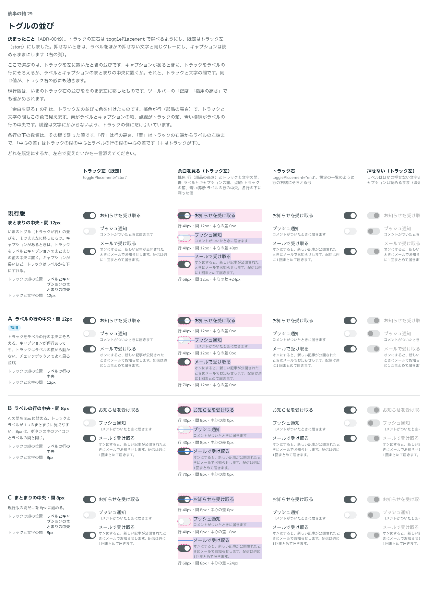

# 0049. トグルの並びと置き場所

- ステータス: Accepted
- 日付: 2026-09-13
- ラウンド: 後半 軸29

## 背景

トグル（`Switch`）は、これまでトラックを文字の右に置く並びしか持っていませんでした。左右を選べるようにするにあたり、キャプションがあるときにトラックをどこにそろえるか（ラベルの行の中央か、ラベルとキャプションのまとまりの中央か）と、トラックと文字の間を決める必要がありました。

合わせて、押せなくなったときのラベルの色と、トラックの左右を選ぶ props の名前・既定値も決めました。

## 候補

比較は Storybook の `Design Review/29 トグルの並び`（[`stories/axis-29-toggle-layout.stories.tsx`](../stories/axis-29-toggle-layout.stories.tsx)）です。トラックを左に置いたとき（`togglePlacement="start"`）の並びを、右にも同じ値が効く前提で比べました。

| 案     | トラックの縦の位置                       | トラックと文字の間 | 内容                                                                             |
| ------ | ----------------------------------------- | ------------------- | -------------------------------------------------------------------------------- |
| 現行版 | ラベルとキャプションのまとまりの中央      | 12px                 | いまのトラック右の並びをそのまま左に移したもの。キャプションが長いほど下にずれる |
| A      | ラベルの行の中央                          | 12px                 | キャプションが何行あっても、トラックはラベルの横から動かない。チェックボックスでよく見る並び |
| B      | ラベルの行の中央                          | 8px                  | A の間を、ボタンの中のアイコンとラベルの間と同じ 8px に詰めたもの                |
| C      | ラベルとキャプションのまとまりの中央      | 8px                  | 現行版の間だけを 8px に詰めたもの                                                |

途中で「余白の可視化列を追加できますか？」「数値を入れられます？違いがあまりわからず…」を受け、行の余白を色で示す列と、その場で測った値（行の高さ・トラックと文字の間・トラックとラベルの行の中心の差）を出す列を足しました。

## 決定

**軸29 は A（ラベルの行の中央・間 12px）です。**

トラックの左右は `togglePlacement`（`start`・`end`）で選べるようにし、既定は `start`（トラック左）にしました。押せないとき、ラベルはほかの押せない文字と同じグレー（`--color-switch-label-disabled`）にし、キャプションは読めるままにします。

過去の比較（軸08・10・11・13・28）は、比べたときの形（トラック右・間12px・ラベルとキャプションのまとまりの中央・押せないラベルは本文の色）に固定しました。

## 理由

ユーザーのメモです。

> 29 は A で決まりで。

トラックの左右と、押せないときのラベルの色については、次のメモです。

> トグルについては、左右両方を選べるようにしたいです。デフォルトは左トグルにしたい気持ちがあります。

> disabled なときは、トグルのラベルも薄いグレーに寄せてほしいです。

過去の比較を固定するかどうかの質問への答えは「比べたときの形に固定」でした。

## 却下した案と理由

- **現行版（まとまりの中央・間12px）**: 選ばれませんでした。キャプションの長さでトラックの縦の位置が動くのは、A の「トラックが横から動かない」比べて分かりにくいと判断されました
- **B（ラベルの行の中央・間8px）**: 選ばれませんでした。間は A の 12px のままになりました
- **C（まとまりの中央・間8px）**: 選ばれませんでした。縦の位置は A のとおりラベルの行の中央になりました

## 影響

- `tokens.css`: トラックの縦の位置 `--switch-track-rows`（`1 / 2`。ラベルの行の中央）とトラックと文字の間 `--switch-gap`（12px）を、A の値にしました。トラックの列の並び `--switch-columns-start`・`--switch-columns-end`（`togglePlacement` の start・end それぞれの格子の列）を足しました
- `src/components/Switch.tsx`: `togglePlacement`（`start`・`end`。既定 `start`）を足しました。押せないときのラベルの色を、本文の色から `--color-switch-label-disabled`（ほかの押せない文字と同じグレー）に変えました。キャプションは変えていません（押せないときも読めるまま）
- 比較のストーリー（軸08・10・11・13・28）: `design/stories/pins.tsx` の `keepSwitchAsCompared` で、比べたときの形（トラックの縦の位置はまとまりの中央、押せないラベルは本文の色）に固定し、各ストーリーで `togglePlacement="end"` を明示して、トラック右の並びのまま再現しています
- **分かっていること**: トラックを右に置いたとき（`togglePlacement="end"`）の押せる範囲・区切り線での並びは、後半の軸46 で別に扱います

## 原則への反映

反映なし。トラックとラベルの並びは実装の詳細で、既存の原則（原則4のラベル/本体/キャプションの3層、原則1の押せないものの表し方）の範囲内です。

## 比較画像

