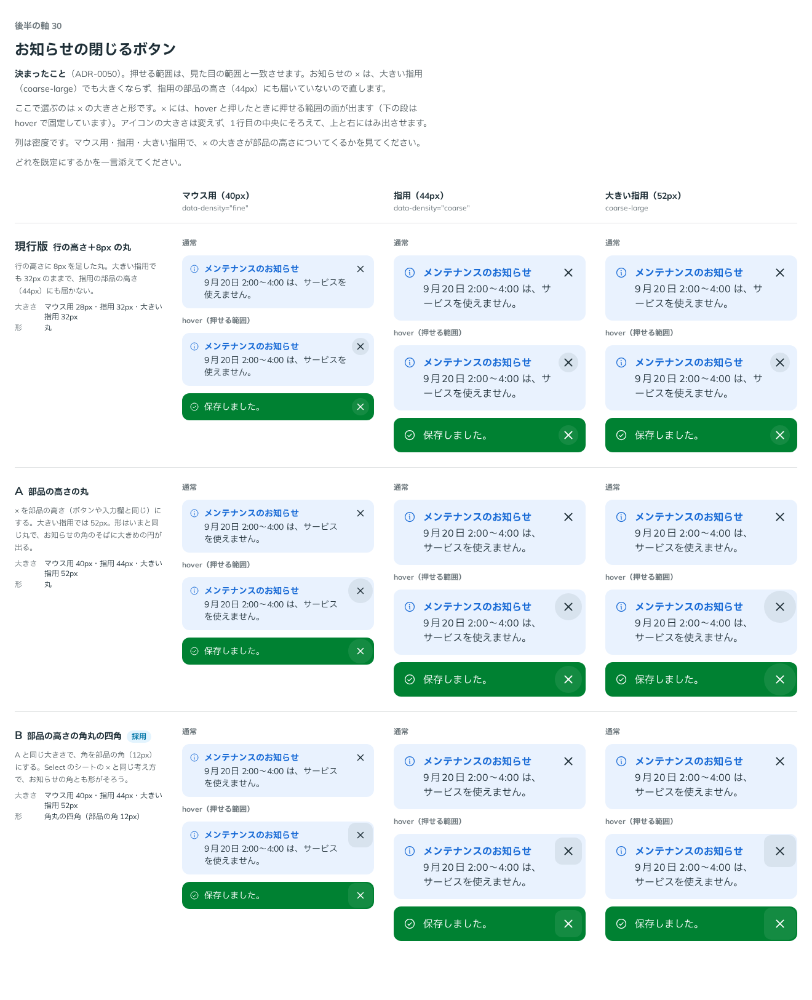

# 0050. お知らせの閉じるボタンの形

- ステータス: Accepted
- 日付: 2026-09-13
- ラウンド: 後半 軸30

## 背景

押せる範囲は見た目の範囲と一致させる、と決めました（[ADR-0048](./0048-hit-area.md)）。お知らせ（`Notice`）の × は、行の高さに 8px を足した丸（マウス用28px・指用32px）で、大きい指用（`coarse-large`、52px）でも大きくならず、指用の部品の高さ（44px）にも届いていませんでした。これを、部品の寸法（`--size-control`）に従う形に直す必要がありました。

## 候補

比較は Storybook の `Design Review/30 お知らせの閉じるボタン`（[`stories/axis-30-notice-close.stories.tsx`](../stories/axis-30-notice-close.stories.tsx)）です。マウス用・指用・大きい指用の3つの密度で、× の大きさが部品の高さについてくるかを見ました。

| 案     | 内容                                                                                                                       | 大きさ                                       | 形                             |
| ------ | ---------------------------------------------------------------------------------------------------------------------------- | --------------------------------------------- | ------------------------------ |
| 現行版 | 行の高さに8px を足した丸。大きい指用でも32pxのままで、指用の部品の高さ（44px）にも届かない                                   | マウス用28px・指用32px・大きい指用32px         | 丸                              |
| A      | × を部品の高さ（ボタンや入力欄と同じ）にする。大きい指用では52px。形はいまと同じ丸で、お知らせの角のそばに大きめの円が出る   | マウス用40px・指用44px・大きい指用52px         | 丸                              |
| B      | A と同じ大きさで、角を部品の角（12px）にする。Select のシートの × と同じ考え方で、お知らせの角とも形がそろう               | マウス用40px・指用44px・大きい指用52px         | 角丸の四角（部品の角12px）     |

## 決定

**軸30 は B（部品の高さの角丸の四角）です。**

× の押せる範囲（大きさ）を、行の高さ＋8px から部品の高さ（`--size-control`）に変え、角を丸（pill）から部品の角（`--radius-control`）にしました。過去の比較（軸25）は、比べたときの形（行の高さ＋8px の丸）に固定しました。

## 理由

ユーザーのメモです。

> 30 は B でお願いします。

## 却下した案と理由

- **現行版（行の高さ＋8px の丸）**: 選ばれませんでした。押せる範囲が部品の高さに届かず、大きい指用でも大きくならないため
- **A（部品の高さの丸）**: 選ばれませんでした。角は部品の角（B）になりました

## 影響

- `tokens.css`: `--notice-close-to-control` を `0`（行の高さ＋8px）から `1`（部品の高さ）にしました。`--notice-close-radius` を `var(--radius-pill)` から `var(--radius-control)` にしました
- `src/components/Notice.tsx`: 変えていません。× の大きさは、もともと `--notice-close-to-control` で「行の高さ＋8px」と「部品の高さ」を計算で切り替える形でした
- 比較のストーリー（軸25）: `design/stories/pins.tsx` の `keepNoticeCloseAsCompared` で、比べたときの見た目（行の高さ＋8px の丸）に固定し、そのまま再現しています

## 原則への反映

反映なし。押せる範囲を部品の寸法に合わせる考え方は原則7の適用（[ADR-0048](./0048-hit-area.md)）、角を部品の角にする考え方は原則5の「お知らせは部品なので、カードの角にはしません」の範囲内です。

## 比較画像

