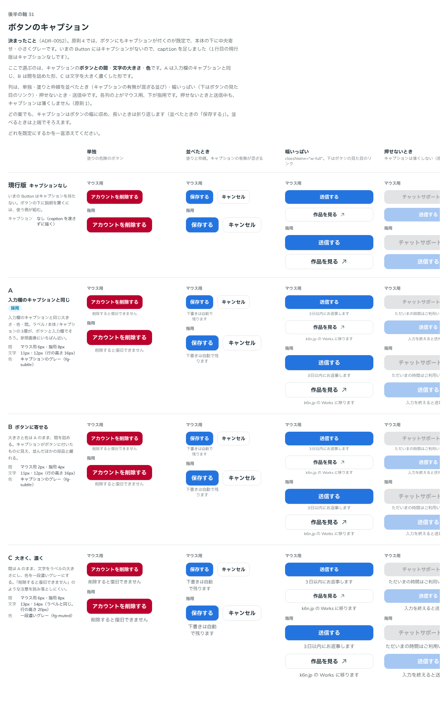

# 0052. ボタンのキャプション

- ステータス: Accepted
- 日付: 2026-09-14
- ラウンド: 後半 軸31

## 背景

原則4では、ボタンにもキャプションが付くのが既定で、本体の下に中央寄せ・小さくグレーです（参照画像 `component-buttons.webp`）。これまでの `Button` にはキャプションがなく、本体の下に説明を置くには使う側が組む必要がありました。`caption` を足すにあたり、ボタンとの間・文字の大きさ・色を決める必要がありました。

合わせて、2026-09-14 に答えた a11y・API の推奨（B1〜B4 ほか）のうち、`Button` のキャプションに関わる次の2つも決めました。

- B1: `Button` のキャプションを `aria-describedby` でつなぐか
- B2: キャプションがあるときの `className` をどこに付けるか

## 候補

比較は Storybook の `Design Review/31 ボタンのキャプション`（決めた時点のコミット `5de918a`（`git checkout 5de918a && pnpm storybook` で開けます））です。1行目の現行版はキャプションなしで描いています。

| 案     | 内容                                                                                       | 間                       | 文字                                     | 色                       |
| ------ | -------------------------------------------------------------------------------------------- | ------------------------- | ----------------------------------------- | ------------------------- |
| 現行版 | いまの `Button` はキャプションを持たない。`caption` を渡さずに描く                            | なし                       | なし                                       | なし                       |
| A      | 入力欄のキャプションと同じ大きさ・色・間。ラベル/本体/キャプションの3層が、ボタンと入力欄でそろう。参照画像にいちばん近い | マウス用6px・指用8px       | 11px・12px（行の高さ16px）                 | キャプションのグレー（`fg-subtle`） |
| B      | 大きさと色は A のまま、間を詰める。キャプションがボタンに付いたものに見え、並んだほかの部品と離れる | マウス用2px・指用4px       | 11px・12px（行の高さ16px）                 | キャプションのグレー（`fg-subtle`） |
| C      | 間は A のまま、文字をラベルの大きさにし、色を一段濃いグレーにする。読み落としにくい注意向け     | マウス用6px・指用8px       | 13px・14px（ラベルと同じ。行の高さ20px）  | 一段濃いグレー（`fg-muted`）        |

## 決定

**軸31 は A（入力欄のキャプションと同じ間・大きさ・色）です。**

キャプションはボタンの幅に収め、長いときは折り返します。押せないとき・送信中も薄くしません（原則1）。

推奨どおり、次の2つも決めました。

- **B1**: `Button` のキャプションは `aria-describedby` でつなぎます
- **B2**: キャプションがあるときの `className` はボタンとキャプションを包む要素に付けます（`w-full` を効かせるため）。`ref` はボタン（リンクのときは `<a>`）に付きます

## 理由

ユーザーのメモです。

> 31 は A でお願いします。

B1・B2 を含む2026-09-14 の a11y・慣例・API の推奨は、まとめて次の答えで採用しました。

> それ以外の項目は特に違和感はありませんでした。

## 却下した案と理由

- **現行版（キャプションなし）**: 選ばれませんでした。原則4のとおり、ボタンにもキャプションが既定で付くようにしました
- **B（ボタンに寄せる、間を詰める）**: 選ばれませんでした。間は A の値（マウス用6px・指用8px）になりました
- **C（大きく、濃く）**: 選ばれませんでした。文字の大きさと色は A の値（入力欄のキャプションと同じ）になりました

## 影響

- `tokens.css`: `--button-caption-gap-fine`（`--space-field-gap-fine`）・`--button-caption-gap-coarse`（`--space-field-gap-coarse`）・`--text-button-caption-fine`（`--text-caption-fine`）・`--text-button-caption-coarse`（`--text-caption-coarse`）・`--leading-button-caption`（`--leading-caption`）・`--color-button-caption`（`--color-fg-subtle`）を、入力欄のキャプションのトークンを参照する形で足しました
- `src/components/Button.tsx`:
  - `caption` props を `ButtonProps`・`ButtonLinkProps`（`ButtonCaptionProps`）に足しました
  - `withCaption` で、キャプションがあるときだけボタン（`<button>` か `<a>`）とキャプションを包む要素（`data-slot="button-root"`）を描きます。ボタンは包みの幅いっぱいに伸び（`items-stretch`）、キャプションは包みの幅を広げません（`w-0 min-w-full`）
  - `className` は、キャプションがあるときは包みに、ないときはボタン自身に付けます。`ref` はいつもボタン（リンクのときは `<a>`）に付きます
  - `joinIds` で、渡された `aria-describedby` の後ろにキャプションの id をつなぎます（`TextField` と同じ「渡された説明 → キャプション」の順）
  - 押せないとき・送信中も、キャプションはボタンの外にあるのでボタンの薄さを受けません
  - `Link` の `appearance="button"`（`ButtonLookLink`）も `caption` を受け取り、`Button` にそのまま渡します

## 原則への反映

原則4はすでに「ボタンにもキャプションが付きます。これは例外ではなく既定です」「ボタンのキャプションは、本体の下に中央寄せです」と書いており、この ADR は具体の値（間・大きさ・色）でその文を裏付けるものです。文そのものの書き換えは不要ですが、末尾の経緯に ADR-0052 を足します。

## 比較画像

