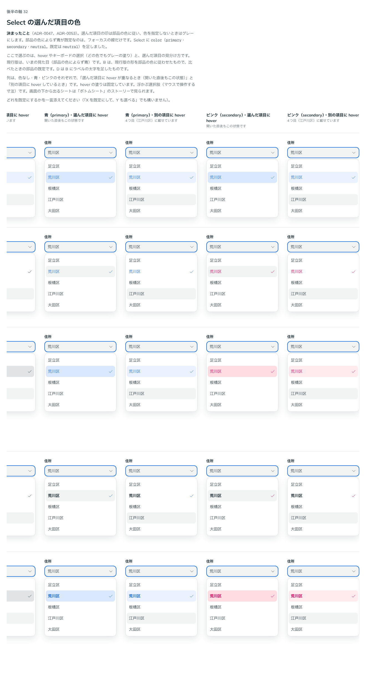

# 0053. Select の選んだ項目の見た目

- ステータス: Accepted
- 日付: 2026-09-14
- ラウンド: 後半 軸32

## 背景

[ADR-0036](./0036-select-popup.md) で、Select の浮かぶ選択肢の見た目を決めたときは、選んだ項目を部品の色によらず青の淡い面で示していました。その後 [ADR-0047](./0047-principles-probe.md) の決定11で、「部品の色によらず青が既定なのはフォーカスの線だけ」とし、選んでいることを示す印（一覧で選んだ項目、チェック、トグルの ON）は部品の色に従い、指定しないときはグレーにすると決まりました。これに合わせて、Select の選んだ項目の色を見直す必要がありました。

Select に、利用者が選ぶ色（`primary`・`secondary`）と、色を持たない `neutral`（既定）からなる `color` を足しました。ここで決めるのは、hover やキーボードの選択（どの色でもグレーの塗り）と、選んだ項目の見分け方です。

フォーカスの色の扱い（欄の枠線やフォーカスリングを部品の色に従わせるか）は、この軸では決めていません。パターンを並べて見る軸41に送りました。

## 候補

比較は Storybook の `Design Review/32 Select の選んだ項目の色`（決めた時点のコミット `5de918a`。`git checkout 5de918a && pnpm storybook` で開けます）です。列は色なし（neutral）・青（primary）・ピンク（secondary）のそれぞれで「選んだ項目に hover」「別の項目に hover」、行は現行版と4案です。変えたのは次のトークンだけです（`src/components/Select.tsx` の `selectedTokens` が読む）。

- `--select-item-selected-fill`: 部品の色の淡い面を敷くか
- `--select-item-selected-ink`: ラベルを部品の色にするか（0 はほかの項目と同じ濃紺）
- `--select-item-selected-weight`: ラベルの太さ
- `--color-select-neutral-selected`: 色なし（neutral）の淡い面

| 案     | 内容                                                                                       |
| ------ | ------------------------------------------------------------------------------------------ |
| 現行版 | いまの見た目（ADR-0036）。部品の色によらず、選んだ項目は淡い青の面に青い文字とチェック     |
| A      | チェックと文字の色だけ。面は敷かず、ラベルとチェックを部品の色にする。色なしは濃紺のチェックだけ |
| B      | 部品の色の淡い面＋チェック。現行版の形を部品の色に従わせる。色なしの面は、hover のグレーと見分けられる一段濃いグレー |
| C      | 太字＋チェック。面は敷かず、ラベルを太字にする。ラベルの色はほかの項目と同じ濃紺で、部品の色はチェックにだけ出す |
| D      | B ＋太字。B の淡い面とチェックに、ラベルの太字を足す                                       |

## 決定

**B（部品の色の淡い面＋チェック）に、D の太字を足した形にします。**

| 項目               | 決定                                                                                                     |
| ------------------ | -------------------------------------------------------------------------------------------------------- |
| 面                 | 部品の色の淡い面（青 `#E9F2FE`・ピンク `#FFEBEE`、色なしはグレー `#E1E3E4`。`--select-item-selected-fill: 1`） |
| 文字・チェック     | 部品の色（色なしは濃紺。`--select-item-selected-ink: 1`）                                                 |
| ラベルの太さ       | 太字（`--select-item-selected-weight: 700`）                                                             |
| 選んだ項目の hover | 面を一段濃く（文字の色を8%混ぜる）                                                                        |
| 色なしのとき       | グレーの面＋濃紺の太字とチェック                                                                          |
| フォーカスの色     | この軸では決めない（軸41へ）                                                                              |

## 理由

ユーザーのメモです。

> 32 ですが、フォーカスカラーとしての青はフォーカスリングに変えたいです。色としては、secondary などを選べるようにしたいです。なので、フォーカスリングを含めた色合いを考えたいです。見た目としては B + 太字 にしたいです。

以下は、メモと比較から読み取れることです。

- **フォーカスの色とは切り離す**: 「フォーカスカラーとしての青はフォーカスリングに変えたい」。選んだ項目の色は、フォーカスの線の色とは別に決めます。ADR-0047 の決定11どおり、部品の色に従わせます
- **見た目は B ＋太字**: 「見た目としては B + 太字 にしたいです。」現行版の淡い面＋チェックの形を残しつつ、部品の色（`primary`・`secondary`）を選べるようにし、色なしのグレーでも太字でもう一段見分けられるようにします

## 却下した案と理由

- **現行版（いつも青の淡い面）**: 選ばれませんでした。ADR-0047 の決定11（部品の色によらず青が既定なのはフォーカスの線だけ）に合わなくなりました
- **A（チェックと文字の色だけ）**: 選ばれませんでした。面を敷かない形です
- **C（太字＋チェック）**: 選ばれませんでした。ラベルの色は濃紺のままで、部品の色は面に出ません
- **D（B ＋太字）**: そのまま採用しました（B と D は同じ形になりました）

## 影響

- `tokens.css`: `--select-item-selected-fill`（1）・`--select-item-selected-ink`（1）・`--select-item-selected-weight`（700）・`--color-select-neutral-selected`（`--palette-gray-200`）を更新しました
- `src/components/Select.tsx`: `color`（`primary`・`secondary`・`neutral`、既定 `neutral`）を足しました。選んだ項目の面・文字・チェックは `selectedTokens` が `color` から作ります
- 分かっていること: フォーカスの色（欄の枠線・フォーカスリングを部品の色に従わせるか）は、まだ決めていません（軸41）
- backlog に残った未決事項: なし（軸32はこの決定で確定）

## 原則への反映

反映なし。ADR-0047 の決定11（選んでいることを示す印は部品の色に従い、指定しないときはグレー）の範囲内の決定です。

## 比較画像

