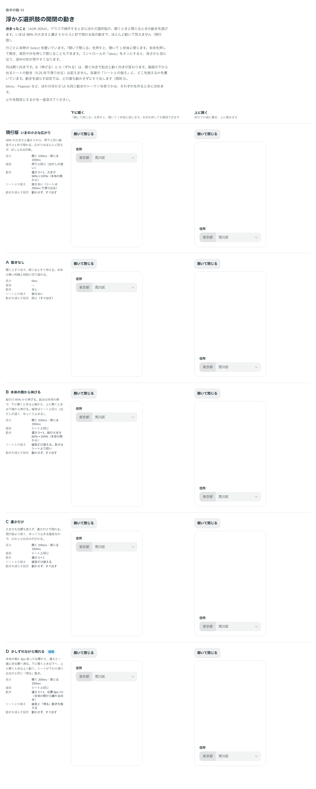

# 0054. 浮かぶ選択肢の開閉の動き

- ステータス: Accepted
- 日付: 2026-09-14
- ラウンド: 後半 軸33

## 背景

[ADR-0036](./0036-select-popup.md) で Select の浮かぶ選択肢の見た目を決めたときは、開閉の動きは仮のまま残していました（98%の大きさと濃さ0から、押下と同じ緩急で0.1秒。広がりがほとんど見えず、ぱっと出る印象）。画面の下から出るシートの動き（250ms で滑り出る、`--duration-sheet`・`--ease-sheet`）とはそろえていませんでした。

原則3（動き）に関わります。

## 候補

比較は Storybook の `Design Review/33 浮かぶ選択肢の開閉の動き`（決めた時点のコミット `5de918a`。`git checkout 5de918a && pnpm storybook` で開けます）です。行ごとに本物の Select を置き、開く向き（下に開く・上に開く）を列にしました。変えたのは次のトークンだけです（`src/components/Select.tsx` の浮かぶ部分が読む）。

- `--select-popup-duration-in`・`-out`: 開く・閉じる長さ
- `--select-popup-ease`: 緩急
- `--select-popup-scale-x`・`-y`: 現れはじめの大きさ（起点は本体の側）
- `--select-popup-shift`: 現れはじめのずれ（本体の側に寄った位置から、離れる向きに動く）

どの案も濃さは0から現れます。動きを減らす設定では、どの案も動かさずにすぐ出す・消す（原則3）。

| 案     | 内容                                                                                       |
| ------ | ------------------------------------------------------------------------------------------ |
| 現行版 | いまの小さな広がり。98%の大きさと濃さ0から、押下と同じ緩急で0.1秒。開く100ms・閉じる100ms |
| A      | 動きなし。開くとすぐ出て、閉じるとすぐ消える。長さ0ms                                     |
| B      | 本体の側から伸びる。縦だけ80%から伸びる。開く200ms・閉じる150ms、緩急はシートと同じ       |
| C      | 濃さだけ。大きさも位置も変えず、濃さだけで現れる。開く200ms・閉じる150ms                  |
| D      | 少しずれながら現れる。本体の側に8px寄った位置から、濃さと一緒に定位置へ滑る。開く200ms・閉じる150ms |

## 決定

**D（本体の側に8px寄った位置から滑る。開く200ms・閉じる150ms、緩急はシートと同じ）にします。動きをなくしたいときは A（長さ0ms）を選べます。**

| 項目               | 決定                                                                                     |
| ------------------ | ----------------------------------------------------------------------------------------- |
| 長さ               | 開く200ms・閉じる150ms（`--select-popup-duration-in`・`-out`）                            |
| 緩急               | シートと同じ（`--select-popup-ease: var(--ease-sheet)`。出だしが速く、ゆっくり止まる）    |
| 動き               | 濃さ0→1、位置8px→0（本体の側から離れる向き。`--select-popup-shift: 8px`）                 |
| シートとの揃え     | 緩急と「滑る」動きを揃える。長さはシートの250msより短い                                   |
| 動きをなくす（A）  | `--select-popup-duration-in`・`-out` を0msにする                                          |
| 動きを減らす設定   | どの案も動かさず、すぐ出す・消す（原則3。変更なし）                                       |

## 理由

ユーザーのメモです。

> 33 は D がこのみですね。アニメーションなしなら A ですかね。

以下は、メモと比較から読み取れることです。

- **既定は D**: 「D がこのみ」。本体の側に寄った位置から滑って定位置に収まる動きが、シートの「滑る」動きと呼応します
- **動きをなくすときは A**: 「アニメーションなしなら A ですかね。」長さを0msにするだけで、大きさもずれも動かさない形になります

## 却下した案と理由

- **現行版（いまの小さな広がり）**: 選ばれませんでした。0.1秒で98%からの広がりはほとんど見えません
- **B（本体の側から伸びる）**: 選ばれませんでした
- **C（濃さだけ）**: 選ばれませんでした

## 影響

- `tokens.css`: `--select-popup-duration-in`（200ms）・`--select-popup-duration-out`（150ms）・`--select-popup-ease`（`var(--ease-sheet)`）・`--select-popup-scale-x`（1）・`--select-popup-scale-y`（1）・`--select-popup-shift`（8px）を更新しました
- `src/components/Select.tsx`: 変更なし。開閉の動きは、すでにこれらのトークンから組み立てています
- 分かっていること: 動きをなくしたい（A）ときにトークンをどう渡すかは、部品の props としては用意していません。利用者がトークンを上書きする前提です
- Menu・Popover など、ほかの浮かぶ UI でも同じ動きのトークンを使うかは、それぞれを作るときに決めます（backlog に記載のまま）

## 原則への反映

反映なし。原則3（動きを減らす設定では動かさない）の範囲内の決定です。

## 比較画像

